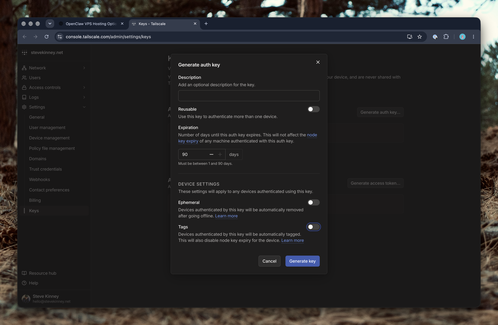

[Railway](https://railway.com?referralCode=kinney) is a convenient place to run an always-on Gateway: you don't manage a server, and volumes keep your state between deploys. A typical Railway deploy, though, gives the Gateway a public URL, and that's the opposite of what we want for something that can read your files and use your accounts.

This lesson uses [`stevekinney/openclaw-railway-template`](https://github.com/stevekinney/openclaw-railway-template), a minimal deployment with **no public domain at all**. Two Railway services run side by side:

- **`openclaw`** runs the Gateway on Railway's private network.
- **`tailscale`** joins your tailnet and forwards traffic to the Gateway.

```text
 Mac app / browser / phone          (devices on your tailnet)
            │
            │  WireGuard (Tailscale)
            ▼
 ┌──────────────── Railway project (private network only) ────────────────┐
 │                                                                        │
 │  tailscale service ── raw TCP forward ──►  openclaw service            │
 │  joins your tailnet                        Gateway on :8080            │
 │  volume: node identity                     volume: /data (all state)   │
 │                                                                        │
 └────────────────────────────────────────────────────────────────────────┘
```

> [!NOTE] This is a different setup from the previous lesson
> In [Connecting to Your OpenClaw Securely with Tailscale](connecting-securely-with-tailscale.md), the Gateway manages Tailscale itself with `gateway.tailscale.mode: serve`. That requires Tailscale to run on the same machine as the Gateway. On Railway that doesn't work, so Tailscale gets its own service and OpenClaw's built-in integration stays off. The ideas are the same; the plumbing is different.

## Why a Separate Tailscale Service?

A few things make Railway different from a VPS:

- Railway containers can't use the kernel networking that a normal Tailscale install wants, and you can't run two long-lived processes in one container without a supervisor.
- A Tailscale **subnet router** would expose every service in your Railway environment to your tailnet.
- Railway's private hostnames (like `openclaw.railway.internal`) only resolve inside Railway.

So the `tailscale` service runs Tailscale in **userspace networking** mode, joins your tailnet as its own machine named `openclaw`, and forwards connections across Railway's private network to the Gateway.

### Why raw TCP and not an HTTP proxy

Tailscale Serve can forward in two ways. The obvious one is as an HTTP reverse proxy, but that adds `X-Forwarded-*` and `Tailscale-User-*` headers to every request. The Gateway refuses requests carrying those headers unless they come from a proxy it has been told to trust, and the Tailscale container's private IP changes on every deploy. You'd end up trusting a whole range of Railway's network, or hitting a `Proxy client attribution is required` error.

This template forwards **raw TCP** instead. Bytes pass through untouched, so the Gateway sees an ordinary private-network client with no forwarded claims, and nothing is trusted that could be spoofed. TLS is still handled by Tailscale on port 443, using your tailnet's real certificate.

## Before You Start

You'll need:

- A [Railway](https://railway.com?referralCode=kinney) account on a paid plan (the volumes are larger than the free tier allows) and the [Railway CLI](https://docs.railway.com/cli): `brew install railway`, then `railway login`.
- A tailnet with **MagicDNS** and **HTTPS Certificates** turned on, as described in the previous lesson. Note your tailnet's DNS name in the admin console under **DNS**. It looks like `tail1234.ts.net`.
- An API key for a model provider. The examples use Anthropic.

> [!WARNING] Use a new Railway environment
> The Gateway can only bind IPv4, and Railway environments created before 2025-10-16 resolve private hostnames to IPv6 only. A new project's `production` environment is fine. An old one will fail to connect.

## Step 1: Prepare Your Tailnet's Access Policy

Do this before anything gets deployed. In the [admin console](https://login.tailscale.com/admin), open **Access controls** and add a tag, plus a grant that lets only you reach the Gateway. Replace `you@example.com` with your Tailscale login:

```jsonc
{
  "tagOwners": {
    "tag:openclaw": ["autogroup:admin"],
  },
  "grants": [
    // Only the operator's devices may reach the Gateway, and only its two ports.
    { "src": ["you@example.com"], "dst": ["tag:openclaw"], "ip": ["tcp:443", "tcp:18789"] },
  ],
  "tests": [{ "src": "you@example.com", "accept": ["tag:openclaw:443", "tag:openclaw:18789"] }],
}
```

Merge this into your existing policy instead of replacing it. If you'd rather not use a tag, see [Prefer Not to Tag?](#prefer-not-to-tag) in Step 2.

Two things to check:

- If your policy still has the default allow-all rule (`"src": ["*"], "dst": ["*:*"]`), **every member of your tailnet can reach the Gateway**. Narrow it.
- The new `openclaw` machine gets no grants of its own, so even if the Gateway were compromised, it couldn't open connections to anything else on your tailnet.

## Step 2: Generate an Auth Key

The `tailscale` service needs a one-time key so it can join your tailnet without anyone logging in by hand. Go to **Settings → Keys → Generate auth key**.



Set it up like this:

| Setting      | Value                  | Why                                                                                       |
| ------------ | ---------------------- | ----------------------------------------------------------------------------------------- |
| Reusable     | **Off**                | The key is used once. After that, the node's identity lives on its volume.                |
| Expiration   | **1 day**              | It only has to last until the first deploy. (The dialog defaults to 90 days.)             |
| Ephemeral    | **Off**                | An ephemeral machine disappears when it disconnects, including during every redeploy.     |
| Pre-approved | **On** if required     | Turn it on if your tailnet requires device approval, so the node isn't left waiting.      |
| Tags         | **On**: `tag:openclaw` | Tagged machines only get the access your policy grants, and their node keys don't expire. |

Copy the key when it's shown. Tailscale won't show it in full again.

> [!WARNING]
> Treat the key like a password. Anyone who has it can add a machine to your tailnet. Don't paste it into chat or commit it, and use the one-day expiration so a leaked key is quickly worthless.

### Prefer Not to Tag?

Tagging is recommended, but it isn't required. If you'd rather not edit your policy's `tagOwners`, leave **Tags** off in the dialog and the node joins as a regular machine owned by your user. Everything else in this lesson works. Three things change:

1. **You have to disable key expiry yourself.** Untagged nodes expire after 180 days by default, and then the Gateway silently drops off your tailnet. After the machine joins, open `openclaw` in the admin console and choose **Disable key expiry**. Tagged nodes skip this step.
2. **The Step 1 grant won't match.** It targets `tag:openclaw`, which an untagged node doesn't have. Skip the `tagOwners` block, and once the machine appears, point the grant at it directly:

   ```jsonc
   {
     "grants": [
       {
         "src": ["you@example.com"],
         "dst": ["<openclaw-tailnet-ip>"],
         "ip": ["tcp:443", "tcp:18789"],
       },
     ],
     "tests": [{ "src": "you@example.com", "accept": ["<openclaw-tailnet-ip>:443"] }],
   }
   ```

   You'll find the IP on the machine's page in the admin console.

3. **The node carries your identity.** A tagged node gets only the access your policy grants it, and this one is granted none. An untagged node is _you_ as far as the policy is concerned, so a compromised Gateway container could reach whatever your account can. The template's documentation doesn't walk through this case, so treat it as Tailscale's general behavior rather than something the template guarantees. If your policy is still the default allow-all, that means everything on your tailnet, so narrow it either way.

For a Gateway that can run commands, the tag is cheap insurance. On a small personal tailnet with a tight policy, going without is a reasonable trade.

## Step 3: Deploy the Template

Open the [OpenClaw Private Gateway template](https://railway.com/deploy/openclaw-private-gateway?referralCode=kinney) on Railway and fill in two variables:

| Variable                 | Value                                    |
| ------------------------ | ---------------------------------------- |
| `OPENCLAW_PUBLIC_ORIGIN` | `https://openclaw.<your-tailnet>.ts.net` |
| `TS_AUTHKEY`             | the key from Step 2                      |

`OPENCLAW_PUBLIC_ORIGIN` is the address you'll connect to. The Gateway also uses it as its list of allowed browser origins. The Gateway token (`OPENCLAW_GATEWAY_TOKEN`) is generated for you.

Wait for both services to turn green. That takes about four minutes, because the first build pulls a large image. When it finishes, a machine named `openclaw` shows up in your tailnet's **Machines** page.

If you already have a machine called `openclaw`, Tailscale names the new one `openclaw-1`. Remove the old one, or set `OPENCLAW_PUBLIC_ORIGIN` to match the new name.

> [!NOTE] Want to deploy from your own fork?
> The repository also describes both services with Railway Infrastructure as Code in `.railway/railway.ts`. Use that if you plan to change the code. The template's `DEPLOYMENT.md` walks through it.

## Step 4: Check the Tailnet Side

From a tailnet device that your policy allows:

```sh
tailscale ping openclaw
curl -fsS https://openclaw.<your-tailnet>.ts.net/healthz
```

You should get a reply from `tailscale ping`, and `curl` should print `{"ok":true,"status":"live"}`. The first HTTPS request can take a few seconds while Tailscale issues the certificate.

Then run the same `curl` from a device your policy **doesn't** allow. It should time out. That's the access policy doing its job, so check it as carefully as you check the success case.

Finally, open the Railway dashboard and look at each service's **Settings → Networking**. There should be no domains and no TCP proxy on either one.

## Step 5: Finish Setting Up the Gateway

At this point the Gateway is running, but it doesn't have a model provider yet. Link the Railway CLI to the project, register an SSH key, and confirm you can reach the container:

```sh
railway link
railway ssh keys add --key ~/.ssh/id_ed25519.pub
railway ssh --service openclaw -- openclaw health
```

The first `railway ssh` asks you to trust `ssh.railway.com`. Railway doesn't publish host-key fingerprints, so you can only accept it the first time.

Add your model provider key. Copy it to the clipboard, then:

```sh
pbpaste | tr -d '\n' | railway variable set ANTHROPIC_API_KEY --stdin --service openclaw
```

When that deploy turns green, run non-interactive onboarding inside the container:

```sh
railway ssh --service openclaw -- openclaw onboard --non-interactive --accept-risk --skip-health \
  --mode local --auth-choice apiKey --secret-input-mode ref \
  --gateway-auth token --gateway-token-ref-env OPENCLAW_GATEWAY_TOKEN \
  --gateway-bind lan --skip-channels --no-install-daemon
```

Onboarding changes a setting that needs a restart. Railway is the supervisor here, so the Gateway exits cleanly and Railway starts it again in about 30 seconds. Then check that the agent answers:

```sh
railway ssh --service openclaw -- openclaw agent --agent main --message "Reply with exactly: OK"
```

For a provider other than Anthropic, set its key variable instead and change `--auth-choice`. `openclaw onboard --help` lists the options.

## Step 6: Connect Your Devices

Everything uses one address. Use the secure `wss://` one:

```text
wss://openclaw.<your-tailnet>.ts.net
```

There's also a plaintext fallback at `ws://openclaw.<your-tailnet>.ts.net:18789`. The traffic is still encrypted by WireGuard inside the tailnet, but prefer `wss://` unless your tailnet can't issue HTTPS certificates.

### The macOS app

1. In the menu bar, open **Connection…**.
2. Under **OpenClaw runs**, choose **Remote (another host)**.
3. Choose **Gateway address or setup code** and enter the `wss://` address.
4. Enter the Gateway token, which you can read from the `openclaw` service's variables in Railway.
5. Choose **Save connection**, then **Test**.

The first test reports that pairing is required. That's expected.

### Approve the device

Tailnet connections count as remote, so nothing is approved automatically. Approve each pending request from the Gateway:

```sh
railway ssh --service openclaw -- openclaw devices list
railway ssh --service openclaw -- openclaw devices approve <requestId>
```

The Mac app files two requests, one for the operator role and one for the node role. Approve both. It will then ask for permission to expose commands on your Mac, including running shell commands. Read that prompt carefully before approving it. The [paired node lesson](connecting-a-remote-node.md) walks through what you're agreeing to.

### Browsers and phones

- **A browser:** open `https://openclaw.<your-tailnet>.ts.net/` on a tailnet device and sign in with the Gateway token. Each browser profile counts as a separate device, so approve it the same way.
- **iOS and Android:** with the phone on your tailnet, run `railway ssh --service openclaw -- openclaw qr` and scan the code in the OpenClaw app. Add `--limited` to withhold administrative access from the phone. The code contains a short-lived token, so don't post it anywhere.

Pairing records are stored on the Gateway's volume, so they survive redeploys.

## Step 7: Clean Up

- **Drop the auth key.** Once the machine has joined, you can delete `TS_AUTHKEY` from the `tailscale` service. A used one-time key is useless anyway.
- **Check key expiry.** If you tagged the key, the node never expires. If you didn't, disable key expiry on the `openclaw` machine in the admin console, or it will drop off your tailnet after 180 days.
- **Turn on backups.** In each service, open **Backups** and enable daily backups. The `openclaw` volume holds OAuth tokens, pairing records, and conversation history.
- **Audit.** Run the security audit and make sure it comes back clean:

  ```sh
  railway ssh --service openclaw -- openclaw security audit
  ```

Then keep going with the rest of the course: [add a channel](adding-telegram-as-a-channel.md) and [choose a DM policy](choosing-a-dm-policy.md), and tighten what the agent is allowed to run.

## How the Tailscale Service Works

You don't need to touch any of this to use the template, but it explains the behavior. The `tailscale` service builds from a small Dockerfile on top of the official Tailscale image, plus a Serve config that is baked in because Railway can't mount files into a service:

```json
{
  "TCP": {
    "443": {
      "TCPForward": "openclaw.railway.internal:8080",
      "TerminateTLS": "${TS_CERT_DOMAIN}"
    },
    "18789": {
      "TCPForward": "openclaw.railway.internal:8080"
    }
  }
}
```

Two consequences follow from that file:

- **The Gateway service must be named `openclaw`.** Its private hostname is hardcoded here.
- **Port 443 terminates TLS at Tailscale**, using your tailnet's certificate. Port 18789 is the plaintext fallback. Both go to the same Gateway port.

The environment variables that matter:

| Variable            | What it does                                                                                 |
| ------------------- | -------------------------------------------------------------------------------------------- |
| `TS_USERSPACE=true` | Userspace networking, so no `/dev/net/tun` or extra Linux capabilities are needed.           |
| `TS_STATE_DIR`      | Stores the node's identity on the service's volume.                                          |
| `TS_AUTH_ONCE=true` | Logs in only when it isn't already, so a restart never consumes another key.                 |
| `TS_SERVE_CONFIG`   | Points at the Serve config above.                                                            |
| `TS_HOSTNAME`       | The MagicDNS name. Defaults to `openclaw`.                                                   |
| `TS_ACCEPT_DNS`     | Left off so Railway's own resolver keeps working. `openclaw.railway.internal` depends on it. |
| `TS_DEBUG_MTU=1236` | Shrinks tunnel packets to fit Railway's network. See the troubleshooting table.              |
| `TS_AUTHKEY`        | First login only.                                                                            |

Because the node's identity lives on a volume, redeploys and restarts keep the same machine, address, and certificate.

## Who Knows Who You Are?

When you connect from your Mac, your phone, and a browser, it's natural to assume something knows they're all you. Three different layers each know something different, and it's worth keeping them straight.

| Layer                 | What it knows                                    | What it decides                               |
| --------------------- | ------------------------------------------------ | --------------------------------------------- |
| **Tailscale**         | Which user owns each device on the tailnet       | Whether a device can reach the Gateway at all |
| **The Gateway token** | Nothing about you. It's a shared secret          | Whether a client may talk to the Gateway      |
| **Device pairing**    | One device's own key, which you approved by hand | What that particular device is allowed to do  |

**Tailscale** is the only layer that knows your devices belong to the same person. Every device on your tailnet has an identity tied to your login, and your access policy (`"src": ["you@example.com"]`) is checked against it. That's how your Mac, phone, and laptop all count as "you," and how a stranger's device gets turned away before it ever touches the Gateway.

**The Gateway doesn't get that information.** The `tailscale` service forwards raw TCP, which passes bytes through without adding any identity headers, and OpenClaw's own Tailscale integration is off. In fact, the Gateway rejects requests that arrive with a `Tailscale-User-Login` header, because it has no way to verify one. From its point of view, every client is the Tailscale service's private IP address. (That's the same reason failed logins are rate limited together, and why its logs can't tell your devices apart.)

So the Gateway builds its own picture of you from two things:

- **The token** is a shared secret. Every client presents the same one. It proves the client knows the secret and nothing else.
- **Device pairing** gives each client its own key pair. A new device stays pending until you approve it, and a connection without a paired device identity gets no operator scopes. A client with only the token can call `health` but not read the configuration.

The result is that OpenClaw sees your Mac app, each browser profile, and your phone as **separate devices**. They're approved separately and revoked separately, and nothing links them together except that they all know the token. A private browser window forgets its device identity, so it needs approval every time.

That has a few practical consequences:

- **The token is the thing that "is you."** Keep it sealed in Railway, and rotate it if it leaks.
- **Revoke by device.** To cut off a lost phone without touching your other devices, revoke just that one:

  ```sh
  railway ssh --service openclaw -- openclaw devices list
  railway ssh --service openclaw -- openclaw devices revoke --device <id> --role <role>
  ```

- **For "which device did that?", check Tailscale's logs.** The Gateway's logs only show the shared IP.

The [previous lesson's](connecting-securely-with-tailscale.md) setup works differently. When Tailscale runs on the Gateway host, OpenClaw can ask the local Tailscale daemon who is connecting and use that for Control UI sign-in. Railway can't do that, which is the trade you make for keeping the Gateway off the public internet there.

## Trade-offs to Know About

- **Everyone shares one IP.** The Gateway sees every tailnet client as the Tailscale service's private address. Its logs won't show which device connected (Tailscale's logs will), and failed-login rate limiting is shared. Ten bad attempts in a minute lock out **all** your devices for five minutes.
- **Anyone with Railway access has a root shell.** Project members can `railway ssh` into the containers. The volume holds tokens and history, so limit who is on the project.
- **Never enable Funnel for this node.** The template's tests fail if the Serve config enables Funnel or switches to HTTP proxying.

## Troubleshooting

Start with the logs:

```sh
railway logs --service tailscale
railway logs --service openclaw
```

| Symptom                                                                     | Likely cause and fix                                                                                                                                         |
| --------------------------------------------------------------------------- | ------------------------------------------------------------------------------------------------------------------------------------------------------------ |
| `tailscale` is unhealthy and the log says `To authenticate, visit:`         | It isn't logged in. Set `TS_AUTHKEY`, or open the printed URL within five minutes. Anyone who can read the logs in that window could claim the node.         |
| The machine is called `openclaw-1`                                          | The name was taken. Remove the stale machine or set `TS_HOSTNAME`, and keep `OPENCLAW_PUBLIC_ORIGIN` in sync.                                                |
| `curl` to the `wss://` address times out                                    | Your device isn't allowed by the access policy, or the node is offline. Check the grant and run `tailscale ping openclaw`.                                   |
| HTTPS fails, but port `18789` works                                         | HTTPS certificates aren't enabled for the tailnet. Turn them on under **DNS**.                                                                               |
| The log says `failed to TCP proxy port … to openclaw.railway.internal:8080` | The Gateway is down, the service isn't named `openclaw`, or the environment is an old IPv6-only one.                                                         |
| The connection works but is slow (handshakes take about a second)           | Packets bigger than Railway's network MTU are being lost. Keep `TS_DEBUG_MTU=1236` and don't override it.                                                    |
| `pairing required` or `disconnected (1008)`                                 | A new device. Run `openclaw devices list`, then `devices approve`.                                                                                           |
| `Proxy client attribution is required` (403)                                | Something is adding forwarded headers, usually because the Serve config was changed to an HTTP proxy. Restore raw TCP forwarding. Don't add trusted proxies. |
| `401 Unauthorized` everywhere                                               | The token is wrong or was rotated, or the rate limit locked everyone out. Wait five minutes.                                                                 |

### If Tailscale Is Down

Railway's SSH gateway makes a break-glass fallback. It needs a Railway account on the project and a registered SSH key. Copy the `openclaw` service's instance ID (press ⌘K in the dashboard and choose **Copy Service Instance ID**), then forward the Gateway port:

```sh
ssh -N -L 18789:127.0.0.1:8080 <service-instance-id>@ssh.railway.com
```

Point the app at `ws://127.0.0.1:18789` with the Gateway token. Through the tunnel the Gateway sees a loopback client, so pairing is approved automatically. That's no more access than the tunnel already gave you, since whoever can open it already has a root shell in the container.

> [!NOTE] Versions and updates
> This lesson follows the template as of OpenClaw `2026.9.8` and Tailscale `1.102.5`. Upgrades are an image change, so check the template's repository for current instructions before you update.
