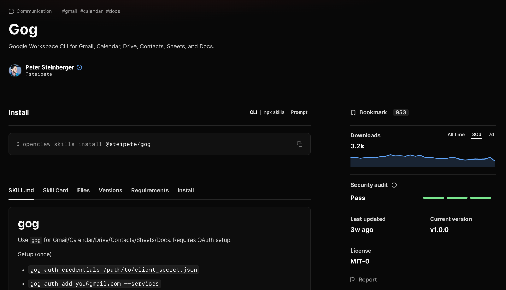
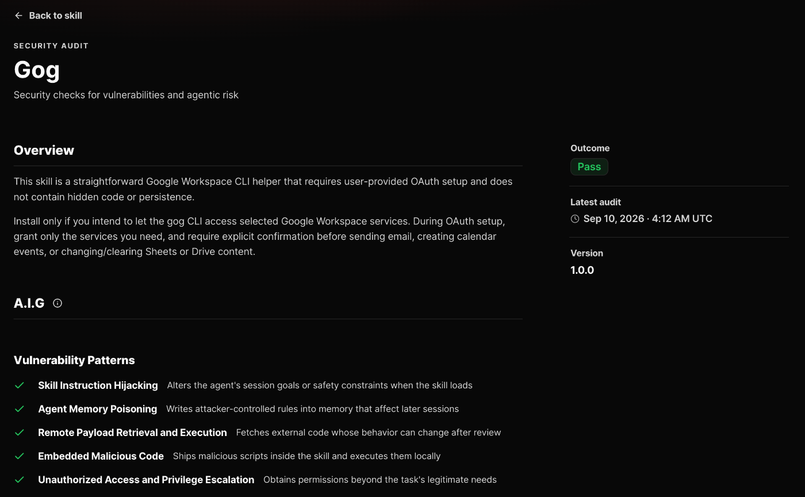

A **skill** is a folder with a `SKILL.md` file in it. The file teaches your agent a procedure: when to do something, which tools to use, and what a good result looks like. Skills are how most people extend OpenClaw day to day, and the most common pattern in the community is asking the agent to write one for itself.

OpenClaw's documentation puts the difference between the three kinds of extension neatly: tools are actions the agent can call, skills teach it how to work, and plugins add new runtime capabilities. Reach for a skill when the agent already has the tools it needs and just needs to know how to use them well.

> [!WARNING] A skill teaches. It doesn't grant, and it isn't sandboxed.
> A skill can't give your agent a tool, a credential, or shell access it didn't already have. But that cuts both ways: once installed, a skill runs with all of the agent's privileges, and nothing isolates it from them. A community skill is untrusted code and instructions. Read it before you enable it.

## Where Skills Live

OpenClaw looks for skills in several places. When two skills share a name, the one higher in this list wins:

| #   | Location                                              | Who sees it                                                                  |
| --- | ----------------------------------------------------- | ---------------------------------------------------------------------------- |
| 1   | `<workspace>/skills/`                                 | The agent that owns that workspace                                           |
| 2   | `<workspace>/.agents/skills/`                         | The same agent (project-style layout)                                        |
| 3   | `~/.agents/skills/`                                   | Every agent (your personal skills)                                           |
| 4   | `~/.openclaw/skills/`                                 | Every agent on the Gateway (`--global` installs)                             |
| 5   | `~/.openclaw/agents/<agentId>/agent/workshop-skills/` | One agent's self-written skills (see [below](#skills-that-write-themselves)) |
| 6   | Bundled with OpenClaw                                 | Every agent                                                                  |
| 7   | `skills.load.extraDirs` and plugin skills             | Every agent                                                                  |

The default workspace is `~/.openclaw/workspace`, so your own skills usually go in `~/.openclaw/workspace/skills/<name>/SKILL.md`.

These paths are on the **Gateway host**, not necessarily the computer you're typing on. On the [Railway template](running-openclaw-on-railway-with-tailscale.md), for example, the state directory lives on the volume under `/data/.openclaw`.

Precedence explains a frustrating failure: if you edit a skill and nothing changes, check whether a copy with the same name exists higher in the list. The higher copy wins silently.

## See What You Already Have

OpenClaw ships with a few dozen bundled skills, and the [Gmail lesson](gmail-and-google-calendar-integration.md) already had you look for one of them, `gog`. Three commands show what's loaded:

```sh
openclaw skills list
openclaw skills check
openclaw skills info <name>
```

All three ask the Gateway, so they report the Gateway's view even when you run them from another machine.

`list` shows every skill with a status: **ready**, **needs setup**, or **disabled**. `check` summarizes what one agent can actually use:

```text
Agent: main
Total: 56
✓ Eligible: 22
✓ Visible to model: 22
✓ Available as command: 20
Disabled: 31
Blocked by allowlist: 0
Excluded by agent allowlist: 0
✗ Missing requirements: 3
```

Your numbers will differ. Here's what the lines mean:

- **Visible to model** means the skill's name and description are in the agent's prompt, so it can choose the skill on its own.
- **Available as command** means you can also call it as a slash command. It can be lower than "visible" because some skills opt out of being commands.
- **Disabled** skills are turned off in config, so they're never offered.
- **Missing requirements** means the skill needs something the host doesn't have. `info` tells you what:

```text
⏰ apple-reminders △ Needs setup
  Source: openclaw-bundled
  Visible to model: no
  Available as command: no
Requirements:
  Binaries: ✗ remindctl
  OS: ✓ (darwin)
```

Install the missing binary on the Gateway host (or on a [paired node](connecting-a-remote-node.md) that provides it) and the skill becomes ready.

## Write Your First Skill

Start with a skill that needs no tools at all, so the only thing you're testing is whether OpenClaw finds it and uses it.

### Step 1: Create the Folder

On the Gateway host:

```sh
mkdir -p ~/.openclaw/workspace/skills/meeting-notes
```

Keep the folder name and the skill's `name` the same.

### Step 2: Write `SKILL.md`

Create `~/.openclaw/workspace/skills/meeting-notes/SKILL.md`:

```markdown
---
name: meeting-notes
description: Turn rough meeting notes into a summary with decisions, action items, and open questions.
---

# Meeting Notes

Use this when the user pastes notes from a meeting and asks you to clean them up.

1. Write a two-sentence summary of what the meeting was about.
2. List every decision under **Decisions**. Only include things that were actually decided.
3. List action items under **Action Items** as `- [ ] Owner: task (due date if mentioned)`.
   If no owner was named, write `Owner: unassigned` rather than guessing.
4. List anything unresolved under **Open Questions**.
5. Don't add commentary or recommendations unless the user asks for them.
```

The frontmatter is the part OpenClaw reads to decide _when_ to use the skill. The body is what the agent reads once it has decided to. Write the `description` as a one-line answer to "when should the agent reach for this?", in under 160 characters.

### Step 3: Confirm It Loaded

```sh
openclaw skills info meeting-notes
```

You want `Source: openclaw-workspace` and `Visible to model: yes`.

OpenClaw watches skill folders, so a new or edited skill shows up on the agent's next turn. If it doesn't, the session may be holding an old snapshot. Send `/new` to start a fresh session, or restart the Gateway.

### Step 4: Use It

There are three ways to invoke a skill:

| How                                          | Example                                            |
| -------------------------------------------- | -------------------------------------------------- |
| Let the agent choose it from the description | "Can you clean up these notes? ..."                |
| Reference it in a message with `$`           | `$meeting-notes` followed by notes                 |
| Call it as a slash command                   | `/meeting_notes ...` or `/skill meeting-notes ...` |

Slash command names can only use lowercase letters, digits, and underscores, so hyphens become underscores. `/skill <name>` always works, whatever the name.

**Test the first way, not just the last two.** Paste some messy notes without naming the skill. If the agent doesn't use it, your description isn't saying clearly enough when it applies. Rewrite it and try again.

## Add a Script

Skills get more useful when they bundle a script. The agent still runs the script with its own `exec` tool, so everything in [Security and Approvals](security-and-approvals.md) applies.

```text
~/.openclaw/workspace/skills/repo-standup/
├── SKILL.md
└── scripts/
    └── standup.sh
```

`SKILL.md`:

```markdown
---
name: repo-standup
description: Summarize the last day of commits in a Git repository as a short standup update.
metadata: { 'openclaw': { 'requires': { 'bins': ['git'] } } }
---

# Repo Standup

When the user asks for a standup update for a repository:

1. If they haven't given a repository path, ask for one.
2. Run `{baseDir}/scripts/standup.sh <repository-path>` with the `exec` tool.
3. Group the commits by theme and write three to five bullet points. Don't list every commit.
4. If the script prints nothing, say there were no commits. Don't invent work.
```

`scripts/standup.sh`:

```bash
#!/usr/bin/env bash
set -euo pipefail
cd "$1"
git log --since="24 hours ago" --no-merges --pretty=format:'%h %an %s'
```

Make the script executable with `chmod +x scripts/standup.sh`.

Two things are new here:

- **`{baseDir}`** resolves to the skill's own folder, so you never hard-code a home directory.
- **`metadata.openclaw.requires.bins`** is a gate. If `git` isn't on the host's `PATH`, the skill shows as "needs setup" and stays out of the prompt, instead of failing halfway through.

If your exec policy asks before running unfamiliar commands, the first run produces an approval prompt. Choosing **Allow always** approves this exact command in this working directory, so later runs against the same repository won't ask again.

## Frontmatter Reference

| Key                        | Default | What it does                                                      |
| -------------------------- | ------- | ----------------------------------------------------------------- |
| `name`                     | —       | Required. Lowercase letters, digits, and hyphens                  |
| `description`              | —       | Required. One line, under 160 characters                          |
| `user-invocable`           | `true`  | Set `false` to hide the skill from slash commands                 |
| `disable-model-invocation` | `false` | Set `true` so the agent never picks it alone; `$name` still works |
| `homepage`                 | —       | A link shown in the UI                                            |

Gates go under `metadata.openclaw`. A skill with no gates is always eligible.

| Key                | Rule                                                               |
| ------------------ | ------------------------------------------------------------------ |
| `requires.bins`    | Every listed binary must be on `PATH`                              |
| `requires.anyBins` | At least one must be on `PATH`                                     |
| `requires.env`     | Each environment variable must be set, or provided through config  |
| `requires.config`  | Each listed `openclaw.json` path must be truthy                    |
| `os`               | `darwin`, `linux`, and/or `win32`                                  |
| `always`           | Skip the `requires` checks (but not `os`)                          |
| `primaryEnv`       | The environment variable that `skills.entries.<name>.apiKey` fills |

Note that `os` and `always` sit next to `requires`, not inside it:

```markdown
metadata: { "openclaw": { "os": ["darwin"], "requires": { "bins": ["memo"] } } }
```

### Giving a Skill a Key

Never put a credential in `SKILL.md` or its files. If the skill declares a `primaryEnv`, give it the key through config instead:

```json5
{
  skills: {
    entries: {
      'my-search': {
        apiKey: { source: 'env', provider: 'default', id: 'SEARCH_API_KEY' },
      },
    },
  },
}
```

The key is injected into the environment only for that agent turn, and only on the host. **It doesn't reach a sandbox.** A sandboxed agent needs the variable passed through `agents.defaults.sandbox.docker.env` instead, and the gated binary installed inside the container.

## Finding Skills on ClawHub

[ClawHub](https://clawhub.ai) is the public registry for OpenClaw skills and plugins. You can browse it on the web or search from the terminal:

```sh
openclaw skills search "calendar"
```

Each skill has a page with its install command, its `SKILL.md`, its files, its version history, and a security audit:



Refer to skills by **owner and name**, like `@steipete/gog`. Popular names attract look-alikes: a search for "calendar" returns several skills from different owners with nearly identical descriptions. The owner is part of what you're trusting.

## Vetting a Skill Before You Install It

Every release gets a ClawHub security audit. Click the result on the skill's page to read the full report:



The audit gives two separate answers. The **status** says what to do with the result:

| Status    | What it means                                              |
| --------- | ---------------------------------------------------------- |
| Pass      | Nothing above low risk was found                           |
| Review    | Read the findings first. The skill may still be legitimate |
| Warn      | A high-impact concern was found. Be extra careful          |
| Malicious | Don't install it                                           |
| Pending   | The audit hasn't finished                                  |
| Error     | The audit couldn't be completed                            |

The **risk level** (Low, Medium, or High) says how much power the skill has if it works exactly as intended. A skill that sends email can be completely honest and still be Medium risk, because sending email as you is a lot of power.

You can check the same information from the terminal:

```sh
openclaw skills verify @steipete/gog --card
openclaw skills verify @steipete/gog
```

The first prints the skill card, which is a short list of the skill's risks and how to reduce them. The second prints ClawHub's verdict and, when available, a link to the exact source commit that was scanned. It doesn't rescan anything or check the files on your disk.

A **Pass** is a good sign, not a guarantee. Before installing, also do this:

1. **Read `SKILL.md`** on the Files tab. Look for instructions that change the agent's goals, write to memory, or tell it to ignore its rules.
2. **Read every script.** Look for downloads, network calls to places the skill has no reason to contact, and anything that reads environment variables or credential files.
3. **Check the requirements.** Which binaries and environment variables does it need, and do they fit what the skill claims to do?
4. **Check the owner and version history.** A long-lived skill from a verified publisher is a different bet than one published yesterday.
5. **Install narrowly.** Install into one agent's workspace rather than globally, and pin a version once you've reviewed it.

> [!NOTE] Not every source is scanned
> Skills installed with a `skills-sh:` reference are resolved by ClawHub to a GitHub commit but are marked **Not scanned by ClawHub**. Skills installed straight from Git or a local folder aren't scanned at all. For those, your own review is the only review.

## Installing, Updating, and Removing

Install a reviewed skill with:

```sh
openclaw skills install @steipete/gog
```

By default it goes into the current agent's workspace `skills/` folder. Use `--agent <id>` to pick a specific agent, `--global` to install into `~/.openclaw/skills` for every agent, and `--version <version>` to pin a release.

`install` writes to a workspace on the machine where you run it, so **run it on the Gateway host**. If your Gateway is remote, either run it there (on the Railway template, through `railway ssh --service openclaw -- openclaw skills install ...`) or install from the Control UI: open **Plugins**, switch to the **Skills** tab, and use the ClawHub search there.

Before downloading, the install checks the release's audit:

- **Review** prints the audit summary and a link, then continues.
- **Malicious** or blocked releases are refused.
- **Pending** GitHub-backed skills wait for the scan. There's a `--force-install` flag to skip the wait. Don't use it just to get past the check.

To update:

```sh
openclaw skills update @steipete/gog
openclaw skills update --all
```

Updates only apply to skills installed from ClawHub. If you've edited an installed skill, the update refuses rather than overwriting your changes, unless you pass `--force`.

There's no `openclaw skills uninstall`. Removal goes through ClawHub's own CLI, pointed at the folder you installed into:

```sh
npm install -g clawhub
clawhub --workdir ~/.openclaw/workspace uninstall @steipete/gog
```

For a `--global` install, use `--workdir ~/.openclaw` instead. Then confirm the skill is gone with `openclaw skills list`.

## Choosing Which Agents See Which Skills

By default, every agent sees every eligible skill. You can narrow that with allowlists:

```json5
{
  agents: {
    defaults: {
      skills: ['meeting-notes', 'repo-standup', 'gog'],
    },
    entries: {
      researcher: { skills: ['summarize'] },
      'locked-down': { skills: [] },
    },
  },
}
```

- An agent's own list **replaces** the default list. It doesn't add to it.
- `[]` means no skills at all.
- To turn a skill off everywhere, set `skills.entries.<name>.enabled: false`.

You can also turn skills on and off for a single conversation in the Control UI: in the message composer, click **+** and then **Skills**.

An allowlist only decides which skills an agent _knows about_. It isn't a permission boundary. An agent that can run shell commands can still run any binary on the host, whether or not a skill mentions it. Command permissions are set by [exec approvals](security-and-approvals.md), not by skills.

## Skills That Write Themselves

The **Skill Workshop** lets your agent create and improve its own skills from experience. Out of the box, it's more autonomous than you might expect:

| Setting                           | Default | What the default means                                               |
| --------------------------------- | ------- | -------------------------------------------------------------------- |
| `skills.workshop.autonomous.mode` | `auto`  | The agent edits its own Workshop skills directly with its file tools |
| `skills.workshop.approvalPolicy`  | `auto`  | The agent can apply its own proposals without asking you             |

The guardrail in `auto` mode is a directory boundary, not a reviewer. The agent can only write inside its own `workshop-skills` folder and never touches a skill from another source. But inside that folder, changes don't go through a proposal, a scan, or a rollback snapshot.

If you'd rather approve every change, switch to proposals:

```sh
openclaw config set skills.workshop.autonomous.mode propose
openclaw config set skills.workshop.approvalPolicy pending
```

Then review what the agent suggests:

```sh
openclaw skills workshop list
openclaw skills workshop inspect <proposal-id>
openclaw skills workshop apply <proposal-id>
openclaw skills workshop reject <proposal-id> --reason "Too specific"
```

The same queue is in the Control UI under **Plugins**, on the **Skill Workshop** tab.

Whatever the mode, you can ask for a skill directly. Send `/learn` after a conversation that went well, optionally with a request like `/learn a skill for triaging my GitHub notifications`. It drafts one skill for review and never applies it on its own.

## Try It Out

1. **Prove discovery works.** Create `meeting-notes`, confirm it with `openclaw skills info`, and get the agent to use it without naming it.
2. **Break a gate on purpose.** Change `repo-standup` to require a binary that doesn't exist, like `gitx`. Confirm `openclaw skills check` lists it under missing requirements and the agent no longer offers it. Change it back.
3. **Lose a precedence fight.** Put a second `meeting-notes` folder in `~/.openclaw/skills/` with a different body. Ask the agent to use it and confirm the workspace copy still wins. Delete the extra copy.
4. **Vet a real skill.** Pick a skill on ClawHub you might actually want. Read its audit, its `SKILL.md`, and its scripts, and run `openclaw skills verify @owner/name --card`. Write down one thing you'd want to know before installing it.
5. **Have the agent write one.** After a task you do often, send `/learn`. Inspect the draft before anything is applied.

## Troubleshooting

| Symptom                                   | Check                                                                                             |
| ----------------------------------------- | ------------------------------------------------------------------------------------------------- |
| The skill isn't in `openclaw skills list` | The folder and file name (`SKILL.md`), the `name` field, and that it's on the Gateway host        |
| It's listed but the agent never uses it   | The description, the agent's skill allowlist, and `disable-model-invocation`                      |
| It says "needs setup"                     | `openclaw skills info <name>` for the missing binary, environment variable, or OS                 |
| Your edits don't show up                  | A same-named skill higher in the precedence list, or a stale session (send `/new`)                |
| It works normally but fails in a sandbox  | Keys aren't passed into sandboxes, and gated binaries must exist inside the container             |
| It fails when run by a subagent           | Subagents may be denied `exec`. See [Subagents and Orchestration](subagents-and-orchestration.md) |
| `openclaw skills uninstall` doesn't exist | Use `clawhub --workdir <folder> uninstall @owner/name`                                            |

> [!NOTE] Commands and flags change
> This lesson matches OpenClaw `2026.9.8`. If something doesn't behave as described, run the command with `--help` and check the [OpenClaw documentation](https://docs.openclaw.ai).
