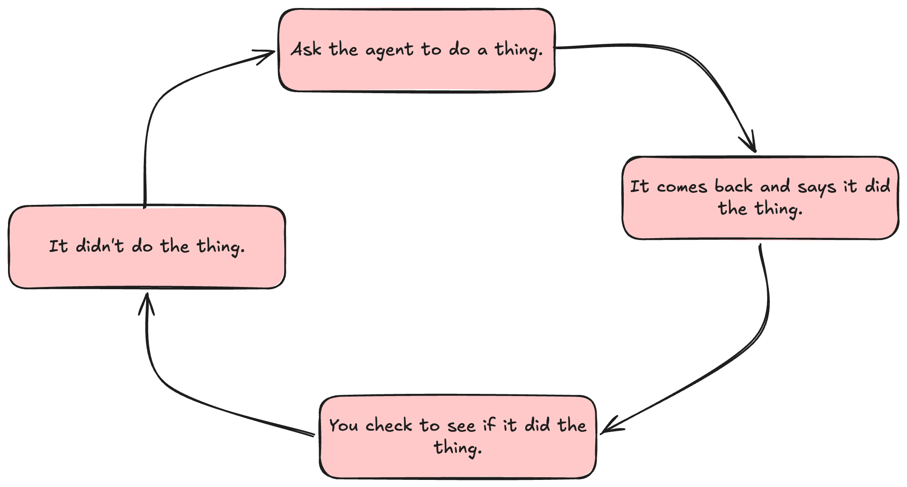

Agents are fast at editing code. They are not particularly good at knowing whether the edit was any good. If every change they make requires you to read the diff, run the thing, click around the UI, eyeball the console, and then prompt the agent to fix what it missed, you haven't automated much. You've traded one kind of typing for another.

And then this is what happens:

1. Ask the agent to do a thing.
2. It comes back and says it did the thing.
3. You check to see if it did the thing _right_.
4. It didn't.
5. Tell it that it didn't do it correctly.
6. Lather, rinse, repeat.

This workshop is built on a single bet: **the bottleneck isn't the agent's intelligence, it's that we keep making ourselves the feedback loop.** If the agent could run lint, types, unit tests, an end-to-end probe, a visual diff, and a second-opinion review on its own, it would catch most of its own mistakes before we ever saw them. Our job is to make it cheap and automatic for the agent to check its own work.

Every lab runs against the same starter project: [**Shelf**](https://github.com/stevekinney/shelf-life), a small [SvelteKit](https://kit.svelte.dev) + TypeScript book-rating app with [Vitest](https://vitest.dev/) and [Playwright](https://playwright.dev/) already wired in. You'll harden it across the day—adding agent rules, a static layer, dossiers, visual regression, and CI—until it's the codebase the rest of the workshop assumes.

The day moves in three beats. First, **prove the UI behaves**: locators and the accessibility hierarchy, a real accessibility gate, the waiting story, storage state, HAR recording, deterministic state, hybrid API+UI tests, visual regression, and a small performance budget loop. Then, **get a second opinion**: review bots, tuning [Cursor's Bugbot](https://cursor.com/bugbot) for your codebase, and what to do when the same flag shows up three times in a row. Finally, **underlay the cheap stuff and ship it**: lint and types as guardrails, dead code detection, git hooks, secret scanning, wiring the whole stack into CI, and validating the app again after merge or deploy-preview so "green CI" is not the last thing anybody checks.

There is also an **appendix** with some additional content that you _might_ find helpful: how to make the review loop portable beyond [Bugbot](https://cursor.com/bugbot), where cross-browser and nightly checks belong without slowing every pull request to a crawl, and how to translate the Shelf loop into a different stack when your real app is not SvelteKit.
