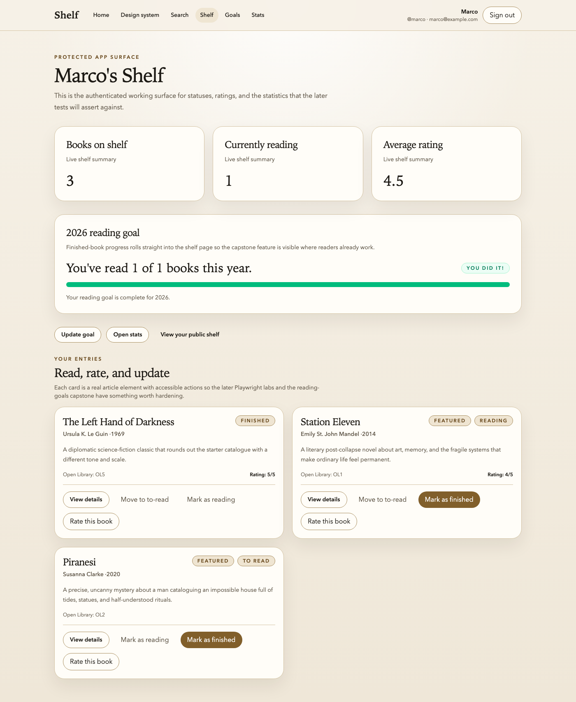
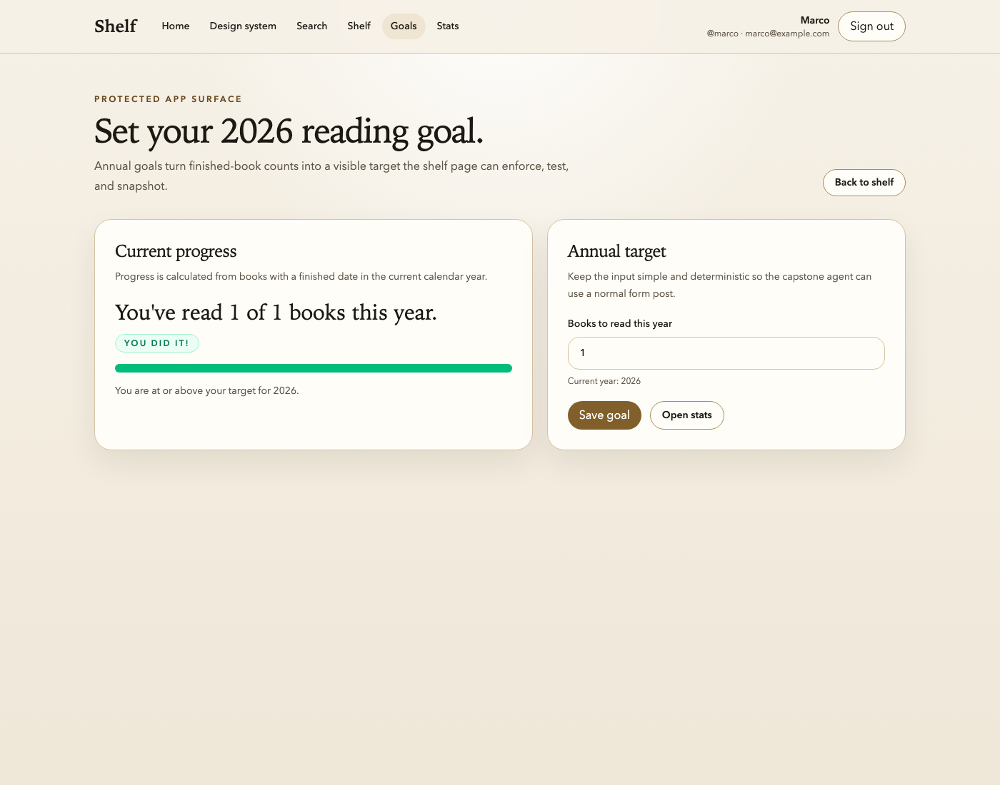
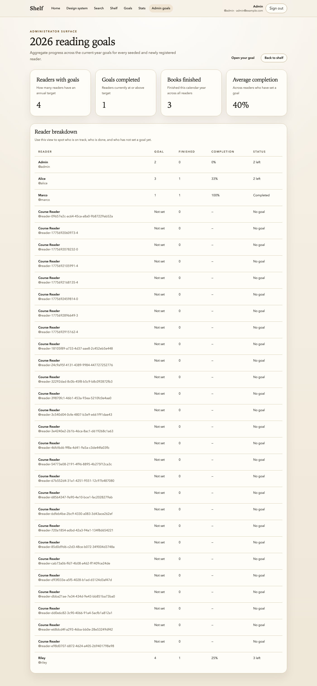

We've built a lot today. The capstone is where we take it out for a drive.

The goal is simple: give the agent a feature to build, step away from the keyboard, and see how many of the loops you built fire on their own. You are not allowed to paste error messages. You are not allowed to explain bugs. You are allowed to sit there, drink coffee, and read git log afterward. If the loops work, the agent finishes the task, opens a PR, recovers from its own mistakes, and lands it in CI without your help.

Take notes on what fires. Take notes on what doesn't. The notes are the workshop.

> [!NOTE]
> Third-run validation note: this capstone was replayed locally from a fresh Shelf branch off `main` and revalidated end to end with `npm run lint`, `npm run typecheck`, and `npm run test`. The local workshop clone still has no Git remote, so the hosted pull-request, CI, and review-bot loop remains a documented follow-up rather than a claimed outcome.

## The task

Build a new feature on Shelf: **reading goals.**

- A user can set an annual reading goal (number of books per year) from a new `/goals` page.
- The shelf page shows progress toward the goal: "You've read 12 of 30 books this year."
- If the goal is met, the progress bar turns green and a "You did it!" badge appears.
- There's an admin view at `/admin/goals` that shows aggregate stats across all users.

That's the user story. Concrete enough to build, vague enough to require real decisions.

## The finished shape

These are the three capstone surfaces the final Shelf repo should expose when the feature lands:

## The prompt

First, save the user story so the agent can read it. Create `CAPSTONE.md` at the **root of the Shelf repo** (alongside `CLAUDE.md` and `package.json`) with the four bullet points from "The task" section above as its body. No frontmatter, no preamble—just the bullets under a single `# Reading Goals` heading. The agent will read this file by name in the next step.

If your Shelf repository has a Git remote and a real hosted CI pipeline, open Claude Code in the Shelf repo and paste _exactly_ this prompt:

> Implement the reading goals feature as described in `CAPSTONE.md`. Follow every rule in `CLAUDE.md`. Keep all user-facing copy product-facing: do not mention Playwright, MCPs, seeded data, route filenames, or workshop notes in the UI. When you believe the task is complete, open a pull request and wait for CI to either pass or fail. If CI fails, read the failure dossier, diagnose the issue, fix it, and push a new commit. Repeat until CI is green. Do not ask me for clarification on anything—use the existing Shelf code as ground truth for patterns.

If your Shelf repository is still local-only and does **not** have a Git remote yet, paste this version instead:

> Implement the reading goals feature as described in `CAPSTONE.md`. Follow every rule in `CLAUDE.md`. Keep all user-facing copy product-facing: do not mention Playwright, MCPs, seeded data, route filenames, or workshop notes in the UI. When you believe the task is complete, run `npm run lint`, `npm run typecheck`, and `npm run test`. If any check fails, use the failure dossier and local artifacts to diagnose the issue, fix it, and rerun the commands until they pass. Record any hosted pull-request, CI, or review-bot gaps in `ROADMAP.md`. Do not ask me for clarification on anything—use the existing Shelf code as ground truth for patterns.

The agent now has everything it needs:

- The task description (in `CAPSTONE.md`, which you just created).
- The rules (in `CLAUDE.md`, which you've been building all day).
- The code (the hardened Shelf starter).
- The verification loops (Playwright, visual regression, custom MCPs, static checks, CI).
- The feedback mechanism (dossiers, Bugbot, CI artifacts).

Your job from this point is to _not intervene_.

> [!NOTE]
> The local Shelf repository used while developing this course currently supports the full local loop, but it may still be missing a Git remote. If so, do not pretend the hosted pull-request or CI steps happened. Finish the local loop, note the hosted gap in `ROADMAP.md`, and continue later once the repository is connected.

## Troubleshooting

- If route-level changes do not appear in Playwright after a large replay step, check whether a stale preview server is still listening on port `4173`. In this repository, `reuseExistingServer` is enabled locally, which is fast for repeat runs but can accidentally reuse an older build until you stop that process.
- If Playwright MCP fails with `ENOENT: no such file or directory, mkdir '/.playwright-mcp'`, that is an environment limitation, not a Shelf bug. Capture the screenshots with local Playwright instead and record the MCP limitation honestly in `ROADMAP.md` or the lesson notes.
- If the goals routes are present on disk but your browser still shows the old home page or a 404 for `/goals`, kill the preview process and rerun the tests against a fresh build before changing application code.

## Observation checklist

Sit with a notebook or a text file open. As the agent works, note each time one of these happens:

- [ ] The agent reads `CLAUDE.md` before writing code.
- [ ] The agent writes a failing test before writing the implementation (TDD default).
- [ ] The agent uses `getByRole` locators in new Playwright tests (no raw CSS, no `waitForTimeout`).
- [ ] The resulting UI reads like a book-tracking product rather than a workshop handout.
- [ ] The agent runs `npm run lint` after edits, either via hooks or explicitly.
- [ ] The agent runs `npm run typecheck` after edits.
- [ ] The agent runs `npm run test:unit` for the new unit tests.
- [ ] The agent runs `npm run test:e2e` for the new end-to-end tests.
- [ ] The agent calls a custom MCP tool (e.g., `verify_shelf_page`) at least once.
- [ ] The agent notices a screenshot diff on the shelf or goals page and either updates the baseline or reverts the change.
- [ ] The agent catches its own mistake via lint (seeing a red squiggle and fixing it before committing).
- [ ] The agent catches its own mistake via typecheck.
- [ ] The agent catches its own mistake via a failing Playwright test.
- [ ] The agent catches its own mistake via a runtime probe.
- [ ] If the repository has a Git remote, the agent opens a pull request without prompting.
- [ ] If CI is available, it fires and runs all jobs.
- [ ] If CI fails, the agent downloads or recreates the dossier artifact without prompting.
- [ ] If CI fails, the agent fixes the issue and pushes a new commit.
- [ ] If Bugbot (or your review bot of choice) is available, it leaves a comment on the pull request.
- [ ] If Bugbot leaves a comment, the agent addresses it.
- [ ] If CI is available, the final run is green.
- [ ] If the repository has a Git remote, the final pull request is mergeable.
- [ ] You did not paste any error messages, diagnose any bugs, or explain anything during the conversation.

The last checkbox is the one that matters. Everything else is diagnostic: if the agent finished the task but you had to paste three error messages along the way, the loop is incomplete. Which three loops failed to catch those errors? Those are your tuning targets.

## When the agent gets stuck

It will, at some point. That's expected. When it does, resist the urge to unstick it. Instead:

1. **Note what it got stuck on.** Write down the specific failure mode. "Agent looped on the same lint error for four iterations without figuring it out." "Agent didn't know to look at the dossier after CI failed." "Agent kept trying to mock the Open Library API instead of using the HAR."
2. **Wait thirty more seconds.** Sometimes it recovers on its own.
3. **If it's still stuck, intervene minimally.** A single short message is allowed, but only to unblock—not to solve. "Have you read the dossier artifact from the failed CI run?" is acceptable. "The bug is in the `calculateProgress` function, change line 47" is not.
4. **Record the intervention.** Every intervention is data. It means one of your loops isn't tight enough, and the tuning is a thing you do after the capstone, not during it.

## After the agent is done

When the agent reports the task is complete (or when you've given up on a particular intervention point), stop and take stock.

### Grading

Score each category out of the possible checkmarks above. Calculate a percentage. You are not trying to get 100%—you are trying to see _which_ loops are tight and which aren't. A 70% capstone is a great capstone because it means you have three or four specific things to tune.

If some of the hosted-only checks were not applicable because the repository had no Git remote, mark them `N/A` instead of `failed`. The point is to grade the loop you actually had, not the one you wish you had.

### The retrospective

Answer these questions in a markdown file, `CAPSTONE-retrospective.md`:

1. Which loops fired on their own, catching mistakes without my help?
2. Which loops failed to fire, allowing mistakes to propagate?
3. Which interventions did I make, and what was the minimal fix that would have prevented me from needing to intervene?
4. If I were running this workshop tomorrow with a new agent, what would I change in `CLAUDE.md` based on what I saw today?
5. What was the _biggest_ mistake the agent made that none of the loops caught? Why did they miss it? What loop would catch it next time?

These questions are the real deliverable of this workshop. The hardened Shelf repo is a nice artifact. The tuned `CLAUDE.md` is a nicer artifact. The retrospective—a list of specific, observed gaps in your agent feedback loop that you can go fix on Monday—is the thing you actually came here for.

## Take-home: tuning

You don't have to fix all the gaps during the workshop. The retrospective is the punch list for the next iteration. For each gap:

- Add a rule to `CLAUDE.md` if the agent needed a clearer operating constraint.
- Add a lint rule, custom MCP, or pre-commit check if the gap should be caught mechanically before the agent gets far enough to make a mess.
- Add a test, dossier field, or CI step if the failure belongs in a later or stricter loop.

Most gaps are short-term fixable. Most fixes are one or two lines. The loop gets tighter every week you tune it, and the agent gets more autonomous as a direct consequence.

## The one thing to remember

The workshop was never about Playwright. It wasn't even about any of the individual tools. It was about _whether you can step away from the keyboard and trust the feedback loop to do its job_. The capstone is the only honest test of that. Every gap you find is a thing to fix. Every loop that fires is a small piece of your life that used to require your attention and now doesn't.

Go build the loop. Then go use it.

## Additional Reading

- [The Hypothesis](the-hypothesis.md)—the bet we made at the start of the day, for comparison after you've built the loop
- [CI as the Loop of Last Resort](ci-as-the-loop-of-last-resort.md)
- [Failure Dossiers: What Agents Actually Need From a Red Build](failure-dossiers-what-agents-actually-need-from-a-red-build.md)
