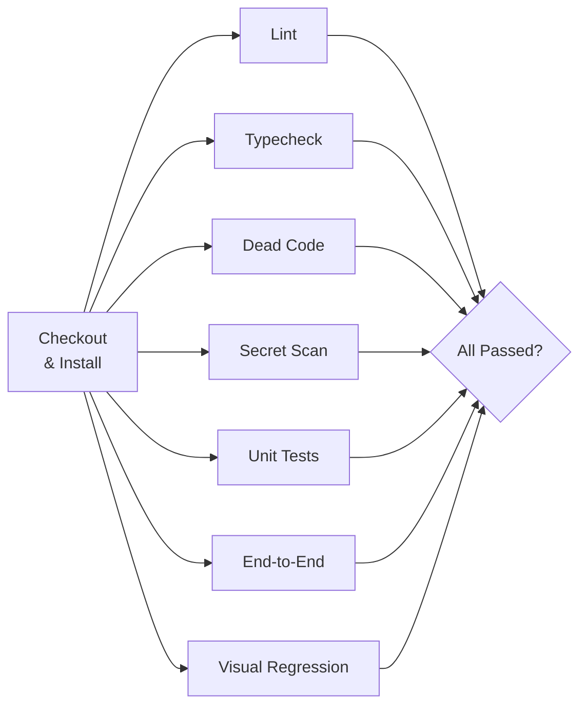

We're almost done. One module left, and it's the module where everything we built today runs together, unattended, in a [GitHub Actions](https://docs.github.com/en/actions) workflow you own.

I want to frame this up front, because the standard CI framing is different from mine.

The standard framing: "CI is where tests run." You set up CI _because_ you need your tests to run somewhere, and the workflow is a list of steps that happen on every push. Your CI is your test suite, basically.

My framing: **CI is the loop of last resort.** Everything we've built today is a loop that runs _earlier_ than CI. Lint runs on save. Type-check runs on save. Tests run locally. Knip runs in pre-push. Bugbot reviews on PR open. The agent probes its own changes before declaring done. By the time code reaches CI, most of the mistakes should already have been caught, and CI's job is to catch the rest—plus the class of mistakes you can't catch locally because your laptop isn't the production environment.

That shift matters because it changes what you put _in_ CI. If CI is where tests run, you stuff everything into CI and wait ten minutes on every push. If CI is the last resort, you put the _strict versions_ of every check in CI—full Playwright matrix, full visual regression, full secret scan against history, full dependency audit—and you accept that CI is slow because you're running it against the environment you actually care about.

## What CI uniquely catches

A short list of things that _only_ CI can reliably catch:

- **Cross-platform differences.** Your laptop is macOS. Production is Linux. Playwright's screenshot pixels differ between them. Your CI runs Linux and catches the drift.
- **Cross-browser differences.** Locally you run Chromium for speed. CI runs the full matrix (Chromium, Firefox, WebKit) and catches the "works in Chrome, broken in Safari" class of bug.
- **Clean-slate environment bugs.** The agent's laptop has ten months of cached dependencies, environment variables, and custom shell aliases. CI starts fresh on every run. Anything that only works because of your laptop's accumulated state is going to fail in CI.
- **Concurrency at scale.** Your local machine runs four Playwright workers. CI runs twelve. Race conditions that only appear under heavier concurrency show up here.
- **Time-sensitive checks.** Nightly HAR regeneration, weekly dependency audits, monthly secret rotation verification—these don't make sense locally. CI is where they live.
- **Artifact enforcement.** Blocking merges, uploading reports, posting status checks on PRs. The workflow glue lives in CI because that's where the API keys to do those things live.

If you don't have any of those concerns, you don't strictly _need_ CI. You could run everything locally. Most teams need at least three of them, which is why CI exists.

## What CI should _not_ be doing

Equally important: things CI should not be catching, because something earlier should have caught them.

- **Formatting errors.** If Prettier isn't running in pre-commit, fix the pre-commit hook. Don't let CI become the place you notice unformatted code.
- **Type errors in files the developer touched.** Pre-push typecheck catches these. CI typecheck is a safety net, not the primary surface.
- **Obvious lint violations.** Same logic. If CI is the first place you see `no-unused-vars`, your editor and hooks are misconfigured.
- **"Did the agent forget to run the tests?"** The instructions file and the Claude hooks should be catching this. If you're relying on CI to notice that the agent skipped local tests, you've missed a cheaper loop.

The rule: CI catches environment-specific and scale-specific problems. Everything else should have been caught earlier, and when CI _does_ catch something earlier-able, treat it as a bug in your earlier loops, not as a CI feature.

## The Shelf CI workflow, at a high level

The next lesson walks through the actual YAML. Here's the shape before we get there.

On every push to any branch and every PR into main:

1. **Checkout and install.** Clone the repo, restore caches, `bun install`.
2. **Static fan-out.** Run lint, typecheck, knip, and gitleaks in parallel. These are fast and independent, so there's no reason to serialize them.
3. **Unit tests.** `bun test`. Fast.
4. **End-to-end tests.** Playwright, full Chromium run. Upload trace artifacts, screenshots, and the failure dossier if anything fails.
5. **Visual regression.** Same Playwright run, or a separate job if you want to isolate. Upload diff images on failure.
6. **Secret scan against history.** Full `gitleaks detect`, not just staged files.
7. **Post results.** If Bugbot or a similar review tool isn't already posting to the PR from its own integration, a summary step posts test counts, coverage deltas, and any dossier content.

On a nightly schedule:

1. **Refresh HAR files** by re-recording against the real Open Library API. Open a PR with the updated HARs if they changed. A human reviews.
2. **Dependency audit.** Run `bun audit`, open an issue or PR if anything new turns up.
3. **Full cross-browser Playwright run.** Chromium, Firefox, WebKit. Surface differences that the daily Chromium-only runs miss.

On every merge to main:

1. **Deploy to staging.** (Out of scope for this workshop, but the hook is there.)
2. **Run a smoke-test probe** against staging to verify the deploy was real.

That's the whole shape. Five jobs in the main workflow, three in the nightly workflow, one in the merge workflow. Each is boring. The power is in the composition.

## Parallelism and caching, the two knobs that matter

Two things you do once and benefit from on every run.

**Parallelism.** GitHub Actions jobs run in parallel by default. Your lint job, typecheck job, knip job, and secret scan job should all run at the same time, not sequentially. Playwright's own sharding can split the end-to-end suite across multiple runners. The difference between a 15-minute sequential CI and a 4-minute parallel CI is usually just understanding that `jobs:` are parallel and `steps:` are sequential, and writing your workflow accordingly.

Here's the shape of a parallel Shelf workflow:



Notice: checkout and install happen once, then all seven checks run in parallel. Total time is limited by the slowest job (usually E2E), not the sum of all jobs.

**Caching.** Bun, npm, and yarn all produce lock-hash-stable caches. Cache the `node_modules` (or Bun's equivalent) directory and CI runs cut 30-60 seconds off the install step. Cache the Playwright browsers and you save another 30 seconds. Cache the TypeScript build info and incremental typecheck gets faster. None of this is hard; it's just the stuff people forget to do because "it works without it." It works without it. It works faster _with_ it.

The actual GitHub Actions `cache` action looks like:

```yaml
- name: Cache dependencies
  uses: actions/cache@v4
  with:
    path: |
      node_modules
      ~/.cache/ms-playwright
    key: ${{ runner.os }}-deps-${{ hashFiles('**/bun.lockb') }}
```

Two lines of cache config, a minute shaved off every run. Do it.

## Fail fast, but not too fast

A common mistake: `fail-fast: true` on every job, which causes any single red check to cancel the whole workflow. This feels efficient—why keep running if something already failed?—but it's the wrong trade for a workshop-grade loop.

The better default is `fail-fast: false`. Run everything to completion. The agent wants to see _all_ the failures at once, not just the first one, because fixing them one at a time is slower than fixing them in a single pass. Running everything also means you get full artifacts (traces, screenshots, dossiers) for every failure, not just the one that fired first.

The exception: job dependencies. If your Playwright job depends on a successful build, don't run Playwright when the build is red. Use `needs:` to express that, and let `fail-fast: false` handle the rest.

## Required checks and branch protection

Once the workflow is reliable, turn on branch protection on `main`:

- Require status checks to pass before merging.
- Require the specific checks you care about: `lint`, `typecheck`, `test`, `playwright`, `secret-scan`.
- Optionally, require Bugbot (or your review bot of choice) to have completed and left a non-blocking comment.
- Require a human reviewer for changes outside certain paths.

Branch protection is the hard gate. Everything before it is soft—the agent can ignore local checks if it's determined. CI plus branch protection is the non-negotiable layer.

## What the agent sees when CI fails

This is the part I want you to optimize for.

When CI fails, the agent should be able to recover without a human pasting error messages. That means:

- The failure messages in the status check summary are specific, not "job failed."
- Artifacts (traces, screenshots, dossier, report JSON) are uploaded to the run.
- The PR gets a comment with a link to the artifacts and a short summary.
- The dossier script from Module 6 runs in CI and the output is uploaded as an artifact.

With those in place, the agent can read the PR, read the status check, download the dossier artifact, and iterate. You don't have to be the relay. The agent iterates until green or until it gets stuck in a way it can report back to you.

I have watched this work. An agent opens a PR, CI fails, the agent reads the dossier artifact, makes a fix, pushes a new commit, CI fails in a different way, the agent reads the new dossier, fixes it, pushes again, CI goes green, and I find out about the whole sequence when I look at the PR thirty minutes later. Entire bug fixes, self-driven, because the CI output is legible to the agent. That's the loop.

## CLAUDE.md rules

```markdown
## CI

- The CI workflow lives at `.github/workflows/main.yml`. Read it before
  proposing changes to the CI configuration.
- When CI fails, download the dossier artifact from the failed run:
  `gh run download <run-id> -n failure-dossier`. Read the dossier,
  reproduce the failure locally, fix it, push a new commit.
- Do not add `continue-on-error: true` to any job without written
  justification in the commit message.
- Do not reduce the strictness of CI checks to "fix" a failure. If a
  check is too strict, say so explicitly and propose the relaxation
  as a separate decision, not as part of a bug fix.
- The nightly HAR refresh opens a PR. If the diff is suspicious, do not
  merge it—investigate whether the upstream API changed in a way that
  requires application code changes.
```

## The one thing to remember

CI is where the loops you built all day run together, one more time, in a clean environment, with the strict versions of every check. If it's the _first_ time any of those checks run, you've misallocated. If it's the _last_ time, with the tightest config, catching environment-specific mistakes your laptop can't, you're doing it right.

## Additional Reading

- [Failure Dossiers: What Agents Actually Need From a Red Build](failure-dossiers-what-agents-actually-need-from-a-red-build.md)
- [Lab: Write the CI Workflow from Scratch](lab-write-the-ci-workflow-from-scratch.md)
