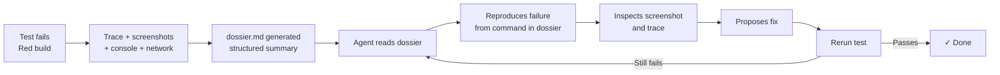

Here's a thing I wish I'd understood about a year earlier than I did: **when an agent sees a test failure, the test output is a prompt.** That's the whole framing shift. The red X on the build isn't a status—it's the next instruction the agent is going to act on, and everything attached to the red X is context for that instruction.

Which means the quality of your test output determines how well the agent can fix things. A failure that says `expect(received).toBe(expected)` with two-line stack trace is a bad prompt. A failure that says what was expected, what actually happened, what the page looked like, what the console said, what the network did, and where to look first—that's a good prompt. The agent will fix the second one without your help about three times more often than it fixes the first.

This lesson is about making failures good prompts. I call the bundle a "failure dossier," because I'm dramatic. Call it whatever you want. The idea is the same.

## What a failure dossier contains

Minimum viable dossier for a failing Playwright test:

- **The test name and file path.** Obvious, often missing from a copy-pasted error.
- **The assertion that failed.** What did the test expect? What did it get? Both sides, not just the failure message.
- **A screenshot of the page at the point of failure.** Playwright takes this for you if you ask it to.
- **The full DOM snapshot at the point of failure.** Playwright's trace file includes this.
- **Console logs from the browser during the test run.** Also in the trace.
- **Network requests that happened during the test.** Also in the trace.
- **The command to reproduce.** Not "the test failed"—the literal shell command that isolates this test.

If your dossier has all of these and a label saying "here's what failed and why," the agent has everything it needs to propose a fix without asking you a single question.

The good news: Playwright already captures most of this for you. You just have to turn it on and route it to a place the agent can read it.

## Turning on traces, screenshots, and videos

In `playwright.config.ts`, use the [tracing configuration options](https://playwright.dev/docs/api/class-testoptions#test-options-trace):

```ts
export default defineConfig({
  outputDir: 'playwright-report/test-results',
  use: {
    trace: 'retain-on-failure',
    screenshot: 'only-on-failure',
    video: 'retain-on-failure',
  },
});
```

Three knobs.

`trace: 'retain-on-failure'` tells Playwright to record a trace file (`trace.zip`) for every test that fails and discard it for every test that passes. The trace includes DOM snapshots, screenshots, network logs, console logs, and the full Playwright action log. It's the most information-dense artifact in the whole ecosystem. You can open it with `npx playwright show-trace trace.zip` and get a fully interactive timeline of the test using the [Trace Viewer](https://playwright.dev/docs/trace-viewer).

`screenshot: 'only-on-failure'` writes a single PNG of the page at the moment the assertion failed. This is the image you feed to an agent. It's redundant with the trace but cheaper to access—one file, opens instantly.

`video: 'retain-on-failure'` records the whole test as a video. I use this less often than I expected to. A video of a test is hard for an agent to consume (most agents can't watch video), and it's rarely more useful than the trace for a human. I keep it on because it's free, but I wouldn't miss it if it weren't.

## The HTML report is the dossier's front door

`playwright.config.ts`:

```ts
reporter: [
  ['html', { open: 'never', outputFolder: 'playwright-report/html' }],
  ['json', { outputFile: 'playwright-report/report.json' }],
  ['list'],
],
```

The HTML reporter writes `playwright-report/html/index.html`, and for each failed test it shows the assertion, the screenshot, the error stack, and a link to open the trace. Open it in a browser and you get a gorgeous, readable dossier with zero effort.

> [!TIP] The easiest way to see this work
> If you want to see the whole dossier pipeline end-to-end without planting a fake application bug, temporarily move one committed visual-regression baseline and run the matching visual test. That produces the full artifact set—`report.json`, `dossier.md`, retained screenshot, retained video, and a `trace.zip` under `playwright-report/test-results/`—off a single intentional failure you can undo in one commit.


The `open: 'never'` flag keeps Playwright from auto-opening a browser tab when you run tests, which is annoying in CI and distracting locally.

In Shelf, the easiest deliberate break is still the `src/routes/design-system/+page.svelte` route because it gives you a loud UI change without touching auth or seeded data. Run the suite through `npm run test:e2e` when you want the real Playwright artifact set, and keep `npm run test` in the loop too so the basic unit gates stay honest while you are iterating on the failure.

## Making dossiers agent-readable

Here's where the lesson gets interesting. An HTML report is great for humans. It's _okay_ for agents. The agent can read the filesystem, so it can technically find the error messages. But it's much better if the agent can ask for "the dossier for the last failing test" and get back a structured summary.

A failure dossier summarizer is worth writing. It's a ~50 line script that:

1. Reads `playwright-report/report.json` after a test run.
2. Finds the failed tests.
3. For each one, extracts the error message, the screenshot path, the retained trace, and the reproduction command.
4. Writes a single `dossier.md` file with all of that, linked to the attachments.

### What the Playwright report looks like

Before we walk the report, it helps to see the shape you're walking. The JSON reporter writes a nested tree: `suites` at the top, each with its own `suites` and `specs`, each `spec` has `tests`, each `test` has `results`, and each failing `result` has an `error` plus `attachments`. The trimmed shape is:

```jsonc
{
  "suites": [
    {
      "suites": [],
      "specs": [
        {
          "title": "user can rate Station Eleven",
          "file": "tests/end-to-end/rate-book.spec.ts",
          "line": 9,
          "tests": [
            {
              "projectName": "authenticated",
              "results": [
                {
                  "status": "failed",
                  "error": { "message": "expect(...).toHaveText failed ..." },
                  "attachments": [
                    {
                      "name": "screenshot",
                      "contentType": "image/png",
                      "path": "playwright-report/test-results/.../test-failed-1.png",
                    },
                    {
                      "name": "trace",
                      "contentType": "application/zip",
                      "path": "playwright-report/test-results/.../trace.zip",
                    },
                  ],
                },
              ],
            },
          ],
        },
      ],
    },
  ],
}
```

The important fields, in the order the walker will reach them:

- `suites[].suites[]` — suites nest, so the walker is recursive.
- `specs[].title`, `specs[].file`, `specs[].line` — these are the fields that identify the test.
- `tests[].projectName` — the Playwright project (e.g. `authenticated`, `public`) that produced the result. We'll use it to build the reproduction command.
- `results[].status` — check for `failed` or `timedOut`.
- `results[].error.message` — the primary human-readable error string.
- `results[].attachments[]` — each attachment has `name`, `contentType`, and `path`. Screenshots land as `image/png`, traces as `application/zip` (and are also named `trace`), videos as `video/webm`.

Now the script. It walks the suite tree, filters to failed results, and renders each one into a markdown section.

```ts
// scripts/summarize-failure-dossier.ts
import { readFileSync, writeFileSync } from 'node:fs';
import path from 'node:path';

const reportJson = JSON.parse(readFileSync('playwright-report/report.json', 'utf8'));

function collectSpecs(suites: any[]): any[] {
  return suites.flatMap((suite: any) => [
    ...(suite.specs ?? []),
    ...collectSpecs(suite.suites ?? []),
  ]);
}

const failures = collectSpecs(reportJson.suites ?? []).flatMap((spec: any) =>
  (spec.tests ?? []).flatMap((test: any) => {
    const failedResult = (test.results ?? []).find(
      (result: any) => result.status === 'failed' || result.status === 'timedOut',
    );
    return failedResult ? [{ spec, failedResult, projectName: test.projectName }] : [];
  }),
);

const screenshot = (attachments: any[]) => {
  const file = (attachments ?? []).find((a: any) => a.contentType?.startsWith('image/') && a.path);
  return file ? `**Screenshot**: [${path.basename(file.path)}](${file.path})\n` : '';
};

const trace = (attachments: any[]) => {
  const file = (attachments ?? []).find((a: any) => a.name === 'trace' && a.path);
  return file ? `**Trace**: \`npx playwright show-trace ${file.path}\`\n` : '';
};

const markdown = failures
  .map(
    ({ spec, failedResult, projectName }: any) => `
## ${spec.title}

**Project**: \`${projectName}\`

**File**: \`${spec.file}:${spec.line}\`

**Error**:
\`\`\`
${failedResult.error?.message ?? 'Unknown error'}
\`\`\`

${screenshot(failedResult.attachments)}${trace(failedResult.attachments)}
**Reproduce**:
\`\`\`sh
npx playwright test --project=${projectName} ${spec.file} -g ${JSON.stringify(spec.title)}
\`\`\`
`,
  )
  .join('\n---\n');

writeFileSync(
  'playwright-report/dossier.md',
  markdown || '# Playwright failure dossier\n\nNo failing tests.\n',
);
console.error(`Wrote dossier for ${failures.length} failures`);
```

> [!NOTE] The course solution includes the production version
> Shelf's `scripts/summarize-failure-dossier.ts` is a longer, fully-typed version of this sketch that also picks the `diff` attachment ahead of the baseline on visual regression failures, guards against `result.error` being undefined via `result.errors[0]`, and makes every attachment path relative to the repo root. Read the sketch above to understand the walk, then open the course solution or your lab implementation to see the production shape.

### A representative failing-run `dossier.md` excerpt

After one intentionally failing rate-book test, the generated markdown includes an entry like this:

```markdown
# Playwright failure dossier

## user can rate Station Eleven

**Project**: `authenticated`

**File**: `tests/end-to-end/rate-book.spec.ts:9`

**Error**:

\`\`\`
Error: expect(locator).toHaveText(expected) failed
Locator: getByRole('status')
Expected string: "Thanks"
Received string: ""
\`\`\`

**Screenshot**: [test-failed-1.png](./playwright-report/test-results/.../test-failed-1.png)

**Trace**: `npx playwright show-trace playwright-report/test-results/.../trace.zip`

**Reproduce**:

\`\`\`sh
npx playwright test --project=authenticated tests/end-to-end/rate-book.spec.ts -g "user can rate Station Eleven"
\`\`\`
```

That's exactly what you want in an agent's hand: the test title, the project it lived in, the file and line, the full error message, a link to the screenshot, a one-liner to open the trace, and a reproduction command that isolates just this test. The agent reads one file and knows what to do next.

(Adjust field names to match your Playwright version if needed—the JSON schema shifts between releases. The point is the structure, not the exact API.)

For an alternative that skips the custom script entirely and uses the LLM itself to triage the dossier into typed JSON, see [Structured CLI Output as Pipeline Glue](structured-cli-output-as-pipeline-glue.md). That lesson teaches `claude -p --json-schema` with the dossier as input—same data, different consumer.

Now you can add this section to `CLAUDE.md`:

```markdown
## When a test fails

1. Run `npm run dossier` to generate a summary at `playwright-report/dossier.md`.
2. Read the dossier. It contains the error, screenshot path, trace path, and reproduction command for every failing test.
3. Use the reproduction command to rerun just the failing test while iterating.
4. Do not "fix" a failing test by changing the assertion. Fix the underlying code.
5. Do not add `console.log` calls to test files to debug. The trace already has the DOM at every step; open it with `npx playwright show-trace <path>`.
```

The agent now has a single, structured entry point. One command, one file, actionable content inside.

## How the loop flows



## Console and network capture

Two Playwright tricks that pay for themselves immediately in the dossier.

**Forwarding browser console to test output.** Add this as a test fixture:

```ts
// tests/end-to-end/fixtures.ts
export const test = base.extend({
  page: async ({ page }, use) => {
    page.on('console', (msg) => {
      if (msg.type() === 'error' || msg.type() === 'warning') {
        console.error(`[browser ${msg.type()}] ${msg.text()}`);
      }
    });
    page.on('pageerror', (error) => {
      console.error(`[browser pageerror] ${error.message}`);
    });
    await use(page);
  },
});
```

Now any browser console error shows up in the test output. When a test fails, the agent can grep the output for `[browser` and see what the app was complaining about in the moments leading up to failure. Half of "mystery" failures turn out to be "oh, there was a TypeError in a component we didn't think mattered."

**Network failure logging.** Similar pattern:

```ts
page.on('requestfailed', (request) => {
  const failureText = request.failure()?.errorText ?? 'unknown error';
  if (failureText.includes('ERR_ABORTED') || failureText.includes('NS_BINDING_ABORTED')) {
    return;
  }
  console.error(`[network failed] ${request.method()} ${request.url()} - ${failureText}`);
});
page.on('response', async (response) => {
  if (response.status() >= 400) {
    console.error(
      `[network ${response.status()}] ${response.request().method()} ${response.url()}`,
    );
  }
});
```

Every failed request, every 4xx, every 5xx shows up in the output. When a test fails because "the button didn't do anything," the `[network 500]` line in the output tells the agent that the button _did_ do something—the API call just failed.

## The `console.log` trap

A counterintuitive one: stop letting the agent add `console.log` statements to tests as a debugging technique. The test fails, the agent adds `console.log(await page.content())` and reruns it. This works, but it's a worse version of what the trace already gives you. The trace has the full DOM at every step, timestamped, already structured.

Rule:

```markdown
- Do not add `console.log` statements to test files to debug failures.
  Read the trace instead: `npx playwright show-trace <path>`. If the
  information you want is not in the trace, either add it as a
  permanent observation (network listener, console forwarder) or
  explain why it's missing.
```

The reason this matters is that `console.log` statements add up. They land in PRs. They ship to CI. They accumulate. A test file with fifteen `console.log` calls is a test file nobody wants to read, and all fifteen were added one at a time by an agent trying to fix a failure.

## What the dossier gives you on the agent side

Here's the loop I care about. A test fails. The dossier is generated. The agent runs Claude Code and says:

> Read `playwright-report/dossier.md`. Pick the first failure. Use the reproduction command to rerun the test in isolation. Look at the screenshot. Read the trace. Propose a fix. Apply the fix. Re-run the test. If it still fails, iterate.

That's a fully self-driving debugging loop. The agent doesn't need you to paste error messages. It doesn't need you to run the test. It doesn't need you to open the HTML report. It reads the dossier, reproduces the failure, looks at the evidence, and iterates. All you do is notice when the loop converges and review the fix.

Every piece of this lesson is a piece of that loop. The dossier is the entry point. The trace is the evidence. The reproduction command is the action. The screenshot is the sanity check.

## The one thing to remember

A failing test is a prompt. A good prompt is loaded with evidence. Traces, screenshots, console logs, reproduction commands—all of them belong in the dossier, because the agent can only act on what you attach. Turn them on once and the loop gets dramatically tighter.

## Additional Reading

- [Writing a Custom MCP Wrapper](writing-a-custom-mcp-wrapper.md)
- [Lab: Build a Failure Dossier for Shelf](lab-build-a-failure-dossier-for-shelf.md)
