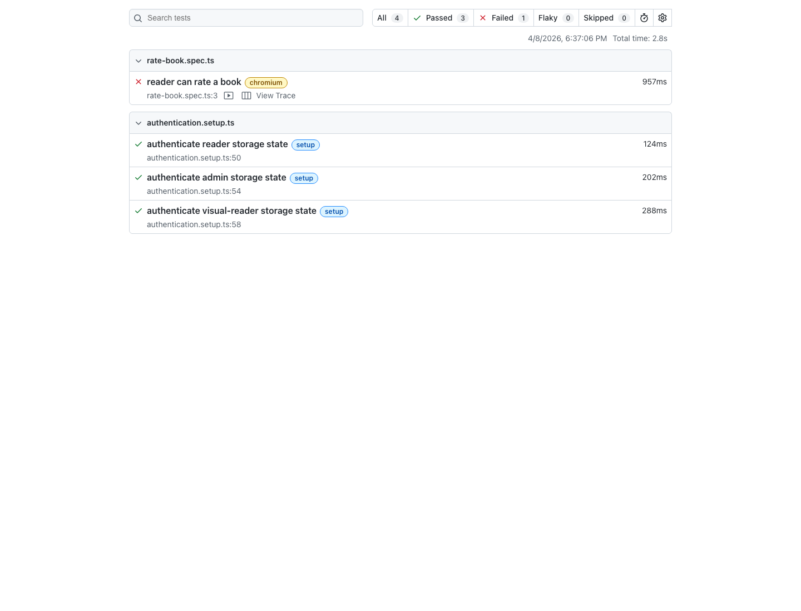

Short lab. Wire up the dossier infrastructure, then run a failure through it to verify the loop closes.

> [!NOTE]
> **Third dry run validation**: The current Shelf starter writes artifacts under `playwright-report/test-results/`, the HTML report to `playwright-report/html/`, the JSON report to `playwright-report/report.json`, and the markdown summary to `playwright-report/dossier.md`. A simple, controlled way to force a failure is to temporarily move one committed screenshot baseline, run the matching visual test, generate the dossier, then restore the baseline and rerun green.

## The task

Update the Shelf repo so that every failing Playwright test produces a structured dossier the agent can read without any additional context.

### Step 1: trace and screenshot config

In `playwright.config.ts`, ensure the following are set:

```ts
outputDir: 'playwright-report/test-results',
use: {
  trace: 'retain-on-failure',
  screenshot: 'only-on-failure',
  video: 'retain-on-failure',
},
reporter: [
  ['html', { open: 'never', outputFolder: 'playwright-report/html' }],
  ['json', { outputFile: 'playwright-report/report.json' }],
  ['list'],
],
```

The JSON reporter is new—your dossier script is going to read from it.

### Step 2: console and network forwarders

In `tests/end-to-end/fixtures.ts`, extend the `page` fixture to forward browser console errors and failed network responses to the Node process's stderr. Use the patterns from the lesson, and filter out benign navigation aborts like `ERR_ABORTED` so the output stays actionable.

Verify it works by adding a temporary `console.error('hello')` to any page component and running the rate-book test. You should see `[browser error] hello` in the test output.

### Step 3: the dossier summarizer

Write `scripts/summarize-failure-dossier.ts` that reads `playwright-report/report.json` and produces `playwright-report/dossier.md`. The dossier should include, for each failed test:

- Test title and file location
- Full error message
- Relative path to the screenshot
- Exact shell command to reproduce the failure

Add a `package.json` script: `"dossier": "tsx scripts/summarize-failure-dossier.ts"`.

### Step 4: CLAUDE.md

Add a section titled "When a test fails" with the reproduction instructions from the lesson.



## Acceptance criteria

- [ ] `playwright.config.ts` has `trace: 'retain-on-failure'`, `screenshot: 'only-on-failure'`, and the JSON reporter enabled.
- [ ] `tests/end-to-end/fixtures.ts` (or equivalent) forwards browser console errors and warnings to stderr. Verify with a deliberate `console.error` and check that it shows up in test output.
- [ ] `scripts/summarize-failure-dossier.ts` exists and runs without crashing: `npm run dossier` exits zero even when there are no failures (with an appropriate "no failures" message).
- [ ] `package.json` has a `dossier` script.
- [ ] `CLAUDE.md` has a "When a test fails" section that names the reproduction command (`npm run dossier`) and the path to the output file.
- [ ] Deliberately break a test (change an assertion so it fails) and run it. Verify:
  - [ ] `playwright-report/html/index.html` exists
  - [ ] `playwright-report/report.json` exists
  - [ ] A `trace.zip` exists somewhere under `playwright-report/test-results/`
  - [ ] A failure screenshot exists somewhere under `playwright-report/test-results/`
  - [ ] `npm run dossier` produces a `playwright-report/dossier.md` with the failure listed
  - [ ] The dossier contains the reproduction command
  - [ ] The dossier contains a screenshot link
- [ ] Revert the broken test. Run the suite green. `npm run dossier` reports no failures.

## Testing the loop end-to-end

Now the hard part. Verify the loop actually works by giving the agent a failing test and nothing else.

1. Introduce a subtle bug in Shelf. Example: in the "rate book" API handler, accidentally multiply the rating by 2 before saving. (`shelfEntry.rating = input.rating * 2`)
2. Run `npx playwright test --project=chromium tests/end-to-end/rate-book.spec.ts`. It should fail because the persisted rating doesn't match what the UI shows.
3. Run `npm run dossier`. Open `playwright-report/dossier.md` to confirm the failure is captured.
4. Open Claude Code. Say: _"Read `playwright-report/dossier.md`. Diagnose the failure. Propose a fix. Apply it."_
5. Do not give the agent any other context. Do not mention that you multiplied by 2. Let it figure it out from the dossier and the code.

### End-to-end acceptance criteria

- [ ] The agent reads the dossier without being prompted to look anywhere else.
- [ ] The agent reproduces the failure locally using the reproduction command from the dossier.
- [ ] The agent identifies the bug in the rate-book handler.
- [ ] The agent applies the fix and reruns the test.
- [ ] The test passes.
- [ ] You did not need to provide additional context during the conversation.

If the agent got stuck, the dossier was missing something. Figure out what it was missing and add it. Common gaps: not enough context in the error message, screenshot doesn't show the relevant UI state, reproduction command doesn't isolate the failure, console logs not included. Iterate until the agent can debug a planted bug without your help.

## Stretch goals

- Expand the dossier to include the first 20 lines of the trace's action log for each failure (Playwright's trace JSON can be parsed to extract this).
- Add a "recent git history" section to the dossier—the last 5 commits and their summaries—so the agent has context for what recently changed.
- Write a second dossier format, `dossier.json`, so tools can consume it programmatically.
- Add the dossier summarizer to the `test` npm script so it always runs after a failing test run. `"test:e2e": "playwright test || (npm run dossier && exit 1)"`.

## The one thing to remember

The moment you can hand the agent a single file and say "diagnose this," you've automated the first half of debugging. Everything after that is iteration, and iteration is where agents excel. The dossier is the bridge between "a test failed" and "the agent can fix it unsupervised."

## Additional Reading

- [Failure Dossiers: What Agents Actually Need From a Red Build](failure-dossiers-what-agents-actually-need-from-a-red-build.md)
- [The Second Opinion](the-second-opinion.md)
