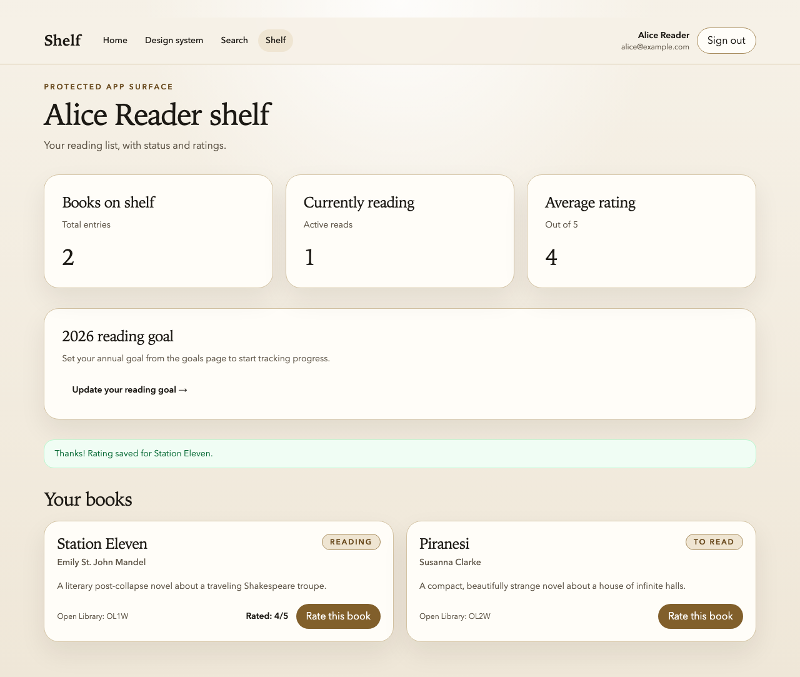

Time to cash the checks from the last six lessons. The Shelf starter ships with a hardened `tests/end-to-end/rate-book.spec.ts`—study it if you want to see the target. Your job in this lab is to _rebuild_ it by hand, starting from the intentionally rough version below, so every Module 3 pattern lands in your fingers instead of just your eyes.

The rough version works. Sort of. It passes until the machine gets slower, the selectors drift, or the database state stops matching your assumptions. It bundles every Module 3 anti-pattern into one short file, which makes it a great place to harden the whole loop.

> [!NOTE] Two local-setup details to know
> Shelf's storage-state setup drives the real login page because the form-action shortcut trips CSRF protection in Better Auth, and `playwright.config.ts` pins `workers: 1` because the starter uses one shared SQLite file. Both are explicit in the repo; neither is a bug.

Your job is to fix it. Every pattern we learned in Module 3 applies here.

## The starting point

```ts
import { test, expect } from '@playwright/test';

test('user can rate a book', async ({ page }) => {
  await page.goto('/login');
  await page.fill('[name=email]', 'alice@example.com');
  await page.fill('[name=password]', 'password123');
  await page.click('button[type=submit]');
  await page.waitForTimeout(1000);

  await page.goto('/shelf');
  await page.waitForTimeout(2000);
  await page.locator('.book-card button.rate').first().click();

  await page.locator('.rating-modal .star[data-value="4"]').click();
  await page.locator('.rating-modal button.submit').click();
  await page.waitForTimeout(1500);

  const toast = await page.locator('.toast').textContent();
  expect(toast).toContain('Thanks');
});
```

Count the problems. I get eight. See if you can find more.

- UI login at the top of every test.
- Three `waitForTimeout` calls with three different magic numbers.
- CSS selectors everywhere.
- Chained `.locator(...)` with compound selectors that are going to break when anyone touches the class names.
- `.first()` to handle the fact that there's more than one `.book-card`, instead of scoping to a specific book.
- `textContent()` read into a variable and asserted with `.toContain`, bypassing Playwright's auto-retry.
- No seeding, so the test depends on whatever the database happens to have in it.
- No network mocking, so the rating POST hits a real API endpoint and sometimes the response is slow.

## The task

Rewrite the test so it passes every run on both a fast laptop and a slow CI machine. You should end up applying, at minimum:

1. Storage state authentication (no UI login).
2. Seeding (the book exists in the database before the test runs).
3. `getByRole` locators with scoped chaining.
4. Auto-retrying `expect` assertions instead of `textContent` + `toContain`.
5. `page.waitForResponse` for the rating POST, not a timeout.
6. Zero `waitForTimeout` calls anywhere in the file.

You may also want to use the `request` fixture to verify the rating actually landed in the database, as a second assertion on top of the UI check.

## Suggested order of attack

Work top-down. Fix one pattern, run the test, move on.

Start by extracting the login into `tests/end-to-end/authentication.setup.ts` and wiring up `playwright.config.ts` to use it. Delete the login block from the test. In the current Shelf starter, the stable setup is a browser-driven login in the setup project: navigate to `/login`, fill the form through the page, and save state with `page.context().storageState(...)`. Do not use a raw `request.post` to the sign-in action—the current auth stack enforces CSRF-style semantics and will reject it with a 403. Run the suite to make sure authentication still works. Commit. (See the Storage State Authentication lesson for the full pattern.)

Next, add (or use) `tests/end-to-end/helpers/seed.ts` to ensure the book you're going to rate is in the database before the test runs. Delete any reliance on "whatever is on the shelf already." Commit.

Next, swap the CSS selectors for `getByRole` chains. Scope by book title, then by button name inside the book. Run the test locally a few times. Commit.

Next, replace every `waitForTimeout` with either an `expect(locator).toBeVisible()` assertion or a `page.waitForResponse` on the rating POST. Delete the `textContent` + `toContain` pattern and use `expect(toast).toHaveText(/Thanks/)` instead. Commit.

Finally, add a second assertion using `request.get('/api/shelf/...')` to verify the rating is actually persisted. This isn't strictly required, but it's the kind of hybrid check that catches "UI says success but database disagrees" bugs. Commit.

## Acceptance criteria

- [ ] `rg "waitForTimeout" tests/end-to-end/rate-book.spec.ts` returns nothing.
- [ ] `rg "page.locator\(" tests/end-to-end/rate-book.spec.ts` returns nothing.
- [ ] `rg "page.goto\('/login'\)" tests/end-to-end/rate-book.spec.ts` returns nothing.
- [ ] `rg "page.fill\(\[name=" tests/end-to-end/rate-book.spec.ts` returns nothing.
- [ ] The test passes ten times in a row: `for i in {1..10}; do npx playwright test --project=chromium tests/end-to-end/rate-book.spec.ts || break; done` and no iteration exits non-zero.
- [ ] The test passes with the current Playwright configuration, which pins `workers: 1` because the starter still points every browser worker at the same local SQLite file.
- [ ] Suite wall time for `rate-book.spec.ts` dropped compared to the baseline. Measure with `time npx playwright test --project=chromium tests/end-to-end/rate-book.spec.ts` before and after. Record both numbers in your commit message.
- [ ] `npx playwright test --project=chromium --grep="can rate" tests/end-to-end/rate-book.spec.ts` completes in under 5 seconds on your machine when Playwright is reusing an already running local server.
- [ ] The commit history shows the work broken into at least four commits, each one addressing one pattern (auth, seed, locators, waits).

## Stretch goals

If you finish early, pick one or more:

- Add a second test in the same file that verifies a user _can't_ rate a book they haven't added to their shelf yet. Use the `request` fixture to set up the scenario (book exists, user has not added it) and assert the rating button is disabled.
- As a short experiment, try swapping the UI login in `authentication.setup.ts` for a direct `POST` to the app's sign-in action (`/login?/signInEmail`) and confirm that, in the current starter, Better Auth rejects the raw request with a CSRF-style 403. That's why the starter keeps the real UI login for storage-state setup: if you want a working shortcut here, keep using the existing storage-state flow instead of `request.post(...)` to the sign-in action.
- Run the test under `--repeat-each=50` and see if anything flakes under load.
- Turn off `fullyParallel` and see if the test still passes. (It should. If it doesn't, you have a seeding leak—fix it.)

## A successful end state

The hardened Shelf starter ends up with an explicit toast and persisted rating after the test clicks through the modal. Your exact styling may differ, but the success state should look like this:



## Checking your work against an agent

Optional but instructive. Delete your hardened version, restore the original broken test, and ask Claude Code to fix it _without_ pointing it at any of the Module 3 lessons. See how close it gets on its own.

Then do it again, this time after updating `CLAUDE.md` with the rules from the lessons (locator hierarchy, waiting rules, authentication rule, seeding rule). Compare the two outputs. The second attempt should match your hand-written version much more closely. That's your evidence that the instructions file is doing its job.

## The one thing to remember

Every anti-pattern in the starting file is individually fixable in under five minutes with the right pattern. What made the original test bad wasn't any one mistake—it was the absence of a framework for thinking about tests. Module 3 was that framework. This lab is where it becomes muscle memory.

## Additional Reading

- [The Waiting Story](the-waiting-story.md)
- [Storage State Authentication](storage-state-authentication.md)
- [Deterministic State and Test Isolation](deterministic-state-and-test-isolation.md)
- [API and UI Hybrid Tests](api-and-ui-hybrid-tests.md)
