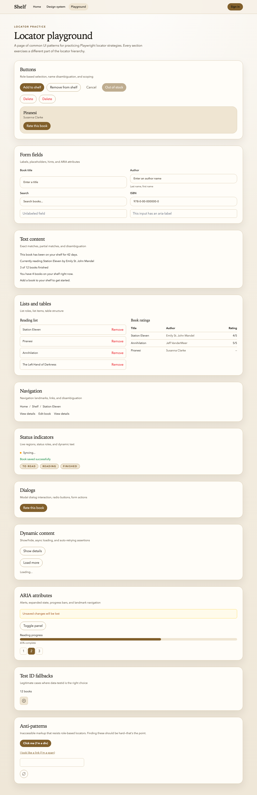

The locator hierarchy is easy to understand and hard to internalize. You know `getByRole` comes first. You know `data-testid` is a last resort. But when you're staring at a page and need to target the _second_ "Delete" button, or an input with no label, or a list item three levels deep—knowing the hierarchy isn't the same as having the muscle memory.

This lab fixes that. Shelf ships a `/playground` page built specifically for this: eleven sections of UI patterns, each designed to exercise a different part of the locator toolkit. Your job is to write Playwright locators for each challenge, run them, and see them pass. The route itself lives at `src/routes/playground/+page.svelte` in the starter — you don't need to edit it, just target it.



> [!NOTE] Prerequisite
> Pull the latest Shelf starter, start it in your usual local mode, and navigate to `/playground` to see the page you'll be targeting.

> [!NOTE] Those a11y warnings are on purpose
> The playground intentionally ships with a handful of accessibility violations — a `div` pretending to be a button, an icon-only button with no accessible name — so challenges 23 and 24 have a real target. You'll see svelte-check print these as warnings every time you run `npm run typecheck` or `npm run build`. That is by design. The whole point of the fallback section is to give you something to locate _when the role hierarchy doesn't help_.

## Setup

Create a new test file at `tests/end-to-end/playground.spec.ts`. Each challenge is one `test()` block. You can run the file with:

```bash
npx playwright test playground.spec.ts --project=public
```

The `public` project doesn't require authentication, which is what you want here—the playground is a public route.

## What you can verify locally

This lab is fully local. With Shelf already running, target the shipped playground route at `src/routes/playground/+page.svelte`, write the exercises in `tests/end-to-end/playground.spec.ts`, and run `npx playwright test playground.spec.ts --project=public` until the file is green. Finish with `npm run typecheck` and `npm run build` so you have seen the intentional playground warnings in the same places the rest of the course references them.

## What remains manual or external

Nothing here depends on GitHub, a deploy preview, or a third-party service. The only judgment call is whether each solution really used the highest-priority locator available. If a test passes but you reached for `getByTestId` or a fallback too early, that still counts as a miss for the point of the lab.

## Warm-up: role basics

**Challenge 1.** Locate the "Add to shelf" button.

**Challenge 2.** Locate the "Cancel" button.

**Challenge 3.** Locate the disabled "Out of stock" button and assert that it is disabled.

**Challenge 4.** Locate the search input by its label.

## Intermediate: disambiguation and chaining

**Challenge 5.** There are two "Delete" buttons on the page. Locate the _first_ one. (Hint: `.first()` or `.nth(0)` on a locator.)

**Challenge 6.** Locate the "Remove" button inside the third item in the "Reading list." You'll need to chain: find the list, find the items, narrow to the third, then find the button inside it.

**Challenge 7.** Inside the article labeled "Piranesi by Susanna Clarke," locate the "Rate this book" button.

**Challenge 8.** Locate the "Author" input and assert that its hint text ("Last name, first name") is visible.

## Text and content

**Challenge 9.** Find the paragraph that mentions "42 days."

**Challenge 10.** Find the text "3 of 12 books finished."

**Challenge 11.** Two paragraphs on the page contain the word "shelf." Find the one that says "You have 4 books on your shelf right now"—without matching the other one. (Hint: `{ exact: true }` won't help here since neither is an exact match for "shelf." Use a regex or a longer string.)

## Tables and lists

**Challenge 12.** Count the data rows in the "Book ratings" table (not including the header row). Assert there are exactly 3.

**Challenge 13.** Locate the "Reading list" and assert it has exactly 4 items.

## Dynamic content

**Challenge 14.** Click "Show details" and assert that the detail paragraph about Station Eleven appears.

**Challenge 15.** Click "Load more" and wait for the two new list items to appear. Assert the list "Newly loaded books" has 2 items.

**Challenge 16.** Assert that "Loading..." is visible, then wait for it to disappear and "Content loaded" to appear. (The page has a 1-second delay built in—your assertions need to handle it.)

## Dialogs

**Challenge 17.** Click the "Rate this book" button in the Dialogs section and assert that a dialog appears.

**Challenge 18.** Inside the dialog, select 4 stars and click "Save rating."

**Challenge 19.** Open the dialog again and close it with the "Cancel" button. Assert the dialog is no longer visible.

## ARIA and roles

**Challenge 20.** Locate the alert that says "Unsaved changes will be lost."

**Challenge 21.** Locate the progress bar and assert its `aria-valuenow` is `65`.

**Challenge 22.** Locate the "Toggle panel" button. Assert that it has `aria-expanded` set to `false`. Click it. Assert that `aria-expanded` is now `true` and the panel content is visible.

## Anti-patterns and fallbacks

**Challenge 23.** Try to locate the clickable `<div>` by role (`getByRole('button')`). It won't work—the div has no role. Locate it by its `data-testid` instead (`fake-button`). This is the teaching moment: if you can't find it by role, the markup is broken.

**Challenge 24.** Locate the icon-only button using `data-testid` (`icon-only-button`). This button has no accessible name—`getByRole('button', { name: ... })` can't target it. A real codebase should fix the button. A test suite should use `getByTestId` until it's fixed.

## Acceptance criteria

- [ ] `tests/end-to-end/playground.spec.ts` exists and contains at least 20 passing tests.
- [ ] Every test uses the highest-priority locator strategy available for its target.
- [ ] No test uses `page.locator()` with a raw CSS selector.
- [ ] The dynamic content tests (14–16) do not use `page.waitForTimeout`.
- [ ] Running `npx playwright test playground.spec.ts --project=public` produces all green.

## Stretch: locator repair and composition

If you want the higher-yield reps, add these after the main 24:

- **Challenge 25.** Start from a deliberately broad locator like `page.getByRole('article')`, then use `filter({ hasText: 'Piranesi' })` or `filter({ has: ... })` to narrow it to the one card you actually want. Click "Rate this book" inside that filtered card.
- **Challenge 26.** Write one test that waits for either the "Compose" button _or_ a security dialog to appear by using `locator.or(...).first()`. If the dialog wins, dismiss it and continue.
- **Challenge 27.** Pick one repeated locator from the file, give it a `describe('...')` label, and inspect the trace or UI Mode output so you can see the named locator show up in the tooling.

## The one thing to remember

Locators are a muscle, not a fact. You can read about `getByRole` all day, but the moment you have to disambiguate two "Delete" buttons on a real page, the hierarchy either lives in your fingers or it doesn't. This lab is the reps.

## Additional Reading

- [Locators and the Accessibility Hierarchy](locators-and-the-accessibility-hierarchy.md)
- [Locator Challenges: Solution](locator-challenges-solution.md)
- [Playwright UI Mode](playwright-ui-mode.md)
