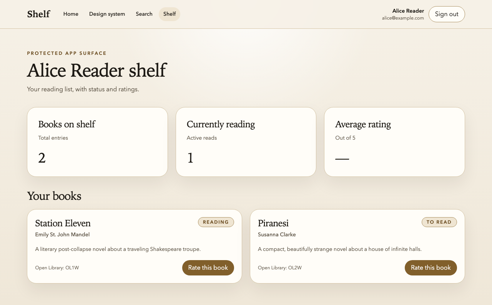
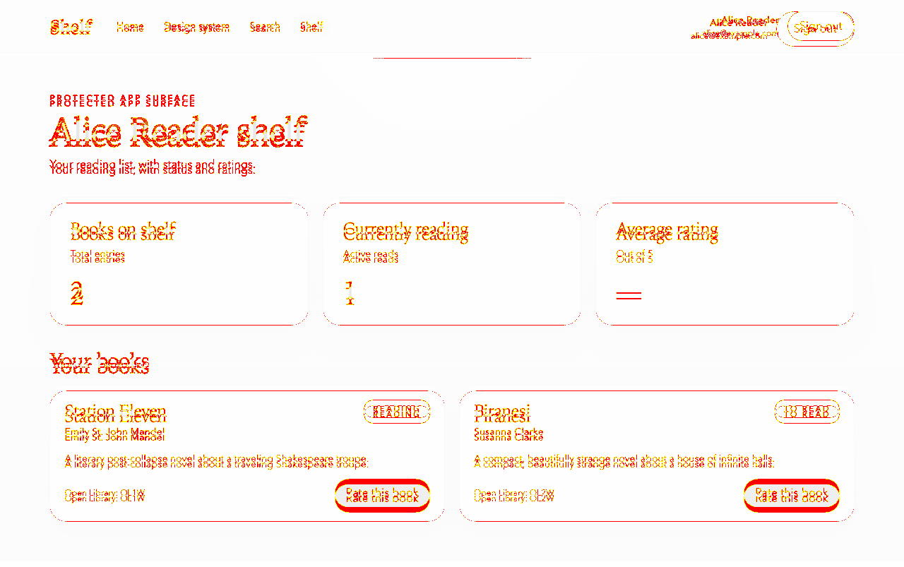

Short lab. Two halves. The first half wires the screenshot gate into Shelf. The second half deliberately breaks a component and watches the loop fire.

> [!NOTE] Prerequisite
> Complete [Visual Regression as a Feedback Loop](visual-regression-as-a-feedback-loop.md) first. This lab assumes the masking, fixed-state, and screenshot-config guidance from that lesson.

## Setup

Make sure you're on the hardened Shelf from [Lab: Harden the Flaky Rate-Book Test](lab-harden-the-flaky-rate-book-test.md). You'll need storage-state authentication and seeding in place. Visual regression without those is a nightmare.

Shelf's `playwright.config.ts` pins `workers: 1` because the local SQLite database is still shared across workers—see [Deterministic State and Test Isolation](deterministic-state-and-test-isolation.md) for the why. The visual-regression workflow below works exactly the same way under single-worker, so you don't have to do anything special to accommodate it.

## Part one: wire the screenshot gate

Shelf splits visual checks across two files so each one runs in the Playwright project whose auth and seeding matches the page under test:

- `tests/end-to-end/visual.spec.ts` — public, no storage state, screenshots `/design-system` (the curated component gallery).
- `tests/end-to-end/visual-authenticated.spec.ts` — runs under the `authenticated` project, reseeds shelf content before each test, and screenshots `/shelf`.

```ts
// tests/end-to-end/visual.spec.ts
import { expect, test } from '@playwright/test';

test('design system matches the starter visual baseline', async ({ page }) => {
  await page.goto('/design-system');
  await expect(page.getByRole('heading', { level: 1 })).toBeVisible();
  await expect(page).toHaveScreenshot('design-system.png', {
    fullPage: true,
  });
});
```

```ts
// tests/end-to-end/visual-authenticated.spec.ts
import { expect, test } from '@playwright/test';
import { resetShelfContent } from './helpers/seed';

test.beforeEach(async () => {
  await resetShelfContent();
});

test('shelf page matches the seeded visual baseline', async ({ page }) => {
  await page.goto('/shelf');

  await expect(page.getByRole('heading', { level: 1 })).toBeVisible();
  await expect(page.getByRole('article', { name: /Station Eleven/ })).toBeVisible();

  await expect(page).toHaveScreenshot('shelf-page.png', { fullPage: true });
});
```

Route the new file through the `authenticated` project in `playwright.config.ts`:

```ts
{
  name: 'authenticated',
  testMatch: /(rate-book|accessibility|search|visual-authenticated|performance)\.spec\.ts/,
  use: {
    ...devices['Desktop Chrome'],
    storageState: storageStatePath,
  },
  dependencies: ['setup'],
},
```

And make sure `expect.toHaveScreenshot` is configured globally:

```ts
expect: {
  toHaveScreenshot: {
    animations: 'disabled',
    caret: 'hide',
    scale: 'css',
    maxDiffPixelRatio: 0.01,
  },
},
```

Generate the baselines:

```sh
npm run test:e2e -- --update-snapshots
```

Commit the baseline PNGs at `tests/end-to-end/visual.spec.ts-snapshots/` and `tests/end-to-end/visual-authenticated.spec.ts-snapshots/`. Yes, you commit PNGs to git. That's the deal.

## Part one acceptance criteria

- [ ] Both `visual.spec.ts` (public) and `visual-authenticated.spec.ts` (authenticated) exist and each contains at least one `toHaveScreenshot` assertion.
- [ ] `playwright.config.ts` sets `animations: 'disabled'`, `caret: 'hide'`, `scale: 'css'`, and `maxDiffPixelRatio: 0.01` under `expect.toHaveScreenshot`.
- [ ] `npm run test:e2e` passes on a clean run (no diffs) — including both visual tests.
- [ ] Running the suite five times in a row produces zero false positives on either screenshot test: `for i in {1..5}; do npm run test:e2e || break; done` exits zero every iteration.
- [ ] Both baseline snapshot files exist (`ls tests/end-to-end/visual.spec.ts-snapshots/ tests/end-to-end/visual-authenticated.spec.ts-snapshots/` prints the committed PNGs).
- [ ] `.gitignore` does not ignore snapshot PNGs.

## The snapshot target in Shelf

Once the suite is wired correctly, the shelf-page baseline should look something like this:



## Part two: break something, and watch it fire

Now we're going to simulate the loop. Open `src/lib/components/button.svelte`. Find the `classes` derived expression and change the base padding:

```svelte
<!-- before -->
'inline-flex items-center justify-center rounded-full px-4 py-2 text-sm font-semibold ...',
<!-- after -->
'inline-flex items-center justify-center rounded-full px-6 py-3 text-sm font-semibold ...',
```

Re-run the visual specs:

```sh
npm run test:e2e -- --grep visual
```

It fails. Open the HTML report:

```sh
npx playwright show-report playwright-report/html
```

Find the failing test, look at the three-panel view (baseline, actual, diff). The diff image should clearly show the buttons in the screenshots have changed size.

Now simulate the agent loop. You have two options depending on your setup:

**Option A—manual.** Copy the diff image path into your Claude Code conversation and ask: _"The visual regression test failed. Here's the diff. What changed, and is the change intentional?"_ Let the agent look at the image and describe what it sees.

**Option B—hooked.** If you're using Claude Code with a hook that auto-attaches test failures, just run the test and let the hook fire. (We'll wire this kind of hook properly in [Git Hooks with Lefthook](git-hooks-with-lefthook.md). For today, manual is fine.)

Either way, notice what the agent says. It should identify that the buttons got bigger, guess correctly whether the change cascaded to other layout (on Shelf, it probably pushed some cards wider), and propose either reverting the change or updating the baseline.

When the padding experiment lands correctly, the shelf-page diff should look like this kind of "everything got roomier" change:



## Part two acceptance criteria

- [ ] The button padding change produces a failing `toHaveScreenshot` assertion.
- [ ] `playwright-report/` contains a diff image for the failing test.
- [ ] You showed the diff to your agent and got a response that correctly identifies what visually changed.
- [ ] You either: (a) reverted the button change and re-ran to green, or (b) ran `--update-snapshots` as an intentional baseline update and committed the new baselines as a separate commit.
- [ ] Your git history shows the experiment as discrete commits so the sequence is legible later.

## Stretch goals

- Add a `design-system` route that exercises every component in every state, if Shelf doesn't already have one. Add a single screenshot test for the whole route. Consider this your poor-person's [Chromatic](https://www.chromatic.com/).
- Set up a second Playwright project for a different viewport (e.g., `iPhone 13` from Playwright's device presets) and regenerate baselines for it. Now your visual regression covers mobile too.
- Try the same flow with [Chromatic](https://www.chromatic.com/) instead of built-in snapshots, just to see the difference in review UX. Don't commit the Chromatic setup permanently unless the whole team is on board—the built-in is the long-term pattern for this workshop.
- Intentionally introduce a subtle change (e.g., change a font weight from 500 to 600) and see if the `maxDiffPixelRatio: 0.01` tolerance catches it. Tune the tolerance if needed.

## The one thing to remember

A failed screenshot test is a conversation opener. The diff image is the message. Once the agent can read the diff, the loop closes itself.

## Additional Reading

- [Solution](wire-visual-regression-into-the-dev-loop-solution.md)
- [Visual Regression as a Feedback Loop](visual-regression-as-a-feedback-loop.md)
- [Runtime Probes in the Development Loop](runtime-probes-in-the-development-loop.md)
