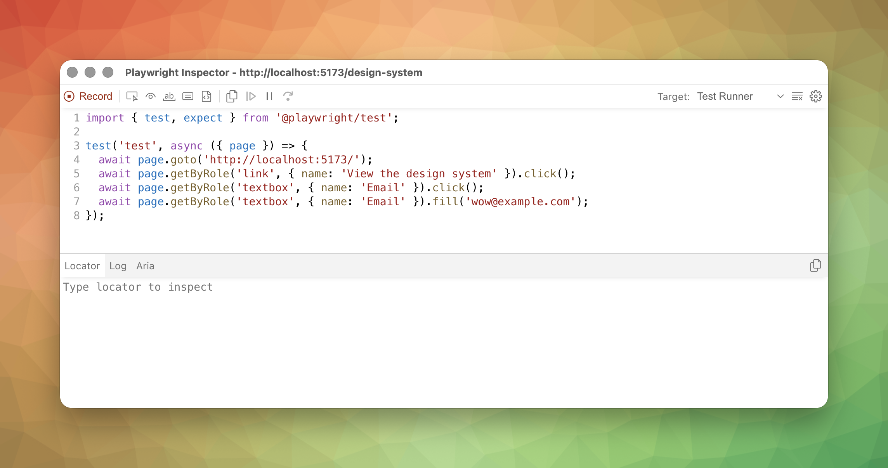

Sometimes the fastest way to write a test is to just _do the thing_ and let the tooling watch. Playwright's [code generator](https://playwright.dev/docs/codegen-intro) records your clicks and keystrokes and turns them into test code. It's not magic—the output needs editing—but it's a legitimate starting point, and for unfamiliar apps it's often faster than reading the DOM by hand.



## Launching codegen

```sh
npx playwright codegen http://localhost:5173
```

Two windows open: a browser you interact with, and the Playwright Inspector showing the generated code in real time. The URL argument is optional—you can leave it off and navigate after launch. But if you already know where you're headed, pass it in and save yourself the typing.

## The recording workflow

Click around. Type into inputs. Navigate between pages. Every action you take appears as a line of test code in the inspector window.

The toolbar has three assertion buttons worth knowing: **assert visibility**, **assert text**, and **assert value**. Click one of those, then click an element in the browser, and codegen adds an assertion to the generated code. This is the part most people miss on their first run—they record a bunch of clicks and wonder why the generated test doesn't _check_ anything. It doesn't check anything because you didn't tell it to.

## What codegen gets right

Codegen defaults to role-based locators. It follows the same hierarchy we covered in the locators lesson: role first, then text, then test ID. If multiple elements match, it refines the locator to uniquely identify the target—adding a `{ name: '...' }` filter or scoping to a parent.

This is genuinely better than what most people write by hand on their first try. I've seen plenty of hand-written tests that start with `page.locator('.btn-primary')` because someone inspected the DOM and grabbed the class. Codegen wouldn't do that. It would give you `page.getByRole('button', { name: 'Submit' })`, which is the right call.

## What codegen gets wrong

The list is predictable:

- **Overly specific locators** when simpler ones would work. If only one button says "Submit" on the page, you don't need the extra scoping codegen might add.
- **Fragile `nth()` chains.** When the DOM has repeated structures, codegen sometimes falls back to `.nth(2)` instead of finding a meaningful differentiator. That breaks the moment someone reorders a list.
- **Missing assertions.** Codegen records actions but doesn't know what you're _verifying_. Unless you explicitly click the assertion buttons, you get a test that navigates, clicks, and types—but never checks a result.
- **No page object structure.** No reusable helpers. No extracted constants. The generated code is a literal transcript of your session, not a maintainable test.

None of this is surprising. A recorder can only capture _what happened_, not _what mattered_. That distinction is yours to make.

## The recommended workflow

Generate the skeleton with codegen. Copy it into a real test file. Then edit: simplify locators that are more specific than they need to be, add meaningful assertions for the behavior you actually care about, extract repeated patterns into helpers, and name the test something a human would understand six months from now.

Codegen is the first draft, not the final draft. Treat it accordingly.

## Repair selectors before they fossilize

This is the part people skip. They generate a test, it passes once, and the generated locator gets committed exactly as recorded. Congratulations, you just promoted a first draft into a maintenance burden.

The [Locator API](https://playwright.dev/docs/api/class-locator) has a nice cleanup move for this: `locator.normalize()` (requires Playwright 1.59+). Point it at a recorder-generated or legacy locator, and Playwright will try to rewrite it toward the same user-facing strategies you should have reached for in the first place.

```ts
const repaired = page
  .locator('main .toolbar > button:nth-child(2)')
  .normalize()
  .describe('compose button');

await expect(repaired).toBeVisible();
await repaired.click();
```

> [!NOTE] `.describe()` only attaches a human-readable label used in trace viewer and reports. It does not change the matching logic — the locator still resolves the same way with or without it.

This is not a license to keep bad selectors around forever. It is a selector-repair tool. The workflow I want is:

1. Generate or copy the rough locator.
2. Normalize it.
3. Read the result.
4. If the result is still ugly, rewrite it by hand with `getByRole`, `filter`, `and`, or `or`.

Codegen is fast. Cleanups are where the test becomes durable.

## Generating locators without recording

Press the "Record" button in the inspector to stop recording. A "Pick Locator" button appears. Now you can hover and click elements to generate locators without generating full test code—useful when you already have a test file open and just need the right locator for one element.

This is the same pick-locator flow you get in UI Mode, just available in the codegen context.

## Authenticated flows

If your app requires login, you don't want to record the login sequence in every test. Codegen has a storage flag for this:

```sh
npx playwright codegen --save-storage=auth.json http://localhost:5173
```

Log in during the recording session, then close the browser. Codegen saves cookies and `localStorage` to `auth.json`. Next time:

```sh
npx playwright codegen --load-storage=auth.json http://localhost:5173
```

The browser starts with your saved session state, so you can record against the authenticated app without logging in again.

> [!WARNING] `auth.json` contains real credentials
> Cookies, tokens, whatever your app stores—it's all in that file. Add it to `.gitignore` immediately. Do not commit it. Do not share it. This is not a hypothetical concern.

## Emulation

Codegen can record against emulated devices:

```sh
npx playwright codegen --device="iPhone 13" http://localhost:5173
```

You can also set viewport and color scheme independently:

```sh
npx playwright codegen --viewport-size="800,600" --color-scheme=dark http://localhost:5173
```

This is useful for generating mobile-specific tests or verifying responsive behavior without pulling out an actual phone. The generated code includes the same locators regardless of device—what changes is the viewport context your actions happen in.

## When to use codegen vs. writing from scratch

Codegen shines when you're new to an app and need to discover the DOM structure. You don't know what roles exist, what labels are attached to what, or how the page transitions between states. Recording a flow and reading the generated locators teaches you the app's accessibility surface faster than reading the source.

Write from scratch when you know the patterns and want clean, intention-revealing test code. After a few weeks on a project, you'll reach for codegen less and less—not because it stopped being useful, but because you've internalized the locators and the patterns that codegen would have shown you.

## The one thing to remember

Codegen is a scaffolding tool, not a test-writing tool. It gives you the raw material. The assertions, the structure, the intent—that's still your job.

## Additional Reading

- [Playwright UI Mode](playwright-ui-mode.md)
- [Locators and the Accessibility Hierarchy](locators-and-the-accessibility-hierarchy.md)
- [Configuring Playwright](configuring-playwright.md)
