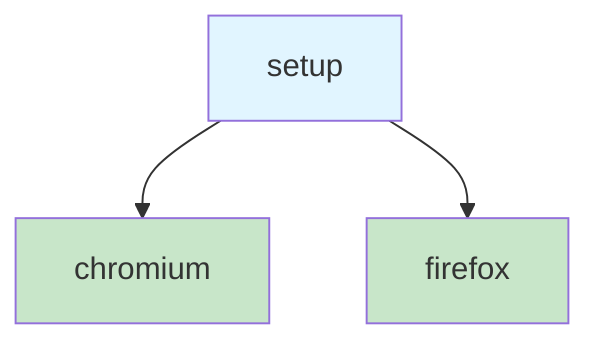
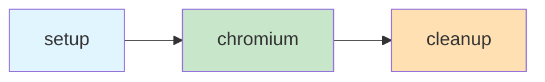

Most Playwright setups start the same way: one config, one browser, run everything. That works until you need something to happen _before_ your tests run—seeding a database, logging in, generating fixtures. At that point, you're stuffing setup logic into `beforeAll` hooks and hoping the execution order works out. It usually does. Until it doesn't.

[Playwright projects](https://playwright.dev/docs/test-projects) are the mechanism that fixes this. A project is a named configuration block inside `playwright.config.ts`. Each one gets its own settings—which browser to use, which test files to match, which `storageState` to load—and, critically, which _other projects_ it depends on.

```ts
import { defineConfig, devices } from '@playwright/test';

export default defineConfig({
  projects: [
    {
      name: 'chromium',
      use: { ...devices['Desktop Chrome'] },
    },
    {
      name: 'firefox',
      use: { ...devices['Desktop Firefox'] },
    },
  ],
});
```

When you run `npx playwright test`, Playwright runs every project in the config. In this case, the full suite runs twice—once in Chromium, once in Firefox. Each project is isolated: its own browser context, its own settings, its own results in the report.

That alone is useful, but the real power shows up when you add `dependencies`.

## Dependencies and execution order

Projects can declare that they depend on other projects. Playwright builds a dependency graph and guarantees the order. If project B depends on project A, A finishes before B starts. If B and C both depend on A but not on each other, they run in parallel after A completes.

```ts
export default defineConfig({
  projects: [
    {
      name: 'setup',
      testMatch: /global\.setup\.ts/,
    },
    {
      name: 'chromium',
      use: { ...devices['Desktop Chrome'] },
      dependencies: ['setup'],
    },
    {
      name: 'firefox',
      use: { ...devices['Desktop Firefox'] },
      dependencies: ['setup'],
    },
  ],
});
```



The `setup` project runs first—always. Then `chromium` and `firefox` run in parallel. If `setup` fails, neither browser project starts. This is a directed acyclic graph, not a hook chain. You declare what depends on what, and Playwright figures out the rest.

## Why this matters more than it looks

The pattern you're about to see in [Storage State Authentication](storage-state-authentication.md) relies on this entirely. The idea is: one project logs in and saves the browser session to a file, and every other project loads that file so its tests start already authenticated. Without project dependencies, there's no guarantee the login runs first. With them, it's structural—not a race condition waiting to happen.

But authentication is just the most common use case. Projects are also how you:

- **Run different test suites with different settings.** A `smoke` project that runs a fast subset on every push, and a `full` project that runs everything nightly.
- **Scope tests to user roles.** One project for regular users, one for admins, each loading a different `storageState` file.
- **Filter by `testMatch`.** A project can match only files in a specific directory, or only files matching a regex. This is how you keep setup files from running as regular tests.

## `testMatch` and `testDir`

Two settings control which tests a project runs.

`testMatch` is a regex or glob that filters test files. If you only want a project to run your setup script, point it at that specific file:

```ts
{
  name: 'setup',
  testMatch: /authentication\.setup\.ts/,
}
```

`testDir` scopes a project to a directory. If your authenticated tests live under `tests/end-to-end/authenticated/`, you can point a project at that directory and skip the regex:

```ts
{
  name: 'authenticated',
  testDir: 'tests/end-to-end/authenticated',
  dependencies: ['setup'],
}
```

Both are optional. If you set neither, the project runs everything that Playwright's top-level `testDir` and `testMatch` would find. In practice, setup projects almost always use `testMatch` to isolate their setup file, and browser projects either use the defaults or scope by directory.

## Teardown projects

Dependencies have a counterpart: `teardown`. If your setup project creates something that needs cleanup—a temporary database, a test user, a running service—you can point it at a teardown project that runs _after_ all dependent projects finish.

```ts
export default defineConfig({
  projects: [
    {
      name: 'setup',
      testMatch: /global\.setup\.ts/,
      teardown: 'cleanup',
    },
    {
      name: 'cleanup',
      testMatch: /global\.teardown\.ts/,
    },
    {
      name: 'chromium',
      use: { ...devices['Desktop Chrome'] },
      dependencies: ['setup'],
    },
  ],
});
```



The execution order: `setup` runs first, then `chromium`, then `cleanup`. If you don't need cleanup—and for authentication you usually don't, since the state file gets overwritten on the next run—skip it. Teardown is there for the cases where leftover state would leak across runs.

## Project-level overrides

Each project can override settings from the top-level `defineConfig`. This is useful when different suites need different tolerances:

```ts
export default defineConfig({
  retries: 0,
  timeout: 30_000,
  projects: [
    {
      name: 'smoke',
      testMatch: /smoke\/.+\.spec\.ts/,
      retries: 2,
      timeout: 10_000,
    },
    {
      name: 'full',
      retries: 0,
      timeout: 60_000,
    },
  ],
});
```

The `smoke` project gets two retries and a shorter timeout because it runs on every push and you want it fast and forgiving. The `full` project gets no retries and a longer timeout because it runs nightly and you want to know about every failure. The top-level values are defaults—projects override them, they don't merge.

## Running a single project

During development, you don't always want to run the full graph. The `--project` flag lets you target one:

```bash
npx playwright test --project=chromium
```

Playwright still respects dependencies—if `chromium` depends on `setup`, both run. But it skips any project you didn't name that isn't a dependency of the one you did.

If you want to skip dependencies entirely—say, the setup already ran and the state file is still fresh—pass `--no-deps`:

```bash
npx playwright test --project=chromium --no-deps
```

Now only `chromium` runs. No setup, no teardown, no dependency resolution. This is a shortcut for local iteration, not something you'd use in CI.

## What not to do

A few patterns that look reasonable but cause pain:

- **Don't use `globalSetup` for authentication.** Playwright still supports `globalSetup`/`globalTeardown` as top-level config options, but they run outside the test runner. That means no fixtures, no `page` or `request` objects, no trace viewer integration, and no visibility in the HTML report. A setup _project_ gives you all of those. The Playwright documentation has [moved entirely to the project-based pattern](https://playwright.dev/docs/auth) for authentication, and so should you.
- **Don't create a project for every test file.** Projects are for _configuration boundaries_—different browsers, different roles, different environments. If two test files share the same browser and the same `storageState`, they belong in the same project. One project per file is just a complicated way to recreate `testMatch` filtering.
- **Don't forget that a failing dependency skips its dependents.** This is a feature, not a bug—if login fails, there's no point running authenticated tests. But it also means a flaky setup project will silently skip your entire suite. If you see "0 tests ran" in CI, check the setup project first.

## The mental model

Think of projects as a mini build graph. Each node has a name, a set of inputs (which tests, which browser, which `storageState`), and a set of edges (dependencies). Playwright resolves the graph, runs roots first, and parallelizes everything it can.

If you've used task runners with dependency declarations—Make, Turborepo, Nx—this is the same idea applied to test execution. The difference is that Playwright's version is small enough to fit in a single config file and focused enough that you rarely need more than three or four projects.

## Additional Reading

- [Storage State Authentication](storage-state-authentication.md)
- [Deterministic State and Test Isolation](deterministic-state-and-test-isolation.md)
