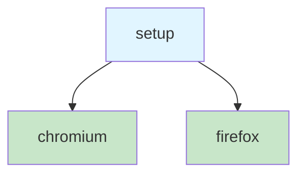
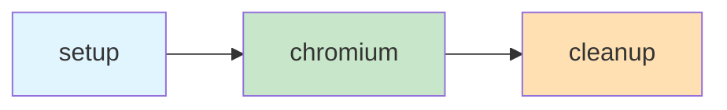

Most Playwright setups start the same way: one config, one browser, run everything. That works until you need something to happen _before_ your tests run—seeding a database, logging in, generating fixtures. At that point, you're stuffing setup logic into `beforeAll` hooks and hoping the execution order works out. It usually does. Until it doesn't.

[Playwright projects](https://playwright.dev/docs/test-projects) are the mechanism that fixes this. A project is a named configuration block inside `playwright.config.ts`. Each one gets its own settings—which browser to use, which test files to match, which `storageState` to load—and, critically, which _other projects_ it depends on.

```ts
import { defineConfig, devices } from '@playwright/test';

export default defineConfig({
  projects: [
    {
      name: 'chromium',
      use: { ...devices['Desktop Chrome'] },
    },
    {
      name: 'firefox',
      use: { ...devices['Desktop Firefox'] },
    },
  ],
});
```

When you run `npx playwright test`, Playwright runs every project in the config. In this case, the full suite runs twice—once in Chromium, once in Firefox. Each project is isolated: its own browser context, its own settings, its own results in the report.

That alone is useful, but the real power shows up when you add `dependencies`.

## Dependencies and execution order

Projects can declare that they depend on other projects. Playwright builds a dependency graph and guarantees the order. If project B depends on project A, A finishes before B starts. If B and C both depend on A but not on each other, they run in parallel after A completes.

```ts
export default defineConfig({
  projects: [
    {
      name: 'setup',
      testMatch: /global\.setup\.ts/,
    },
    {
      name: 'chromium',
      use: { ...devices['Desktop Chrome'] },
      dependencies: ['setup'],
    },
    {
      name: 'firefox',
      use: { ...devices['Desktop Firefox'] },
      dependencies: ['setup'],
    },
  ],
});
```



The `setup` project runs first—always. Then `chromium` and `firefox` run in parallel. If `setup` fails, neither browser project starts. This is a directed acyclic graph, not a hook chain. You declare what depends on what, and Playwright figures out the rest.

## Why this matters more than it looks

The pattern you're about to see in [Storage State Authentication](storage-state-authentication.md) relies on this entirely. The idea is: one project logs in and saves the browser session to a file, and every other project loads that file so its tests start already authenticated. Without project dependencies, there's no guarantee the login runs first. With them, it's structural—not a race condition waiting to happen.

But authentication is just the most common use case. Projects are also how you:

- **Run different test suites with different settings.** A `smoke` project that runs a fast subset on every push, and a `full` project that runs everything nightly.
- **Scope tests to user roles.** One project for regular users, one for admins, each loading a different `storageState` file.
- **Filter by `testMatch`.** A project can match only files in a specific directory, or only files matching a regex. This is how you keep setup files from running as regular tests.

## Good setup-project use cases

Leaving database seeding aside for a moment, setup projects are a good fit any time one part of the suite needs a repeatable prerequisite that should happen inside the Playwright runner rather than in an ad hoc shell script or `beforeAll`.

- **Generate authenticated browser state.** Log in once, save `storageState`, and let dependent projects reuse it.
- **Create different user-role sessions.** Build separate stored sessions for reader, admin, moderator, support, or other role-based suites.
- **Verify a prerequisite flow before the rest of the suite starts.** If login, onboarding, or initial navigation is broken, fail fast and skip the dependent tests.
- **Capture reusable browser artifacts.** Generate a HAR, save a file download, create a trace baseline, or record another browser-produced artifact that later tests consume.
- **Provision temporary files or directories the suite depends on.** Create upload fixtures, temp workspaces, scratch exports, or runtime config files that tests expect to exist.
- **Start or verify a supporting local service.** Bring up a lightweight mock server, webhook receiver, fake SMTP sink, or callback listener and confirm it is healthy before dependents run.
- **Establish non-database app state that lives outside the browser context.** Create feature-flag files, seed a cache layer, warm a search index, or write config a test environment needs.
- **Create external test resources that should be shared across many specs.** Upload a fixture to blob storage, register a fake tenant, mint a temporary API credential, or create a sandbox workspace once for a whole project.
- **Prepare environment-specific expectations.** Build a mobile-only asset pack, a locale-specific snapshot set, or another artifact that a project variant depends on.
- **Encode expensive one-time setup that would be wasteful in every file.** If the work is slow but deterministic, a setup project keeps it visible and reportable without repeating it in each spec.

The common thread: a setup project is for prerequisites that are real, shared, and worth modeling explicitly as a node in the graph.

## `testMatch` and `testDir`

Two settings control which tests a project runs.

`testMatch` is a regex or glob that filters test files. If you only want a project to run your setup script, point it at that specific file:

```ts
{
  name: 'setup',
  testMatch: /authentication\.setup\.ts/,
}
```

`testDir` scopes a project to a directory. If your authenticated tests live under `tests/end-to-end/authenticated/`, you can point a project at that directory and skip the regex:

```ts
{
  name: 'authenticated',
  testDir: 'tests/end-to-end/authenticated',
  dependencies: ['setup'],
}
```

Both are optional. If you set neither, the project runs everything that Playwright's top-level `testDir` and `testMatch` would find. In practice, setup projects almost always use `testMatch` to isolate their setup file, and browser projects either use the defaults or scope by directory.

## Teardown projects

Dependencies have a counterpart: `teardown`. If your setup project creates something that needs cleanup—a temporary database, a test user, a running service—you can point it at a teardown project that runs _after_ all dependent projects finish.

The important detail the docs tend to glide past is that the teardown logic lives in an ordinary Playwright test file. It is not a special callback hidden somewhere else in the config. `testMatch: /global\.teardown\.ts/` means "run the file whose name matches that pattern as the teardown project."

```ts
export default defineConfig({
  projects: [
    {
      name: 'setup',
      testMatch: /global\.setup\.ts/,
      teardown: 'cleanup',
    },
    {
      name: 'cleanup',
      testMatch: /global\.teardown\.ts/,
    },
    {
      name: 'chromium',
      use: { ...devices['Desktop Chrome'] },
      dependencies: ['setup'],
    },
  ],
});
```

In a real repo, that usually looks like this:

```text
tests/end-to-end/
  global.setup.ts
  global.teardown.ts
  smoke.spec.ts
  authenticated.spec.ts
```

And the teardown file itself is just a tiny Playwright test that removes whatever the setup created:

```ts
// tests/end-to-end/global.teardown.ts
import { test as teardown } from '@playwright/test';

teardown('remove temporary database', async () => {
  // Delete the temp database, stop the local server, remove seeded users,
  // or whatever your setup project created.
});
```

That is the mental model:

- `setup` points at `global.setup.ts`
- `cleanup` points at `global.teardown.ts`
- Playwright runs both because they are regular project-scoped test files
- the `teardown: 'cleanup'` link is what tells Playwright when to run the cleanup file



The execution order: `setup` runs first, then `chromium`, then `cleanup`. If you don't need cleanup—and for authentication you usually don't, since the state file gets overwritten on the next run—skip it. Teardown is there for the cases where leftover state would leak across runs.

## Good teardown-project use cases

Again, excluding database cleanup specifically, teardown projects make sense when the setup created something outside the normal per-test bubble and leaving it behind would pollute the next run or leak cost.

- **Delete temporary files or directories.** Remove upload fixtures, export bundles, scratch workspaces, or generated config written during setup.
- **Shut down supporting local services.** Stop a mock API, webhook listener, SMTP sink, or other helper process started for the suite.
- **Revoke temporary credentials or tokens.** Clean up short-lived API keys, auth grants, signed URLs, or sandbox access tokens created for testing.
- **Remove external resources created for the run.** Delete blob uploads, message queues, mailboxes, tenants, test workspaces, or cloud objects that should not accumulate between runs.
- **Undo feature-flag or environment toggles.** Reset flags, kill switches, or remote config changes that were flipped for a specialized test project.
- **Clear caches or generated artifacts that would taint the next run.** Remove warmed indexes, compiled fixture bundles, snapshot staging directories, or downloaded browser artifacts.
- **Tear down tunnels, listeners, or background processes.** Close ngrok tunnels, local callback servers, proxy layers, or long-lived child processes started in setup.
- **Restore shared state in external systems.** Put a third-party sandbox back into a neutral state if setup had to create durable objects outside your app.
- **Collect and archive final diagnostics before exit.** Bundle logs, traces, service output, or helper-process metadata that only exists after the dependent projects finish.
- **Enforce cleanup as part of the dependency graph instead of tribal knowledge.** If the run is only correct when cleanup happens, model it structurally with `teardown` rather than hoping a shell script runs later.

The common thread: teardown is worth the ceremony when the suite created something durable, shared, or expensive enough that "just leave it there" will eventually become a bug.

## Project-level overrides

Each project can override settings from the top-level `defineConfig`. This is useful when different suites need different tolerances:

```ts
export default defineConfig({
  retries: 0,
  timeout: 30_000,
  projects: [
    {
      name: 'smoke',
      testMatch: /smoke\/.+\.spec\.ts/,
      retries: 2,
      timeout: 10_000,
    },
    {
      name: 'full',
      retries: 0,
      timeout: 60_000,
    },
  ],
});
```

The `smoke` project gets two retries and a shorter timeout because it runs on every push and you want it fast and forgiving. The `full` project gets no retries and a longer timeout because it runs nightly and you want to know about every failure. The top-level values are defaults—projects override them, they don't merge.

## Running a single project

During development, you don't always want to run the full graph. The `--project` flag lets you target one:

```bash
npx playwright test --project=chromium
```

Playwright still respects dependencies—if `chromium` depends on `setup`, both run. But it skips any project you didn't name that isn't a dependency of the one you did.

If you want to skip dependencies entirely—say, the setup already ran and the state file is still fresh—pass `--no-deps`:

```bash
npx playwright test --project=chromium --no-deps
```

Now only `chromium` runs. No setup, no teardown, no dependency resolution. This is a shortcut for local iteration, not something you'd use in CI.

## Mini lab: Seed Shelf through a setup project

This lesson lands better if the dependency graph does something real. In Shelf, the smallest believable version is this:

- a `setup` project seeds the database from `tests/data/*.json`
- a dependent project opens the public shelf page for `alice`
- the UI proves the seed worked

That gives you a practical feel for:

- how a setup project is just an ordinary Playwright test file
- how `dependencies` guarantees execution order
- how one project can prepare state that another project consumes

without forcing you into the full storage-state authentication flow yet.

### Goal

Add a tiny setup file at `tests/database.setup.ts`:

```ts
import { test as setup } from '@playwright/test';
import { users, books, shelfEntries } from './data';
import { createUser, deleteAllUsers } from '../src/lib/server/users';
import { createBook, deleteAllBooks } from '../src/lib/server/books';
import { createShelfEntry, deleteAllShelfEntries } from '../src/lib/server/shelf-entries';

setup('seed starter data', async () => {
  await deleteAllShelfEntries();
  await deleteAllBooks();
  await deleteAllUsers();

  const createdUsers = new Map<string, { id: string }>();
  for (const record of users) {
    const created = await createUser(record);
    createdUsers.set(record.email, created);
  }

  const createdBooks = new Map<string, { id: string }>();
  for (const record of books) {
    const created = await createBook(record);
    createdBooks.set(record.openLibraryId, created);
  }

  for (const record of shelfEntries) {
    const user = createdUsers.get(record.userEmail);
    const book = createdBooks.get(record.bookOpenLibraryId);

    if (!user || !book) {
      throw new Error('Seed fixture references a missing user or book');
    }

    await createShelfEntry({
      userId: user.id,
      bookId: book.id,
      status: record.status,
      rating: record.rating,
    });
  }
});
```

Then add a tiny dependent spec at `tests/public-shelf.spec.ts`:

```ts
import { expect, test } from '@playwright/test';

test('public shelf shows the seeded reader shelf', async ({ page }) => {
  await page.goto('/shelf/alice');

  await expect(page.getByRole('heading', { name: /Alice Reader's shelf/i })).toBeVisible();
  await expect(page.getByText('Station Eleven')).toBeVisible();
  await expect(page.getByText('Piranesi')).toBeVisible();
});
```

Then wire the projects in `playwright.config.ts`:

```ts
import { defineConfig } from '@playwright/test';

export default defineConfig({
  testDir: 'tests',
  testIgnore: ['**/labs/fixtures/**', '**/labs/broken-traces/**'],
  webServer: {
    command: 'npm run build && npm run preview -- --host 127.0.0.1 --port 4173',
    url: 'http://127.0.0.1:4173',
    reuseExistingServer: true,
  },
  use: {
    baseURL: 'http://127.0.0.1:4173',
  },
  projects: [
    {
      name: 'setup',
      testMatch: /database\.setup\.ts/,
    },
    {
      name: 'public-shelf',
      testMatch: /(smoke|public-shelf)\.spec\.ts/,
      dependencies: ['setup'],
    },
  ],
});
```

This is intentionally smaller than the full deterministic seeding lesson. You are not building the final `tests/helpers/seed.ts` abstraction here. You are just proving the graph:

- one project prepares state
- another project depends on it
- the app reads that state through a real page

### What to run

Start with discovery:

```bash
npx playwright test --list
```

You should see `database.setup.ts` under the `setup` project and the ordinary specs under `public-shelf`.

Then run just the dependent project:

```bash
npx playwright test --project=public-shelf
```

Playwright should still run `setup` first because of the dependency edge.

Then run the full graph:

```bash
npx playwright test
```

### What this should teach you

- Setup projects are ordinary test files, not special hidden callbacks.
- `dependencies` is what gives you ordering, not lucky timing.
- A project graph becomes much easier to trust when the effect is visible in the app itself.

### Acceptance criteria

- `npx playwright test --list` shows both `setup` and `public-shelf`
- `setup` only matches `tests/database.setup.ts`
- `public-shelf` depends on `setup`
- `npx playwright test --project=public-shelf` passes
- `tests/public-shelf.spec.ts` only passes because the seeded reader shelf exists

### Stretch

If you want one extra rep:

- expand `public-shelf.spec.ts` to assert the summary cards (`Books on shelf`, `Currently reading`)
- add an `admin-setup` variant that seeds an admin user and then point a second project at admin-only tests later
- refactor the inline seed logic into `tests/helpers/seed.ts` after you reach the deterministic state lesson

That last stretch is the bridge to the next layer of the course: today you are feeling the graph, later you make the seed reusable.

## What not to do

A few patterns that look reasonable but cause pain:

- **Don't use `globalSetup` for authentication.** Playwright still supports `globalSetup`/`globalTeardown` as top-level config options, but they run outside the test runner. That means no fixtures, no `page` or `request` objects, no trace viewer integration, and no visibility in the HTML report. A setup _project_ gives you all of those. The Playwright documentation has [moved entirely to the project-based pattern](https://playwright.dev/docs/auth) for authentication, and so should you.
- **Remember what you lose with `globalSetup`.** No test steps. No trace attached to the setup itself. No fixture graph. No report entry a human can click. The setup project is boring in the best possible way because it stays inside the same runner model as the rest of the suite.
- **Don't create a project for every test file.** Projects are for _configuration boundaries_—different browsers, different roles, different environments. If two test files share the same browser and the same `storageState`, they belong in the same project. One project per file is just a complicated way to recreate `testMatch` filtering.
- **Don't forget that a failing dependency skips its dependents.** This is a feature, not a bug—if login fails, there's no point running authenticated tests. But it also means a flaky setup project will silently skip your entire suite. If you see "0 tests ran" in CI, check the setup project first.

## The mental model

Think of projects as a mini build graph. Each node has a name, a set of inputs (which tests, which browser, which `storageState`), and a set of edges (dependencies). Playwright resolves the graph, runs roots first, and parallelizes everything it can.

If you've used task runners with dependency declarations—Make, Turborepo, Nx—this is the same idea applied to test execution. The difference is that Playwright's version is small enough to fit in a single config file and focused enough that you rarely need more than three or four projects.

## Additional Reading

- [Storage State Authentication](storage-state-authentication.md)
- [Deterministic State and Test Isolation](deterministic-state-and-test-isolation.md)
