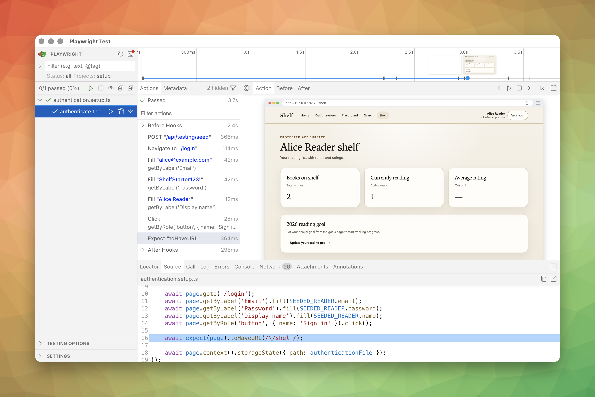
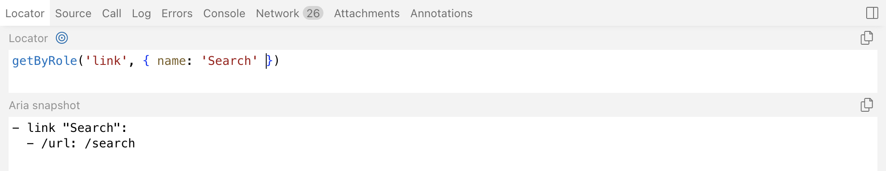

You've written a test, you've used `getByRole` like a responsible adult, and the test fails with "element not found." Now what? You stare at the error. You add a `console.log`. You add three more. You run the test again. You squint at the terminal output and try to reconstruct the page in your head from a wall of HTML.

Stop doing that. Playwright has a visual test runner that lets you _see_ the page at every step of the test. It's called UI Mode, and once you've used it, the `console.log` archaeology feels almost medieval.



## Launching UI Mode

```bash
npx playwright test --ui
```

That's it. Playwright opens a browser window with its visual test runner. Your test files appear in a sidebar on the left, organized by file and test name. Click a test to run it. Click it again to re-run it.

You can also scope it to a single file if you don't want the full suite staring at you:

```bash
npx playwright test tests/smoke.spec.ts --ui
```

## The action timeline

When a test runs in UI Mode, every action—`goto`, `click`, `fill`, `expect`—appears as a step in a timeline on the left. Click any step and the DOM snapshot for _that exact moment_ appears on the right. Before tab, After tab, side by side.

This is the thing that replaces the mental model you were trying to build from `console.log` output. Instead of imagining what the page looked like when the locator failed, you're looking at it. You can see whether the button existed, whether it was visible, whether it had the accessible name you thought it had.

The Before/After tabs are particularly useful for `click` and `fill` actions: you can see what the page looked like right before the interaction, then what changed as a result. If nothing changed, that's your bug.

## Pick locator

This is the killer feature for this course.



Click the "Pick locator" button in the toolbar, then hover over any element in the DOM snapshot. Playwright suggests a locator for that element—and it follows the same hierarchy from the [locators lesson](locators-and-the-accessibility-hierarchy.md). Role first, then label, then text, then test ID, CSS as a last resort.

Click the element, and the suggested locator appears in a playground at the bottom of the panel. You can edit it, and the playground highlights which elements on the page match your edited locator in real time. Too many matches? Tighten the query. Zero matches? You misspelled something, or the element doesn't have the accessible name you assumed.

Once you're happy with the locator, copy it into your test. No guessing, no inspecting the DOM in a separate browser tab, no writing a locator and running the test to see if it finds anything.

For agents, this is the workflow you want to internalize: if you're unsure what locator to use, don't guess. Open UI Mode, pick the locator visually, and let Playwright tell you what works.

## Code-level locator debugging

UI Mode is still the first stop. But sometimes you are already in a headed run and you just need proof that your locator is pointing at the thing you think it is. [`locator.highlight()`](https://playwright.dev/docs/api/class-locator) is the code-level version of that check.

```ts
const saveButton = page.getByRole('button', { name: 'Save draft' });
await saveButton.highlight();
```

Use it when:

- strict mode says the locator matches two things and you need to see which ones
- a healed or generated locator keeps landing on the wrong card or button
- you want to confirm that a chained locator is scoped to the right region before rewriting the test

Then delete it. `highlight()` is a debugging helper, not a committed part of the suite. Locator picking itself already lives in UI Mode, which is exactly where it belongs.

## Watch mode

See the eye icon next to each test in the sidebar? Click it. Now that test re-runs automatically every time the source file changes. Write the test, save, watch it fail. Write the implementation, save, watch it pass. Refactor, save, watch it stay green.

It's the red-green-refactor loop without the alt-tab-and-rerun ceremony.

UI Mode also gets much more useful once the suite is big enough to need archaeology instead of just debugging. You can filter by project, tag, and status, which is the difference between "open the whole suite" and "show me the failing Firefox-only `@critical` tests from yesterday."

## The other panels

UI Mode has a row of tabs along the bottom that give you different views into what happened during the test. Quick tour:

- **Source:** Shows the test source code with the current action's line highlighted. Useful for orienting yourself when you click through the timeline.
- **Log:** What Playwright actually did behind the scenes for each action—scrolling the element into view, waiting for it to be actionable, retrying the locator. When a test is slow and you don't know why, the log usually tells you.
- **Errors:** Where the test broke and why. The stack trace, the expected-vs-received values, the accessibility tree at the point of failure.
- **Console:** Browser console output. If the application logged something, it's here.
- **Network:** Every HTTP request the page made during the test, with timing, status codes, and payloads.

You don't need to memorize these. You need to know they exist so you reach for the right one when you're stuck.

## When to use what

Playwright gives you three flags for visual debugging, and they're not interchangeable:

- **`--ui`:** The full visual test runner. Interactive, explorable, pick-locator, watch mode. This is the one you'll reach for most.
- **`--headed`:** Runs the test in a visible browser window so you can watch it happen in real time, but no inspector, no timeline, no pick-locator. Good for a quick sanity check when you just want to _see_ the flow.
- **`--debug`:** Opens the Playwright Inspector, the older step-through debugger. You advance one action at a time with a "Step" button. Useful for surgical debugging of a single flaky interaction, but heavier than UI Mode for everyday work.

If you're exploring or writing a new test, `--ui`. If you're watching a test run to see if the flow looks right, `--headed`. If you need to pause on a specific line and inspect the live page, `--debug`.

For those "pause right here" moments, keep two APIs in your pocket:

- [`page.pause()`](https://playwright.dev/docs/api/class-page#page-pause) stops immediately at that call site
- [`browserContext.debugger.requestPause()`](https://playwright.dev/docs/api/class-debugger#debugger-request-pause) pauses before the **next** Playwright action

That second one is surprisingly useful when you want to stop just before the next click or fill without rewriting the whole flow around a hardcoded pause.

## Connection to the locator hierarchy

The pick locator tool doesn't just suggest _any_ locator—it suggests the best one it can, following the same priority order from the previous lesson. If you hover over a button and Playwright suggests `getByRole('button', { name: 'Add book' })`, that's the tool confirming the component's accessibility is solid.

If you hover over a button and Playwright suggests `getByTestId('add-book-btn')` instead, that's a signal. It means the button doesn't have an accessible name that Playwright can match on—the same signal the locators lesson described as a real bug. The pick locator tool just made that bug visible without you having to think about it.

This is why UI Mode matters for agent-driven testing specifically: it's a visual confirmation of the locator hierarchy you're encoding in your agent instructions. The tool and the rule agree.

## Things to Remember

When a locator fails and you don't know why, `--ui` is faster than `console.log`. Pick locator is faster than reading the DOM. And if the suggested locator isn't `getByRole`, the component has a problem—not the test.

## Additional Reading

- [Locators and the Accessibility Hierarchy](locators-and-the-accessibility-hierarchy.md)
- [Playwright Codegen](playwright-codegen.md)
- [UI Mode](https://playwright.dev/docs/test-ui-mode)
- [Configuring Playwright](configuring-playwright.md)
