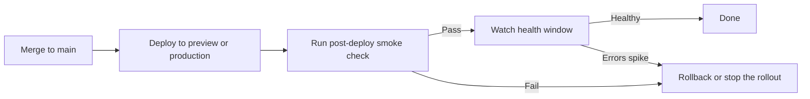

CI going green is a great feeling. It is also not the same thing as "the deployment is healthy."

I've shipped enough "perfectly green" pull requests that still broke on the real environment to stop pretending otherwise. Wrong environment variables. Wrong redirect URL. Wrong cookie domain. Background job didn't boot. CDN served the old asset manifest. Database migration passed and the route still exploded on first real traffic. You only need a few of these before "CI passed" stops sounding like a victory speech.

So, this module is about the loop _after_ the merge gate.

> [!NOTE] Prerequisite
> This lesson assumes you've already wired [CI as the Loop of Last Resort](ci-as-the-loop-of-last-resort.md). CI is the last pre-merge gate. Post-deploy validation is the first post-merge one.

## The shape of the loop

If you're using [GitHub Actions environments](https://docs.github.com/en/actions/how-tos/deploy/configure-and-manage-deployments/manage-environments) or an equivalent deployment system, the loop should look like this:



That's the whole lesson in a diagram.

The key idea: **deployment is not the end of automation. Deployment is the beginning of the next loop.**

## What post-deploy validation is actually proving

This layer is not rerunning your whole test suite for the drama of it. It is proving a smaller, sharper thing:

- the deployed URL is reachable
- the core route renders
- authentication still works if the route depends on it
- the primary read path and one primary write path still function
- the environment-specific wiring is correct

That is a smoke check, not a second CI pipeline.

For Shelf, the post-deploy smoke check can stay tiny:

- load the home page or shelf page
- confirm the critical heading renders
- confirm the seeded data or a known empty state shows up
- if auth is required, prove the storage state or login bootstrap still works against the deployed URL

Small is a feature here. If the post-deploy check takes ten minutes, nobody trusts it as a stop-ship signal.

## Preview targets count

You do not need a full production rollout to teach this loop well.

A deployment preview, a staging target, or even a build-and-preview job that exposes a stable URL is enough to practice the shape:

- deploy candidate artifact
- run smoke check against the deployed URL
- upload artifacts on failure
- decide whether to proceed

That is why I prefer teaching this on a preview target first. The loop is the point. The host is an implementation detail.

## The health window after the smoke test

Passing the smoke test is necessary. It is still not the whole story.

There is usually a short window after deploy where you want at least one more signal:

- error rate stayed flat
- request latency did not jump
- logs are not filling with obvious exceptions
- jobs and background workers are still healthy

I am not asking you to build a full observability stack in this course. I _am_ asking you to define what would trigger a rollback. If you do not define that rule ahead of time, every bad deploy becomes an argument instead of a decision.

## Rollback rules should be written before you need them

This is one of those delightfully unglamorous engineering habits that saves an unreasonable amount of stress.

Write the rollback trigger down:

- smoke check fails: rollback
- critical route 500s: rollback
- authentication broken: rollback
- error spike above agreed threshold in first N minutes: rollback or pause

Make the rule specific enough that an agent or a human can follow it without theater.

> [!WARNING] Ambiguous rollback rules
> "If it looks bad, we should probably revert" is not a rollback policy. That is a future argument in a pull request thread while users are already feeling the problem.

## What the agent needs here

The agent needs the exact same thing it has needed all day:

- a named command to run
- a target URL
- artifacts when the check fails
- a documented stop condition

If the deployment workflow says "run `npm run test:smoke` against `SMOKE_BASE_URL` and upload the Playwright report on failure," the agent can work with that. If the workflow says "manually look at the deploy and decide if vibes are good," congratulations, you have rebuilt yourself as the relay.

## What goes in `CLAUDE.md`

```markdown
## Post-merge and post-deploy

- A green pull request is not the end of the loop. After merge or after
  a deploy preview is available, run the post-deploy smoke check against
  the deployed URL.
- Use the named smoke-test command and the deployment URL provided by the
  workflow or environment.
- If the smoke check fails, treat that as a stop-ship signal. Do not
  wave the deploy through in the summary.
- If rollback conditions are met, recommend rollback explicitly instead
  of describing the failure passively.
```

## Success state

You have this loop when:

- a deployment or preview target exposes a stable URL
- a named smoke test runs against that URL automatically
- rollback triggers are written down before the deploy fails

## The one thing to remember

CI proves the change was mergeable. Post-deploy validation proves the deployment itself is healthy. Those are different claims, and if you only automate the first one, the second one is still your problem.

## Additional Reading

- [CI as the Loop of Last Resort](ci-as-the-loop-of-last-resort.md)
- [Lab: Add Post-Deploy Smoke Checks to Shelf](lab-add-post-deploy-smoke-checks-to-shelf.md)
