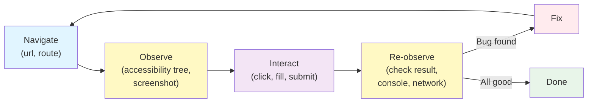

You installed Playwright MCP. Great. Now what?

> [!NOTE]
> As of April 9, 2026, Playwright MCP defaults to a persistent browser profile. For reproducible probes against Shelf, prefer an isolated profile or an explicit storage state so every probe starts from known browser and authentication state.

This lesson is about what to actually _do_ with a runtime tool once the agent has one. The short version is that you want the agent probing the UI between edits, on its own initiative, the way a careful developer would.

## What a probe is, and why it's different from a test

A test is a scripted, repeatable thing you commit. A probe is a one-off interactive check the agent runs in the middle of doing something else. Probes don't get committed. They don't have assertions in the "fail the build" sense. They produce observations the agent uses to decide what to do next.

Concretely: the agent has just edited `src/routes/shelf/+page.svelte` to add a "Sort by rating" dropdown. Before declaring the task done, it runs a probe: "Open the dev server at localhost:5173/shelf, confirm the dropdown is visible, click it, confirm it has the expected options, select 'rating', confirm the list re-sorts." That's not a test. That's the agent rubber-ducking itself by actually running the code it wrote.

Without a runtime tool, the agent has two bad options: run the committed Playwright suite (slow, wrong-grained, might not cover the new thing) or skip the check and hope. With a runtime tool, it has a third option: poke at the feature directly.

## The probe pattern

I teach the pattern as a four-step loop the agent should follow after any UI change:

1. **Navigate** to the page affected by the change.
2. **Observe** the relevant region—read the accessibility tree, take a screenshot, log the DOM for the specific component.
3. **Interact** with the change—click the new button, fill in the new form field, trigger the new animation.
4. **Re-observe**—did the interaction produce the expected result? What does the console say? What does the network tab say?

Step 4 is the one agents skip if you don't explicitly tell them not to. The click succeeds, no error is thrown, and the agent thinks the feature works. The actual question is _what happened next_, and the only way to know is to look.



You can encode this directly in the instructions file:

```markdown
## Runtime probing after UI changes

After any change to a file under `src/routes/` or `src/lib/components/`,
run a runtime probe before declaring the task done. The probe must:

1. Open the affected route in the browser (Playwright MCP or equivalent).
2. Take a screenshot of the changed region.
3. Interact with the change (click the button, submit the form, etc.).
4. Report what you observed after the interaction—console errors,
   network responses, visible state changes, anything unexpected.

If any step produces an error or unexpected result, fix it before
reporting the task as complete. Attach the screenshot to your summary.
```

The last sentence is the important one. "Attach the screenshot to your summary" means the agent has to actually look at the thing it changed. That's different from running a test.

## Accessibility tree as the probe's primary observation

When an agent uses [Playwright MCP](https://playwright.dev/) to probe, the single most useful thing it can ask for is the page's structured accessibility snapshot of the region it changed. Not a screenshot—that's the second-most useful thing. The accessibility snapshot is a text representation of what's on the page structured by role, and it's the form the agent can reason about most effectively.

A good probe from the agent looks like:

```
> Open http://localhost:5173/shelf and give me an accessibility snapshot of the main region.

main:
  heading: "Alice's Shelf"
  combobox: "Sort by"
    option: "Date added"
    option: "Title"
    option: "Rating"  ← new
  list:
    listitem: "Station Eleven"
      button: "Rate this book"
    listitem: "Piranesi"
      button: "Rate this book"
```

The agent can read this and confirm "yes, the 'Rating' option is in the combobox and nothing else moved." That's a much stronger observation than "I took a screenshot and it looks fine."

If the accessibility snapshot doesn't show the new element the agent expected, that's itself a bug—it means the agent wrote a button with no accessible name, or a dropdown with no role, or something similar. Catching that at probe time is exactly the kind of early-warning loop we want.

## Running the dev server and keeping it alive

Runtime probes require a running dev server. This sounds obvious but it's the part that's most likely to get the agent stuck.

A few patterns that work:

**Let the agent manage the dev server itself.** The agent runs `bun run dev` in a background shell, waits for the "Local: http://localhost:5173" message, and then probes. When it's done, it kills the server. This works but it's fiddly—managing background processes is not the agent's strong suit.

**Run the dev server out-of-band and tell the agent about it.** You keep `bun run dev` running in a terminal you own. The agent's instructions file says "the dev server is always running at localhost:5173; do not start or stop it." The agent just probes. This is my default for workshop use—simpler, fewer moving parts, easier to reason about.

**Spin up a test-dedicated dev server.** Your CI or your Playwright config starts a dev server on an unusual port (e.g., 4173) just for probing. The agent uses that port. Your normal dev server on 5173 is untouched by the agent. This is nice for isolation but adds config complexity.

Pick one, put the URL and the rules in CLAUDE.md, and move on. I'd spend more time on this if it were interesting. It's not.

## When a probe finds something

Here's the part I like. When a probe finds a real bug—the button doesn't work, the console has a warning, the network tab shows a 500—the agent has everything it needs to fix the bug without asking you. It has the exact URL, the exact interaction, the exact error. It can go back to the code, make an edit, and re-run the probe. The loop is complete.

This is the loop working as intended. The agent caught its own mistake, diagnosed it, fixed it, and verified the fix—all before your next message. The only thing left for you to do is review the commit, and the commit is clean because the agent iterated on its own.

When I see this work, it feels like magic. It isn't. It's just that the feedback loop finally exists.

## The failure mode I want you to watch for

Probes can become busy work. The agent probes _every_ change, including changes that have nothing to do with the UI, and you end up watching the agent take screenshots of unrelated pages for five minutes. This is wasteful.

The instructions file rule I quoted earlier has a scope guard built in: "After any change to a file under `src/routes/` or `src/lib/components/`." Anything outside those paths doesn't trigger a probe. You can widen or narrow the scope based on what you find the agent doing. The goal is that probes fire exactly when they're useful, not every time something changes.

## CLAUDE.md additions

In addition to the probe rule above, I put this in the file:

```markdown
## Runtime probing rules

- The dev server is running at http://localhost:5173 and should not be
  started or stopped by the agent.
- Use Playwright MCP for probing. Prefer structured accessibility
  snapshots over screenshots as the primary observation; use both for
  visual changes.
- Read the browser console after every interaction. If there is an
  error or a warning that wasn't there before your change, fix it.
- If a probe reveals a bug, fix it and re-probe before reporting the
  task as complete.
```

## The one thing to remember

Probes are the agent's way of checking its own work at runtime without paying the cost of the full test suite. They're cheap, they're fast, and they catch the class of mistake tests don't think to cover. Teach the agent to run them, and most of the "hey, did you actually try it?" questions you currently ask go away.

## Additional Reading

- [Runtime Tools Compared](runtime-tools-compared.md)
- [Writing a Custom MCP Wrapper](writing-a-custom-mcp-wrapper.md)
