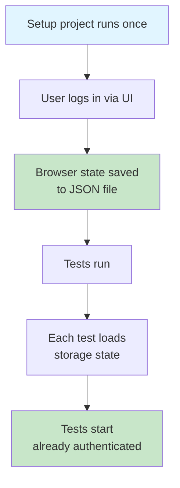

Here's a pattern I see in nearly every Playwright suite I inherit—and it is doing more damage than anyone on the team realizes.

```ts
test.beforeEach(async ({ page }) => {
  await page.goto('/login');
  await page.fill('[name=email]', 'alice@example.com');
  await page.fill('[name=password]', 'password123');
  await page.click('button[type=submit]');
  await expect(page).toHaveURL('/shelf');
});
```

Every single test logs in through the UI. Every single test opens the login page, fills in the fields, clicks submit, and waits for the redirect. If your suite has a hundred tests and login takes 1.5 seconds, you've just spent 150 seconds of wall time doing the same thing over and over. In CI that's real money. Locally, it's the reason nobody runs the full suite.

It gets worse. Every one of those logins is _also_ a possible point of failure independent of whatever the test is actually testing. If someone changes the email field's `name` attribute, fifty tests break at once, and none of them have anything to do with login. The test output is a wall of red with "element not found" errors, and an agent looking at that wall of red will happily go rewrite fifty tests when the actual fix is to update one selector in one `beforeEach`.

There's a better way. It's not new. It's in the [Playwright docs](https://playwright.dev/docs/auth). It's called [storage state](https://playwright.dev/docs/auth), and almost nobody uses it.

## The idea

Log in once, at the start of the test run. Save the resulting browser state—cookies, `localStorage`, and, if you ask for it, `IndexedDB`—to JSON. Tell every test to start from that state instead of starting from a blank browser. Now every test opens already logged in, and you've paid the login cost exactly once.

Playwright has first-class support for this. You don't need plugins, you don't need clever fixtures, you just need to know where the two knobs are.

## The setup

Create a Playwright setup file—convention is `tests/end-to-end/authentication.setup.ts`—that logs in and writes the state to a file. There are two ways to do the "log in" part, and both are worth knowing.

### Option A: Log in through the UI

```ts
import { test as setup, expect } from '@playwright/test';
import path from 'node:path';

const authenticationFile = path.resolve('playwright/.authentication/user.json');

setup('authenticate', async ({ page }) => {
  await page.goto('/login');
  await page.getByLabel('Email').fill('alice@example.com');
  await page.getByLabel('Password').fill('password123');
  await page.getByRole('button', { name: 'Sign in' }).click();
  await expect(page).toHaveURL('/shelf');

  // Save cookies, localStorage, etc., to a file
  await page.context().storageState({ path: authenticationFile });
});
```

This is the conservative default and the one Shelf uses. It runs the real login flow—the same page, same form, same redirect—just once per Playwright invocation instead of once per test. The side effect is that it doubles as a smoke test: if someone breaks the login form, the setup fails before any other test runs, and the error is obvious.

### Option B: Hit the auth endpoint directly

```ts
import { test as setup, expect } from '@playwright/test';
import path from 'node:path';

const authenticationFile = path.resolve('playwright/.authentication/user.json');

setup('authenticate', async ({ request }) => {
  const response = await request.post('/api/auth/sign-in/email', {
    data: { email: 'alice@example.com', password: 'password123' },
  });

  expect(response.ok()).toBeTruthy();

  await request.storageState({ path: authenticationFile });
});
```

No page load, no DOM rendering, no dependency on the login form's markup. This is faster and more resilient to UI changes. The tradeoff: if someone breaks the login form, the setup still passes, and you won't find out until a user reports it—or until you have a separate test that exercises the login page directly.

### Which one?

Use the UI approach when login is fast and you want the free smoke test. Use the API approach when login is slow (OAuth redirects, CAPTCHAs in staging, multi-step flows) or when you already have a dedicated login test and don't need the setup to double as one.

### What the storage state file and object look like

Either way, Playwright can write a JSON file to `playwright/.authentication/user.json` that looks roughly like this:

```json
{
  "cookies": [
    {
      "name": "session",
      "value": "eyJhbGciOiJIUzI1NiJ9...",
      "domain": "localhost",
      "path": "/",
      "expires": 1748000000,
      "httpOnly": true,
      "secure": false,
      "sameSite": "Lax"
    }
  ],
  "origins": [
    {
      "origin": "http://localhost:5173",
      "localStorage": [
        {
          "name": "shelf:user",
          "value": "{\"id\":\"usr_01J\",\"email\":\"alice@example.com\"}"
        }
      ]
    }
  ]
}
```

That file-on-disk shape is also the basic object shape you can pass directly to `storageState` in code. If you export with `indexedDB: true`, Playwright can add extra snapshot data for you, but the hand-authored inline form still starts with `cookies` and `origins`. You do _not_ have to read from a file if the state is small enough that inlining it is clearer.

```ts
import { test } from '@playwright/test';

test.use({
  storageState: {
    cookies: [
      {
        name: 'session',
        value: 'test-session-token',
        domain: 'localhost',
        path: '/',
        expires: 1893456000,
        httpOnly: true,
        secure: false,
        sameSite: 'Lax',
      },
    ],
    origins: [
      {
        origin: 'http://localhost:5173',
        localStorage: [
          {
            name: 'shelf:user',
            value: JSON.stringify({
              id: 'usr_01J',
              email: 'alice@example.com',
              role: 'reader',
            }),
          },
        ],
      },
    ],
  },
});

test('opens already signed in from an inline object', async ({ page }) => {
  await page.goto('/shelf');
  // Already authenticated without reading a file.
});
```

That is useful when you want a tiny synthetic state for one spec file, when you want to force a known logged-out state, or when the filesystem dependency is more ceremony than value.

```ts
import { test } from '@playwright/test';

test.use({ storageState: { cookies: [], origins: [] } });
```

Every field in the inline object matters. In current Playwright docs and the installed Playwright `1.57` types in this repository, the object form accepts exactly two top-level keys: `cookies` and `origins`.

#### `cookies`

This is an array of cookie objects to preload into the browser context.

- **`name`:** The cookie name.
- **`value`:** The cookie value.
- **`domain`:** Which host the cookie belongs to. Prefix with `.` if you want it to apply to subdomains too, such as `.example.com`.
- **`path`:** Which URL path the cookie applies to. `'/'` means the whole site.
- **`expires`:** Expiration time as a Unix timestamp in seconds.
- **`httpOnly`:** Whether JavaScript in the page can read the cookie. `true` means `document.cookie` cannot see it.
- **`secure`:** Whether the cookie should only be sent over HTTPS.
- **`sameSite`:** Cross-site behavior. `'Strict'` is the most restrictive, `'Lax'` is the common default, and `'None'` allows cross-site usage.

#### `origins`

This is an array of origin-scoped storage buckets. Each one maps to one exact browser origin.

- **`origin`:** The exact scheme, host, and port, such as `http://localhost:5173`. If the page runs on a different origin, these entries do nothing.
- **`localStorage`:** The `localStorage` entries to preload for that origin.

#### `localStorage`

Each `localStorage` entry is a name/value pair.

- **`name`:** The key.
- **`value`:** The stored string value. `localStorage` is string-only, so objects need `JSON.stringify(...)`.

#### What is _not_ in this object

This is the part people mix up.

- There is no top-level `path` key here. `path` belongs to [`browserContext.storageState({ path })`](https://playwright.dev/docs/api/class-browsercontext#browser-context-storage-state) when you are _exporting_ state to disk.
- There is no top-level `indexedDB` key here either. `indexedDB: true` is also an _export_ option on `browserContext.storageState(...)`, not something you usually hand-author in the inline input object.
- There is no `sessionStorage` key. [Playwright's auth docs](https://playwright.dev/docs/auth#session-storage) are explicit that `sessionStorage` is not persisted by `storageState`; if your app stores auth there, you need an `addInitScript` recipe instead.
- There is no cookie `url` shortcut in this shape. `url` exists on [`browserContext.addCookies()`](https://playwright.dev/docs/api/class-browsercontext#browser-context-add-cookies), but `storageState` expects `domain` and `path`.

So the mental model is:

- `browserContext.storageState({ path, indexedDB })`: export state
- `test.use({ storageState })` or `browser.newContext({ storageState })`: consume a file path or an inline object with `cookies` and `origins`

## Wiring it into the config

This is where [Playwright projects](playwright-projects.md) earn their keep. If you haven't read that lesson yet, the short version: a project is a named block in `playwright.config.ts` with its own settings and dependencies. Playwright runs them in dependency order, like a mini build graph.

For authentication, you split the config into two projects—one that logs in, and one that runs the actual tests:

```ts
import { defineConfig } from '@playwright/test';
import path from 'node:path';

export default defineConfig({
  projects: [
    {
      name: 'setup',
      testMatch: /authentication\.setup\.ts/,
    },
    {
      name: 'chromium',
      use: {
        storageState: path.resolve('playwright/.authentication/user.json'),
      },
      dependencies: ['setup'],
    },
  ],
});
```

The `setup` project matches only the authentication setup file. The `chromium` project depends on `setup`, so Playwright guarantees the login runs first. Every test in `chromium` starts with the saved session pre-loaded—no login code, no `beforeEach`, nothing.



Tests that used to begin with a login flow now begin at `/shelf` already authenticated:

```ts
test('rate a book', async ({ page }) => {
  await page.goto('/shelf');
  // Already logged in. Just do the thing.
  await page
    .getByRole('article', { name: /Station Eleven/ })
    .getByRole('button', { name: 'Rate this book' })
    .click();
  // ...
});
```

The login code is gone. The login _concern_ is gone. If login breaks, exactly one test fails—the setup test—and the error tells you unambiguously that login itself is broken, not that "everything is flaky."

## Multiple roles

Shelf has an admin surface for featuring books on the home page. So we need two authenticated contexts: a regular user and an admin. Easy:

```ts
// authentication.setup.ts
setup('authenticate as user', async ({ page }) => {
  // ... log in as alice ...
  await page.context().storageState({ path: 'playwright/.authentication/user.json' });
});

setup('authenticate as admin', async ({ page }) => {
  // ... log in as admin ...
  await page.context().storageState({ path: 'playwright/.authentication/admin.json' });
});
```

Then in the config, two test projects:

```ts
projects: [
  { name: 'setup', testMatch: /authentication\.setup\.ts/ },
  {
    name: 'user',
    testMatch: /tests\/end-to-end\/user\//,
    use: { storageState: 'playwright/.authentication/user.json' },
    dependencies: ['setup'],
  },
  {
    name: 'admin',
    testMatch: /tests\/end-to-end\/admin\//,
    use: { storageState: 'playwright/.authentication/admin.json' },
    dependencies: ['setup'],
  },
];
```

Organize the tests by role under subdirectories. Every test inherits the right state automatically. No decorators, no fixtures-within-fixtures, no clever `beforeEach` logic.

## Third-party providers still end in storage state

If your app signs in through Google OAuth, Okta, Microsoft, Auth0, or some other external identity provider, the storage-state pattern still applies. What changes is not the destination but _how you obtain the authenticated state_.

The dedicated lesson, [Testing Third-Party Authentication](testing-third-party-authentication.md), covers the pattern in detail: keep one narrow smoke test for "the redirect starts," bootstrap your application's own session for the normal test suite, and reserve full real-provider flows for a separate smoke lane when you truly need them.

## The `.gitignore` you need

The authentication state files contain real cookies. Do not commit them. Add this to `.gitignore`:

```
playwright/.authentication/
```

And do not skip this step. I have seen session cookies committed to public repos twice. Both times it was an agent that did it. Put the ignore line in before the agent writes the setup file, not after.

## When to re-authenticate

Storage state files don't expire on their own. If your session cookies are short-lived (which they should be), the state file will eventually be stale, and your tests will start failing with "redirected to /login" errors.

Two options exist:

- Regenerate the state file on every Playwright run. The `setup` project approach above does this automatically—every `npx playwright test` runs the login again.
- Cache the state file with a TTL. There are recipes in the Playwright docs if you want this. I usually don't—regenerating on every run is cheap enough that I don't bother with caching.

> [!TIP]
> The setup-project pattern is the safest default for workshop code because it gives you a fresh, browser-real authentication state on every run. Cache the file only when you have measured the setup as a bottleneck and you understand the failure modes around expired cookies.

## CLAUDE.md rules

```markdown
## Playwright authentication

- Never log in through the UI inside a test. Login happens once, in
  `tests/end-to-end/authentication.setup.ts`, and all other tests inherit
  the resulting storage state.
- If a test needs a different user or role, add a new setup for that
  role and a new Playwright project that depends on it.
- Never commit `playwright/.authentication/`. It contains real session
  cookies.
- If a test is failing because it's redirected to `/login`, the problem
  is the setup file or the session cookie TTL, not the individual test.
  Do not fix it by adding `page.goto('/login')` to the test.
```

That last rule is specifically there to stop the agent from "fixing" the symptom when the setup is broken. I have watched an agent, given a redirect error, revert six months of storage-state work because it was easier to copy-paste a login block into the failing test. The rule makes that explicitly off-limits.

## The one thing to remember

You log in once per run, not once per test. The cost savings are real, the stability improvements are bigger than the cost savings, and the pattern is one of the few places where Playwright's defaults are genuinely well-designed and almost nobody uses them. Put it in the instructions file. The agent will thank you by not writing a hundred login blocks.

## Additional Reading

- [Playwright Projects](playwright-projects.md)
- [Testing Third-Party Authentication](testing-third-party-authentication.md)
- [The Waiting Story](the-waiting-story.md)
- [Recording HARs for Network Isolation](recording-hars-for-network-isolation.md)
