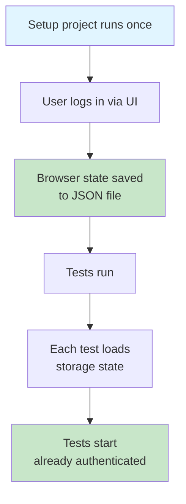

Here's a pattern I see in nearly every Playwright suite I inherit—and it is doing more damage than anyone on the team realizes.

```ts
test.beforeEach(async ({ page }) => {
  await page.goto('/login');
  await page.fill('[name=email]', 'alice@example.com');
  await page.fill('[name=password]', 'password123');
  await page.click('button[type=submit]');
  await expect(page).toHaveURL('/shelf');
});
```

Every single test logs in through the UI. Every single test opens the login page, fills in the fields, clicks submit, and waits for the redirect. If your suite has a hundred tests and login takes 1.5 seconds, you've just spent 150 seconds of wall time doing the same thing over and over. In CI that's real money. Locally, it's the reason nobody runs the full suite.

It gets worse. Every one of those logins is _also_ a possible point of failure independent of whatever the test is actually testing. If someone changes the email field's `name` attribute, fifty tests break at once, and none of them have anything to do with login. The test output is a wall of red with "element not found" errors, and an agent looking at that wall of red will happily go rewrite fifty tests when the actual fix is to update one selector in one `beforeEach`.

There's a better way. It's not new. It's in the [Playwright docs](https://playwright.dev/docs/auth). It's called [storage state](https://playwright.dev/docs/auth), and almost nobody uses it.

## The idea

Log in once, at the start of the test run. Save the resulting browser state—cookies, localStorage, sessionStorage, all of it—to a JSON file. Tell every test to start from that JSON file instead of starting from a blank browser. Now every test opens already logged in, and you've paid the login cost exactly once.

Playwright has first-class support for this. You don't need plugins, you don't need clever fixtures, you just need to know where the two knobs are.

## The setup

Create a Playwright setup file—convention is `tests/end-to-end/authentication.setup.ts`—that logs in and writes the state to a file. (This follows Steve's preference for full words: `authentication.setup.ts` not `auth.setup.ts`.)

```ts
import { test as setup, expect } from '@playwright/test';
import path from 'node:path';

const authenticationFile = path.resolve('playwright/.authentication/user.json');

setup('authenticate', async ({ page }) => {
  await page.goto('/login');
  await page.getByLabel('Email').fill('alice@example.com');
  await page.getByLabel('Password').fill('password123');
  await page.getByRole('button', { name: 'Sign in' }).click();
  await expect(page).toHaveURL('/shelf');

  // Save cookies, localStorage, etc., to a file
  await page.context().storageState({ path: authenticationFile });
});
```

Notice this is still using the UI to log in, the same way a real user would. That's fine—it runs _once_ per Playwright invocation, not once per test. It's also a de facto smoke test for your login flow, which is a nice side effect.

Then in `playwright.config.ts`, wire the setup as a dependency of the main test project:

```ts
import { defineConfig } from '@playwright/test';
import path from 'node:path';

export default defineConfig({
  projects: [
    {
      name: 'setup',
      testMatch: /authentication\.setup\.ts/,
    },
    {
      name: 'chromium',
      use: {
        storageState: path.resolve('playwright/.authentication/user.json'),
      },
      dependencies: ['setup'],
    },
  ],
});
```

Two projects. The `setup` project runs the login file once. The `chromium` project depends on `setup`, so it always runs after, and it starts every test with the saved authentication state pre-loaded.



Tests that used to begin with a login flow now begin at `/shelf` already authenticated:

```ts
test('rate a book', async ({ page }) => {
  await page.goto('/shelf');
  // Already logged in. Just do the thing.
  await page
    .getByRole('article', { name: /Station Eleven/ })
    .getByRole('button', { name: 'Rate this book' })
    .click();
  // ...
});
```

The login code is gone. The login _concern_ is gone. If login breaks, exactly one test fails—the setup test—and the error tells you unambiguously that login itself is broken, not that "everything is flaky."

## Multiple roles

Shelf has an admin surface for featuring books on the home page. So we need two authenticated contexts: a regular user and an admin. Easy:

```ts
// authentication.setup.ts
setup('authenticate as user', async ({ page }) => {
  // ... log in as alice ...
  await page.context().storageState({ path: 'playwright/.authentication/user.json' });
});

setup('authenticate as admin', async ({ page }) => {
  // ... log in as admin ...
  await page.context().storageState({ path: 'playwright/.authentication/admin.json' });
});
```

Then in the config, two test projects:

```ts
projects: [
  { name: 'setup', testMatch: /authentication\.setup\.ts/ },
  {
    name: 'user',
    testMatch: /tests\/end-to-end\/user\//,
    use: { storageState: 'playwright/.authentication/user.json' },
    dependencies: ['setup'],
  },
  {
    name: 'admin',
    testMatch: /tests\/end-to-end\/admin\//,
    use: { storageState: 'playwright/.authentication/admin.json' },
    dependencies: ['setup'],
  },
];
```

Organize the tests by role under subdirectories. Every test inherits the right state automatically. No decorators, no fixtures-within-fixtures, no clever `beforeEach` logic.

## Skipping the UI entirely

Everything I just showed you logs in through the real login page. That's the conservative default and it's what I reach for first. But, if you have an API-based login (which Shelf does, via `POST /api/authentication/sign-in`), you can skip the UI entirely and just hit the API:

```ts
setup('authenticate as user', async ({ request }) => {
  await request.post('/api/authentication/sign-in', {
    data: { email: 'alice@example.com', password: 'password123' },
  });
  await request.storageState({ path: 'playwright/.authentication/user.json' });
});
```

This is faster (no page load, no DOM rendering) and doesn't care if the login form changes. The tradeoff is that it no longer doubles as a smoke test for the login UI. I generally run the UI version in CI (as a safety net) and the API version locally (for speed). You can have both—two setup projects, pick one based on an environment variable.

## The `.gitignore` you need

The authentication state files contain real cookies. Do not commit them. Add this to `.gitignore`:

```
playwright/.authentication/
```

And do not skip this step. I have seen session cookies committed to public repos twice. Both times it was an agent that did it. Put the ignore line in before the agent writes the setup file, not after.

## When to re-authenticate

Storage state files don't expire on their own. If your session cookies are short-lived (which they should be), the state file will eventually be stale, and your tests will start failing with "redirected to /login" errors.

Two options exist:

- Regenerate the state file on every Playwright run. The `setup` project approach above does this automatically—every `npx playwright test` runs the login again.
- Cache the state file with a TTL. There are recipes in the Playwright docs if you want this. I usually don't—regenerating on every run is cheap enough that I don't bother with caching.

## CLAUDE.md rules

```markdown
## Playwright authentication

- Never log in through the UI inside a test. Login happens once, in
  `tests/end-to-end/authentication.setup.ts`, and all other tests inherit
  the resulting storage state.
- If a test needs a different user or role, add a new setup for that
  role and a new Playwright project that depends on it.
- Never commit `playwright/.authentication/`. It contains real session
  cookies.
- If a test is failing because it's redirected to `/login`, the problem
  is the setup file or the session cookie TTL, not the individual test.
  Do not fix it by adding `page.goto('/login')` to the test.
```

That last rule is specifically there to stop the agent from "fixing" the symptom when the setup is broken. I have watched an agent, given a redirect error, revert six months of storage-state work because it was easier to copy-paste a login block into the failing test. The rule makes that explicitly off-limits.

## The one thing to remember

You log in once per run, not once per test. The cost savings are real, the stability improvements are bigger than the cost savings, and the pattern is one of the few places where Playwright's defaults are genuinely well-designed and almost nobody uses them. Put it in the instructions file. The agent will thank you by not writing a hundred login blocks.

## Additional Reading

- [The Waiting Story](the-waiting-story.md)
- [Recording HARs for Network Isolation](recording-hars-for-network-isolation.md)
