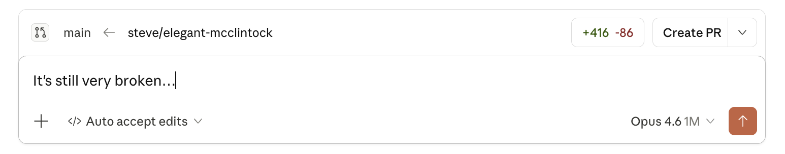
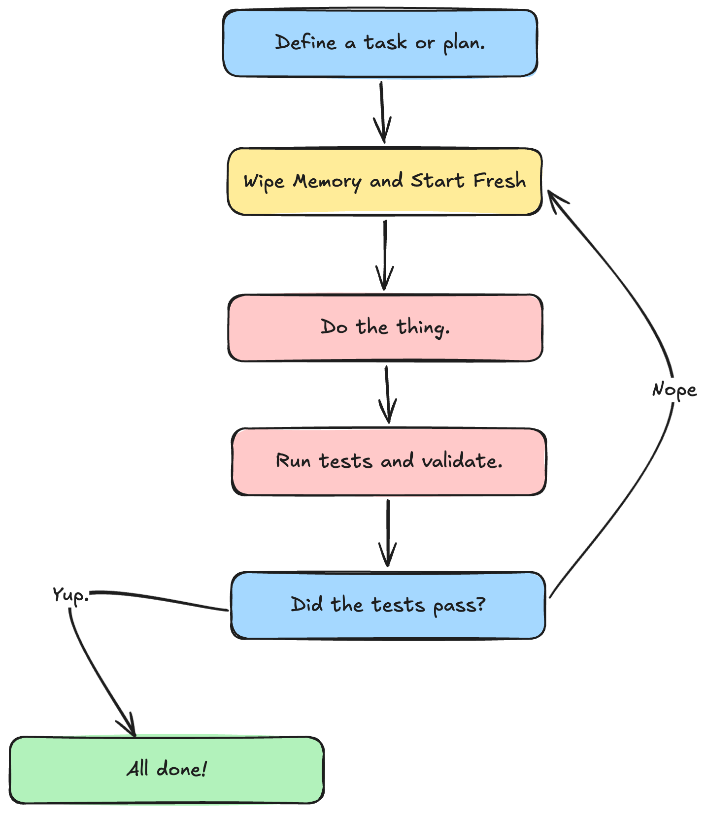

So, here's the bet the rest of the day is built on.

Agents are _fast_ at editing code. They are not particularly good at knowing whether the edit was any good. If every change they make requires _you_ to read the diff, run the thing, click around the UI, eyeball the console, and then prompt the agent to fix what it missed—you haven't automated much. You've traded one kind of typing for another, and some days it's not even obvious which side of the trade you're on.

I've done the relay dance more times than I'd like to admit: The agent ships something confident-looking. I run it. It's wrong in a way the agent would have caught immediately if it had bothered to actually _run_ the code. I paste the error back. It fixes the error and introduces a new one. Repeat until lunch—or, I get rate limited.

The hypothesis for today is that the problem isn't the agent's intelligence—it's that we keep making ourselves the feedback loop. If the agent could run lint, types, unit tests, an end-to-end probe, a visual diff, and a second-opinion review on its own, it would catch most of its own mistakes before we ever saw them. We'd stop reviewing every edit and start reviewing the ones that escape the loop.

That's the whole workshop in one sentence: **how do we make it cheap and automatic for an agent to check its own work?**

> [!NOTE] About Shelf
> Every lab in this workshop runs against the same starter project: a small [SvelteKit](https://kit.svelte.dev/) + TypeScript book-rating app called [**Shelf**](https://github.com/stevekinney/shelf-life). It uses [Vitest](https://vitest.dev/) for unit tests and [Playwright](https://playwright.dev/) for end-to-end. You'll harden it across the day—adding a CLAUDE.md, a static layer, dossiers, visual regression, and CI—until it's the codebase the rest of the workshop assumes. If a lab tells you to "open the Shelf starter repo," that's the one.

## Why loops beat prompting discipline

You can get surprisingly far by writing a great prompt. I am not going to tell you to stop doing that. But, prompting discipline has a ceiling, and the ceiling is lower than people think.

A prompt is a one-shot instruction. A loop is a process that keeps running until something is true. "Don't use `waitForTimeout`" is a prompt. A lint rule that fails the build when `waitForTimeout` appears is a loop. The first one works until the agent forgets. The second one works until you delete the rule.

The interesting thing about loops is that they compound. Every layer you add catches a class of mistake the previous layer missed, and _also_ makes the next layer cheaper to add. Once your tests run reliably, writing a visual regression gate is a config change. Once your visual regression gate exists, feeding the diff back to the agent is a few lines of glue. The work stacks.

## The three beats of the day

The modules are ordered to start where you probably came here to start—agent-driven verification of real UI work—and to save the broader scaffolding for the end, where it flows naturally into CI.

Think of the arc in three beats.

**Prove the UI behaves.** Most of the morning. We build the testing muscle the agent needs: the pyramid in context, a [Playwright](https://playwright.dev/) suite that survives a real codebase, visual regression as a live signal, runtime probes that let the agent click around, and failure dossiers that make every red run readable.

**Get a second opinion.** After lunch, we bring in a second agent to review what the first one shipped. Review bots catch the things tests didn't, and when they flag the same mistake three times in a row they're telling you what's missing from your instructions.

**Underlay the cheap stuff and ship it.** The back half of the day is the stuff that should be running underneath everything—lint, types, dead code detection, git hooks, secret scanning—and then wiring the whole stack into CI so it runs without a human in the room. This lives at the end on purpose. By the time we get there, you'll know exactly what you want these checks to enforce, which makes the grab-bag feeling of "here's a bunch of tools" land as answers instead of setup.

## What we're _not_ doing today

A few things I want to flag up front so nobody is waiting for the shoe to drop.

We're not doing a testing fundamentals course. The good news is that [we have one of those](https://frontendmasters.com/courses/testing/). If you want the full pyramid from first principles, I have two other courses for that (more on those in **Module 2**). Today assumes you can write a test and we're focused on what changes when an agent is the one driving.

We're not doing a tour of _every_ agent. I'll call out Codex, Cursor, and Copilot where the patterns differ, but the default is [Claude Code](https://docs.claude.com/en/docs/claude-code/overview) and the default stack is TypeScript, [SvelteKit](https://kit.svelte.dev/), [Vitest](https://vitest.dev/), and [Playwright](https://playwright.dev/). The patterns port; the keybindings don't.

We're _not_ doing a prompt engineering seminar. There's exactly one upstream lever we care about—instructions that wire the agent into the loop—and that's the next lesson. Everything else today is about the loop itself.

## The one thing to remember

If you forget everything else from this opening, remember this: **a feedback loop the agent can run on its own is worth more than a better prompt.** That's the bet. The rest of the day is us cashing the check.

## Additional Reading

- [Instructions That Wire the Agent In](instructions-that-wire-the-agent-in.md)
- [The Testing Pyramid as a Feedback Hierarchy](the-testing-pyramid-as-a-feedback-hierarchy.md)
