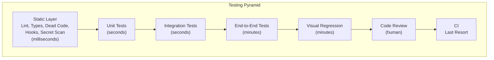

We're about six hours into the day. Here's where I explain why the lesson you'd have expected to see first is showing up now.

When I sketched this workshop originally, the static layer—[ESLint](https://eslint.org/), [TypeScript](https://www.typescriptlang.org/), Prettier, [knip](https://knip.dev/), [ts-prune](https://github.com/nadeesha/ts-prune), [Husky](https://typicode.github.io/husky/), [lint-staged](https://github.com/lint-staged/lint-staged), [Gitleaks](https://github.com/gitleaks/gitleaks)—was Module 2. Right after the opening. The logic was that static checks are the cheapest feedback loop we have, and you want them in place before anything else, so the agent can lean on them from the start.

The logic is correct. The ordering was wrong.

If I'd put the static layer up front, I'd have spent an hour telling you to install a bunch of packages and write a bunch of config files, and you'd have spent the afternoon wondering why. Without the context of an actual Playwright suite, a visual regression workflow, a review bot, and a failure dossier, "install ESLint and add a rule banning `page.waitForTimeout`" is an abstract good idea that you'd probably skip on your own project.

By now, the context exists. You know why you want that lint rule. You know because you spent an hour this morning explaining the ban to yourself, and now you want the computer to explain it next time. You know why you want a git hook that blocks the commit if the screenshot snapshots changed without an explanation. You know why you want dead code detection. Every static check I'm about to walk through is an answer to a question you've already asked today.

That's why this module is here. Not as a grab bag, but as the _answers_ to the grab bag.

## The mental model

Think of static checks as underlayment. You put them down once, they run under everything else, and they catch a specific class of mistake before any of the more expensive loops fire. Lint catches bad patterns at the moment of typing. Types catch shape mismatches at the moment of editing. Dead code detection catches orphans at the moment of imports. Hooks catch mistakes at the moment of commit. Secret scanning catches credentials at the moment of push.

Each of these runs in milliseconds to seconds. None of them require a browser. None of them require a database. They are the _cheapest_ possible feedback loop, which is why they should be running continuously in the background and why the agent should be wired to trip them constantly.

The specific pieces we're going to cover in this module:

- **ESLint and TypeScript** as opinionated guardrails, including custom rules for the Playwright patterns from this morning.
- **Dead code detection** with knip, ts-prune, and dependency-cruiser. This is a big one for agent workflows—agents love to leave orphans behind.
- **Git hooks** with husky and lint-staged, including the "Claude hooks" mention (they're a more specific version of the same idea).
- **Secret scanning** with gitleaks. Credentials in test fixtures are the canonical agent mistake.
- A light-touch mention of **axe-core** as the accessibility layer that belongs in the static tier even though it technically runs in a browser.

All of it runs on every save, every commit, every push, and finally in CI. The layers are the same; only the strictness changes.

## Why the agent benefits more than you do

Static checks help human developers too. That's not news. What _is_ news is that static checks help agents disproportionately, and the reason is worth naming.

An agent is a text-in, text-out system. Every piece of feedback it gets is a future prompt. A test failure is a prompt. A lint error is a prompt. A type error is a prompt. A dead code warning is a prompt. And the _faster_ the prompt arrives, the cheaper it is for the agent to act on it, because the agent is still looking at the code it just wrote.

A test failure five minutes after the edit is expensive—the agent has moved on, its context has shifted, it has to go back and re-understand what it was doing. A lint error thirty seconds after the edit is almost free—the context is still hot, the fix is immediate, and the loop closes inside a single turn. This is why the static layer has outsized value in an agent workflow: it shortens the feedback distance more than any other layer.

A practical consequence: an agent with a tight static layer looks smarter than an agent without one, even if the underlying model is identical. The smartness comes from the feedback loop, not the model.

## The pattern, independent of tools

Every static tool you install is going to follow roughly the same setup pattern:

1. Install it.
2. Configure it with defaults aggressive enough to be useful but not so aggressive that it flags your existing code everywhere.
3. Wire it into `package.json` as a named script.
4. Add the script to `CLAUDE.md` under "what done means."
5. Run it on save (via editor integration), on commit (via a git hook), and in CI.
6. Tune it over the next week based on what it catches and what it gets wrong.

Steps 3 and 4 are the ones most projects skip. "We have ESLint configured" means nothing if it's not on the agent's list of commands to run. The static check that the agent doesn't know about is a static check that doesn't get run.

Similarly, step 6 is the one that separates a working static layer from a cargo-culted one. Every rule that flags something the agent shouldn't have done is a rule you keep. Every rule that produces noise for a week is a rule you delete or tune. Tuning is the work.

## A word on Claude hooks

A quick aside on Claude Code's hook system, because it comes up in this area and it's worth placing correctly.

Claude Code supports hooks—shell commands that fire on specific events (pre-prompt, post-tool-use, pre-submit, etc.). They're powerful and agent-specific. You can, for example, set a `post-tool-use` hook that runs `bun lint` whenever the agent edits a file, and if the lint fails, the result gets fed back to the agent as context before the next turn.

That's a real, useful feedback loop. It's also completely Claude Code-specific. Cursor has its own flavor (Rules + Agents), Codex has its own, Copilot has its own.

My take: hooks are _one_ way to wire a static check into the agent's loop, but they're not the only way, and they're not the most portable way. A git hook via husky runs on commit regardless of which agent edited the file. That's my default. If you're committed to Claude Code and want the tighter loop, add Claude hooks on top of the git hooks—they're complementary, not alternatives. We'll cover both in the git hooks lesson later in this module.

## What's in the rest of the module

I'll say what each of the next lessons covers in one line so you can decide whether to read them in order or pick the ones you care about.

- **Lint and Types as Guardrails**—why ESLint's recommended config isn't enough, and the specific rules I'd add for agent-driven codebases.
- **Dead Code Detection**—knip, ts-prune, and the one-line script that catches orphaned files before they rot.
- **Git Hooks with Husky and Lint-Staged**—the right hooks, the wrong hooks, and how to not make everyone hate git commits.
- **Secret Scanning with Gitleaks**—the agent has already committed a fake API key once on my watch. Do not let this be you.
- **The Lab**—wire the whole stack into Shelf, verify each layer fires on the right mistake.

Pick your own order. They don't depend on each other.

## The one thing to remember

The static layer is not a prerequisite for the rest of the day. It's a _consequence_ of the rest of the day—the pile of concrete "I keep seeing the agent do this" observations that each deserve a mechanical guardrail. Build it now, with all that context in your head, and every rule you add answers a specific question you asked this morning.

## Additional Reading

- [Lint and Types as Guardrails](lint-and-types-as-guardrails.md)
- [Dead Code Detection](dead-code-detection.md)
- [Git Hooks with Husky and Lint-Staged](git-hooks-with-husky-and-lint-staged.md)
- [Secret Scanning with Gitleaks](secret-scanning-with-gitleaks.md)
