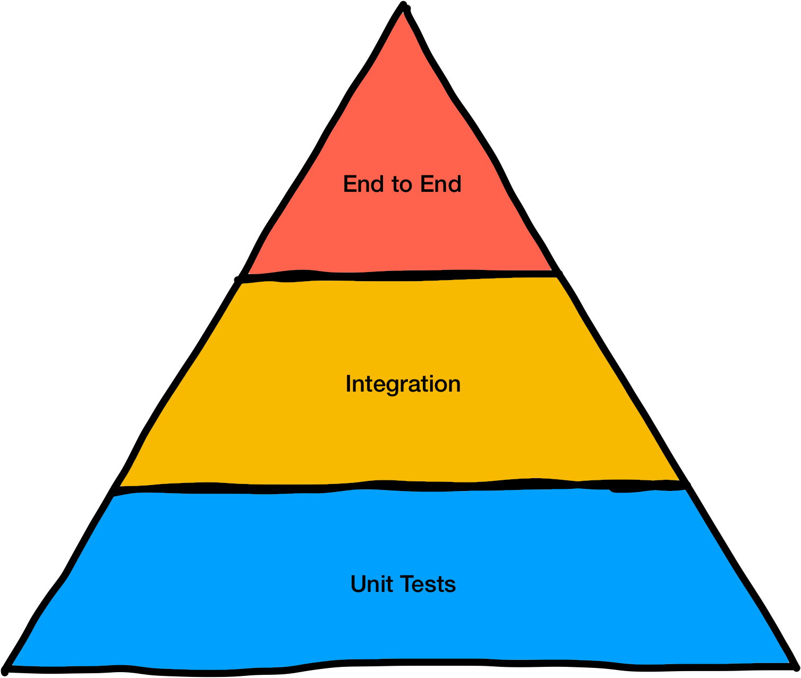
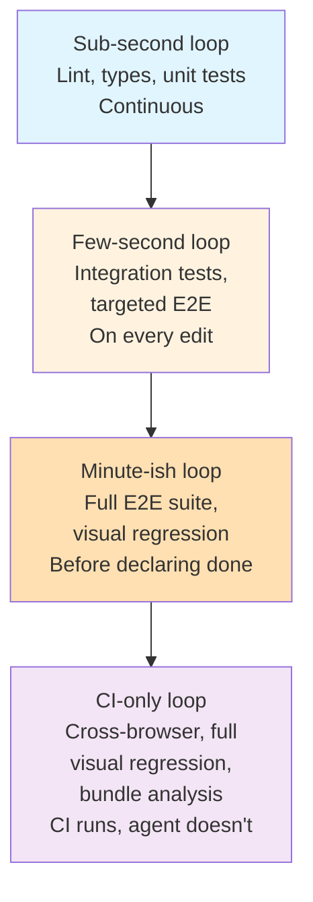

I'm going to move fast through this one. If you want the full treatment of the testing pyramid from first principles, I have two courses for that—[Testing JavaScript Applications](https://frontendmasters.com/courses/testing/) and [Enterprise UI Development](https://frontendmasters.com/courses/enterprise-ui-dev-v2/)—and you don't need to rewatch them to follow along here.

What I do want is for all of us to have the same mental model of the pyramid before we start the [Playwright](https://playwright.dev/)-heavy morning. Because when an agent is the one driving the tests, the pyramid stops being an abstract shape about "ratios of tests" and starts being a _feedback hierarchy_. Each layer is a different loop with different cost and different scope, and the agent needs to know which one to hit when.

## The classic picture, in one paragraph

Unit tests at the bottom—fast, many, narrow. Integration tests in the middle—slower, fewer, wider. End-to-end tests at the top—slowest, fewest, widest. The pyramid shape is prescriptive: you want more fast tests than slow tests because fast tests dominate your feedback loop. If your pyramid is upside down, every change waits on the end-to-end suite and nobody ever runs it locally, which means nobody ever knows if it works, which means it breaks, which means people start ignoring red runs, which means the gate stops being a gate.

That's the summary. None of that changes when the agent shows up. What _does_ change is who's reading the signal.

## Reframed: what each layer tells the agent

Here's the version that matters for today.

**Unit tests** answer "did this function do what I said?" They run in milliseconds. The agent can run the entire unit suite dozens of times in a single task without paying a meaningful cost. These are the loop the agent lives inside when it's writing a pure function, a store, a reducer, a utility module. If a unit test takes more than a second or two to run, it's lying about being a unit test.

**Integration tests** answer "do these pieces agree with each other?" A component rendered with its actual store. A route handler with its actual database (a real one, against a test schema). A form with its actual validation schema. The agent reaches for these when it touches a seam—when the edit it just made crosses two files that have a contract between them. They're slower than unit tests but still cheap enough to run on every save.

**End-to-end tests** answer "would a user be able to do the thing?" They spin up the whole stack. They click real buttons in a real browser against real (or deterministic) data. They're the only layer that can tell you the navigation works, the form submits, the page renders, the auth loads, the loading state actually resolves. They are _expensive_—a Playwright suite that's fast for today's standards is still measured in seconds per test, and a real suite is measured in minutes. The agent should not run the whole end-to-end suite on every save. But it absolutely should run the one or two end-to-end tests that cover the feature it's currently working on, every time it changes UI.

## The shape the agent cares about

The classic pyramid is drawn as a cost/volume tradeoff: cheap tests are numerous, expensive tests are scarce. For the agent, the more useful framing is _loop speed_.

- Sub-second loop: lint, types, unit tests. The agent runs these continuously.
- Few-second loop: integration tests, a single targeted end-to-end test. The agent runs these on every meaningful edit.
- Minute-ish loop: the full end-to-end suite, visual regression, full type check on a cold cache. The agent runs these at the end of a task, before declaring done.
- CI-only loop: cross-browser end-to-end, full visual regression against the baseline, flaky-retries, bundle analysis. The agent does not run these locally—CI does.

If you buy the loop-speed framing, the pyramid almost inverts: you want the _shortest_ loops to be the _densest_ in feedback, because those are the ones that run on every edit. That's not a contradiction with the classic pyramid—it's the same shape, labelled with time instead of volume.

## Where agents misuse the pyramid

A few failure modes I see a lot, and that we're going to actively counter in the lessons after this one.

**The agent writes end-to-end tests when unit tests would do.** Classic overreach. The agent changes a utility function, writes a [Playwright](https://playwright.dev/) test that clicks three pages to verify the utility function, and calls it done. The utility function needed a three-line [Vitest](https://vitest.dev/) case. The [Playwright](https://playwright.dev/) test is ten times slower, flakier, and tests the wrong thing. The fix: the instructions file explicitly says _what a unit test looks like in this repo, with an example path_, so the agent has a template to copy.

**The agent writes unit tests when end-to-end tests are what mattered.** The inverse. The agent adds a form, writes unit tests that mock the form's state and pretend the mock is a test, and never actually renders the form in a browser. The whole loading state is broken and nobody notices because no test ever saw a browser. The fix: the instructions file says _"UI features must ship with a [Playwright](https://playwright.dev/) test that opens the page and asserts on visible content."_ A lint rule or pre-commit hook can even enforce it—if `src/routes/foo/+page.svelte` changed, `tests/foo.spec.ts` must exist.

**The agent doesn't know the difference.** This is the most common failure mode. The agent writes "a test" without any awareness of which layer it's targeting, which means the test ends up halfway between two layers and exercises neither well. The fix is again the instructions file, and again with examples: "Here's what a unit test in this repo looks like. Here's what an integration test looks like. Here's what an end-to-end test looks like." Concrete file paths, not abstract descriptions.

Notice the pattern—every fix routes back through the [instructions file](instructions-that-wire-the-agent-in.md). The pyramid only works as a hierarchy if the agent knows which layer to reach for, and it only knows that because you told it.

## The one thing to remember

The pyramid, for our purposes, is a hierarchy of loops. Fast loops run continuously, slow loops run at checkpoints, slowest loops run in CI. The agent needs to know which loop a given change triggers, and that knowledge lives in the instructions file as concrete examples and concrete rules, not as "follow the testing pyramid."

The next set of lessons picks up here and spends the whole morning on the slowest, most expensive, most pain-prone layer: Playwright. That's where the agent needs the most help, so that's where we spend the most time.

## Additional Reading

- [The Hypothesis](the-hypothesis.md)
- [Locators and the Accessibility Hierarchy](locators-and-the-accessibility-hierarchy.md)
