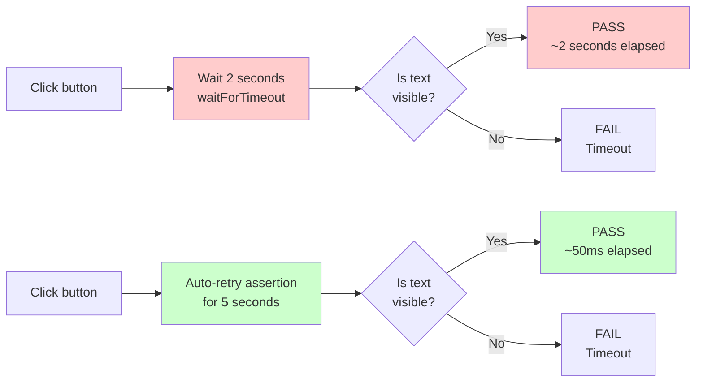

If locator discipline is the number-one thing an agent will get wrong in a Playwright suite, waiting is a very close second. And where locators are bad because they break across refactors, waiting is bad because it breaks _on the exact same code, intermittently, for reasons nobody can explain_. That's worse. That's the thing that makes your team stop trusting end-to-end tests.

## The sin

```ts
await page.click('button.add-book');
await page.waitForTimeout(2000);
await expect(page.getByText('Added to your shelf')).toBeVisible();
```

Two seconds. Why two? Because one didn't work on the agent's first try and three felt wasteful. This is the most common pattern I see in agent-generated Playwright code, and it's wrong in every possible way.

It's wrong when the machine is fast, because you're sitting there for 1.9 seconds doing nothing. It's wrong when the machine is slow, because 2 seconds wasn't enough and the test flakes. It's wrong in CI, because CI is slow on Tuesdays and fast on Wednesdays and nobody knows why, and your test is now a coin flip. And it's especially wrong because the mechanism you _should_ be using is not only more reliable, it's also faster in the happy case.



I have a simple rule about this: `page.waitForTimeout` is banned. Not discouraged. Banned. The instructions file bans it. The lint rule bans it. The only time it's acceptable is in a throwaway `test.skip` debugging session, and even then you should feel bad about it.

## The better version, with no magic

[Playwright's auto-retrying assertions](https://playwright.dev/docs/test-assertions) do almost everything you need them to do if you let them. Every assertion is retried for a configurable timeout (default five seconds) until it either passes or times out. That means you don't have to wait yourself—the assertion _is_ the wait.

```ts
await page.getByRole('button', { name: 'Add book' }).click();
await expect(page.getByText('Added to your shelf')).toBeVisible();
```

That's it. No `waitForTimeout`, no `waitForSelector`, no `sleep`. The `toBeVisible()` assertion waits until either the text appears or the timeout fires. On a fast machine it passes in ten milliseconds. On a slow machine it passes in two seconds. On a broken machine it fails with a useful error. All three outcomes are correct.

This works for more than visibility. The whole `expect(locator).*` family auto-retries:

- `toBeVisible()`, `toBeHidden()`, `toBeEnabled()`, `toBeDisabled()`
- `toHaveText(text)`, `toHaveValue(value)`, `toHaveAttribute(name, value)`
- `toHaveCount(n)`—my personal favorite for "wait until the list of books has rendered all three entries"
- `toBeInViewport()`

Anything you want to assert that's eventually true, use an `expect` on a locator. That's your wait.

## Waiting for network, not for clocks

Sometimes the thing you're waiting on isn't a DOM change—it's a network response. The click fires off a POST, you need the POST to finish before you can interact with the next thing, and there's no DOM state that cleanly tells you the POST finished. This is where [`page.waitForResponse`](https://playwright.dev/docs/api/class-page#page-wait-for-response) earns its place.

```ts
const responsePromise = page.waitForResponse(
  (res) => res.url().endsWith('/api/shelf') && res.request().method() === 'POST',
);
await page.getByRole('button', { name: 'Add book' }).click();
await responsePromise;
```

Two things to notice. First, you set up the waiter _before_ the action, because the response might land faster than the next line of code runs. Second, you match on URL and method, not on a string comparison of the whole URL—query params and IDs will mess you up otherwise.

`page.waitForRequest` exists too, for the "I just want to prove the request went out" case. Both are precise, both beat a timeout every time.

## Clocks and animations and the Clock API

The ugly class of waits is when the UI has a `setTimeout` somewhere. A toast that auto-dismisses after three seconds. A "just now" timestamp that updates every minute. An animation that takes 250ms. Your test now depends on real wall-clock time, which is an abomination.

Playwright ships a [Clock API](https://playwright.dev/docs/clock) that lets you install a fake clock before the page loads:

```ts
await page.clock.install();
await page.goto('/shelf');
// ... interact ...
await page.clock.fastForward('00:03'); // advance three seconds
await expect(page.getByText('Added to your shelf')).toBeHidden();
```

This is how you test the toast that dismisses after three seconds without actually waiting three seconds. It's how you test "X minutes ago" displays without editing the system clock. It is extremely underused and worth putting in the agent's awareness. If the agent is writing a `waitForTimeout` because it's waiting on a clock-driven UI, the correct answer is almost always `page.clock`.

## Waiting for the page to "settle"

A common agent mistake: `await page.waitForLoadState('networkidle')`. Don't. `networkidle` means "no network activity for 500ms," which is both slower than what you actually need (why wait for _all_ requests?) and unreliable in pages with long-polling, analytics beacons, or any kind of heartbeat. Every major testing framework has been quietly moving away from networkidle for years.

Instead, wait for the specific thing you actually care about. If you're waiting for the shelf to render, wait for the shelf content, not for network idle. If you're waiting for an API call to finish, wait for _that_ call, not for all calls to stop. Be specific.

## The `CLAUDE.md` rules

Add these to the instructions file under Playwright:

```markdown
## Waiting in Playwright

- Never use `page.waitForTimeout`. There is always a better option.
- Never use `page.waitForLoadState('networkidle')`.
- To wait for a UI change, use `expect(locator).toBeVisible()` or a
  similar assertion. They auto-retry up to the configured timeout.
- To wait for a network call, set up `page.waitForResponse` with a
  URL+method matcher _before_ triggering the action.
- To wait for clock-driven UI (toasts, timers, "X minutes ago"),
  install `page.clock` at the top of the test and advance it explicitly.
- If you are tempted to add a wait to "fix flakiness," stop. The flakiness
  is a symptom of an assertion not matching the actual end state. Find
  the real end state and assert on it.
```

The last rule is the important one, and the hardest one for an agent to follow without a human pointing it out. Flakiness is never solved by waiting longer. It's solved by asserting on the correct thing.

## A concrete example from Shelf

Shelf ships with a deliberately broken test at `tests/end-to-end/rate-book.spec.ts`. It uses `waitForTimeout(1500)` after submitting a rating, because the agent that originally wrote it was guessing. The test passes most of the time. It fails about one time in fifteen on my machine, and more often on CI under load. Right now the rate-book test is the canonical "flaky test" that blocks releases every few days.

We're going to fix it in the next lab. The fix has three parts: replace the locator with a `getByRole` chain, replace the `waitForTimeout` with a `waitForResponse` on the POST, and add an `expect(locator).toHaveText(/Thanks/)` assertion on the confirmation toast. That's it. Three edits, zero magic, and the test stops flaking.

## The one thing to remember

Every wait in your test is a statement about what you expect to be true. If you can't write that statement as an assertion, you don't actually know what you're waiting for, and the test is going to flake until you figure it out. `waitForTimeout` is the absence of a statement. Ban it.

## Additional Reading

- [Locators and the Accessibility Hierarchy](locators-and-the-accessibility-hierarchy.md)
- [Storage State Authentication](storage-state-authentication.md)
- [Lab: Harden the Flaky Rate-Book Test](lab-harden-the-flaky-rate-book-test.md)
