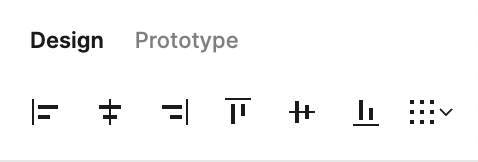
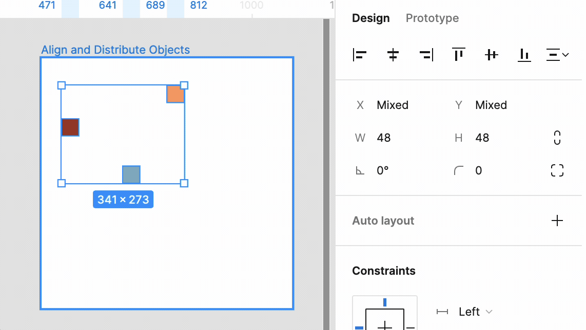
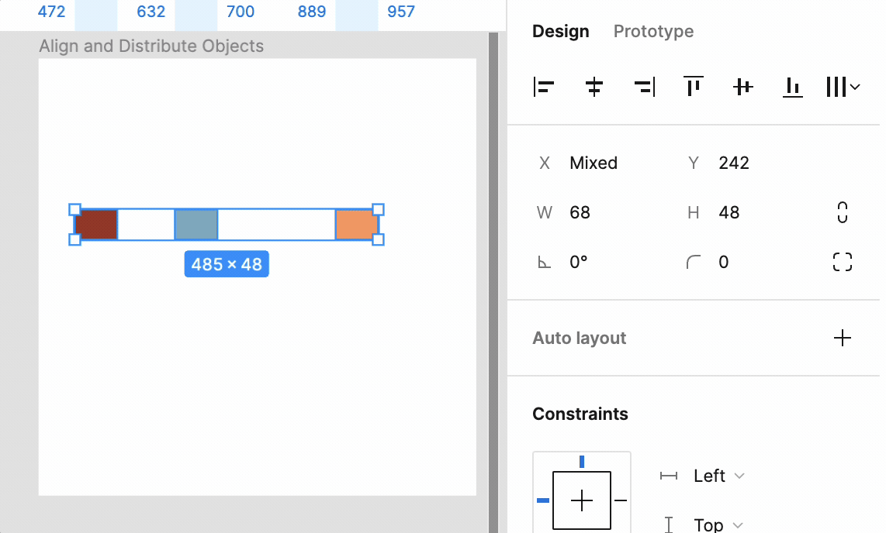
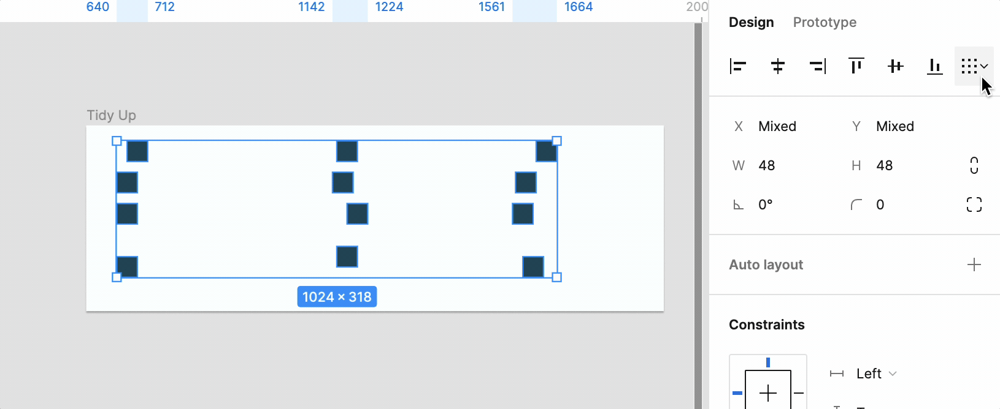

Figma offers various tools to help you align and distribute objects easily. When you select multiple objects, you'll find a set of tools like the one shown below.

## Aligning Objects

In Figma, you can align objects vertically or horizontally, choosing from start, middle, or end alignment options. Figma cleverly uses the boundaries of all selected objects to align them perfectly.

The following keyboard shortcuts facilitate these alignment actions:

- **Align Left:** `Ctrl/Cmd + Shift + L`
- **Align Center (Horizontal):** `Ctrl/Cmd + Shift + H`
- **Align Right:** `Ctrl/Cmd + Shift + R`
- **Align Top:** `Ctrl/Cmd + Shift + T`
- **Align Middle (Vertical):** `Ctrl/Cmd + Shift + V`
- **Align Bottom:** `Ctrl/Cmd + Shift + B`

## Distributing Objects

Figma also lets you evenly distribute objects. When distributing horizontally, it considers the leftmost and rightmost objects as boundaries; for vertical distribution, it uses the top and bottommost objects.

The platform includes keyboard shortcuts for distribution tasks:

- **Distribute Vertically:** `Ctrl/Cmd + Shift + A`
- **Distribute Horizontally:** `Ctrl/Cmd + Shift + D`

## Tidy Up

The Tidy Up tool makes it super easy to tidy up messy selections without the need for precise adjustments. You can use the Tidy Up to neatly organize your chosen items.

Tidy Up arranges selected items closely together with equal spacing. This feature isn't just handy for Smart Selections; it works wonders with tables and toolbars too. Plus, unlike the usual distribute function, Tidy Up ensures consistent spacing every time.

