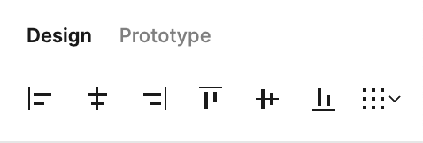
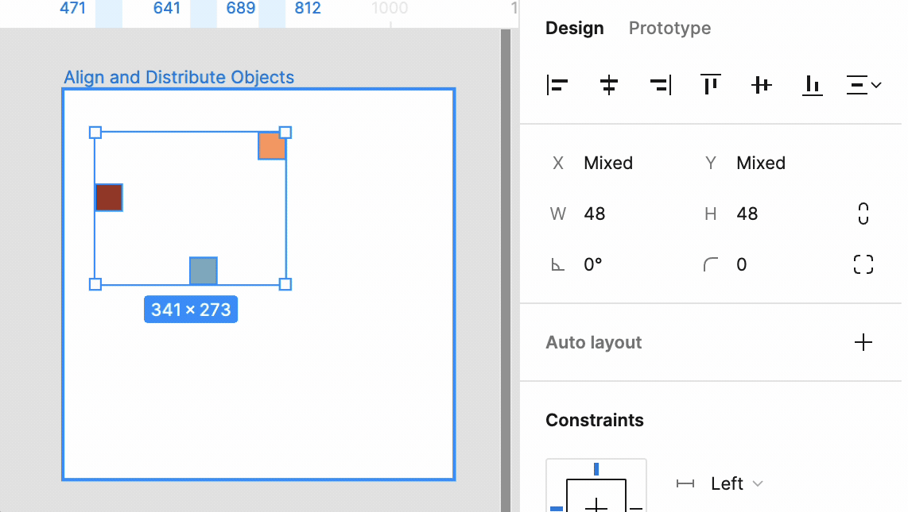
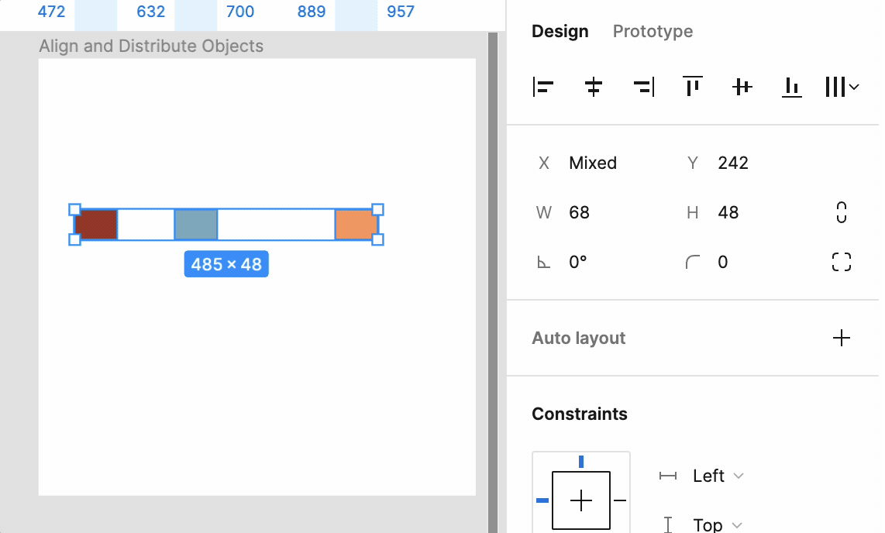

Figma provides an array of tools designed to assist in aligning and distributing objects precisely. Upon selecting multiple objects, you'll encounter a toolset akin to what's illustrated below.

## Aligning Objects

Figma enables the alignment of objects along the vertical or horizontal axes, allowing selection of start, middle, or end alignment. The platform intelligently utilizes the boundaries of all selected objects to determine the optimal alignment.

The following keyboard shortcuts facilitate these alignment actions:

- **Align Left:** `Ctrl/Cmd + Shift + L`
- **Align Center (Horizontal):** `Ctrl/Cmd + Shift + H`
- **Align Right:** `Ctrl/Cmd + Shift + R`
- **Align Top:** `Ctrl/Cmd + Shift + T`
- **Align Middle (Vertical):** `Ctrl/Cmd + Shift + V`
- **Align Bottom:** `Ctrl/Cmd + Shift + B`

## Distributing Objects

Beyond alignment, Figma also enables the even distribution of objects. When distributing horizontally, it considers the leftmost and rightmost objects as bounds; vertically, the top and bottommost objects are used.

The platform includes keyboard shortcuts for distribution tasks:

- **Distribute Vertically:** `Ctrl/Cmd + Shift + A`
- **Distribute Horizontally:** `Ctrl/Cmd + Shift + D`

## Tidy Up

The "Tidy Up" feature in Figma makes it easy to organize multiple objects by automatically aligning and distributing them with a single click.

- [ ] Add more around the **Tidy Up** feature.
