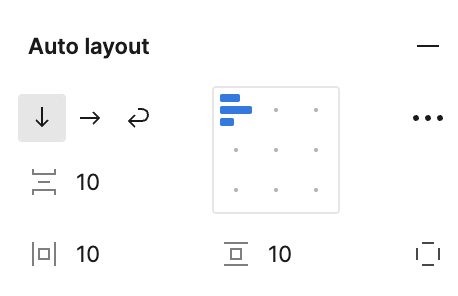
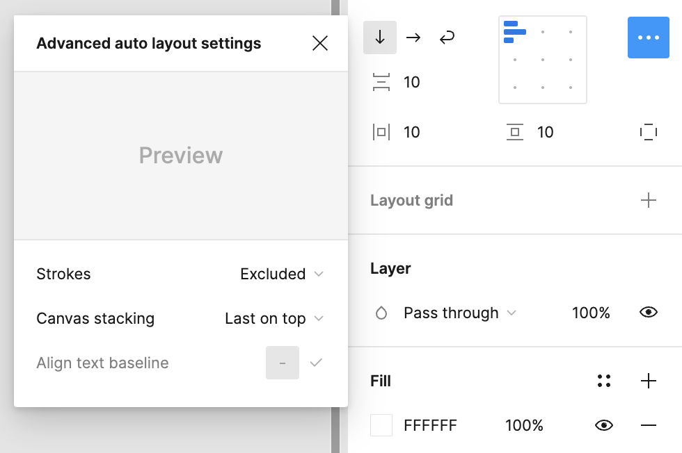
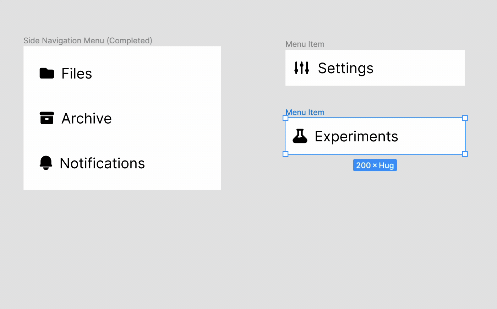
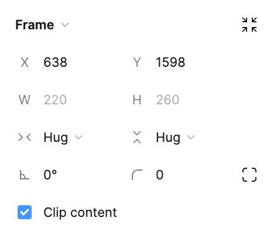
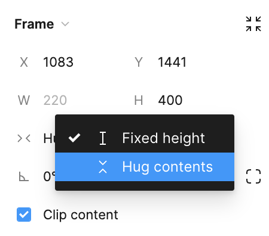
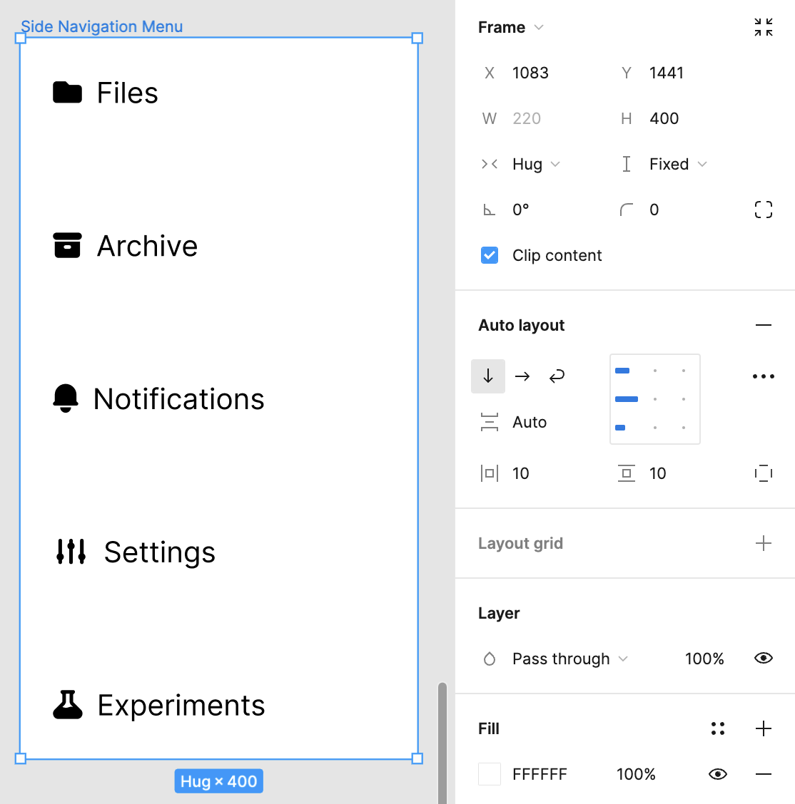
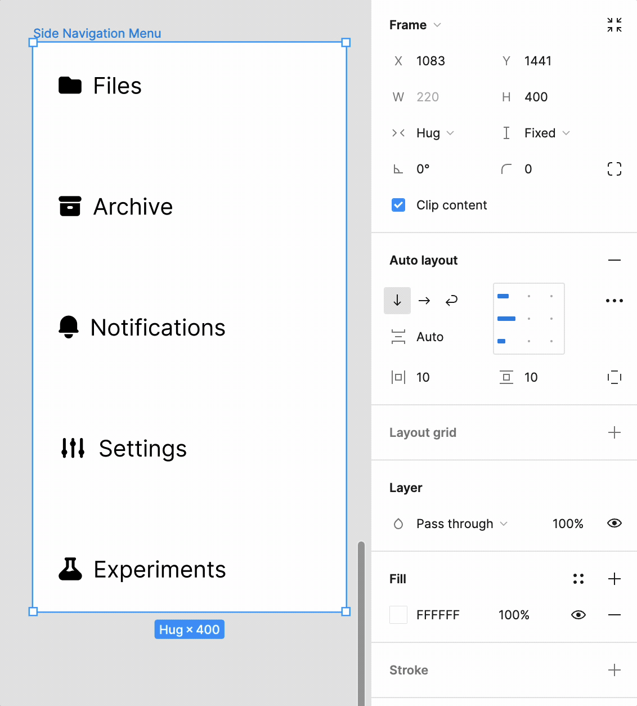
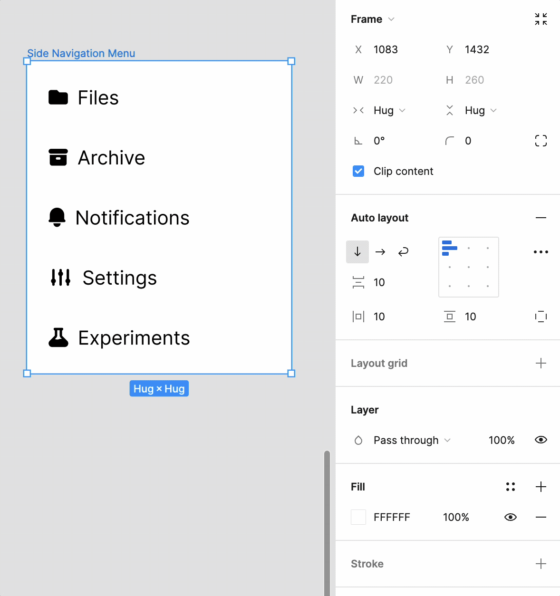

Manually adjusting everything is hard and we certainly don’t arrange our UIs by pixel in the browser. Imagine if everything you already know and love about [flexbox](https://developer.mozilla.org/en-US/docs/Web/CSS/CSS_flexible_box_layout/Basic_concepts_of_flexbox) was available to you?
Well, it is. It just goes by the name auto layout.

## Understanding Auto Layout

Auto layout adds a structure to your frames and components, allowing them to resize content automatically based on the properties you define. It's particularly useful for designing interfaces that need to be responsive or adapt to content variations, such as text changes or dynamic lists.

Looking at the screenshot above, you can see the following controls:

- The ability to set the direction of the elements in the auto-layout. You can think of this as similar to `flex-direction` in CSS.
- The gap between the times. This is similar to the `gap` property in CSS.
- The horizontal and vertical padding of each item. To no one's surprise, this is similar to `padding` in CSS, but applied to each of the items from one place. You can also set the individual padding by using the little square icon located at the bottom-right of the control pane.
- In the grid that it's the center, you can set the alignment and justification. This is similar to `justify-items` and `align-items` in CSS.

There are also some advanced settings hiding out in the little menu along the right-side of the control panel.

## Limitations

Auto layout does have some limitations:

- You can't add Layout Grids to a frame with auto layout applied.
- You can't apply Constraints to a frame using auto layout.
- You can't use Smart Selection on anything in a frame using auto layout.

## Setting Up Auto Layout

To apply auto layout, select a frame or group of objects and click the "Auto Layout" button in the right-side panel. From here, you can define properties such as spacing, alignment, and direction (horizontal or vertical), which determine how the elements within the frame will behave.

The really cool thing about using auto layout is that you no longer need to resize your frames in order to accommodate new items.

This works because in this case, sizing is controlled by the `Hug` value in the frame size. This instructs the frame to adapt to the size of its children.

You can control this by using the caret next to the value.

## Minding the Gap

When you're basing the size of the frame based on it's children, then you can provide a value that represents how many pixels you want in between each child. Alternatively, if you want to use a fixed size, then you can set the `gap` to auto. This will spread the children out evenly across the entire height or width of the parent frame. You can think of this like using `justify-items: space-between` in flexbox when using CSS.

Now, the you can resize the frame and the elements will distribute themselves evenly.

## Adjusting the Padding

Trying to grab the corners of the frame to resize it will switch the horizontal and/or vertical resizing from **Hug** to **Fixed**. However, if you want to click to change the padding, you can do that as well, you just need to be a _little bit_ more precise as to where you click to drag.

## Responsive Design

With auto layout, creating responsive designs becomes a lot more straightforward. By defining constraints and using auto layout strategically, you can ensure that your design adapts elegantly across different devices, from desktops to mobile phones.

auto layout provides flexibility, enabling elements to shrink, grow, or stay fixed based on their content. Whether you're dealing with buttons that need to adjust to text length or lists that vary in content size, auto layout ensures your design remains cohesive.

## Accounting for Strokes

When determining the size of objects for auto layout, strokes are not considered, so they do not impact the parent frame or other nearby elements.

This might not be the best approach for developer handoff since it doesn't show how CSS displays borders accurately.

To address this, you can decide if strokes should occupy space within an auto layout frame. Simply access the advanced layout settings and use the dropdown menu next to **stroke** to choose between **included in layout** or **excluded from layout**.

## Nesting with Auto Layout

For more complex designs, auto layout can be nested within other auto layout frames, allowing for intricate layouts with multiple levels of content that all respond dynamically. This nesting capability is crucial for creating scalable designs that require minimal adjustments as they evolve.
