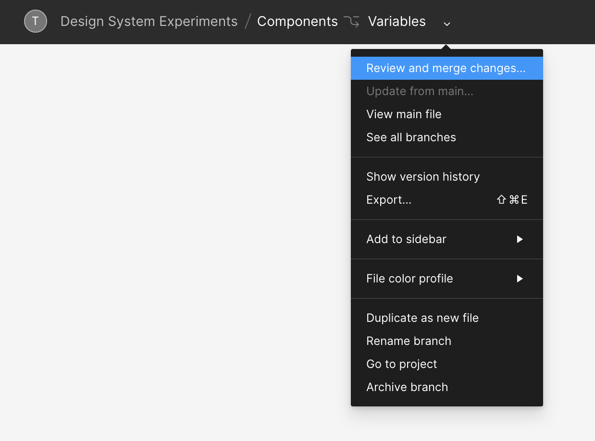
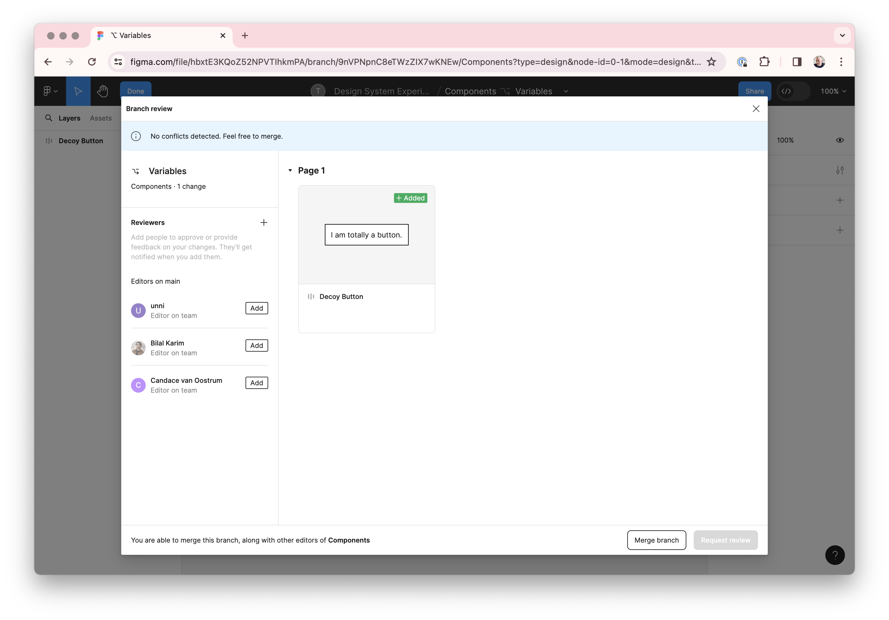

We're not going to go _too_ in-depth into branching in Figma, for two salient reasons:

- It's not available on draft designs—only designs that are part of a Team project.
- It's not available on the free plan.

If these terms immediately sound familiar to you and your mind has wandered in the general direction of Git, then you're alright on the right track. Branching and merging in Figma allows designers to create branches off the main file, work independently on their designs, and later merge their changes back, ensuring a smooth, conflict-free collaboration.

Branching in Figma allows team members to create parallel versions of a design file. Each branch acts as an independent workspace where designers can experiment, make changes, or add new features without affecting the main project. This approach is particularly useful for exploring design variations, testing new ideas, or working on different aspects of a project simultaneously.

## How to Create a Branch

To create a branch in Figma, you navigate to the file you wish to branch from and select the option to create a new branch.

## Working Within Branches

While working within a branch, you have the freedom to make any changes or additions without impacting the main file. This autonomy encourages creativity and experimentation, knowing that the main project remains untouched and stable.

## The Merging Process

Once the work on a branch is complete, the next step is to merge these changes back into the main file. Merging compares the branch with the main file, identifying any conflicts that might have come up. Figma provides tools to resolve these conflicts, ensuring that the final merge is smooth and that all changes are integrated seamlessly.

## Benefits of Branching and Merging

1. **Enhanced Collaboration:** Multiple designers can work on the same file simultaneously without interfering with each other's work, making collaboration more fluid and dynamic.
2. **Risk Mitigation:** By allowing experimentation in separate branches, the main file remains safe from potentially disruptive changes, reducing the risk to project stability.
3. **Conflict Resolution:** Figma’s merging tools facilitate easy resolution of conflicts, ensuring that the final design incorporates the best ideas from all team members.

## Best Practices for Using Branching and Merging

- **Communicate with Your Team:** Regular communication is crucial when working with branches. Ensure everyone knows which branches are being worked on and what changes are expected.
- **Regularly Merge Changes:** To minimize conflicts, frequently merge changes from the main file into your branch and vice versa. This practice keeps branches up-to-date and simplifies the final merge process.
- **Use Descriptive Names for Branches:** Naming branches according to their purpose or the feature being worked on makes it easier for teams to navigate and understand each other’s work.
