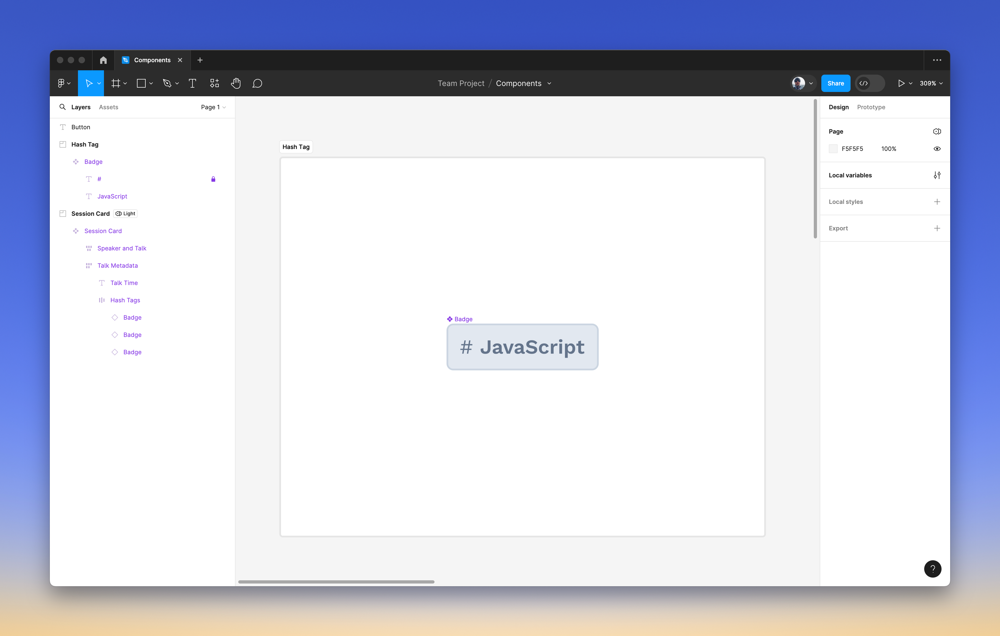
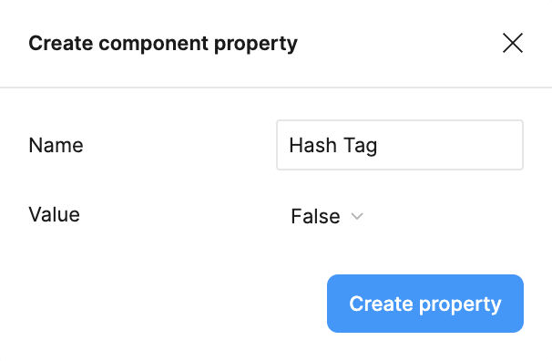
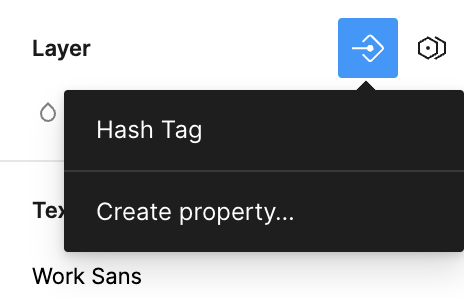
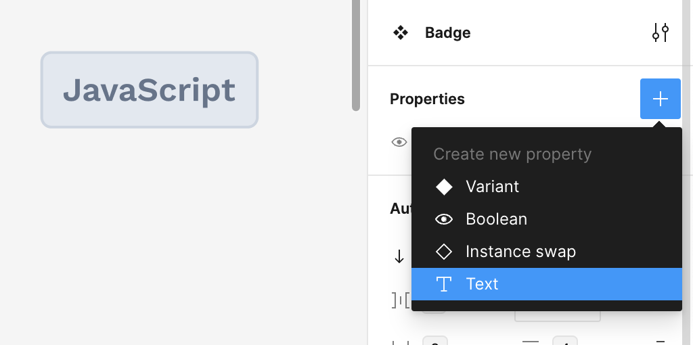
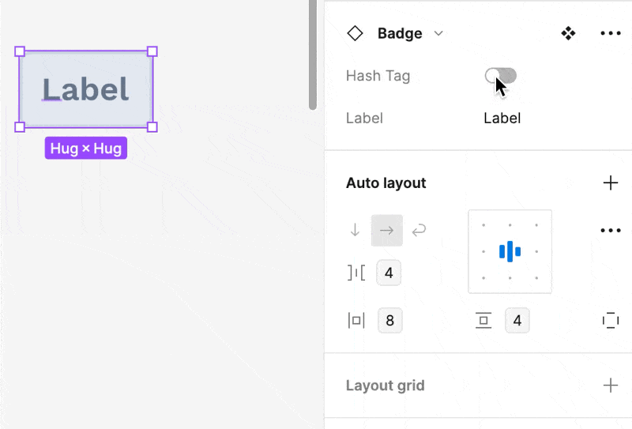

In Figma, there are four types of component properties:

- [Variants](variants.md)
- [Boolean](#boolean-properties)
- [Instance Swap](#simplifying-component-instances)
- [Text](#text-properties)

> [!note] Component Properties vs. Variables
> It's easy to get confused between component properties and variables. For me, it's helpful to think about component properties as the prop that you might pass into a component and use locally verses some globally stored variable.

## Boolean Properties

Boolean properties to set `true` and `false` values. This allows us to toggle an attribute on or off. Let's say we had a badge component and we wanted to add the ability to add a hash tag to the badge—and we wanted it to be something that we could toggle on and off.

We can start by creating a boolean component property from the **Properties** on the left panel.

And from there, we can give it a default value of—you guessed it—either `true` or `false` along with a convenient name for the property.

Then we can navigate to the layer that want trigger with this property and link it it's visibility to the component property.

Now, when we use an instance of that component, we'll see that we have the ability to toggle the component property on and off.

## Text Properties

We can also create component properties that have a text value. There are two main reasons why you might consider using this:

1. You want to easily change the text in a given component without needing to dive into the components layers.
2. You want to use the same piece of text in multiple places.

The first reason is probably the most common, but the second reason might become handy if you're looking to get a little fancy with the given variants of your component and want to use the same label in more than one place.

We can then set the value of any text field to this property in the **Text** panel.

Now, you can easily change the value of the text property just by clicking the instance of the component.

## Instance Swap

The **instance swap** property allows you to swap out a given component with another one. When you define this property, you set select a default instance value. You can also define some preferences for the other components that you're interested in swapping between.

These **preferred values** allow you to create define a set of components that you want to swpa between. If this sounds kind of like [variants](variants.md), you're not wrong. I typically use a combination of the two approaches when I am creating a components for a design.

> [!tip] Variants vs. Instance Swap
> Your mileage may vary and you're welcome to disagree with me, but I will typically make [variants](variants.md) for all of the different states of a button (e.g. hover, active, disabled. etc.). But, I'll make different components for each type of button (e.g. primary, secondary, ghost, etc.). This allows me to swap between the states with [variants](variants.md) when [prototyping](prototyping.md) and but easily [instance swap](#instance-swap) between the types when designing. Shoving _everything_ into variants tends to make organization a mess.

- [ ] Add some screenshots showing how to implement an instance swap property in Figma.
## Simplifying Component Instances

If you want to hide away most of the complexities of a component away from anyone using it, then you can go to the main component and select "Simplify all instances". This will reduce the number of knobs that someone gets to (or, has to) fiddle and allows you to keep things *simple*.

> [!NOTE] Simplifying an instance will hide layers, but **anyone with the ability to edit** the design file will still be able to edit those layers.

Next let's talk about [Variants](variants.md).
