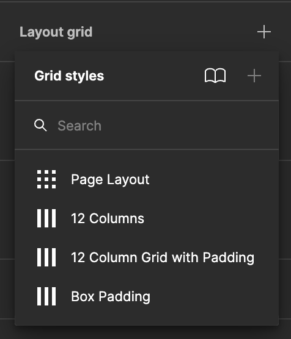
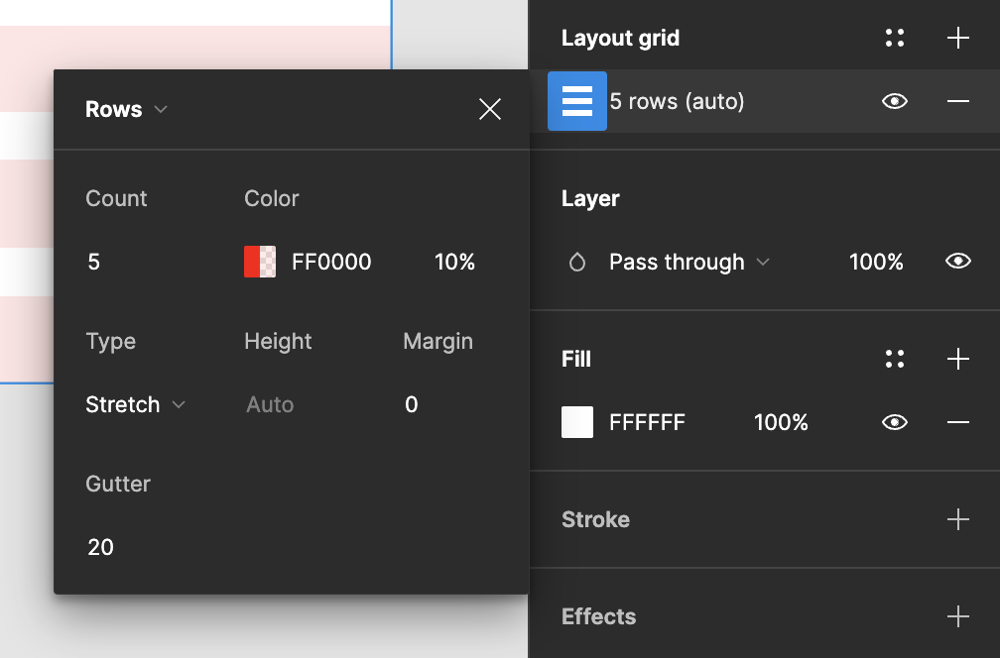

Layout grids allow you to apply a fixed grid or a set of columns or rows to a frame. You can use these grids to align elements to a grid system. They pair nicely with constraints to assist you in putting together responsive layouts, which have been all the range since a little pocket-sized computer out back in 2007.

> [!NOTE] Layout grids can only be applied to frames.

You can apply a layout grid to any frame. You can even apply multiple grids to a single frame. You can also tweak how the grid looks (e.g. the color and opacity).

Figma comes with some built-in grids.

## Columns

Column grids are perfect for web pages and mobile interfaces, where vertical alignment is super important. In Figma, you can customize the number of columns, the gutter width between columns, and the margin on the sides of the canvas.

## Rows

Row grids are used less frequently but are invaluable for designs that require horizontal alignment, such as timelines or charts. Similar to column grids, you can adjust the number of rows, the gutter height, and margins to fit your design specifications.

## Grids

The grid option combines columns and rows, offering a versatile structure for aligning elements both horizontally and vertically. It's particularly useful for complex projects needing a more detailed organizational framework, like dashboards or intricate layouts.

> [!tip] You can apply more than one layout grid to a frame.
> For example, you could choose to use both rows and columns. This can be an interesting alternative to a grid when when you're working through some responsive design or developing for CSS grid.

## Using Layout Grids

To apply a layout grid, select a frame or object, and in the right-side panel under the 'Layout Grid' section, click the '+' button. Here, you can choose the type of grid and customize its properties to suit your design.

Figma also allows the overlay of multiple grid types on a single frame, providing a comprehensive guide for element placement. This layered approach can be particularly useful in responsive design, where you need to consider how elements will adjust across different screen sizes.

## Adjusting and Toggling Grids

Once a grid is applied, you can adjust its settings at any time to reflect changes in your design requirements. Pro-tip: Toggling grids on and off is simple — use the shortcut `Ctrl/Cmd + G` or click the eye icon next to the grid name in the right-side panel. This feature is handy for quickly checking your design’s alignment with or without the grid's visual guides.
