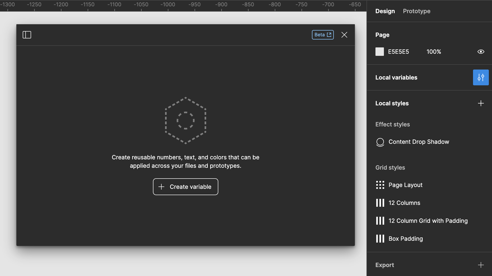

Variables in Figma act as placeholders that store specific values. These values can be anything from color codes, font sizes, spacing measurements, to text strings. Once defined, these variables can be applied to properties of different design elements within your Figma files.

> [!NOTE] Release Status
> As of the time of this writing, Variables are still in beta.

## Setting Up Variables

Creating variables in Figma is straightforward. You define a variable and assign it a value, such as a HEX code for a color or a numerical value for spacing. These variables are then available to be applied to any relevant property in your design, such as fill color or padding.

Your variables must be one of the following types of values:

- Colors
- Numbers
- Strings
- Boolean

You can create a variable and see a table of all of your local variables can be seen by clicking on the Canvas and the selecting **Local Variables** from the **Design** panel.

## Some Practical Applications of Variables

- **Brand Colors:** Define your brand colors as variables, making it easy to update your entire design system if your brand colors change.
- **Typography:** Set font sizes, line heights, and font families as variables to ensure text elements across your project are consistent.
- **Spacing and Layout:** Use variables for spacing values, like margins and paddings, to keep your layouts consistent and easily adjustable.

## Best Practices for Using Variables

- **Name Variables Clearly:** Use clear, descriptive names for your variables to ensure they are easily identifiable and understandable by anyone working on the project.
- **Organize Variables:** Group related variables together, such as colors, typography, and spacing, to keep your variables organized and accessible.
- **Use Variables Judiciously:** While variables are powerful, using too many can make your designs complicated. Employ variables for values that are reused often and are likely to change.
