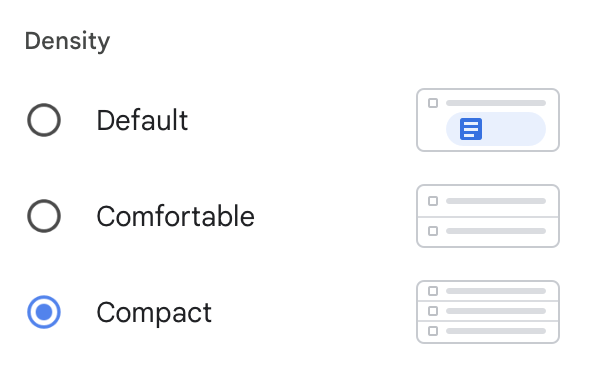

Variables in Figma act as placeholders that store specific values. These values can be anything from color codes, font sizes, spacing measurements, to text strings. Once defined, these variables can be applied to properties of different design elements within your Figma files.

> [!NOTE] Release Status
> As of the time of this writing, Variables are still in beta. Variables aren't available for everything—just yet. But the list of things that support variables is likely to increase over time.

- Variables are local to the file that you'e currently working in.
- You can have one or more collections of variables.
- You can organize your variables into groups.

## Setting Up Variables

Creating variables in Figma is straightforward. You define a variable and assign it a value, such as a HEX code for a color or a numerical value for spacing. These variables are then available to be applied to any relevant property in your design, such as fill color or padding.

Your variables must be one of the following types of values:

- Colors
- Numbers
- Strings
- Boolean

You can create a variable and see a table of all of your local variables can be seen by clicking on the Canvas and the selecting **Local Variables** from the **Design** panel.

## What Are the Difference between Styles and Variables?

In the past—e.g. before Variables were introduced—it has been common to use [styles](shared-styles.md) in order to share colors—and other properties—between elements. So, how are a variables and styles different and which should you use when?

Think of variables are one single unit or a primitive, while styles can be a composite of multiple colors or even images. A style can be made up of multiple variables.

The most salient bit, is that variables make it easier to do theming. Let's talk more about that below.

## Modes and Theming

The values of a given variable can be split into one or more modes. The most common use case for this light and dark modes, but these modes could be used for any number of different themes. You could also create a "comfortable" and "compact" mode as seen in Gmail.

## Boolean Variables

Boolean variables are useful when you want to show or hide something. Lets's start by making a boolean variable. We can then use the modes associated with this boolean variable based on what mode we're in.

## Variables, Modes, and Inheritance

Modes are inherited from their parent. Components that are set to `auto` will inherit from the mode that that parent layer is set to.

## Material to Add

- [ ] Create an example where you might demonstrate using both primitive and semantic variables in Figma. Show how aliasing might work.
- [ ] Create an example of refactoring a component to use Figma variables.
- [ ] Create an example where you might use Figma to create different spacing modes (e.g. comfortable, compact, and default).
