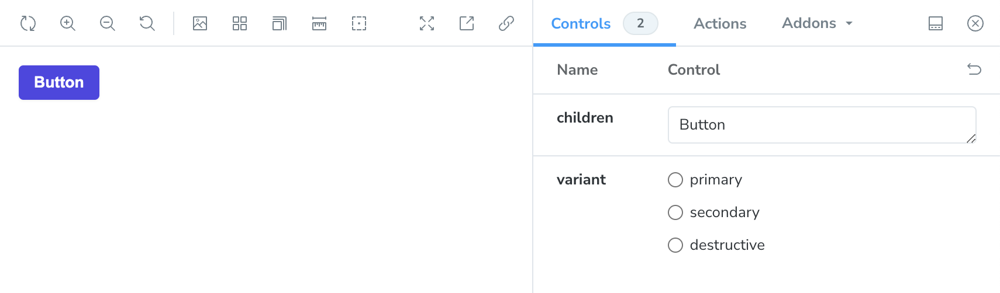

Let's get a little philosophical. There are a _lot_ of flavors of buttons in the world. For our purposes, we're going to call these **variants**. One of the most common variants that we see out in the wild is the idea of having primary and secondary buttons. Additional examples include destructive buttons and disabled buttons, et cetera.

## Using a Prop to Set the Variant

If we review a selection of existing design system implementations, we'll see that far and away the most common way to allow consumers of your component library to set a variant is to provide a prop. What exactly you choose to call that prop and what values you're willing to accept is up to you. As you'll see, `variant` is a fairly popular choice, but `appearance` and `kind` are also used.

- [Microsoft's Fluent design system](https://react.fluentui.dev/?path=/docs/components-button-button--default) uses an `appearance` prop that is one of the following variants: `primary`, `secondary`, `subtle`, `outline`, `transparent`.
- [Atlassian's design system](https://atlassian.design/components/button/examples#appearance) also uses an `appearance` prop that can be either `primary`, `subtle`, `link`, `subtle-link`, `warning`, or `danger`.
- [IBM's Carbon design system](https://react.carbondesignsystem.com/?path=/story/components-button--default) uses a `kind` property that can be set to `primary`, `secondary`, `danger`, `ghost`, `tertiary`, `danger--primary`, `danger--ghost`, or `danger--tertiary`.
- [GitHub's Primer design system](https://primer.style/components/button/react/alpha) uses a `variant` prop that can be either `default`, `primary`, `danger`, or `invisible`.
- [Twilio's Paste design system](https://paste.twilio.design/components/button) uses a `variant` prop as well with the following variants: `primary`, `primary_icon`, `secondary`, `secondary_icon`, `destructive`, `destructive_icon`, `destructive_link`, `destructive_secondary`, `link`, `inverse_link`, and `inverse`.
- [Shopify's Polaris design system](https://polaris.shopify.com/components/actions/button) uses a `variant` prop consisting of `plain`, `primary`, `secondary`, `tertiary`, and `monochromePlain`.
- [GitLab's Pajamas design system](https://design.gitlab.com/components/button/code) also uses a `variant` property that is one of the following: `default`, `confirm`, `info`, `success`, `danger`, `dashed`, `link`, or `reset`.
- [Adobe's Spectrum design system](https://react-spectrum.adobe.com/react-spectrum/Button.html) also uses a `variant` property that can be either `primary`, `secondary`, or `negative`. In their system, `negative` is similar to `destructive` or `danger` in some of the other systems. They _also_ have two styles: `fill` and `outline`, which are more like `primary` and `secondary` in the other systems.

The end result is something that looks like this:

```tsx
<Button variant="primary">Button</Button>
<Button kind="primary">Button</Button>
<Button appearance="primary">Button</Button>
```

## Using Boolean Props

[Mozilla's Acorn design system](https://firefoxux.github.io/firefox-desktop-components/?path=/story/ui-widgets-button--regular-button) uses a `primary` prop as well as a `disabled` prop, each of which is a boolean. This approach will look something like this:

```tsx
<Button primary>Button</Button>
<Button secondary>Button</Button>
```

This syntax is really nice, but you risk ending up with someone passing in a conflicting set of variants.

```tsx
<Button primary secondary>
	Button
</Button>
```

We _can_ protect against this behavior with both type-safety and run-time checks, but it's certainly more complicated. Given that the first approach is more popular, let's look at implementing that first.

## Implementing a Variant Prop

Let's use `variant` as our prop since that seems to be a tried-and-true approach and possibly the most common based on my very cursory research above. For starters, we'll have the following variants:

- `primary`
- `secondary`
- `destructive`Here's the corrected version of your blog post with typographical errors fixed.

We'll start with our super-simple button component from [the previous chapter](writing-stories.md).

```tsx
import { ComponentProps } from 'react';

type ButtonProps = ComponentProps<'button'>;

export const Button = (props: ButtonProps) => {
	return <button {...props} />;
};
```

First, we'll add our new prop and its accepted values to the `ButtonProps` type.

```tsx
type ButtonProps = ComponentProps<'button'> & {
	variant?: 'primary' | 'secondary' | 'destructive';
};
```

### Styling the Button

> [!NOTE] A Brief Word on Styling
> We're going to start by using vanilla CSS and CSS modules right now. Later on, we'll use [Tailwind](https://tailwindcss.com) in a effort to make our lives easier and focus on the specifics of Storybook rather than CSS. But, you're welcome to use whatever styling tools make you happiest. Storybook doesn't have a horse in this race.

Let's start by styling the button. We haven't implemented any of these variants yet, so we'll work on styling the primary button first and then go from there. In `button.module.css`, add the following:

```css
.button {
	background-color: hsla(237, 64%, 50%, 1);
	border-color: hsla(237, 64%, 50%, 1);
	color: white;
	border-radius: 0.5rem;
	cursor: pointer;
	display: inline-block;
	font-size: 1rem;
	padding: 0.5rem 0.75rem;
	text-align: center;
	text-decoration: none;
	outline-offset: 0.0625rem;
	outline-style: none;
	outline-width: 0.25rem;
	outline-color: hsla(237, 64%, 50%, 0.2);
	border: 0.125rem solid transparent;
}

.button:hover {
	background-color: hsla(237, 64%, 46%, 1);
}

.button:active {
	background-color: hsla(237, 64%, 42%, 1);
}

.button:focus,
.button:active {
	outline-style: solid;
}

.button:disabled {
	opacity: 0.5;
	cursor: not-allowed;
}
```

We'll add the style to our component and then bask in the fruits of our labor.

```tsx
import styles from './button.module.css';

export const Button = (props: ButtonProps) => {
	return <button className={styles.button} {...props} />;
};
```

Our button now looks a little prettier.



So far, we've made the follow changes to our code.

```diff
diff --git a/src/stories/button.tsx b/src/stories/button.tsx
index ae8eab4..a6632c5 100644
--- a/src/stories/button.tsx
+++ b/src/stories/button.tsx
@@ -1,7 +1,11 @@
 import { ComponentProps } from 'react';

-type ButtonProps = ComponentProps<'button'>;
+import styles from './button.module.css';
+
+type ButtonProps = ComponentProps<'button'> & {
+  variant?: 'primary' | 'secondary' | 'destructive';
+};

 export const Button = (props: ButtonProps) => {
-  return <button {…props} />;
+  return <button className={styles.button} {…props} />;
 };
```

### Styling Our Variants

Writing the styles for our variants is as simple as adding the CSS properties that we want to override from the base variant.

```css
.secondary {
	background-color: white;
	color: hsla(237, 64%, 50%, 1);
	border-color: hsla(237, 64%, 50%, 1);
}

.secondary:hover {
	background-color: hsla(237, 64%, 95%, 1);
}

.secondary:active {
	background-color: hsla(237, 64%, 90%, 1);
}

.destructive {
	background-color: hsla(0, 64%, 50%, 1);
	color: white;
	border-color: hsla(0, 64%, 50%, 1);
}

.destructive:hover {
	background-color: hsla(0, 64%, 46%, 1);
}

.destructive:active {
	background-color: hsla(0, 64%, 42%, 1);
}

.destructive:focus {
	outline-color: hsla(0, 64%, 50%, 0.2);
}
```

#### Adding the Classes to Our Component

Now that we've written our classes, we need to dynamically add them to our our component. One simple—but tedious—way to do this is to just append them to the `className` string. This might look something like this:

```tsx
export const Button = ({ variant = 'primary', ...props }: ButtonProps) => {
	let className = styles.button;
	if (variant === 'secondary') className += ` ${styles.secondary}`;
	if (variant === 'destructive') className += ` ${styles.destructive}`;

	return <button className={className} {...props} />;
};
```

#### Adding Stories for Our Variants

If we want to easily see each of these variants in Storybook, we'll need to add additional stories for each variant.

```tsx
export const Primary: Story = {
	args: {
		children: 'Button',
		variant: 'primary',
	},
};

export const Secondary: Story = {
	args: {
		children: 'Button',
		variant: 'secondary',
	},
};

export const Destructive: Story = {
	args: {
		children: 'Button',
		variant: 'destructive',
	},
};
```

We'll now see each variant in our Storybook as well as an additional control for swapping between the variants.

![[button-variants-in-storybook.png]]

### Using `clsx` to Compose Class Names

> [!NOTE] Installing `clsx`
> You made need to install `clsx` as a dependency using `npm install clsx`.

In our super simple example, appending to the string to compose the list of classes we want to apply to our button worked, but it's going to get tedious as as the complexity of our button grows. We can use [`clsx`](https://www.npmjs.com/package/clsx), a handy utility for dynamically applying classes, to make our future lives a bit easier.

```tsx
import { ComponentProps } from 'react';
import clsx from 'clsx';

import styles from './button.module.css';

type ButtonProps = ComponentProps<'button'> & {
	variant?: 'primary' | 'secondary' | 'destructive';
};

export const Button = ({ variant = 'primary', ...props }: ButtonProps) => {
	return (
		<button
			className={clsx(styles.button, {
				[styles.secondary]: variant === 'secondary',
				[styles.destructive]: variant === 'destructive',
			})}
			{...props}
		/>
	);
};
```

## An Optional Extension

We can also pull our the styles the are specific to the `primary` variant and add that as an option as well.

```css
.button {
	border-radius: 8px;
	border-width: 2px;
	border-style: solid;
	outline-offset: 1px;
	outline-width: 4px;
	padding: 8px 12px;
	text-align: center;
	text-decoration: none;
	display: inline-block;
	font-size: 16px;
	cursor: pointer;
}

.button:focus {
	outline-style: solid;
}

.button:disabled {
	opacity: 0.5;
	cursor: not-allowed;
}

.primary {
	background-color: #444ce7;
	border-color: #444ce7;
	color: #f8fafc;
	outline-color: #444ce780;
}

.primary:hover {
	background-color: #363bcc;
	border-color: #363bcc;
}
```

We can even use the `variant` prop as a key to index the `styles` object.

```tsx
export const Button = ({ variant = 'primary', ...props }: ButtonProps) => {
	return <button className={clsx(styles.button, styles[variant])} {...props} />;
};
```

Here is a quick `diff` of those changes:

```diff
diff --git a/src/stories/button.tsx b/src/stories/button.tsx
index f2fa94b..f025c74 100644
--- a/src/stories/button.tsx
+++ b/src/stories/button.tsx
@@ -8,13 +8,5 @@ type ButtonProps = ComponentProps<'button'> & {
 };
 
 export const Button = ({ variant = 'primary', …props }: ButtonProps) => {
-  return (
-    <button
-      className={clsx(styles.button, {
-        [styles.secondary]: variant === 'secondary',
-        [styles.destructive]: variant === 'destructive',
-      })}
-      {…props}
-    />
-  );
+  return <button className={clsx(styles.button, styles[variant])} {…props} />;
 };
```
