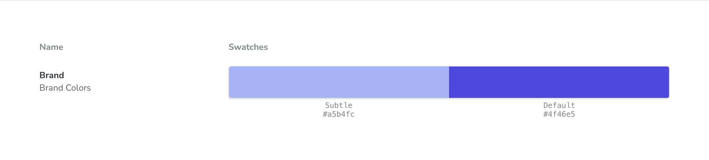
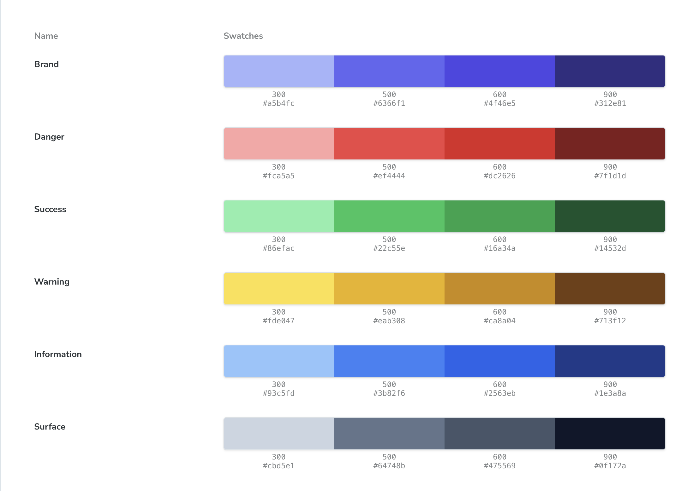

Storybook provides a Docs Block for rendering your design system's color palette. For example, you can create a `.mdx` file that looks like this.

```jsx
import { Meta, ColorPalette, ColorItem } from '@storybook/blocks';

<Meta title="Colors" />

<ColorPalette>
	<ColorItem
		title="Brand"
		subtitle="Brand Colors"
		colors={{
			Subtle: '#a5b4fc',
			Default: '#4f46e5',
		}}
	/>
</ColorPalette>
```

Storybook will render this simple color palette.



What's even better is that you can programmatically render the color palette since you have the full power of JSX at your disposal. This allows you to easily generate a color palette based on your theme.

```jsx
import { Meta, ColorPalette, ColorItem } from '@storybook/blocks';
import colors from './colors';


<Meta title="Colors" />

<ColorPalette>
  {Object.entries(colors).map(([name, value]) => (
    <ColorItem key={name} title={name} colors={value} />
  ))}
</ColorPalette>
```

Obviously, this will be a little different depending on the taxonomy of your theme, but you can expect something along the lines of this.

