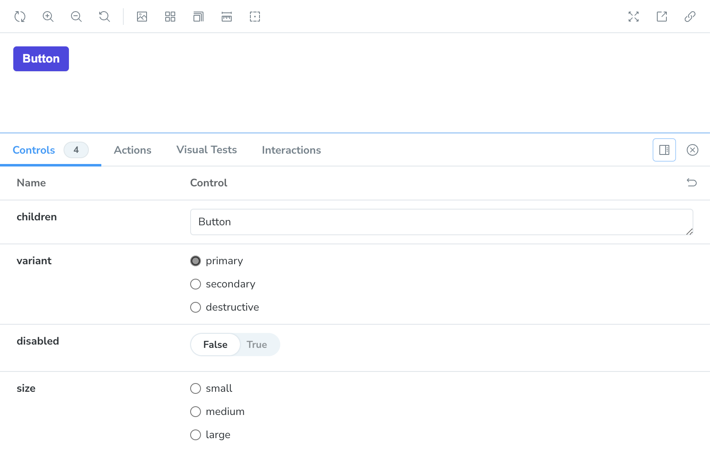

Now, this is interesting. If you look closely, you'll see that we don't have anything selected in terms of the `variant` for each of these button sizes. This makes sense since we didn't add it as an argument and if you peek back over at our component code, you'll see that when in doubt, we default to a primary button unless told otherwise—similarly, we default to a medium-size button if no `size` prop is passed in.



We can set some default arguments that Storybook will fall back to unless we override them in our stories.

```tsx
const meta: Meta<typeof Button> = {
	title: 'Button',
	component: Button,
	args: {
		children: 'Button',
		variant: 'primary',
		size: 'medium',
		disabled: false,
	},
	argTypes: {
		disabled: { control: 'boolean' },
	},
};
```

You'll now see that the correct radio buttons are selected and even our `disabled` boolean is now correctly set. And now, we can remove a lot of our boiler plate and spreading of arguments and get something a bit cleaner.

```ts
export const Primary: Story = {};

export const Secondary: Story = {
	args: {
		variant: 'secondary',
	},
};

export const Destructive: Story = {
	args: {
		variant: 'destructive',
	},
};

export const ExtraSmall: Story = {
	args: {
		size: 'extra-small',
	},
};

export const Small: Story = {
	args: {
		size: 'small',
	},
};

export const Medium: Story = {
	args: {
		size: 'medium',
	},
};

export const Large: Story = {
	args: {
		size: 'large',
	},
};
```

You can argue that we can/should probably get rid of a dedicated story for each size and I probably wouldn't make a counter argument.
