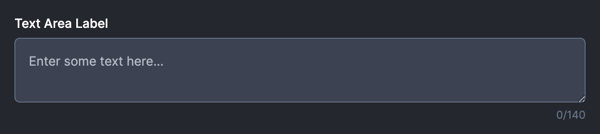

Consider this text area for a moment.

If a `maxLength` attribute is passed in, then we display a character count at the bottom. In fact it has an extra feature: we'll add styling to the text area in the event that the user blows past the character count.

What we'd like to do is verify this state. I suppose that we could cheat and have stories that put it in each state, but this has the drawback of needing to make sure look at the story every time we modify the component.

Instead, we can use a **Play** function to simulate a user interaction.

