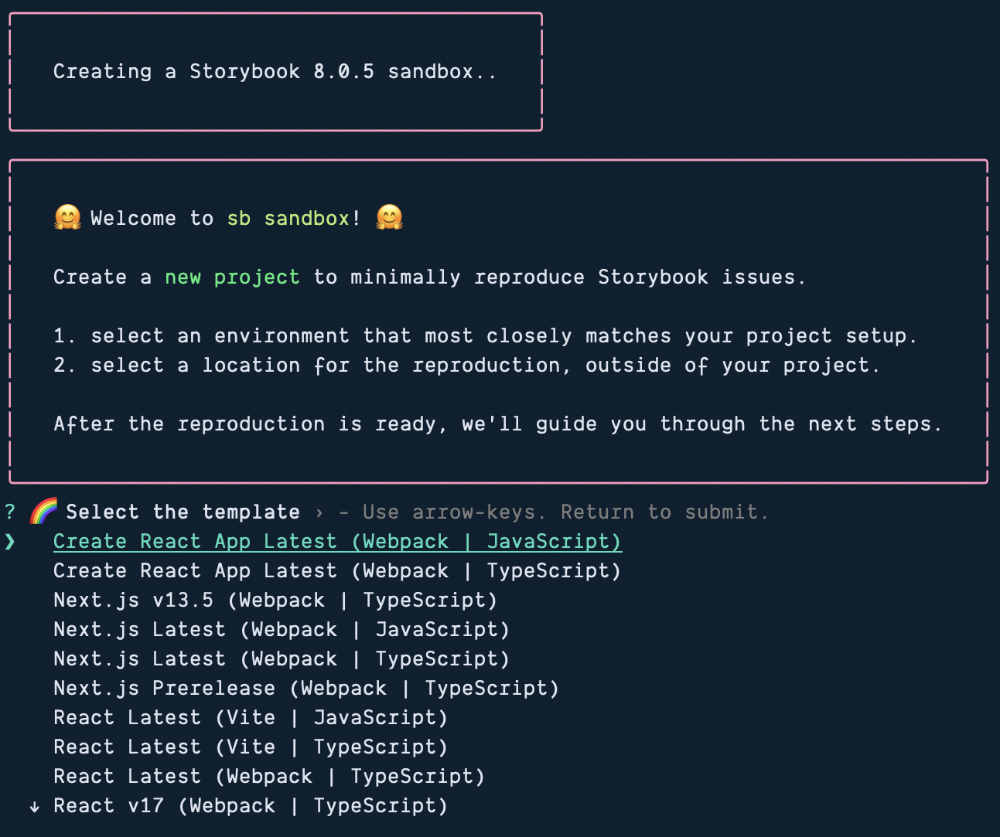

Storybook allows you to set up pre-configured sandboxes. This is useful if you just want to test something out or—hypothetically—if you're teaching a workshop and want to spin up a quick example.

```ts
npx storybook@latest sandbox
```


