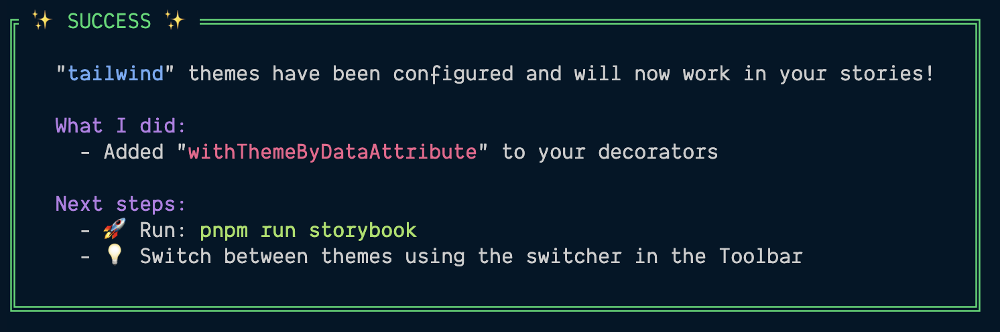

> [!NOTE] This is not necessarily Tailwind-specific
> Almost everything in this section can be applied to any stylesheets that you happen to be using in your application, but since we're going to be using Tailwind in our design system, this has a mild-Tailwind flavor to it, but the content itself applies more broadly.
>
> There are plenty of reasons why you might consider using Tailwind and equally as many as to why it might not be the best fit. I did my best to outline my thinking [here](/writing/tailwind-and-design-systems).

Integration with [Tailwind](https://tailwindcss.com)—or, honestly—any other styles that you have set up is fairly easy with Storybook.

If you need to install Tailwind, you can run the following:

```bash
npm install -D tailwindcss postcss autoprefixer
npx tailwind init --ts -p
```

In `.storybook/preview.ts`, simply import any stylesheet that you want to include in your stories. These will _only_ be applied to the canvas and _not_ to the entire Storybook UI.

```ts
import '../src/index.css';
```

## Supporting Dark Mode

Tailwind comes with support out of the box for [Dark Mode](https://tailwindcss.com/docs/dark-mode). Tailwind defaults to using the browser's preferences (using the [`prefers-color-scheme` media query](https://developer.mozilla.org/en-US/docs/Web/CSS/@media/prefers-color-scheme)) to determine if it should render content in dark mode, but it also allows you to determine if you'd prefer to trigger dark mode using a CSS selector.

We're going to want to toggle between light and dark mode without needing to adjust our browser settings. So, let's set that up.

```ts
import type { Config } from 'tailwindcss';

export default {
	content: ['./src/**/*.{js,jsx,ts,tsx}'],
	darkMode: ['class', '[data-mode="dark"]'],
	theme: {
		extend: {},
	},
	plugins: [],
} satisfies Config;
```

## Using the Storybook Themes Addon

Storybook's CLI has a helper to both install addons as a dependency as well as add the addon to `.storybook/main.ts`.

```bash
npx storybook@latest add @storybook/addon-themes
```

You will be asked the following question:

```ts
? How do you toggle themes? › - Use arrow-keys. Return to submit.
❯   CSS class
    Data attribute
```

Either answer is fine depending on your settings. I don't have a strong opinion outside from the experience of migrating an existing code base and finding out the hard way that `dark` was already being used for other purposes, so I'm going to go with the data attribute.

If all goes well, you should see something like this:



In addition to installing the dependency, this will make the following changes to your Storybook configuration.

- It will add [`@storybook/addon-themes`](https://storybook.js.org/addons/@storybook/addon-themes/) to your list of `addons` in `.storybook/main.ts`.
- It will configure a [decorator](decorators.md) in `.storybook/main.ts`.

```diff
diff --git a/.storybook/main.ts b/.storybook/main.ts
index 69ac007..5ac752a 100644
--- a/.storybook/main.ts
+++ b/.storybook/main.ts
@@ -8,6 +8,7 @@ const config: StorybookConfig = {
     "@storybook/addon-essentials",
     "@chromatic-com/storybook",
     "@storybook/addon-interactions",
+    "@storybook/addon-themes"
   ],
   framework: {
     name: "@storybook/react-vite",
diff --git a/.storybook/preview.ts b/.storybook/preview.ts
index 6725718..d8d6e03 100644
--- a/.storybook/preview.ts
+++ b/.storybook/preview.ts
@@ -2,6 +2,8 @@ import type { Preview } from '@storybook/react';

 import '../src/index.css';

+import { withThemeByDataAttribute } from "@storybook/addon-themes";
+
 const preview: Preview = {
   parameters: {
     controls: {
@@ -11,6 +13,16 @@ const preview: Preview = {
       },
     },
   },
+
+  decorators: [withThemeByDataAttribute({
+      themes: {
+          // nameOfTheme: 'dataAttributeForTheme',
+          light: '',
+          dark: 'dark',
+      },
+      defaultTheme: 'light',
+      dataAttribute: 'data-theme',
+  })]
 };

 export default preview;
```
