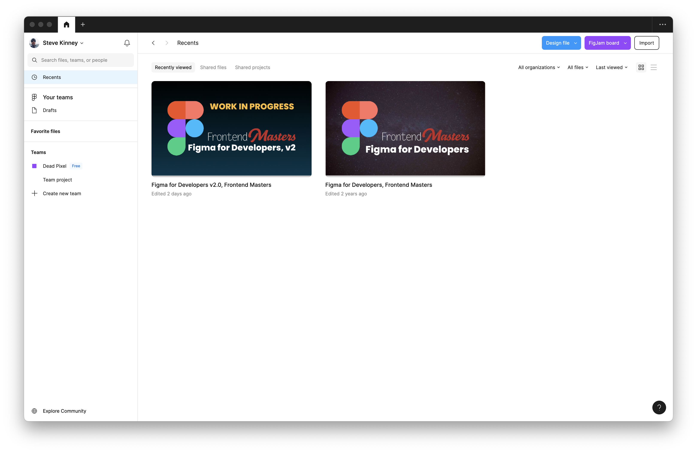
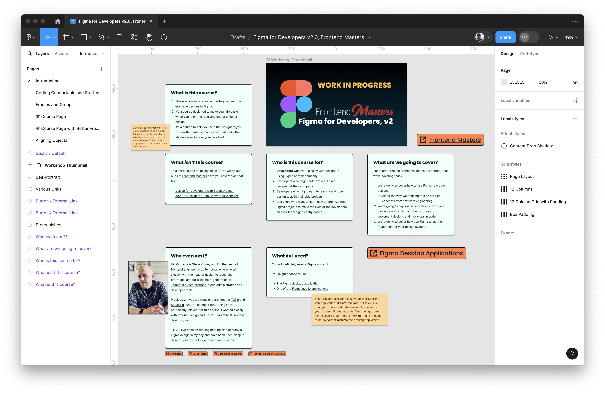
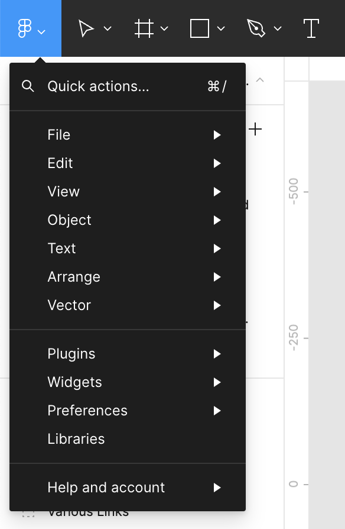
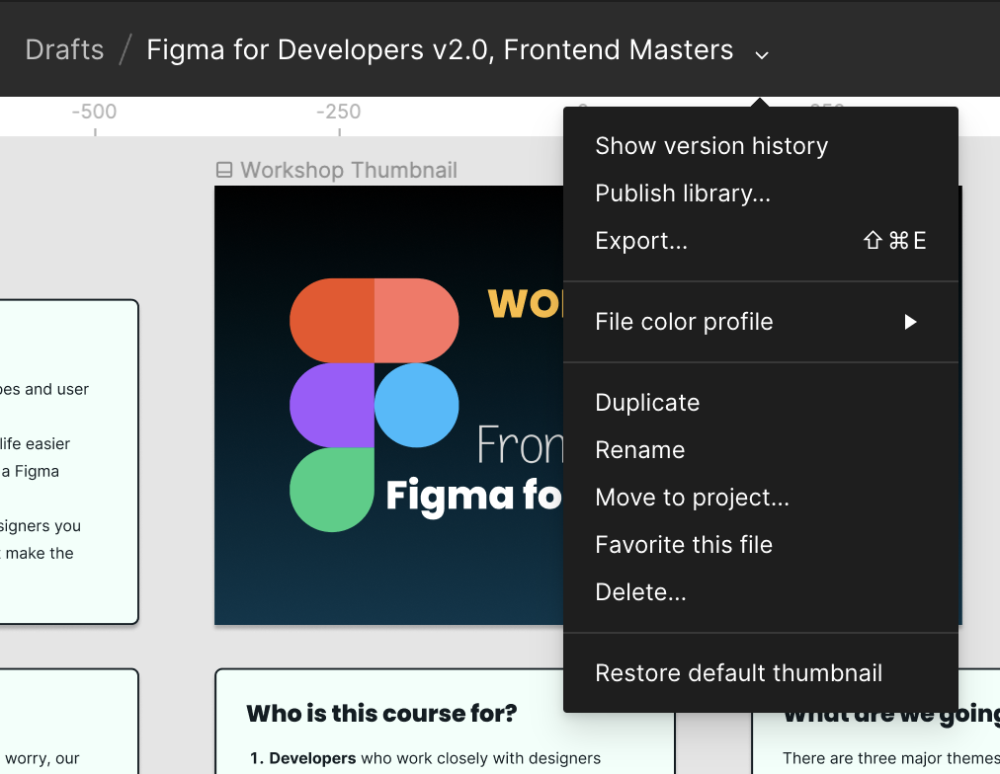
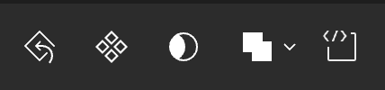
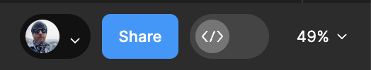
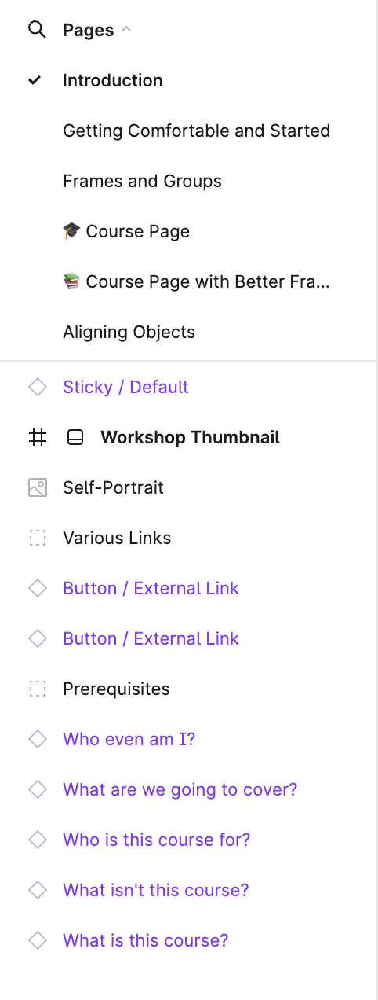
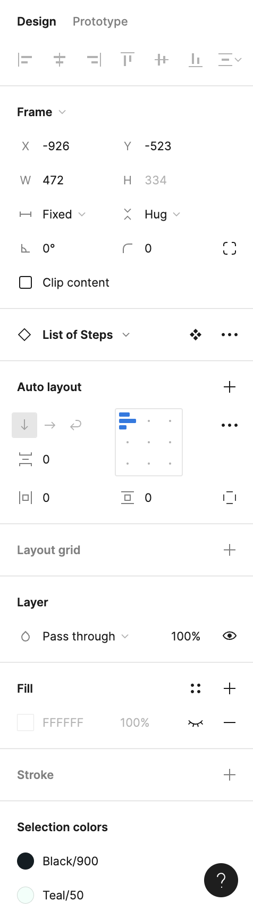
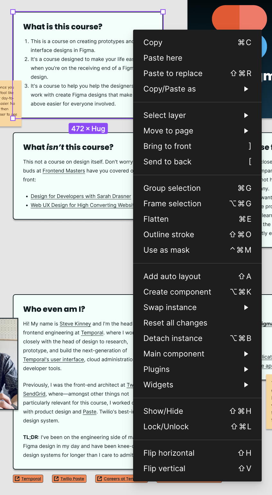

When you first enter Figma, you're greeted with the option to either create a new project or select a recent one.

Upon entering a project, you're presented with an interface similar to the screenshot below.

## The Toolbar

The toolbar, located along the top, is where you find essential tools for drawing shapes, creating layers, adding comments, and more. A small caret next to some of the icons reveals a sub-menu with additional tools.

- **Move Tool (V):** The default tool for selecting and moving objects.
- **Frame Tool (F):** Creates frames, which are containers for other objects, useful for entire screens or components.
- **Shape Tools:** Includes Rectangle (R), Line (L), Ellipse (O), Polygon (P), and Pen (P) tools for drawing basic shapes and custom paths.
- **Text Tool (T):** Adds and edits text elements.
- **Hand Tool (H):** Pans around the canvas, can be temporarily activated with the Spacebar.
- **Zoom Tool (Z):** Zooms in and out of the canvas, also zoomable via keyboard shortcuts or trackpad gestures.
- **Comment Tool (C):** Facilitates collaboration by enabling comments on the design.

### The Figma Menu

At the toolbar's leftmost end is the **Figma menu**. In the [desktop application](https://www.figma.com/downloads), this menu combines application menu bar items with additional preferences.

The **Quick Actions…** menu item opens a command palette (using `Command/Control-/`) that lets you quickly search for and execute commands.

### File Options

The center of the toolbar displays the current file name, surrounded by various file-related options. Figma tracks revisions, allowing access to version history.

### Layer Options

Selecting a layer changes the toolbar center to display a set of layer-specific tools.

These options allow you to reset changes, create components, use masks, combine selections, and mark designs as ready for development.

## Account, Sharing, and Dev Mode

The right end of the toolbar shows account information, sharing options, and a switch for [Dev Mode](./dev-mode.md).

## Left Side Panel: Layers and Assets

This panel has two sections:

- **Layers Panel:** Displays the design's hierarchical structure, crucial for organizing elements.
- **Assets Panel:** Houses reusable components and styles for efficient and consistent design.

### Pages and Layers

The interface's left side lets you navigate between pages and view layers for the selected page.

### Assets

The Assets Panel is a repository for managing reusable components and styles, supporting team collaboration through shared libraries. This feature streamlines the design process and ensures design consistency.

## Right Side Panel: Design and Prototype

This panel features two tabs:

- **Design Tab:** Contains properties for the appearance of selected objects.
- **Prototype Tab:** Offers tools for creating interactive prototypes by defining user flows and interactions.

### Design

The right side provides options for adjusting the properties of selected layers.

### Prototype

The Prototype Tab enables the creation of detailed, interactive prototypes, enhancing the design process and facilitating user testing by simulating real user flows.

## Context Menu

Right-clicking a layer opens a context menu for layer-specific actions.

This tour of Figma's UI highlights the comprehensive tools available for digital design, from basic drawing to advanced prototyping, ensuring an efficient and collaborative design process.