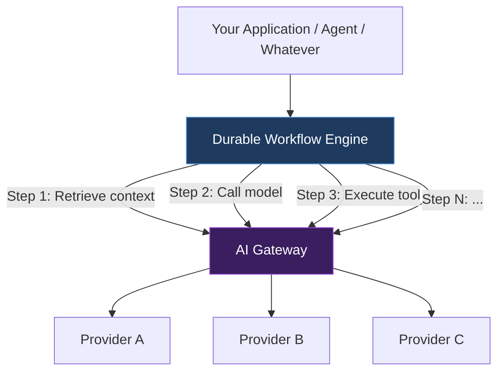
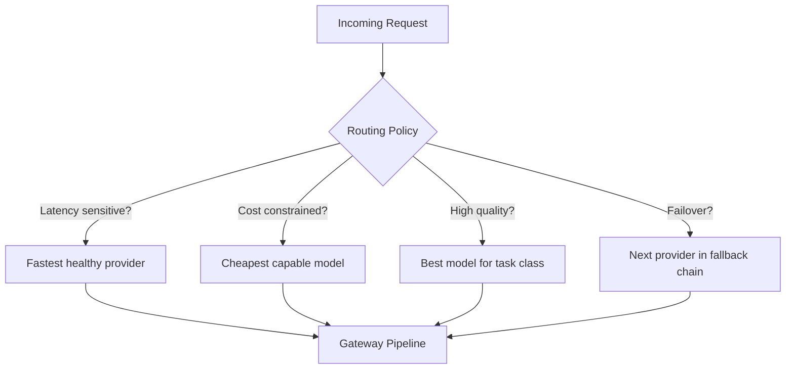
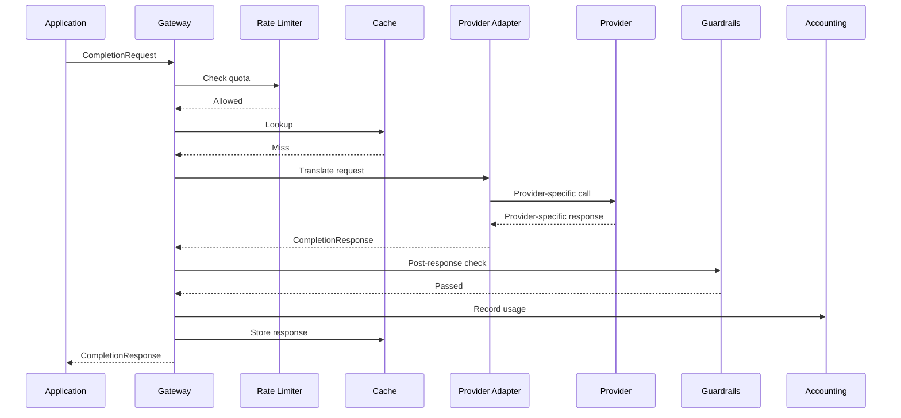
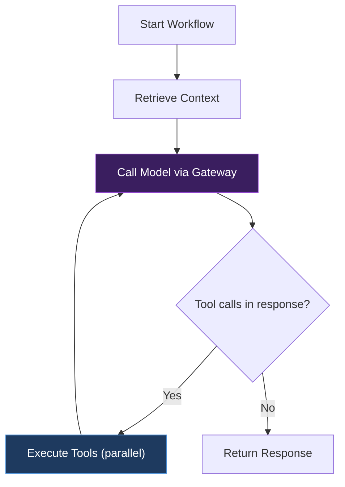
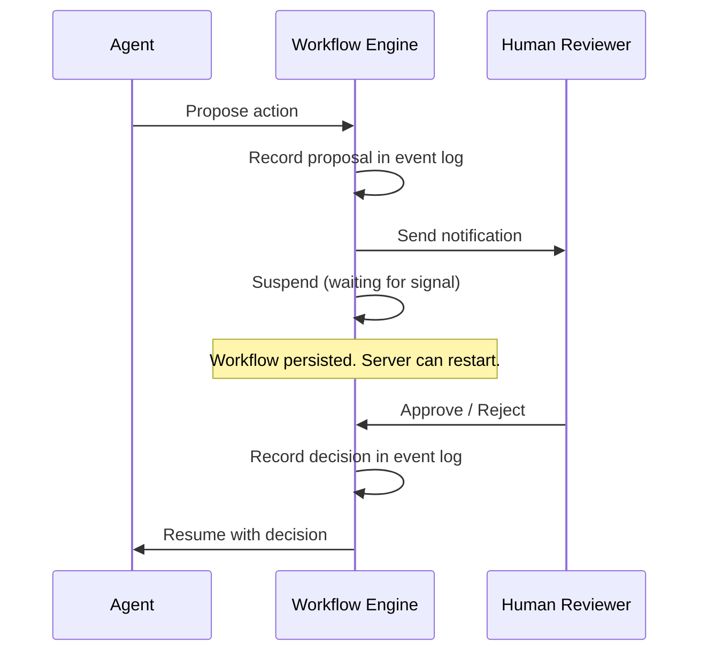
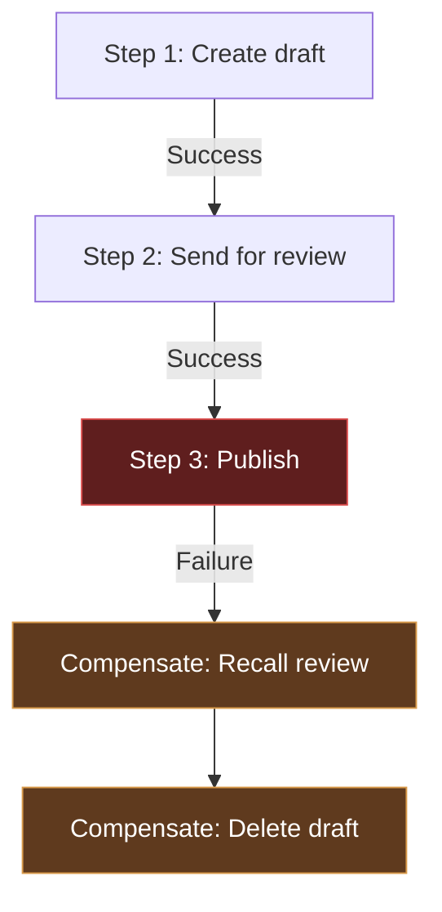
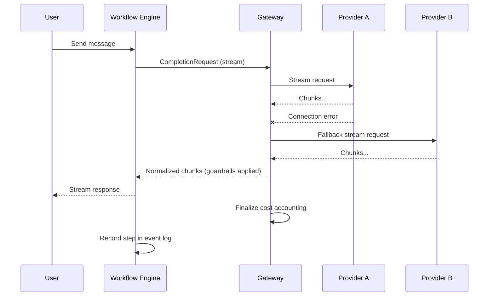
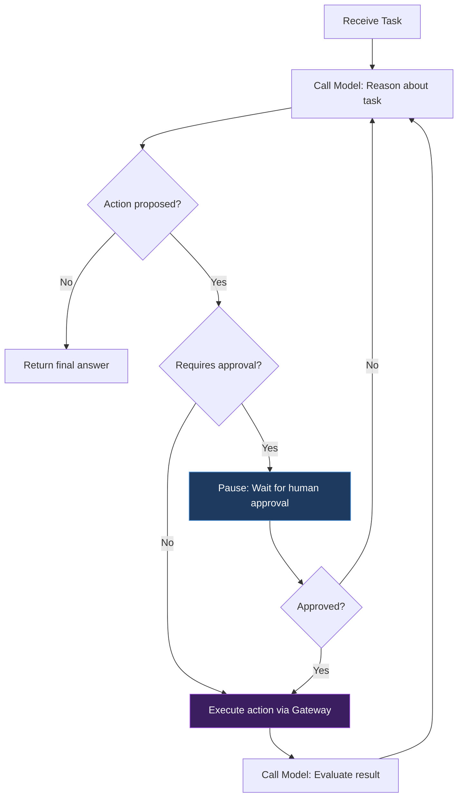
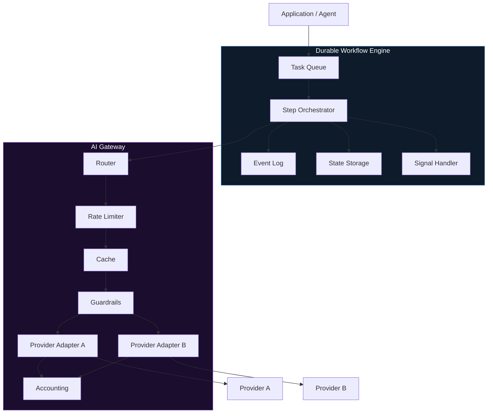

Most production AI integrations start the _same-ish_ way. Someone writes a function that calls a model, wraps it in a `try`/`catch`, and ships it. It works _fine_ until it doesn't—the provider has an outage, you blow through a rate limit at 2am (also known as the _only_ time incidents like this happen), a multi-step agent loses its state halfway through a tool chain, or someone asks why the monthly bill tripled. The function that calls the model was never the hard part. The hard part is everything _around_ calling the model: routing, fallbacks, cost control, retries, state management, human approval gates, and the ability to pick up exactly where you left off when something goes sideways.

That's two problems, really, and they decompose into two layers: a **gateway** and a **durable workflow engine**.

> [!NOTE] I am well aware that there are projects that do this.
> I know things like [Temporal](https://temporal.io) exist. But, what I wanted to do in this post is talk about little about how something like this might work under the hood. Having worked at Temporal, my thinking is somewhat anchored in how Temporal works, but I tried to be as agnostic as possible. You should probably just use an existing service. This is more of an inellectual exercise than anything else. **Disclaimer**: I used to work at Temporal and I'm still a shareholder—so, take my opinions with a grain of salt.

## The two-layer problem

If you squint at enough production AI systems, you start to see a similar architecture emerge—despite how unique each creator will insist that their approach is. (It's usually not. They all tend to rhyme.) There's a stateless layer that handles individual model calls—normalizing requests, enforcing policies, tracking costs, routing to providers. And there's a stateful layer that orchestrates multi-step tasks—managing queues, recording events, pausing for human input, recovering from failures.

The gateway is the **bouncer**. It doesn't care what your workflow is doing or why. It just makes sure every outbound model call is normalized, observable, policy-compliant, and resilient. The workflow engine is the stage manager. It doesn't care which provider handles a given call. It just makes sure the sequence of steps executes correctly, durably, and recoverably.

Neither layer is particularly useful in isolation. A gateway without a workflow engine can't handle multi-step tasks. A workflow engine without a gateway is calling raw provider APIs with no policy enforcement. Together, they make the difference between a demo and a system.



The rest of this post walks through each layer bottom-up—starting with the gateway (because it's simpler and you'll need it first), then the workflow engine, then how they compose in practice.

## The gateway layer

The gateway sits between your application code and every model provider. Its job is to make every outbound model call normalized, observable, policy-compliant, and resilient—without the caller needing to know which provider or model is actually handling the request. Think of it as a reverse proxy for LLM calls.

### Model and provider abstraction

The foundational design decision is the canonical request/response shape. Your application sends a `CompletionRequest`; the gateway translates it into whatever the provider expects. Your application receives a `CompletionResponse`; the gateway translated it from whatever the provider returned. Swapping providers or models becomes a configuration change, not a code change.

This matters more than it sounds. The major providers agree on the _concept_ of messages, roles, and tool calls, but disagree on nearly every detail: how tool calls are structured, how streaming chunks are shaped, how token counts are reported, what the error format looks like. The abstraction layer eats that divergence.

```typescript
interface CompletionRequest {
  model: string;
  messages: Message[];
  tools?: ToolDefinition[];
  temperature?: number;
  maxTokens?: number;
  stream?: boolean;
  metadata?: Record<string, string>;
}

interface CompletionResponse {
  id: string;
  model: string;
  provider: string;
  messages: Message[];
  toolCalls?: ToolCall[];
  usage: { inputTokens: number; outputTokens: number };
  latencyMs: number;
}

interface ProviderAdapter {
  name: string;
  translateRequest(request: CompletionRequest): ProviderSpecificRequest;
  translateResponse(response: ProviderSpecificResponse): CompletionResponse;
  translateStream(chunk: ProviderSpecificChunk): StreamChunk;
}
```

The `ProviderAdapter` is where all the provider-specific weirdness lives. One adapter knows how to talk to one provider. The gateway picks the right adapter based on routing, and the rest of your code never thinks about it.

### Routing policies

With a provider abstraction in place, the gateway needs to decide _which_ provider and model handles a given request. This is routing, and it can be as simple or as sophisticated as your system requires.

- **Static routing** is the simplest: every request for a given use case goes to the same model. You hardcode "summarization uses model X, classification uses model Y" and call it a day. This is where most teams start, and it's fine until you need resilience or cost optimization.
- **Weighted routing** distributes traffic across providers by percentage—70% to provider A, 30% to provider B. This is useful for gradual migrations, A/B testing model quality, or hedging against single-provider outages.
- **Content-based routing** inspects the request and routes based on its characteristics. Long-context requests go to models with large context windows. Simple classification tasks go to smaller, cheaper models. Requests with tool calls go to models that handle tool calling well.

**Cost-based routing** prefers the cheapest model that meets a quality threshold. This requires some way of estimating quality per model per task class, which is its own can of worms—but even a rough heuristic beats sending everything to the most expensive model.

```typescript
interface RoutingPolicy {
  name: string;
  selectProvider(
    request: CompletionRequest,
    providers: ProviderAdapter[],
    context: RoutingContext,
  ): { provider: ProviderAdapter; model: string };
}

interface RoutingContext {
  tenantId: string;
  quotaRemaining: QuotaStatus;
  providerHealth: Map<string, HealthStatus>;
  recentLatency: Map<string, number>;
}
```

The `RoutingContext` is the key insight. Routing isn't just about the request—it's about the current state of the world. Which providers are healthy? Which are rate-limited? What's the tenant's remaining budget? A good routing policy uses all of this.



### Fallbacks and retries

Providers fail. They return 500s, 429s, timeouts, and occasionally responses that are technically successful but completely wrong. The gateway needs a strategy for each case.

**Retries** hit the same provider again. Exponential backoff with jitter is the standard approach—wait 1 second, then 2, then 4, with some randomness so you don't thundering-herd the provider when it comes back up. The retry policy needs to know _which_ errors are retryable (rate limits, transient server errors) and which aren't (authentication failures, malformed requests).

**Fallbacks** switch to a different provider entirely. You define a fallback chain—try provider A, then B, then C—and the gateway walks down the chain when the primary fails. Fallbacks and retries are orthogonal: you might retry provider A three times, _then_ fall back to provider B and retry it three times.

**Circuit breakers** prevent you from hammering a provider that's clearly down. If provider A has failed N times in the last M minutes, the circuit opens and the gateway skips directly to the fallback. After a cooldown period, the circuit half-opens and lets a single request through to test whether the provider has recovered.

```typescript
interface RetryPolicy {
  maxAttempts: number;
  initialBackoffMs: number;
  maxBackoffMs: number;
  jitterFactor: number;
  shouldRetry(error: GatewayError): boolean;
}

interface FallbackChain {
  providers: Array<{
    adapter: ProviderAdapter;
    model: string;
    retryPolicy: RetryPolicy;
  }>;
  circuitBreaker: {
    failureThreshold: number;
    windowMs: number;
    cooldownMs: number;
  };
}
```

> [!WARNING] Streaming changes the retry calculus
> Retrying a request that already streamed partial tokens to the user is a fundamentally different problem than retrying one that never started. If the client has already seen half the response, you can't just start over from scratch without confusing the user. Your retry logic needs to know whether the stream has begun, and your fallback logic needs a strategy for partial responses—discard and restart, or stitch together from a new provider.

### Rate limits and multi-tenant quotas

Rate limiting in the gateway operates at two levels, and it's worth being explicit about the distinction.

**Outbound rate limiting** protects you from provider rate limits. Each provider has its own limits—requests per minute, tokens per minute, concurrent requests—and the gateway needs to stay under them. If you're close to a limit, the gateway can queue the request, route to a different provider, or reject it with a clear error.

**Inbound rate limiting** protects your providers from your tenants. If you're running a multi-tenant system, you don't want one tenant consuming the entire provider quota. Per-tenant quotas give each tenant a slice of the total capacity, and the gateway enforces them.

```typescript
interface QuotaPolicy {
  tenantId: string;
  limits: {
    requestsPerMinute: number;
    tokensPerMinute: number;
    concurrentRequests: number;
    monthlyBudgetCents: number;
  };
  onExhausted: 'queue' | 'reject' | 'degrade';
}
```

The `onExhausted` field is where it gets interesting. "Reject" is simplest—return a 429 and let the caller deal with it. "Queue" holds the request until capacity frees up, which is friendlier but introduces latency and requires a queue. "Degrade" routes to a cheaper, smaller model instead of rejecting, which preserves availability at the cost of quality. The right choice depends on the use case.

Token-bucket or sliding-window algorithms work well here. The important thing is that the rate limiter is shared across gateway instances—if you're running multiple gateway replicas (and you should be), the rate limiter needs to be backed by a shared store.

### Streaming

Streaming isn't an optional feature you bolt on later. It's a first-class architectural concern that complicates every other part of the gateway.

When a request is marked `stream: true`, the gateway doesn't get a single response to process—it gets a stream of chunks that arrive over seconds or minutes. Every gateway feature that touches the response now needs a streaming-aware implementation. Token counting? You accumulate across chunks. Cost accounting? You don't know the total until the stream ends. Guardrail checks? You either buffer (adding latency) or check incrementally (adding complexity). Caching? You need to decide whether to cache the assembled response or the raw chunk stream.

```typescript
interface StreamTransformer {
  onChunk(chunk: StreamChunk): StreamChunk | null;
  onEnd(accumulated: StreamChunk[]): void;
  onError(error: GatewayError): void;
}

interface GatewayStreamPipeline {
  transformers: StreamTransformer[];
  processChunk(chunk: ProviderSpecificChunk): StreamChunk | null;
  finalize(): StreamSummary;
}
```

The `StreamTransformer` is the gateway's unit of stream processing. Each transformer in the pipeline sees every chunk: the normalizer translates provider-specific chunks into canonical ones, the guardrail checker scans for policy violations, the token counter accumulates usage, and so on. A transformer can pass chunks through, modify them, buffer them, or suppress them entirely.

Backpressure matters here, too. If the client can't consume chunks as fast as the provider produces them, the gateway needs to buffer or signal the provider to slow down. This is especially relevant for tool-calling scenarios where the client is doing work between chunks.

### Token and cost accounting

Every request that passes through the gateway should be metered. Input tokens, output tokens, model used, provider, latency, and the dollar cost. This data feeds into billing, budgeting, routing decisions, and debugging.

The challenge is that costs aren't always known at the same time.

| Scenario              | When tokens are known | When cost is computable               | Gotchas                                          |
| --------------------- | --------------------- | ------------------------------------- | ------------------------------------------------ |
| **Single request**    | In the response       | Immediately                           | Straightforward                                  |
| **Streaming request** | After stream ends     | After stream ends                     | Must accumulate across chunks                    |
| **Cached request**    | From cache metadata   | Immediately (cost is zero or reduced) | Need to track cache hits separately              |
| **Batch request**     | When batch completes  | After batch completes                 | May be hours later; discount pricing applies     |
| **Prompt caching**    | In the response       | Immediately, but at reduced rate      | Provider reports cached vs. uncached token split |

Cost computation itself requires maintaining a pricing table per provider per model. Prices change, new models launch, and some providers have tiered pricing based on volume. The gateway needs a pricing registry that's easy to update and that correctly handles the model that was _actually used_ (which might differ from the model that was _requested_, if routing or fallbacks changed it).

A good accounting system tags every request with the tenant, use case, prompt version, and any other dimensions you care about. This turns "we spent $14,000 on AI this month" into "the document summarization pipeline for tenant X spent $3,200 on model Y, and 40% of that was cache misses that could be optimized."

### Caching

Two kinds of caching are worth considering, and they have very different tradeoff profiles.

**Exact caching** hashes the full request—model, messages, parameters, tool definitions—and returns a stored response if the hash matches. It's simple, predictable, and the cache hit rate depends entirely on how repetitive your traffic is. For many agentic workloads, it's surprisingly high: tool-calling agents often invoke the same tools with the same parameters, and batch processing sends structurally identical requests with different data.

**Semantic caching** tries to detect when a new request is "similar enough" to a cached one. This requires an embedding model, a vector store, and a similarity threshold. It catches more cache hits but introduces a new failure mode: returning a cached response that's _close_ to correct but subtly wrong. In my experience, the complexity cost rarely justifies the hit rate improvement, but your mileage may vary.

```typescript
interface CacheStrategy {
  computeKey(request: CompletionRequest): string;
  get(key: string): Promise<CompletionResponse | null>;
  set(key: string, response: CompletionResponse, ttlMs: number): Promise<void>;
  invalidateByPrefix(prefix: string): Promise<void>;
}
```

Cache key design deserves thought. At minimum, the key should include the model, the full message history, and all generation parameters (temperature, max tokens, etc.). But you also want to be able to invalidate caches by prompt version—if you update a system prompt, cached responses from the old version should be stale. Including the prompt version in the key handles this naturally.

> [!TIP] Start with exact caching
> Exact caching is surprisingly effective for tool-calling agents that repeatedly invoke the same tools with the same parameters. It's simple to implement, easy to reason about, and has no false-positive risk. Start there before investing in semantic similarity search.

### Guardrails

The gateway is the natural enforcement point for content policies. Every request passes through it, so it's the single place where you can apply checks consistently—regardless of which application or workflow originated the request.

**Pre-request guardrails** run before the request reaches the provider. Input validation (is the request well-formed?), PII detection (does the prompt contain sensitive data that shouldn't be sent to a third-party API?), prompt injection scanning (is user-provided content trying to override system instructions?), and content policy checks (does the input violate your acceptable use policy?).

**Post-response guardrails** run after the provider returns. Output validation (does the response match the expected schema?), toxicity detection (did the model produce harmful content?), and factual grounding checks (if you provided context documents, did the model stay within them?).

```typescript
interface Guardrail {
  name: string;
  phase: 'pre-request' | 'post-response';
  check(content: string, context: GuardrailContext): Promise<GuardrailResult>;
}

interface GuardrailResult {
  passed: boolean;
  action: 'allow' | 'block' | 'warn' | 'redact';
  reason?: string;
  modified?: string;
}
```

The `action` field is where policy meets pragmatism. "Block" stops the request entirely—appropriate for clear policy violations. "Warn" logs the issue and continues—appropriate for borderline cases where you want to monitor but not disrupt. "Redact" modifies the content to remove the problematic part—appropriate for PII scrubbing. The right mix depends on your risk tolerance and how much latency you're willing to add.

Synchronous guardrails add latency to every request. If your PII scanner takes 200ms, every request is 200ms slower. Asynchronous guardrails run in the background—they log findings for later review but don't block the request. Most production systems use a mix: fast, cheap checks run synchronously, and expensive, thorough checks run asynchronously.

### Prompt versioning and observability

These two concerns are tightly coupled, so I'm treating them together. You can't debug a regression if you don't know which prompt version produced the output, and you can't evaluate a new prompt version without observability data to compare against.

**Prompt versioning** means every request carries a version identifier for the system prompt, the user prompt template, and any few-shot examples. When you update a prompt, the version increments. This lets you compare performance across versions, roll back to a previous version if the new one regresses, and ensure that cached responses from old versions don't leak into the new one.

**Structured logging** records every request/response pair with metadata: tenant, model, provider, prompt version, latency, token counts, cost, guardrail results, cache hit/miss, and any routing decisions. This is the raw data you need for debugging, billing, and evaluation.

**Distributed tracing** follows a request through the entire gateway pipeline—routing, rate limiting, caching, provider call, guardrail checks, cost accounting. Each step annotates the trace with timing and results. When something goes wrong, you can pull up the trace and see exactly what happened at each stage.



The metrics that matter: p50/p95/p99 latency (per provider, per model, per tenant), error rates (per provider, per error type), cost per request (per tenant, per use case), cache hit rate, guardrail trigger rate, and token throughput. If you're running a multi-tenant system, you need all of these sliced by tenant.

## The durable workflow layer

The gateway handles individual model calls. But production AI systems rarely consist of a single call. They're multi-step: retrieve context, call a model, parse the response, call a tool, call the model again, wait for human approval, summarize results. A multi-step agent might loop through a dozen model calls before it's done, and any of those calls might fail.

You _could_ write this as a chain of async functions. It'd work right up until the process crashes between step 3 and step 4, or the human approval takes three days and the server restarts in the meantime, or you need to figure out what went wrong in a failed workflow from last Tuesday.

This is the job of a durable workflow engine: make multi-step tasks survive failures, pause for external input, and replay deterministically for debugging.

### Queues and event logs

The foundation of durability is two data structures: a **task queue** and an **event log**.

The task queue holds pending work. When a workflow needs to execute a step, it enqueues a task. A worker picks up the task, executes it, and records the result. If the worker crashes, the task eventually times out and gets re-enqueued for another worker.

The event log records everything that happened. Every step started, every step completed, every step failed, every external signal received—all of it goes into an append-only log. The workflow's current state is a projection of its event history. If you need to recover from a crash, you replay the event log to reconstruct the state up to the point of failure, then continue from there.

```typescript
interface WorkflowEvent {
  workflowId: string;
  stepId: string;
  type: 'step_started' | 'step_completed' | 'step_failed' | 'signal_received' | 'timer_fired';
  payload: unknown;
  timestamp: Date;
  sequenceNumber: number;
}

interface TaskQueue {
  enqueue(task: Task): Promise<void>;
  dequeue(workerType: string): Promise<Task | null>;
  acknowledge(taskId: string): Promise<void>;
  fail(taskId: string, error: Error): Promise<void>;
}
```

The event log is the source of truth—not the workflow's in-memory state. This is a critical distinction. If you treat in-memory state as authoritative, you lose everything when the process crashes. If you treat the event log as authoritative, you can always reconstruct the state.

### Step orchestration

A workflow is a composition of steps. The simplest composition is sequential: do A, then B, then C. But real workflows need more.

**Parallel steps** execute simultaneously and the workflow waits for all of them (or some of them) to complete before moving on. A multi-step agent that needs to call three tools can execute them in parallel instead of waiting for each one serially.

**Conditional steps** branch based on the result of a previous step. If the model's response contains tool calls, execute the tools. If it doesn't, return the response directly.

**Loops** repeat a step or a group of steps until a condition is met. The canonical agent loop—call model, execute tools, call model again—is a loop with an exit condition.

```typescript
interface Step<TInput, TOutput> {
  id: string;
  execute(input: TInput, context: StepContext): Promise<TOutput>;
  retryPolicy?: RetryPolicy;
  timeoutMs?: number;
}

function sequential<T>(...steps: Step<T, T>[]): Step<T, T>;
function parallel<T>(...steps: Step<T, T>[]): Step<T, T[]>;
function conditional<T>(
  predicate: (input: T) => boolean,
  ifTrue: Step<T, T>,
  ifFalse: Step<T, T>,
): Step<T, T>;
```



Each step is a unit of work that the workflow engine can schedule, execute, record, and retry independently. The engine doesn't care what the step does—it just calls `execute`, records the result in the event log, and moves on to the next step. This is what makes the system composable: you can build complex workflows from simple, well-defined steps.

### Idempotency

Every step must be **idempotent**—safe to execute more than once without changing the outcome. This isn't a nice-to-have. The workflow engine _will_ re-execute steps: during retries after transient failures, during replay for debugging, and during recovery after a crash.

Some operations are naturally idempotent. Reading from a database returns the same result regardless of how many times you do it. Upserting a record (insert-or-update) produces the same end state whether it runs once or ten times.

Other operations require explicit idempotency handling. Sending an email, calling an external API that creates a resource, charging a payment—these have side effects that you don't want to repeat. The standard pattern is an **idempotency key**: before executing the operation, check whether it already completed (by looking up the key in a store). If it did, return the stored result. If it didn't, execute the operation and store the result keyed by the idempotency key.

```typescript
async function idempotentStep<T>(
  stepId: string,
  workflowId: string,
  store: IdempotencyStore,
  execute: () => Promise<T>,
): Promise<T> {
  const key = `${workflowId}:${stepId}`;
  const existing = await store.get(key);
  if (existing) return existing as T;

  const result = await execute();
  await store.set(key, result);
  return result;
}
```

> [!WARNING] Model calls are not naturally idempotent
> The same prompt can produce different outputs every time you call the model (unless temperature is 0, and even then, providers don't guarantee determinism). If deterministic replay matters—for debugging, auditing, or compliance—you need to cache the original response and replay it, not re-execute the call. This is one of the reasons the event log stores step outputs: so that replay can use the recorded results instead of calling the model again.

### Pause, resume, and human approval

Some workflows need to stop and wait. A human needs to approve an action. An external system needs to send a callback. A timer needs to expire. The workflow might be paused for seconds, hours, or days—and it needs to survive server restarts in the meantime.

This is where durable workflow engines diverge most sharply from "just writing async functions." An `await` in a normal function doesn't survive a process restart. A durable pause does, because the workflow's state is in the event log, not in memory.

The pattern is a **signal wait**: the workflow declares that it's waiting for an external signal with a given name, records this in the event log, and suspends. When the signal arrives (via an API call, a webhook, a human clicking a button), the engine records the signal in the event log and resumes the workflow from where it paused.

```typescript
async function approvalWorkflow(context: WorkflowContext, proposal: Proposal) {
  // Step 1: Send the proposal for review
  await context.executeStep('notify', () =>
    sendNotification(proposal.reviewerEmail, {
      type: 'approval_request',
      proposal,
      approveUrl: context.getSignalUrl('approval_decision'),
    }),
  );

  // Step 2: Wait for human decision (survives restarts)
  const decision = await context.waitForSignal<ApprovalDecision>(
    'approval_decision',
    { timeoutMs: 72 * 60 * 60 * 1000 }, // 72 hours
  );

  // Step 3: Act on the decision
  if (decision.approved) {
    await context.executeStep('execute', () => executeProposal(proposal));
  } else {
    await context.executeStep('reject', () => recordRejection(proposal, decision.reason));
  }
}
```



The timeout on the signal wait is important. If the human never responds, the workflow shouldn't wait forever. When the timeout fires, the engine records it as a timer event and the workflow can handle it—escalate to another reviewer, auto-reject, or take some default action.

### Timeouts and cancellation

Every step and every workflow needs a timeout. Without them, a single stuck request can tie up a worker indefinitely, and a workflow waiting for a signal that never arrives runs forever.

**Step timeouts** bound how long a single step can take. A model call might time out after 30 seconds. A tool execution might time out after 60 seconds. A human approval might time out after 72 hours. When a step times out, the engine records the timeout and executes the step's failure handler.

**Workflow timeouts** bound how long the entire workflow can run. Even if every individual step completes within its timeout, the workflow as a whole might take too long if it loops too many times or waits too long between steps.

**Heartbeat timeouts** are for long-running steps. If a step is expected to take 10 minutes (a large batch operation, say), the step must periodically send a heartbeat to prove it's still alive. If the engine doesn't receive a heartbeat within the heartbeat interval, it assumes the worker crashed and reassigns the step to another worker.

```typescript
interface TimeoutPolicy {
  stepTimeoutMs: number;
  workflowTimeoutMs: number;
  heartbeatIntervalMs?: number;
}

interface StepContext {
  heartbeat(): Promise<void>;
  isCancelled(): boolean;
  checkTimeout(): void;
}
```

Cancellation is the flip side of timeouts. When you cancel a workflow, the engine needs to stop any running steps, skip any pending steps, and optionally run compensating actions for steps that already completed. Clean cancellation is harder than it sounds—you need to handle the case where a step is mid-execution when the cancellation arrives, and you need to ensure that the cancellation itself is recorded in the event log for auditability.

### Saga patterns and failure recovery

When a multi-step workflow fails partway through, you have a problem: some steps already completed and may have produced side effects. A model generated a summary. An email was sent. A record was created. What do you do about them?

The **saga pattern** answers this question. Every step optionally defines a **compensating action**—an operation that undoes the step's work. When a step fails, the engine runs compensations for all previously completed steps in reverse order. Step 3 fails → compensate step 2 → compensate step 1.

```typescript
interface SagaStep<TInput, TOutput> {
  id: string;
  execute(input: TInput): Promise<TOutput>;
  compensate?(output: TOutput): Promise<void>;
}
```



Not every step needs a compensating action. Reading data doesn't need compensation. And some side effects can't be undone—you can't un-send an email. For those, the compensating action might be a "best effort" mitigation: send a correction email, mark the record as reverted, log the issue for manual review.

The saga pattern isn't the only strategy. Simpler alternatives include:

- **Retry the failed step:** If the failure is transient, just try again. This is the right default for network errors and rate limits.
- **Skip and continue:** If the failed step is optional, skip it and proceed. Useful for enrichment steps where partial results are acceptable.
- **Fail the entire workflow:** Mark the workflow as failed and let a human decide what to do. This is the safest default when you're not sure what the right recovery strategy is.

The right choice depends on the failure type and the step's side effects. Transient failures? Retry. Permanent failures with reversible side effects? Compensate. Permanent failures with irreversible side effects? Fail and escalate.

### State storage

The workflow's state needs to live somewhere durable between steps. The common implementation is a database row per workflow with serialized state—the workflow ID, the current step, the status, and a blob of context data that steps read from and write to.

```typescript
interface WorkflowState {
  workflowId: string;
  definitionId: string;
  status: 'running' | 'paused' | 'completed' | 'failed' | 'cancelled';
  currentStep: string;
  context: Record<string, unknown>;
  createdAt: Date;
  updatedAt: Date;
}
```

There's a definite tension between storing minimal state (just enough to resume) and rich state (everything you need for debugging and observability). Minimal state is smaller and faster to serialize. Rich state makes debugging much easier—when a workflow fails, you can inspect exactly what each step saw and produced. Honestly, I think this a topic that probably deserves it's own post. Workflows are durable, but conversations can grow very large and if you're passing in the _entire_ conversation to each step and that entire history is getting saved as the inputs, it will grow exponentially. That said, it makes the debugging experience _very_ clean—you basically backed yourself into all of the nice parts of functional programming whether you know it or now.

I lean toward rich state. Disk is cheap. Debugging time is expensive.

> [!TIP] Store step inputs, not just outputs
> When you need to replay a failed workflow or debug a production issue, you want to know exactly what each step received, not just what it returned. Storing the inputs to each step alongside the outputs gives you a complete picture of the workflow's execution path. This is especially valuable for model calls, where the input (the prompt) is often more informative than the output (the response).

The state must be serializable—no functions, no class instances, no closures, no circular references. This sounds obvious, but it's a common source of bugs when developers first move from "chain of async functions" to "durable workflow." If your step context includes a database connection or an HTTP client, those need to be recreated on resume, not serialized into state.

### Replay and debugging

The event log enables one of the most powerful debugging tools you can build: **deterministic replay**. You take a failed workflow's event history and re-execute it locally, step by step, to understand exactly what happened.

Here's how it works. The workflow engine has two modes: live mode and replay mode. In live mode, when a step executes, the engine calls the step's `execute` function and records the result. In replay mode, the engine skips the `execute` function and instead returns the recorded result from the event log. The workflow code runs identically in both modes—it doesn't know whether it's executing live or replaying history.

```typescript
async function replayWorkflow(
  definition: WorkflowDefinition,
  events: WorkflowEvent[],
): Promise<ReplayResult> {
  const replayContext = createReplayContext(events);

  // The workflow runs the same code, but steps return
  // recorded results instead of executing
  const result = await definition.execute(replayContext);

  return {
    finalState: replayContext.getState(),
    stepsReplayed: replayContext.getReplayedSteps(),
    divergencePoint: replayContext.getDivergence(),
  };
}
```

The `divergencePoint` is the interesting part. If you modify the workflow definition and then replay an old event history, the replay will diverge at the point where the new code differs from the old code. This tells you exactly which change broke the workflow—or exactly which steps will be affected by a proposed change.

What breaks replay? Non-deterministic code in the workflow definition itself. If a step branches on `Date.now()` or `Math.random()`, the replay will take a different path than the original execution. The fix is to source all non-deterministic values from the step context (which records them in the event log) rather than computing them inline.

## Where the layers meet

The gateway and the workflow engine are designed to compose. The workflow engine orchestrates multi-step tasks; each step that involves a model call goes through the gateway. The gateway handles the per-call concerns—routing, retries, rate limits, cost accounting. The workflow engine handles the cross-call concerns—state, ordering, idempotency, human approval, failure recovery.

Let's walk through a few concrete examples to make this tangible.

### Chat streaming through the stack

A user sends a message in a chat interface. Here's the full path through both layers.

The message enters the workflow engine as a new step in an ongoing conversation workflow. The workflow step sends a `CompletionRequest` (with `stream: true`) through the gateway. The gateway checks the tenant's rate limit, misses the cache, routes to a provider, and opens a streaming connection. As chunks arrive, the gateway normalizes them, runs incremental guardrail checks, and accumulates token counts. The chunks flow back through the workflow engine to the user.

When the stream ends, the gateway finalizes cost accounting and the workflow engine records the completed step in the event log—including the full response, the token usage, and the model used.

If the provider fails mid-stream, the gateway activates the fallback chain and attempts the request with a different provider. The workflow engine sees this as a single step that took longer than usual, not as a failure and retry. The complexity is contained within the gateway.



### Tool calling with durability

A model requests a tool call—say, querying a database or calling an external API. Without durability, you'd execute the tool call inline, and if the process crashes between the tool call and feeding the result back to the model, you've lost both the tool result and the model's reasoning that led to the call.

With the workflow engine, the tool call is a separate durable step. The model call (step 1) completes and its response—including the tool call request—is recorded in the event log. The tool execution (step 2) runs as its own step with its own timeout, retry policy, and idempotency key. When it completes, the tool result is recorded. The follow-up model call (step 3) uses the recorded tool result as input.

If the process crashes after step 1 but before step 2, the engine replays step 1 from the event log (returning the recorded response, not re-calling the model) and then executes step 2. If it crashes after step 2 but before step 3, it replays both step 1 and step 2 from the log and then executes step 3. No work is lost. No model calls are repeated.

```typescript
async function toolCallingWorkflow(context: WorkflowContext, userMessage: string) {
  // Step 1: Call model (recorded in event log)
  const response = await context.executeStep('call-model', () =>
    gateway.complete({
      model: 'default',
      messages: [{ role: 'user', content: userMessage }],
      tools: availableTools,
    }),
  );

  if (!response.toolCalls?.length) return response;

  // Step 2: Execute each tool call as a durable sub-step
  const toolResults = await context.executeStep('execute-tools', () =>
    Promise.all(
      response.toolCalls.map((call) =>
        context.executeStep(`tool-${call.id}`, () => executeTool(call.name, call.arguments)),
      ),
    ),
  );

  // Step 3: Feed tool results back to the model
  return context.executeStep('model-with-tools', () =>
    gateway.complete({
      model: 'default',
      messages: [
        { role: 'user', content: userMessage },
        { role: 'assistant', toolCalls: response.toolCalls },
        ...toolResults.map((r) => ({ role: 'tool' as const, content: r })),
      ],
    }),
  );
}
```

### Batch enrichment

Processing a thousand documents through a model is a common pattern—add summaries, extract entities, classify content. The workflow engine manages the batch; the gateway handles each individual call.

The workflow splits the batch into chunks, fans out to parallel steps (bounded by a concurrency limit), collects results, and handles partial failures. If 950 documents succeed and 50 fail, the workflow records the successes and retries the failures. If the entire process crashes and restarts, it replays the successful steps from the event log (returning cached results) and only re-executes the ones that hadn't completed.

```typescript
async function batchEnrichment(context: WorkflowContext, documents: Document[]) {
  const results = await context.executeStep('process-batch', async () => {
    const chunks = chunkArray(documents, 50);
    const allResults: EnrichmentResult[] = [];

    for (const chunk of chunks) {
      const chunkResults = await Promise.all(
        chunk.map((doc) =>
          context.executeStep(`enrich-${doc.id}`, async () => {
            const response = await gateway.complete({
              model: 'fast',
              messages: [
                { role: 'system', content: enrichmentPrompt },
                { role: 'user', content: doc.content },
              ],
            });
            return { documentId: doc.id, enrichment: response.messages[0].content };
          }),
        ),
      );
      allResults.push(...chunkResults);
      await context.heartbeat();
    }

    return allResults;
  });

  await context.executeStep('store-results', () => storeEnrichments(results));
  return { processed: results.length, failed: documents.length - results.length };
}
```

The `heartbeat()` call inside the loop is important. Batch processing can take a long time, and without heartbeats, the workflow engine might assume the worker is dead and reassign the step to another worker—causing duplicate processing.

### Multi-step agents with approval gates

The most complex composition: an agent that reasons, proposes actions, pauses for human approval, executes the approved actions, evaluates results, and loops. This is where both layers earn their keep.



Each model call goes through the gateway, which handles routing, fallbacks, and cost accounting. The workflow engine manages the loop, the approval gate, and the state between iterations. If the agent has been running for six iterations and the server crashes, the engine replays the first six iterations from the event log (no model calls repeated, no tools re-executed) and continues from iteration seven.

The approval gate is particularly interesting here. The agent proposes an action—"I'd like to delete these 47 unused database tables"—and the workflow pauses while a human reviews it. The human might approve, reject, or modify the proposal. The workflow has to handle all three cases, and it has to do so durably—the human might take a day to respond, and the server might restart multiple times in the meantime.

## Tradeoffs

No architecture is free. The two-layer system described above involves real tradeoffs, and the right choices depend on your constraints.

| Axis                        | Favoring one end                                                                                                                                 | Favoring the other                                                                                                                                      |
| --------------------------- | ------------------------------------------------------------------------------------------------------------------------------------------------ | ------------------------------------------------------------------------------------------------------------------------------------------------------- |
| **Consistency vs. cost**    | Every request uses the best model, deterministic routing, no caching. You get predictable, high-quality results. You pay full price.             | Aggressive caching, cheapest-model-first routing, fallback to smaller models under load. You pay less. Quality varies.                                  |
| **Latency vs. correctness** | Skip optional guardrails, skip retries on first attempt, use the fastest provider. Responses arrive quickly. Some responses are wrong or unsafe. | Full guardrail pipeline, retry with fallback, validate outputs before returning. Responses are more reliable. P99 latency goes up.                      |
| **Build vs. buy**           | Full control, no vendor lock-in, customized to your exact needs. You maintain it. You debug it at 3 AM.                                          | Faster to production, maintained by someone else, less operational burden. You're constrained by their abstractions. You're dependent on their roadmap. |

None of these have universally correct answers. A prototype that needs to ship this week should favor speed and simplicity. A medical AI system should favor correctness at all costs. A multi-tenant platform should favor cost efficiency and quotas. Know which axis matters most for _your_ system, and make the tradeoff explicitly rather than accidentally.

### When to build, when to buy

The gateway and the workflow engine have different build-vs-buy profiles.

| Component                  | Build it yourself?                                                                   | Buy / use existing?                                         |
| -------------------------- | ------------------------------------------------------------------------------------ | ----------------------------------------------------------- |
| **Provider abstraction**   | Yes—it's a thin translation layer specific to your request shapes                    | Reasonable either way; some gateway products include this   |
| **Routing policies**       | Usually yes—your routing rules are specific to your business                         | Reasonable either way                                       |
| **Rate limiting**          | Maybe—single-process rate limiting is easy; distributed rate limiting is hard        | Existing solutions (Redis-based, etc.) are well-proven      |
| **Token accounting**       | Yes—your billing and reporting needs are specific                                    | Build the accounting; use an existing store                 |
| **Caching**                | Yes for exact caching; buy for semantic caching                                      | Exact caching over a key-value store is straightforward     |
| **Guardrails**             | Depends—basic input validation is easy; PII detection and toxicity scoring are hard  | Specialized guardrail services exist and are getting better |
| **Workflow orchestration** | Almost never—durable execution is one of the hardest problems in distributed systems | Use an existing workflow engine. Seriously.                 |
| **Event logging**          | Use your workflow engine's built-in log, or an append-only store                     | Don't build your own event log from scratch                 |
| **Saga coordination**      | Implement the pattern yourself using the workflow engine's primitives                | The workflow engine provides the building blocks            |

The gateway is a good candidate for building in-house. The abstractions are straightforward, the requirements are specific to your system, and the failure modes are well-understood. Many teams start with a thin gateway—just provider abstraction, retries, and basic cost tracking—and add features as they need them.

The workflow engine is a terrible candidate for building in-house. Durable execution, exactly-once semantics, distributed task scheduling, and deterministic replay are hard problems with subtle failure modes. Use an existing workflow engine and invest your time in writing good workflow definitions instead.

## The architecture as a whole

Here's the full picture, expanded from the opening diagram.



You don't need _all_ of this on day one. Start with whichever layer hurts more. If your main problem is that provider calls are unreliable and you can't track costs, build the gateway first—even a minimal version with provider abstraction, retries, and basic accounting makes a meaningful difference. If your main problem is that multi-step workflows lose state and you can't debug failures, adopt a workflow engine first and bolt on the gateway later.

The architecture is additive. Each component is independently valuable, and they compose cleanly because the boundary between the layers is well-defined: the workflow engine sends `CompletionRequest`s into the gateway and gets `CompletionResponse`s back. Everything above that boundary is stateful and durable. Everything below it is stateless and per-request.

The gateway makes _every_ model call better. The workflow engine makes _every_ multi-step task survivable. Together, they make the difference between an AI system that works in a demo and one that works in production.
