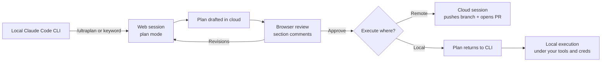

If you've spent any time using [Claude Code](https://code.claude.com/docs/en/overview) on a real task, you've probably hit the same wall I keep hitting: the planning phase is the part that matters most, and the terminal is the worst place to do it. You're scrolling through a wall of plan output, trying to remember which step you wanted to push back on, and your only review tool is "type a follow-up message and hope Claude understands which paragraph you meant." It works. It is not _good_.

Ultraplan is Anthropic's first real answer to that problem, and I've been running it on real work for the last week or so. It's a research-preview workflow that takes the planning phase off your local machine and runs it as a [Claude Code on the web](https://code.claude.com/docs/en/claude-code-on-the-web) session in plan mode. You get a browser UI with inline section comments, the ability to ask for revisions on specific parts of the plan, and—when you're happy—a choice between executing remotely (Claude opens a pull request) or sending the plan back to your terminal for local execution.

> [!NOTE]
> This is preview software and the policy surface around it is moving fast. I'll flag the parts that feel stable versus the parts that smell like they'll churn, but treat dates and exact entitlements as "true the day I wrote this."

## What Ultraplan actually changes

The core mental model is simpler than the marketing (which keeps trying to sell it as a new product rather than a better surface for an old one): Ultraplan is a _plan review surface upgrade_, plus parallelization. [Plan mode](https://code.claude.com/docs/en/permission-modes) itself hasn't changed—it still means "research and propose changes without making them." What's different is _where_ the plan is produced and _how_ you review it.

In the old flow, plan mode happens in your terminal, blocks your terminal, and gets reviewed in scrollback. In the new flow, plan mode happens in a cloud session, your terminal stays free for other work, and the plan lands in a browser UI where you can leave inline comments on specific sections—the way you'd review a pull request instead of the way you'd react to a chat message. When you ask for revisions, the cloud session picks them up and rewrites the relevant parts. When you approve, you pick an execution surface.

You can launch it three ways from the CLI: `/ultraplan <prompt>`, the keyword `ultraplan` inside a normal prompt, or by starting a regular plan-mode session locally and then choosing "refine with Ultraplan" once the local plan is ready. That last one is the door I find myself using most—local plan mode is faster for the first pass, and Ultraplan is where I want to go when the plan is _almost_ right but I want a real review surface before anything mutates.

The minimum bar to use it: a [Claude Code on the web](https://code.claude.com/docs/en/claude-code-on-the-web)–eligible plan and a connected GitHub repository. The cloud session runs in your account's default cloud environment, and that environment is going to matter more than you'd guess.



## The setup dance

Before Ultraplan does anything useful, you need GitHub wired up. There are two paths: connect GitHub from the browser, or run `/web-setup` inside Claude Code. `/web-setup` is the path I'd recommend if you already use [`gh`](https://cli.github.com/) locally—it syncs your `gh auth token` to Claude Code on the web, creates a default cloud environment, and pops the web UI open in your browser. It's the kind of command you run once per machine and forget about.

Once that's done, `/ultraplan <prompt>` is the whole interface from the terminal side. Everything else is in the browser.

> [!TIP] Treat Ultraplan as a design review gate
> The thing that made Ultraplan click for me was treating it as a structural gate, not as "fancy plan mode." When I want a high-quality, reviewable plan—one I can comment on and hand to a teammate—I reach for Ultraplan. When I just want to bash on something exploratory, I stay in local plan mode. The two are not interchangeable.

## Where the plan gets executed

This is the part that actually changes how you work, so let's be precise. Once a plan is approved, you choose between two execution surfaces: remote (the cloud session executes the plan, pushes a branch, and can open a pull request) or local (the plan teleports back to your terminal and you run it the way you'd run any other plan).

The choice is mostly about where your credentials and tooling live. Remote execution is great when the cloud environment can do everything the plan needs—install dependencies, run tests, make commits, push a branch—and you want pull request output as the final artifact. Local execution is the right call when the plan needs something the cloud environment can't easily provide: production credentials, an internal package registry, a custom toolchain, a database that only your laptop can reach.

The cloud environment is _not_ a snapshot of your laptop. It's a universal image with setup scripts. Custom images and snapshots aren't supported yet, outbound traffic goes through a security proxy with an allowlist, and some package managers are unhappy with that proxy ([Bun](https://bun.sh/) is a named example, and yes, that one _stings_). The most common operational failure mode is "it worked locally but not remotely," and almost every time I've hit it, the root cause was the network policy or a setup script that quietly assumed unrestricted outbound access.

## What's actually under the hood

The cloud session is an Anthropic-managed VM with an isolated clone of your repo. GitHub authentication is handled through a secure proxy, which means your GitHub credentials never enter the sandbox—the proxy holds them and Claude talks to GitHub through it. Outbound network traffic also goes through a proxy, which is how the allowlist gets enforced and how Anthropic does audit logging on what cloud sessions reach out to.

That architecture matters for two reasons, and they pull in opposite directions. It's why you can hand an autonomous agent a real repo without giving it your raw GitHub token—and it's also why your cloud-side dependency installs sometimes fail in ways your local installs don't. The proxy is a real boundary, not a no-op.

One thing I want to be honest about: Anthropic does not publish hard latency or throughput numbers for Ultraplan. I can tell you that planning runs in parallel with whatever you're doing in the terminal, which is the actual quality-of-life win. I cannot tell you a "plans per minute" number, because nobody has, and I'm not going to make one up. If you care about that—and on a team workflow, you should—the only honest move is to instrument it yourself: wall-clock time from `/ultraplan` to plan-ready, plan iterations per task, token footprint per plan. Claude Code's built-in `/stats` and the [org-level OpenTelemetry exports](https://code.claude.com/docs/en/monitoring-usage) are the right starting points.

## Plans, pricing, and the part nobody likes talking about

Ultraplan is gated behind Claude Code on the web, which is gated behind your [Claude plan](https://claude.com/). As of now, web access is research-preview-available on Pro, Max, Team, and Enterprise (with Enterprise availability depending on which seat type your org is on). Pro is the cheapest door in. Max gets you 5–20× the included usage and earlier access to research-preview features. Team and Enterprise are where the governance controls live.

The thing that surprises people the most isn't the plan tiers, it's _what's covered by your subscription versus what counts as "extra usage."_ Anthropic's [extra-usage model](https://support.claude.com/en/articles/12429409-manage-extra-usage-for-paid-claude-plans) lets paid plans keep going past their included limits by switching to pay-as-you-go at standard API rates, with limits resetting on a five-hour cadence. That sounds friendly until you realize that several of the features you'd actually want for a serious Ultraplan workflow are explicitly extra-usage-only:

- **[Fast mode](https://code.claude.com/docs/en/fast-mode) for Opus 4.6**: billed to extra usage from token one, on every plan. Quality and capabilities are unchanged—it's the same model running with a faster inference configuration that delivers up to ~2.5× higher output token throughput at premium pricing. It is not in your subscription bucket. Ever.
- **1M-token context for Opus 4.6 in Claude Code**: included on Max, Team, and Enterprise; on Pro it requires extra usage. (The full breakdown is in the [model config docs](https://code.claude.com/docs/en/model-config).)
- **1M-token context for Sonnet 4.6 in Claude Code**: extra usage on every plan.

If you're going to use Ultraplan on big repos, the 1M context window matters more than the marketing makes it sound—planning tasks are exactly the kind of work where a long context lets the model actually _see_ the codebase instead of guessing. If you're on Pro and you want included long-context Opus, the math starts pointing at Max pretty quickly.

> [!WARNING] The April 4 policy change
> On April 4, 2026, Anthropic stopped covering "third-party harnesses" (think OpenClaw and similar wrapper tools) under flat subscription limits. If you've built—or were planning to build—an Ultraplan-like workflow inside an external orchestrator that authenticates against your Pro or Max plan, that path is closing. The supported routes forward are discounted extra-usage bundles or a real Claude API key issued through the [Console](https://console.anthropic.com/). Anthropic's [Claude Code legal guidance](https://code.claude.com/docs/en/legal-and-compliance) is also explicit that OAuth-based Claude.ai login is meant for "ordinary use" of native Anthropic apps, and that third-party developers should authenticate via API keys. Don't build a business on routing other people's traffic through your Pro plan.

## Effort, thinking, and not setting your wallet on fire

Inside Claude Code, the two knobs that most directly affect cost and latency are _effort_ and _thinking_. The [model config docs](https://code.claude.com/docs/en/model-config) recommend medium effort for most coding tasks—including most planning tasks—and reserve high or max for genuinely hard problems. There's also a one-shot `ultrathink` prompt trigger that bumps effort to high for a single turn, which is the right tool when you have a specific gnarly question and you want to spend the tokens once.

On [Opus 4.6](https://www.anthropic.com/news/claude-opus-4-6) specifically, Anthropic's release notes are pretty candid that the model "often thinks more deeply," which is great for hard work and overkill (and overspend) for trivial tasks. `/effort` is the lever; use it. The default isn't always what you want.

For Ultraplan in particular, I'd default to medium effort and only escalate when the plan is genuinely architectural. A plan to add a feature flag does not need max effort. A plan to refactor your auth module does.

## Building Ultraplan-shaped things yourself

If you want to build a workflow that _looks like_ Ultraplan but lives inside your own product, the structure has three layers and the [Claude Agent SDK](https://platform.claude.com/docs/en/agent-sdk/overview) gives you most of what you need for all of them.

The layers are: a planning phase that's read-only (RAG over your repo state, constraints, acceptance criteria), a review and approval UX with section-level feedback, and an execution phase that runs tools inside a sandbox or CI environment of your choosing. The Agent SDK is positioned by Anthropic as "Claude Code as a library"—the same agent loop, the same tool and context management, available in Python and TypeScript. If you've used Claude Code, you already know how to use it.

The minimum-viable planning call in Python looks roughly like this:

```python
import os
from anthropic import Anthropic

client = Anthropic(api_key=os.environ["ANTHROPIC_API_KEY"])

msg = client.messages.create(
    model="claude-opus-4-6",
    max_tokens=1024,
    messages=[
        {"role": "user", "content": "Draft a migration plan from tRPC v10 to v11."}
    ],
    thinking={"type": "adaptive"},
    effort="high",
)

print(msg.content)
```

A couple of things to call out. `thinking={"type": "adaptive"}` and `effort="high"` are the modern control surface for Opus 4.6 and Sonnet 4.6—the older `budget_tokens`-style controls are documented as deprecated for those models, so don't cargo-cult an example from 2024. And `claude-opus-4-6` is the current model ID; if you see something with a date suffix in someone's blog post, check the [models overview](https://platform.claude.com/docs/en/about-claude/models/overview) before you copy it. The [Python SDK docs](https://platform.claude.com/docs/en/api/sdks/python) have the authoritative install and auth guidance.

The TypeScript side is essentially identical:

```ts
import Anthropic from '@anthropic-ai/sdk';

const client = new Anthropic({
  apiKey: process.env['ANTHROPIC_API_KEY'],
});

const message = await client.messages.create({
  model: 'claude-opus-4-6',
  max_tokens: 1024,
  messages: [
    {
      role: 'user',
      content: 'Create a plan to refactor our auth module safely.',
    },
  ],
});

console.log(message.content);
```

The [`@anthropic-ai/sdk`](https://platform.claude.com/docs/en/api/sdks/typescript) package has the full TypeScript types. Streaming is SSE-based; the SDK supports `stream: true` plus helpers like `.finalMessage()`, and the [streaming docs](https://platform.claude.com/docs/en/build-with-claude/streaming) have the patterns worth knowing.

For long-context agents where the same prefix gets sent over and over—system prompts, repo summaries, tool schemas—[prompt caching](https://platform.claude.com/docs/en/build-with-claude/prompt-caching) is the load-bearing optimization, and the published multipliers (5-minute cache writes at 1.25× input price, 1-hour writes at 2×, reads at 0.1×) are the only honest way to model your bill. For non-interactive workloads where you can tolerate up to a 24-hour completion window, [Message Batches](https://platform.claude.com/docs/en/build-with-claude/batch-processing) cut the price in half. Fast mode and Message Batches don't combine—fast mode is for interactive, latency-sensitive work, and batches are for everything else.

If you use tool calling, the [strict tool use](https://platform.claude.com/docs/en/agents-and-tools/tool-use/strict-tool-use) option is worth knowing about—grammar-constrained sampling that guarantees schema conformance for tool inputs. Combine it with clear tool descriptions and input examples and the model's tool selection gets noticeably more reliable.

## Integrations worth knowing about

Ultraplan's minimum integration is [GitHub](https://github.com/)—both for connecting repos and for PR-centric workflows (which, if you've been doing any of this in the last year, is where the industry is clearly heading). Claude Code on the web clones your repo into an Anthropic-managed VM, pushes changes to a branch, and supports auto-fix workflows that respond to CI failures and review comments via GitHub events.

Claude Code's extensibility stack goes deeper than "plugins" in the lightweight sense. [Plugins](https://code.claude.com/docs/en/features-overview) are the packaging layer—bundles of skills, hooks, subagents, and MCP servers into installable units distributable via marketplaces. [MCP (Model Context Protocol)](https://code.claude.com/docs/en/mcp) is the open standard underneath for connecting Claude Code to external tools and data sources. And [remote MCP custom connectors](https://support.claude.com/en/articles/11175166-get-started-with-custom-connectors-using-remote-mcp) let you connect to MCP servers that originate from Anthropic's servers rather than your device—an important networking boundary for enterprise deployments. In practice, I reach for MCP when I need Claude Code to see something the filesystem can't show it: a live dashboard, a ticket queue, a staging database.

For developers who want MCP tool access directly from API calls, Anthropic has an [MCP connector feature in the Messages API](https://platform.claude.com/docs/en/agents-and-tools/mcp-connector) that can connect to remote MCP servers without implementing a separate MCP client. It's beta-header-gated but worth knowing exists.

On the enterprise routing side: the SDK ecosystem supports `ANTHROPIC_BASE_URL` patterns for sending traffic through compatible gateways. [Vercel's AI gateway](https://vercel.com/docs/ai-gateway/sdks-and-apis/anthropic-messages-api) documents one such setup, and [Databricks](https://docs.databricks.com/aws/en/machine-learning/model-serving/query-anthropic-messages) has an Anthropic Messages API–compatible interface for Claude models on its serving endpoints—useful if your org standardizes provider-native APIs behind internal gateways.

## Security, privacy, and the things you have to read carefully

This is the section I'd flag for anyone bringing Ultraplan into a regulated environment, because the defaults differ in ways that matter.

[Data retention](https://docs.anthropic.com/en/docs/claude-code/data-usage) depends on account type. For consumer users (Free, Pro, Max), if you let Anthropic use your data for model improvement, retention is five years; if you don't, it's thirty days. You can change the setting in Claude privacy controls. For commercial users (Team, Enterprise, API), standard retention is thirty days, and [Zero Data Retention](https://code.claude.com/docs/en/zero-data-retention) is available for Claude Code on Enterprise on a per-organization basis. Claude Code clients may also store sessions locally for up to thirty days for resumption.

Anthropic states explicitly that commercial users' code and prompts are not used to train generative models under commercial terms unless the customer opts in (e.g., via a partner program). Consumer users are governed by the privacy controls above—which is to say, _check the toggle_.

A detail in the [data usage docs](https://code.claude.com/docs/en/data-usage) that surprised me the first time I read it: local Claude Code prompt and output data is encrypted in transit via TLS, but it is **not encrypted at rest**. Read that sentence twice if you're on a shared or weakly encrypted machine.

For the cloud side—where Ultraplan actually lives—the picture is different. Claude Code on the web runs sessions in Anthropic-managed VMs with an isolated repo clone, GitHub auth flows through a secure proxy (credentials never enter the sandbox), and outbound traffic goes through a security proxy with audit logging. Network access is limited by default to an allowlist of domains. That's the good news. The flip side is that the allowlist is a real allowlist—if your setup script needs to fetch from a private mirror or an unusual CDN, it's going to fail until you do something about it.

Claude Code's [permission model](https://code.claude.com/docs/en/security) is read-only by default and requires explicit approval for actions like bash command execution. Prompt-injection protections include approval gates, command blocklists for risky fetch tools by default, and isolated context windows for web fetch. None of that makes the system magic, but it's a meaningfully better posture than "agent has root from the start."

For BAA-bound environments, Anthropic's [Claude Code legal docs](https://code.claude.com/docs/en/legal-and-compliance) are the canonical reference. The short version: a BAA covers Claude Code if the customer has executed a BAA _and_ has Zero Data Retention activated, and ZDR is enabled per organization. SOC 2 Type 2 and ISO 27001 artifacts live in Anthropic's [trust center](https://trust.anthropic.com/). For org deployments specifically, the [Agent SDK secure deployment guide](https://platform.claude.com/docs/en/agent-sdk/secure-deployment) is the right companion—it covers isolation, least privilege, and the proxy patterns worth adopting when you're running automated execution in CI.

## What gets harder

I want to be honest about this, because the marketing is going to be gentler than the experience.

Ultraplan and Claude Code on the web are research preview. That label is real—capabilities, gating, and pricing behaviors change based on feedback, and the April 4 third-party harness change is a recent example of how fast policy can move. If you're building team workflows around any of this, build them in a way that survives churn.

Cloud execution will surprise you the first few times. The universal image is _universal_, not _yours_. Setup scripts cover most of the gap, custom images aren't supported yet, and the proxy will trip up package managers that don't know how to talk to it. Plan for the failure mode where a plan that runs perfectly locally can't get its dependencies installed remotely, because that failure mode is going to happen.

Cost is sneakier than it looks. Subscription "limits" are real until they aren't—and the moment you cross them, you're on extra usage at API rates. Fast mode is on extra usage from token one. If you turn on fast mode without an extra usage budget, you can fall back automatically when the budget runs out, which is friendlier than failing but worse than knowing in advance. The [`/cost` command](https://code.claude.com/docs/en/costs) is primarily for API users; if you're on Pro or Max, `/stats` is the better starting point for usage patterns. The mistake to avoid is treating subscription pricing as flat-rate when it's actually flat-with-an-overflow-tank.

And there's a softer trade-off worth naming: Ultraplan separates plan approval from code mutation, which is _great_ for review rigor and governance and _slightly worse_ for the kind of fast feedback loop where you're rapidly iterating on a half-formed idea. The right move isn't to pick one and use it for everything; it's to know which loop you're in and use the matching tool.

## How I'd actually adopt it

If I were rolling Ultraplan out on a small team starting tomorrow, the order of operations would be roughly:

- Confirm everyone has Claude Code on the web access on their plan.
- Run `/web-setup` once on each machine to wire up GitHub.
- Agree on a "what counts as a good plan" contract—scope boundaries, acceptance criteria, rollback, tests—and put it in a [project instruction file](https://docs.anthropic.com/en/docs/claude-code/memory) so Claude actually follows it.
- Decide per repo whether remote PR creation or local execution is the default.
- Set a cost posture. Is fast mode allowed? Is 1M context on?
- Turn on [OpenTelemetry exports](https://code.claude.com/docs/en/monitoring-usage) if you care about cost spikes.

The most important of those is the plan contract. Ultraplan is a review surface, and a review surface is only as good as the thing you're reviewing. If your team doesn't agree on what a complete plan looks like, the inline comments will turn into the same chat-message back-and-forth you were trying to escape from. Write the contract down. Make Claude follow it.

For teams that need compliance visibility, [Claude Code analytics](https://code.claude.com/docs/en/analytics) gives you dashboards for token usage and session counts. One gotcha: contribution metrics require GitHub integration and aren't available under ZDR—you get usage metrics only.

The parts that are easy to defer: fast mode (only turn it on when latency is actually the bottleneck), 1M context (only enable when you have repos that need it), OpenTelemetry (only if you're at a size where someone is going to ask about cost). None of those need to be on day one.

## Where this is going

Plan mode has always been the most underrated part of Claude Code, and Ultraplan is the first time the review surface has matched the seriousness of the planning step. The shift it represents—planning as a parallel, asynchronous, reviewable artifact instead of a terminal-bound back-and-forth—is the part that's going to stick, regardless of how the specifics of this preview shake out.

If you've been doing big planning work in scrollback and it's been driving you slowly insane: yes, this fixes it. If you've been waiting for "agent-in-the-cloud" workflows that don't require giving up your terminal, this is the shape they're starting to take. And if you're skeptical that any of this changes the fundamentals of how you write software—fair, I get it, and I was too. The thing that moved me wasn't the marketing. It was the first time I left an Ultraplan running, did half an hour of unrelated work in the same terminal, and came back to a plan I could actually review like a pull request.

That's the win. Everything else is plumbing.
