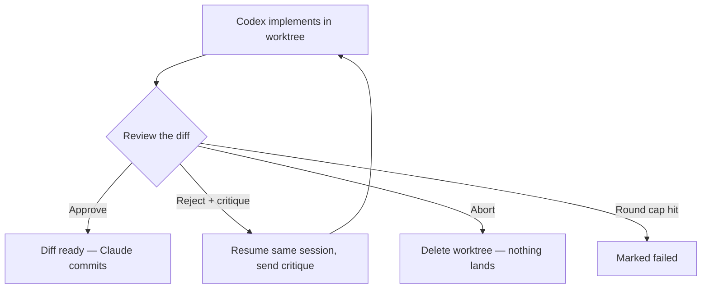
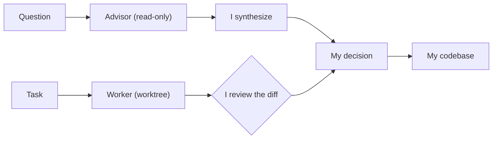

A couple days ago I wrote about wiring [OpenAI's Codex](https://openai.com/index/introducing-codex/) into [Claude Code](https://www.claude.com/product/claude-code) as a consulting subagent—a [second opinion from a different model family](/writing/codex-as-a-second-opinion) that I tap when I'm stuck inside my own priors. That whole setup keeps Codex on a tight leash: read-only sandbox, text-only, _analysis, not action_. It talks. It never touches my files.

This post is about the other half of the relationship, and it took me a while to admit I wanted it. Because sometimes I don't want Codex's opinion. I want Codex to do the work, in a different model family's brain, while I do something else—and then I want to review what it produced like I'd review a coworker's branch. Same two models, completely inverted stance. The advisor is a brain I borrow. The worker is a pair of hands I delegate to.

> [!NOTE] Read the other one first, or don't
> This leans on the advisor post for the "why a different lineage" argument and the doghouse/fail-warn plumbing. I'm not going to re-litigate either here. If you want the case for two model families at all, that's where it lives.

## The opposite of a leash

The advisor literally can't edit anything—that's its defining constraint. The worker is the exact inverse. Its entire job is to edit files. So the design problem flips: it's no longer "how do I stop Codex from touching things," it's "how do I let Codex touch everything _safely_, and make sure nothing it does lands in my repo until I've personally signed off."

Those turn out to be very different engineering problems with one shared answer: isolation. If Codex is going to write code, it writes it somewhere that isn't my working tree, and it stays there until I pull it across the line myself.

## One worker, in a worktree it can't escape

Here's the move that makes the whole thing safe to run unsupervised. Before Codex writes a single line, the worker creates a dedicated [git worktree](https://git-scm.com/docs/git-worktree)—a separate checkout of the same repository, on its own throwaway branch—and points Codex at _that_:

```bash
GIT_ROOT=$(git rev-parse --show-toplevel)
BRANCH_NAME="codex-worker-<id>-$(date +%s)"
WORKTREE_PATH="${GIT_ROOT}/.codex-worktrees/<id>"
git worktree add "$WORKTREE_PATH" -b "$BRANCH_NAME"
```

Codex does its thing inside that worktree with a `workspace-write` sandbox—it can read, write, and run commands, but only within its own isolated checkout. My actual working tree never sees any of it. If Codex goes sideways and rewrites half the codebase, the blast radius is a branch I can delete with one command and never think about again.

This matters even for a _single_ task, which surprised me at first. You'd think isolation is only worth the ceremony when you're running things in parallel. But the worktree isn't really about concurrency—it's about keeping Codex's in-progress work quarantined from my repo until it's earned a place there. The branch is a holding pen. Approval is the only door out.

## The approval loop, where I'm the bottleneck on purpose

This is the part I care about most, and it's the direct sibling of the advisor's "never just forward Codex's answer" rule. The worker never commits. It physically can't, by its own instructions: _never run `git add`, `git commit`, `git push`, or `git merge`._ Its job ends at a reviewed diff. Mine begins there.

The loop is boring in the best way. Codex implements the task in its worktree. The orchestrator reads the resulting `git diff`—the actual diff, not Codex's prose summary of what it claims it did—and runs it through a rubric:



Each path in that diagram is one of three verdicts:

- **Approve** if the diff does the whole task, touches only the right files, has no obviously broken logic, and matches the codebase's conventions.
- **Reject with specific feedback** if it's partially done, touches the wrong files, or has a fixable bug. The critique quotes the offending code and says exactly what to do instead.
- **Abort** if Codex errored, produced an empty diff for a task that clearly needed changes, or wrote something so broken that another round won't help.

A rejection doesn't restart from scratch. It resumes the same Codex session by ID and sends the critique plus the previous diff back into the same thread, so Codex fixes _its own_ work instead of forgetting the context and starting over. Around it goes—implement, review, critique, resume—until I approve, it aborts, or it burns through its round cap and gets marked failed.

The thing I had to internalize is that **Codex finishing is not the task finishing.** My approval is. A diff that Codex is proud of and that I haven't read is worth exactly nothing, because the failure I'm guarding against here is the same one from the advisor post wearing different clothes: laundering another model's confidence into my codebase without anyone checking it. The worktree keeps the bad diffs out of my repo. The review loop keeps the unexamined ones out.

## More than one pair of hands

Once you've got each task quarantined in its own worktree, a nice property falls out for free: you can run several at once without them stepping on each other. Independent tasks—`fix-auth`, `add-tests`, `update-types`—each get their own worktree, their own branch, their own Codex session, and they all run in parallel as background jobs. They literally cannot interfere, because no two of them share a working directory.

That's the moment I stop being a programmer and start being the person who reviews three branches at lunch. I'm not typing. I'm decomposing work into independent chunks, handing each to a worker, and reading the diffs as they come back. Claude orchestrates and reviews; Codex implements; I stay the one who decides what's good enough to keep.

The honest caveat: this only pays off when the tasks are _genuinely_ independent. If two of those chunks share a file or an interface, you've reintroduced exactly the coordination problem the isolation was supposed to kill, and now you're merging conflicting branches by hand. Parallelism across worktrees is a gift for orthogonal work and a tax on entangled work. Decompose accordingly, or don't decompose at all.

## You decide the effort, every time

One small design decision I'm oddly fond of: the worker never guesses how hard to think. The caller passes an explicit effort level—`low`, `medium`, `high`, `xhigh`—and the worker refuses to infer it.

The reason is that effort is a money-and-time dial, and the agent doing the work is the worst-placed party to set it. A rename, a mechanical search-and-replace, a format pass—that's `low`, and spending `xhigh` reasoning on it is lighting money on fire to move three lines. A security-sensitive multi-file redesign is `xhigh`, and running it at `low` is how you get a fast, cheap, wrong answer. I'm the one who knows which shape the task is, so I'm the one who sets the dial. Making that an explicit input instead of an inferred default keeps the cost where I can see it and own it.

## When _not_ to hand off the keys

The advisor post had a list of things that earn a consultation. The worker has the opposite list—things that should _never_ get delegated, even when the work looks tailor-made for it:

- **Anything I could finish faster than I could write the prompt and review the diff.** If the round-trip costs more than just doing it, delegation is pure overhead. A lot of small changes live here.
- **Work that needs live context only I have**—edits in flight, a half-formed idea in the current conversation, state that lives in my head and not in the files. The worker starts from a self-contained prompt; if I can't make the task self-contained, it's not ready to hand off.
- **Anything where I'd spend the whole time fighting the diff.** If three rounds of critique don't converge, that's the signal to stop delegating and either finish it myself or admit the task was specified too vaguely to hand to anyone, human or model.

And the rule I hold hardest, the one that's just the advisor's rule pointed at code instead of analysis: I read every line of what comes back. Not skim, not trust the summary, not spot-check. The worker's prose describes intent; the diff is what actually changed, and the diff is the only thing I commit. Codex is a capable pair of hands. It is not, and never gets to be, the thing that decides what's good.

## The shape of the partnership

So that's both halves. The [advisor](/writing/codex-as-a-second-opinion) is Codex as a brain I consult when my own priors have failed me twice—it talks, I synthesize, nobody touches the repo. The worker is Codex as hands I delegate to when the work is clear and I'd rather review than type—it edits in a quarantine, I approve the diff, nothing lands until I say so.



Notice where both arrows land before anything reaches the repo: on me. That's not an accident of the drawing.

Different stances, one spine running through both: the second model is never allowed to be the final judge. It advises or it implements, and in both cases I'm the one who decides what survives contact with my codebase. Borrow the other brain, borrow the other hands—just don't let either of them sign your name.
