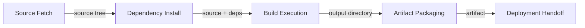
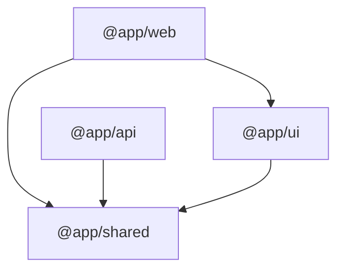
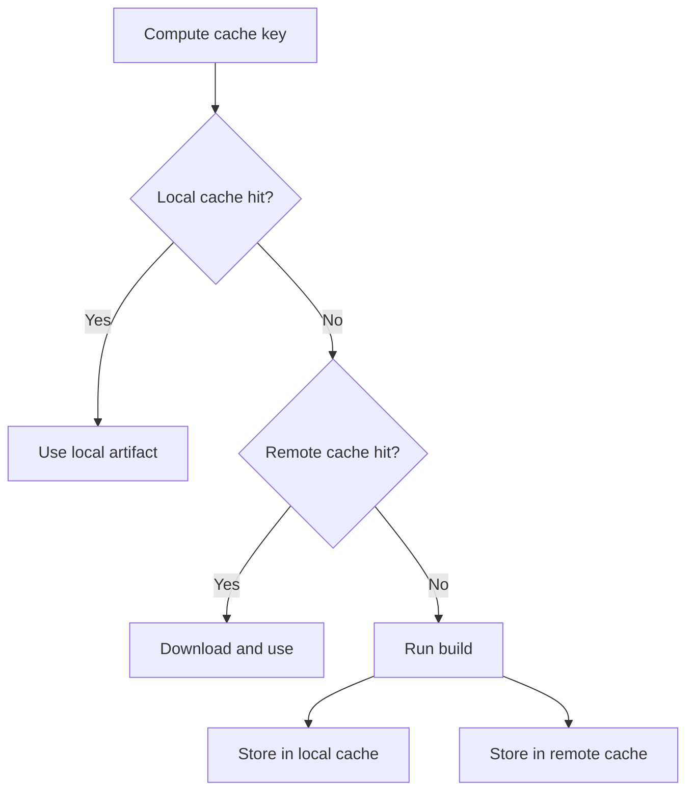
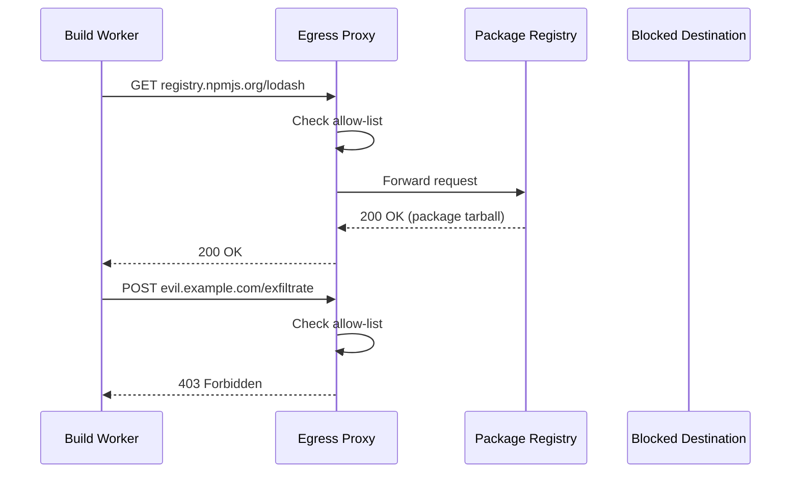
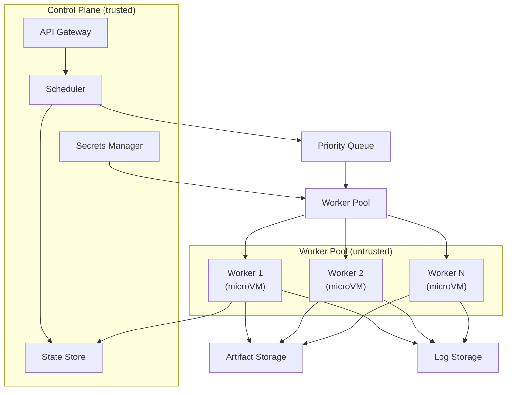
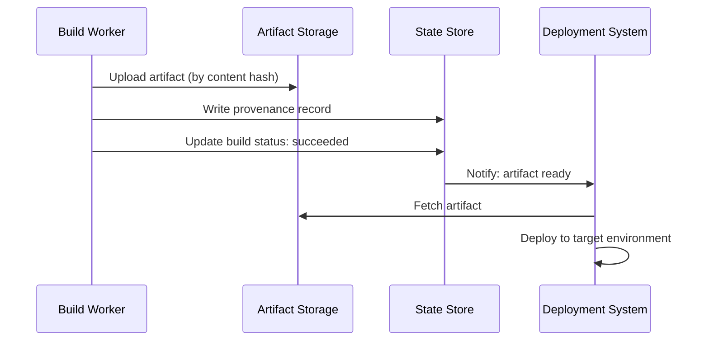
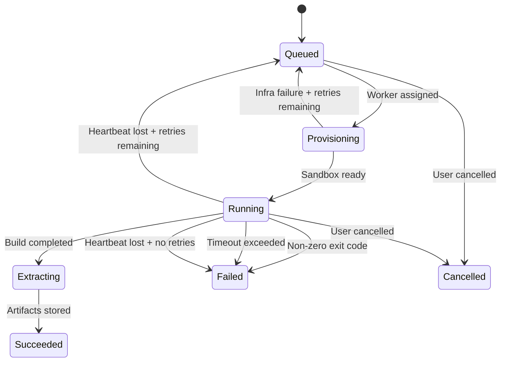
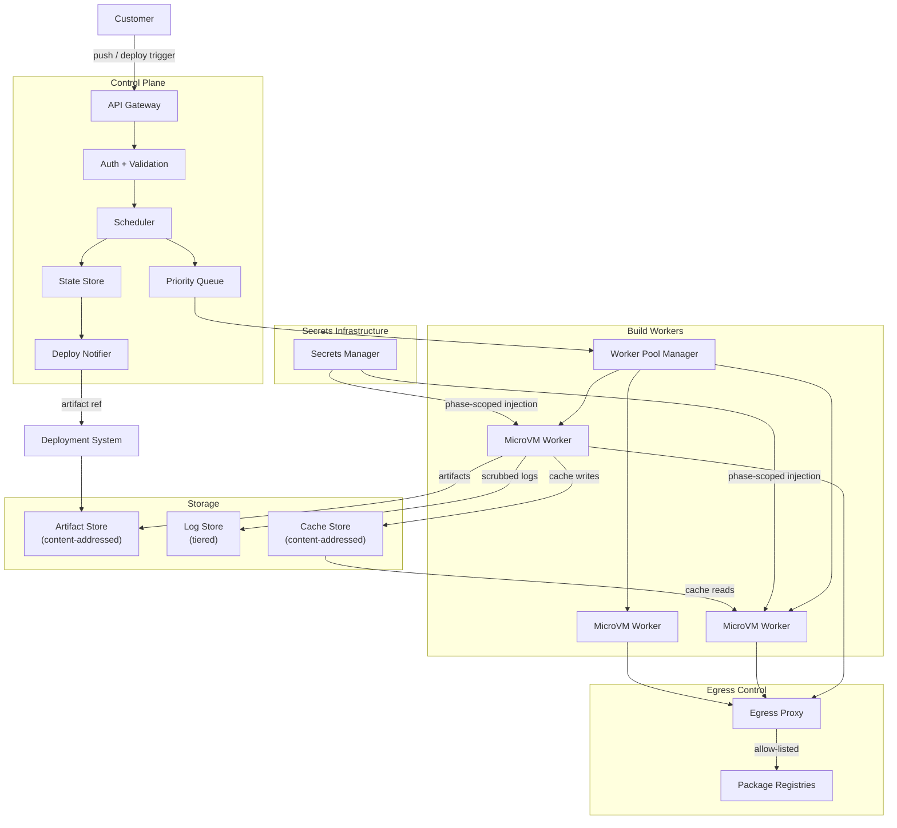

So, you (or, in this case—a younger, less-wise version of me) want to build a platform that accepts a Git repository URL from a stranger, runs whatever code is inside it on your infrastructure, and produces something you're willing to serve to the internet. That's the pitch, anyway. The reality is that every interesting design decision in this kind of system follows from a single uncomfortable fact: you are running untrusted code.

It sounds obvious when you say it out loud. But the implications are sneaky. Every `npm install` is arbitrary code execution—`postinstall` scripts run whatever they want. Every `pip install` can execute a `setup.py`. Every `go generate` runs shell commands embedded in source comments. The build step itself is just more arbitrary code execution on top of that. You're not just compiling source files. You're handing a stranger a shell on your machine and hoping they do something reasonable with it.

This post walks through the design of a system like that—from the moment a build request arrives to the moment an artifact is ready for deployment. I'll cover the pipeline stages, the security model, the architecture of the control plane and workers, and the operational realities of running it. The goal is to be concrete enough that you could actually start building this, while staying vendor-neutral enough that the design decisions transfer regardless of which cloud you're on.

## The shape of a build

Before things get complicated, it helps to name the stages. A build, at its simplest, is a pipeline with five discrete phases. Each transforms an input into an output, and each introduces its own category of problems.



**Source fetch:** clone the customer's repository and get the relevant files onto disk. **Dependency install:** resolve and fetch third-party packages. **Build execution:** run the customer's build command (or infer one). **Artifact packaging:** normalize the build output into a format your deployment system understands. **Deployment handoff:** store the artifact and notify the downstream system that it's ready.

That's the whole pipeline. It's conceptually linear, but the implementation is anything but—caching, concurrency, security boundaries, and failure recovery all add nonlinear complexity. We'll start at the beginning and work our way through, stopping at each point where things get harder than they look.

## Source fetch and the trust boundary it creates

Cloning a customer's repository is the first moment untrusted data enters your system. Even before any build command runs, `git clone` itself is doing more than you might expect.

A full clone downloads the entire commit history, which is wasteful when you only need the latest commit. Shallow clones (`--depth 1`) fix that—but they break monorepo tooling that relies on git history to determine which packages changed. Sparse checkout lets you clone only a subdirectory, which matters for large monorepos where the build target is one package among hundreds.

Submodules are where things get interesting from a trust perspective. Each submodule is another repository you're cloning from an arbitrary URL. A project could reference a submodule hosted on an attacker-controlled server. That server could serve different content depending on when or from where the clone request arrives. The trust boundary isn't just the top-level repository—it's every transitive dependency in the submodule graph.

Then there's `.gitattributes`. Git supports custom **filter drivers**—commands that run automatically during checkout to transform file contents. A malicious `.gitattributes` can specify a filter that executes arbitrary shell commands the moment you check out the working tree. Most people don't know this feature exists, which makes it a particularly effective attack vector.

```typescript title="source-fetch.ts"
interface FetchOptions {
  repositoryUrl: string;
  ref: string;
  depth: number | 'full';
  sparsePaths?: string[];
  submodulePolicy: 'none' | 'shallow' | 'recursive';
  // [!note Each submodule is another trust boundary you're crossing.]
  lfsPolicy: 'skip' | 'fetch';
  disableFilters: boolean;
}

async function fetchSource(options: FetchOptions): Promise<SourceTree> {
  const cloneArgs = ['clone', '--single-branch', '--branch', options.ref];

  if (options.depth !== 'full') {
    cloneArgs.push('--depth', String(options.depth));
  }

  if (options.disableFilters) {
    // [!note Disable .gitattributes filter drivers to prevent arbitrary command execution.]
    cloneArgs.push('--config', 'filter.lfs.process=', '--config', 'filter.lfs.smudge=');
  }

  await exec('git', [...cloneArgs, options.repositoryUrl, workDir]);

  if (options.submodulePolicy !== 'none') {
    await exec('git', ['submodule', 'update', '--init', `--depth=1`], { cwd: workDir });
  }

  return { path: workDir, commit: await resolveHead(workDir) };
}
```

That `disableFilters` flag is doing real security work. Without it, checking out the working tree is already arbitrary code execution—before you've even looked at the `package.json`.

## Dependency installation as arbitrary code execution

With source on disk, the next step is installing dependencies. This is—not to be dramatic about it—the most dangerous phase of the entire pipeline.

When you run `npm install`, npm doesn't just download packages. It executes lifecycle scripts: `preinstall`, `install`, `postinstall`. Any package in the dependency tree can include these scripts, and they run with the full privileges of the user that invoked `npm`. The same is true across ecosystems: `pip install` can run `setup.py`, Ruby's `gem install` can execute `extconf.rb`, and so on.

The first decision is figuring out _which_ package manager the project uses. This is less straightforward than it sounds, because different managers use different lockfiles, different install semantics, and different approaches to lifecycle scripts.

| Package Manager | Lockfile            | Clean Install                     | Runs Lifecycle Scripts      | Script Disable Flag              |
| --------------- | ------------------- | --------------------------------- | --------------------------- | -------------------------------- |
| npm             | `package-lock.json` | `npm ci`                          | Yes                         | `--ignore-scripts`               |
| yarn (classic)  | `yarn.lock`         | `yarn install --frozen-lockfile`  | Yes                         | `--ignore-scripts`               |
| yarn (berry)    | `yarn.lock`         | `yarn install --immutable`        | Yes                         | `enableScripts: false`           |
| pnpm            | `pnpm-lock.yaml`    | `pnpm install --frozen-lockfile`  | Yes                         | `--ignore-scripts`               |
| bun             | `bun.lockb`         | `bun install --frozen-lockfile`   | Yes                         | `--ignore-scripts`               |
| pip             | `requirements.txt`  | `pip install -r requirements.txt` | Yes (`setup.py`)            | `--no-build-isolation` (partial) |
| Go              | `go.sum`            | `go mod download`                 | No (but `go generate` does) | N/A                              |

The "clean install" column matters for reproducibility. `npm ci` deletes `node_modules` and installs exactly what's in the lockfile, refusing to run if the lockfile doesn't match `package.json`. This is what you want in a build system—if a customer's lockfile is out of sync, the build should fail rather than silently resolving to different versions.

```typescript title="package-manager.ts"
interface PackageManagerConfig {
  name: string;
  installCommand: string[];
  lockfile: string;
  scriptDisableFlag: string;
}

function resolvePackageManager(rootDir: string): PackageManagerConfig {
  if (existsSync(join(rootDir, 'bun.lockb'))) {
    return {
      name: 'bun',
      installCommand: ['bun', 'install', '--frozen-lockfile'],
      lockfile: 'bun.lockb',
      scriptDisableFlag: '--ignore-scripts',
    };
  }

  if (existsSync(join(rootDir, 'pnpm-lock.yaml'))) {
    return {
      name: 'pnpm',
      installCommand: ['pnpm', 'install', '--frozen-lockfile'],
      lockfile: 'pnpm-lock.yaml',
      scriptDisableFlag: '--ignore-scripts',
    };
  }

  // [!note Presence of yarn.lock alone isn't enough—check for .yarnrc.yml to distinguish classic from berry.]
  if (existsSync(join(rootDir, 'yarn.lock'))) {
    const isBerry = existsSync(join(rootDir, '.yarnrc.yml'));
    return {
      name: isBerry ? 'yarn-berry' : 'yarn-classic',
      installCommand: isBerry
        ? ['yarn', 'install', '--immutable']
        : ['yarn', 'install', '--frozen-lockfile'],
      lockfile: 'yarn.lock',
      scriptDisableFlag: '--ignore-scripts',
    };
  }

  return {
    name: 'npm',
    installCommand: ['npm', 'ci'],
    lockfile: 'package-lock.json',
    scriptDisableFlag: '--ignore-scripts',
  };
}
```

The `scriptDisableFlag` is the key safety lever. If you disable lifecycle scripts during install, you cut off the most common arbitrary code execution path. But some packages genuinely need post-install scripts—native addons that compile C code, for example. You have two options: run install with scripts disabled and maintain an allow-list of packages that are permitted to run scripts, or run the entire install phase inside the isolation sandbox (which we'll design shortly) and let scripts run freely within those constraints.

The second approach is simpler and more compatible, but it means your isolation boundary needs to be up before dependency installation, not just before build execution. That's a meaningful architectural decision.

## Build graph resolution

Now we have source code and dependencies on disk. For a single-package repository, the next step is straightforward: read the build command from the project configuration and run it. But monorepos—repositories that contain multiple packages with interdependencies—require understanding the dependency graph before you can decide what to build and in what order.

Consider a monorepo with four packages:



You can't build `@app/web` before `@app/ui` and `@app/shared`, because it imports from both. You can't build `@app/ui` before `@app/shared`. But you _can_ build `@app/api` and `@app/ui` in parallel, since neither depends on the other—as long as `@app/shared` is built first.

This is a textbook topological sort. Walk the dependency graph, find nodes with no unresolved dependencies, mark them as ready to build, and repeat.

```typescript title="build-graph.ts"
interface PackageNode {
  name: string;
  dependencies: string[];
  buildCommand: string;
}

function resolveBuildOrder(packages: PackageNode[]): string[][] {
  const remaining = new Map(packages.map((p) => [p.name, new Set(p.dependencies)]));
  const levels: string[][] = [];

  while (remaining.size > 0) {
    // [!note Packages with no unresolved dependencies can build in parallel.]
    const ready = [...remaining.entries()]
      .filter(([, deps]) => deps.size === 0)
      .map(([name]) => name);

    if (ready.length === 0) {
      const cycle = [...remaining.keys()].join(' -> ');
      throw new Error(`Dependency cycle detected: ${cycle}`);
    }

    levels.push(ready);

    for (const name of ready) {
      remaining.delete(name);
    }

    for (const deps of remaining.values()) {
      for (const name of ready) {
        deps.delete(name);
      }
    }
  }

  return levels;
}
```

The return type—`string[][]`—is a list of levels. Each level contains packages that can build concurrently. Level 0 might be `['@app/shared']`, level 1 might be `['@app/ui', '@app/api']`, and level 2 might be `['@app/web']`.

**Affected detection** is the optimization that makes monorepo builds practical at scale. If a commit only touches files in `@app/api`, there's no reason to rebuild `@app/web` or `@app/ui`. You need git history to determine which files changed, which is why shallow clones can be a problem—without history, you can't diff against the previous build's commit. The common approach is to clone with enough history to reach the last successful build's commit SHA, then use `git diff` to identify changed files and map them back to the packages they belong to.

## Concurrency, incrementalism, and caching

With a build graph in hand, you want to run builds as fast as possible. That means three things: executing independent tasks in parallel, skipping work that hasn't changed, and caching aggressively so you don't repeat work across builds.

Concurrent execution follows directly from the topological sort. Tasks at the same level can run in parallel, subject to resource constraints. If you have four packages at level 1 but only two CPU cores available, you'll run two at a time. The scheduler needs to balance parallelism against resource contention—CPU, memory, and disk I/O all become bottlenecks when you're running multiple builds simultaneously.

Incrementalism is about skipping work entirely. If the inputs to a build step haven't changed, the output won't change either. The trick is defining "inputs" precisely enough that cache hits are reliable and broadly enough that cache misses are rare. A content-addressable model works well: hash everything that affects the output, and use that hash as a cache key.

```typescript title="cache.ts"
async function computeCacheKey(task: BuildTask): Promise<string> {
  const inputs = [
    await hashDirectory(task.sourceDir),
    await hashFile(task.lockfilePath),
    task.buildCommand,
    // [!note Missing an env var here means cache hits produce wrong output silently.]
    ...task.environmentVariables.sort().map((e) => `${e.name}=${e.value}`),
    task.builderImageVersion,
  ];

  return createHash('sha256').update(inputs.join('\n')).digest('hex');
}
```

The cache lookup flow has two tiers: a local cache on the build machine (fast but limited to that machine's history) and a remote cache shared across all build machines (slower but much higher hit rate).



Remote caching introduces a security concern that deserves its own callout: **cache poisoning**. If an attacker can write to your shared cache—either by exploiting a build that runs their code, or by compromising the cache storage directly—they can replace legitimate cached artifacts with malicious ones. Every subsequent build that hits that cache key gets the poisoned output. We'll come back to this in the security sections, but the mitigation starts here: cache keys must be tamper-proof, cache writes should be scoped to the build that produced them, and cache reads should verify content integrity (the hash of the retrieved artifact must match the cache key).

## The isolation model

Everything we've discussed so far—source fetch, dependency install, build execution—runs inside some kind of sandbox. The design of that sandbox is where the hardest decisions live, because you're balancing three competing concerns: how strong the isolation is, how fast it starts up, and how much it costs.

There are three tiers of isolation technology, each with a different position on that tradeoff triangle.

**Containers** use Linux kernel features—namespaces for resource visibility isolation, cgroups for resource limits, and seccomp for syscall filtering. They share the host kernel. A process inside a container thinks it has its own filesystem, network stack, and process tree, but it's running on the same kernel as every other container on that machine. Startup is fast (milliseconds to low seconds), resource overhead is minimal, and the tooling ecosystem is mature.

The catch is the shared kernel. A kernel vulnerability is a container escape. This isn't theoretical—container escapes via kernel exploits have happened repeatedly in production. A default container configuration (the kind you get from a stock `docker run`) is not hardened. You need to layer on a restrictive seccomp profile that blocks dangerous syscalls, a read-only root filesystem, dropped capabilities (no `CAP_SYS_ADMIN`, no `CAP_NET_RAW`, no `CAP_SYS_PTRACE`), and a minimal base image with no unnecessary tooling.

Even with all of that, the shared kernel remains. For a multi-tenant build system where you're running code from strangers, containers alone are a calculated risk.

**MicroVMs** run each build inside a lightweight virtual machine with its own kernel. The pioneering implementation in this space uses a stripped-down VMM (virtual machine monitor) purpose-built for serverless workloads—no BIOS, no PCI bus emulation, no legacy device support. Startup times are sub-second. Memory overhead is tens of megabytes rather than the gigabytes a traditional VM requires. Each build gets its own kernel, so a kernel exploit only compromises the guest kernel—it doesn't reach the host or other builds.

The operational cost is higher than containers. You need to manage VM images, handle the boot sequence, and deal with the fact that a microVM is a real (if minimal) operating system. Networking setup is more complex. Storage attachment is less flexible. But the security boundary is dramatically stronger.

**Full VMs** provide the strongest isolation—a complete hardware-virtualized environment with its own kernel, BIOS, and device emulation. Startup times are measured in seconds to minutes. Resource overhead is significant (each VM reserves dedicated memory and CPU). This is the traditional approach for multi-tenant compute, and it works, but the startup latency and resource cost make it impractical for a build system where you might be running thousands of builds per hour.

| Property          | Container      | MicroVM             | Full VM            |
| ----------------- | -------------- | ------------------- | ------------------ |
| Startup time      | ~100ms         | ~125ms–1s           | 10s–60s            |
| Kernel isolation  | Shared         | Dedicated (minimal) | Dedicated (full)   |
| Memory overhead   | ~5MB           | ~30–50MB            | ~256MB–1GB         |
| Escape complexity | Kernel exploit | VMM exploit         | Hypervisor exploit |
| Operational cost  | Low            | Medium              | High               |

> [!WARNING] Shared kernels
> A container with a hardened seccomp profile, dropped capabilities, and a read-only root filesystem is _much_ better than a default container. But it still shares a kernel with every other container on the host. For multi-tenant build systems running untrusted code, this is the fundamental limitation. MicroVMs exist specifically to address this gap—same-order-of-magnitude startup cost, with a dedicated kernel per build.

Most multi-tenant build platforms that take security seriously have converged on microVMs or equivalent technologies. The startup latency penalty over containers is small (hundreds of milliseconds), and the security improvement is large (an entirely separate kernel).

The choice you make here cascades through the rest of the architecture. If you use microVMs, you need a provisioning pipeline that can create and destroy VMs at the rate you receive build requests. If you use containers, you need a host-level security posture that accounts for the shared kernel. If you use full VMs, you need a warm pool to absorb startup latency. We'll come back to provisioning when we discuss the control plane.

## Network egress and supply-chain exposure

Builds need the internet. Dependency installation fetches packages from registries. Build steps may download tools, pull base images, or call external APIs. That network access is also a channel for data exfiltration—a malicious build could `curl` your internal metadata service, phone home with stolen secrets, or tunnel out through DNS.

The straightforward mitigation is egress filtering: allow traffic to known-good destinations and block everything else. In practice, this means maintaining an allow-list of package registries (`registry.npmjs.org`, `pypi.org`, `rubygems.org`, `proxy.golang.org`, etc.) and blocking all other outbound traffic.



There are several ways to implement this. **DNS-based filtering** resolves domain names through a controlled DNS server that refuses to resolve blocked domains. It's simple but coarse—you can block domains but not paths, and it doesn't work if the build uses IP addresses directly. **Proxy-based filtering** routes all traffic through an HTTP/HTTPS proxy that inspects the destination and applies policy. It's more granular (you can allow specific paths or methods) but adds latency and requires all build tools to respect proxy environment variables. **Network policy** at the infrastructure level (firewall rules, security groups) is the most reliable—traffic never leaves the network interface—but the least flexible to update.

```typescript title="egress-policy.ts"
interface EgressPolicy {
  allowedDomains: string[];
  allowedPorts: number[];
  // [!note DNS resolution happens inside the sandbox—the proxy validates the resolved address too.]
  dnsPolicy: 'proxy-controlled' | 'sandbox-local';
  blockMetadataService: boolean;
  maxEgressBytesPerBuild: number;
}

const defaultPolicy: EgressPolicy = {
  allowedDomains: [
    'registry.npmjs.org',
    'registry.yarnpkg.com',
    'pypi.org',
    'files.pythonhosted.org',
    'proxy.golang.org',
    'rubygems.org',
    'crates.io',
  ],
  allowedPorts: [443, 80],
  dnsPolicy: 'proxy-controlled',
  blockMetadataService: true,
  maxEgressBytesPerBuild: 2 * 1024 * 1024 * 1024,
};
```

That `blockMetadataService` flag is critical. Cloud metadata services (typically available at `169.254.169.254`) expose instance credentials, project IDs, and other sensitive information. A build that can reach the metadata service can potentially escalate privileges far beyond the sandbox.

Beyond egress, the supply-chain attack surface during dependency installation is broad. **Typosquatting** registers package names that are one character off from popular packages (`lodassh` instead of `lodash`). **Dependency confusion** exploits the lookup order between public and private registries—if your project uses a private package called `@company/utils` and an attacker publishes a public package with the same name and a higher version number, some package managers will prefer the public one. **Compromised maintainer accounts** inject malicious code into legitimate packages. **Malicious post-install scripts** execute during `npm install` without any explicit user action.

The defenses are layered. Lockfile integrity verification catches unexpected version changes. Disabling lifecycle scripts (or running them inside the sandbox) limits post-install attacks. Scoped registries (pointing `@company/*` to your private registry exclusively) prevent dependency confusion. But there's no single defense that covers all vectors—this is a problem that requires defense in depth.

## Secrets injection and lifecycle

Builds need secrets. API keys for external services, deploy tokens for artifact registries, authentication credentials for private package registries. How you get those secrets into the build—and more importantly, when and where—is a security-critical design decision.

The core principle is **late injection**: secrets should enter the build environment as late as possible and be scoped as narrowly as possible. A deploy token has no business being available during `npm install`. A package registry credential shouldn't be accessible during the build step. Each secret should be available only during the phase that actually needs it.

```typescript title="secrets-policy.ts"
type BuildPhase = 'source-fetch' | 'dependency-install' | 'build' | 'artifact-upload' | 'deploy';

interface SecretBinding {
  name: string;
  // [!note A deploy token visible during dependency install is a leaked secret.]
  allowedPhases: BuildPhase[];
  injectionMethod: 'environment-variable' | 'mounted-file' | 'secrets-manager-reference';
  rotationIntervalHours: number;
}

interface SecretsPolicy {
  bindings: SecretBinding[];
  logScrubbing: 'pattern-based' | 'value-based' | 'both';
  maxSecretSizeBytes: number;
  auditAccess: boolean;
}
```

**Injection methods** have different security profiles. Environment variables are the simplest—every tool understands them—but they're also the leakiest. They show up in `/proc/self/environ`, in crash dumps, in `printenv` output, and in framework error pages that dump the environment. Mounted files (a secret written to a tmpfs path that the build reads) are harder to accidentally leak but require the build to know where to look. Secrets manager references (where the build receives a token that can fetch the real secret from a secrets manager API) add a layer of indirection that improves audit trails but adds latency and complexity.

The biggest operational headache with secrets is **log scrubbing**. Builds produce logs, and secrets end up in logs constantly. A developer runs `echo $DATABASE_URL` to debug a connection problem. A framework dumps the environment on startup. An error message includes the authorization header that failed. If those logs leave the sandbox un-scrubbed, the secret is compromised.

Log scrubbing needs to happen at the boundary—inside the sandbox, before logs are streamed to the control plane. Two approaches work in tandem: **pattern-based scrubbing** matches known secret formats (AWS access keys, GitHub tokens, base64-encoded credentials) using regex. **Value-based scrubbing** takes the set of secret values that were injected into this build and masks any log line containing any of those values. You need both, because pattern-based scrubbing catches secrets your system didn't inject (leaked by dependencies), and value-based scrubbing catches secrets that don't match common patterns.

## Threat model and resource quotas

With the security controls described—isolation, egress filtering, secrets scoping, log scrubbing—it's worth stepping back and naming the threats explicitly. A threat model makes the defenses legible and exposes gaps.

An attacker submitting a build to your platform has four categories of goals. **Resource theft:** use your compute to mine cryptocurrency or run other workloads. **Data exfiltration:** steal secrets, source code, or build artifacts belonging to other customers. **Lateral movement:** escape the sandbox to reach the control plane, the host machine, or other customers' builds. **Supply-chain insertion:** inject malicious code into build output that gets deployed to production.

Each goal maps to specific attack vectors, and each vector maps to one or more defense layers.

| Threat                         | Primary Defense                          | Secondary Defense                         |
| ------------------------------ | ---------------------------------------- | ----------------------------------------- |
| Crypto mining / resource theft | CPU time limits, process quotas          | Anomaly detection on resource usage       |
| Secret theft from environment  | Phase-scoped injection                   | Log scrubbing, rotation                   |
| Cross-tenant data access       | Per-build isolation (microVM)            | No shared writable storage between builds |
| Sandbox escape                 | MicroVM kernel boundary                  | Minimal attack surface, host hardening    |
| Data exfiltration via network  | Egress allow-list                        | Bandwidth limits, DNS filtering           |
| Cache poisoning                | Content-addressed keys, integrity checks | Per-customer cache namespaces             |
| Malicious build output         | Artifact scanning                        | Provenance verification                   |
| Dependency supply-chain attack | Lockfile verification, script disable    | Registry allow-listing                    |

> [!NOTE] Defense in depth
> No single layer in this table is sufficient on its own. The security model assumes any individual layer can fail. Cache poisoning might bypass lockfile verification. A microVM might have a VMM vulnerability. Log scrubbing might miss a secret in an unexpected format. The defenses work because they're layered—an attacker needs to defeat multiple independent controls to achieve their goal.

**Resource quotas** are the primary defense against the simplest attack: just using too many resources. A fork bomb that spawns thousands of processes. A build that allocates 64 GB of memory. A dependency install that writes 100 GB of cache to disk.

Quotas operate at several levels. **CPU time limits** cap total compute. You can enforce this as wall-clock time (kill the build after 30 minutes) or CPU time (kill after 15 CPU-minutes, regardless of how long it's been running). Wall-clock limits are simpler for customers to understand; CPU-time limits are fairer for the platform. **Memory limits** use cgroup memory controllers to cap RSS. When a build exceeds its memory limit, the OOM killer terminates it—this is a hard limit with no graceful degradation. **Disk quotas** limit the filesystem space available inside the sandbox. **Process count limits** prevent fork bombs by capping the number of concurrent processes.

**Fairness** is the higher-order problem. Even with per-build quotas, a single customer running 50 concurrent builds consumes more platform resources than one running 2. Fairness scheduling—where each customer's builds compete for resources within a per-customer allocation rather than globally—prevents any single customer from monopolizing the build queue.

## Control plane and worker architecture

The threat model shapes the architecture. Every decision about worker lifecycle, queue design, and storage follows from the constraints we've established.

The **control plane** is the trusted half of the system. It accepts build requests, manages state, schedules work, and exposes the API. It never runs untrusted code. The control plane consists of a few core components: an API gateway that authenticates requests and validates input, a **scheduler** that assigns builds to workers, a **state store** that tracks build lifecycle and metadata, and a **secrets manager** interface that retrieves secrets for injection at the appropriate build phase.

**Workers** are the untrusted half. Each worker is an ephemeral isolation boundary—created for a single build and destroyed after. The worker lifecycle is a state machine with a small number of states and well-defined transitions.

```typescript title="worker-lifecycle.ts"
type WorkerState = 'provisioning' | 'ready' | 'running' | 'extracting' | 'destroying' | 'destroyed';

interface WorkerLifecycle {
  state: WorkerState;
  buildId: string;
  createdAt: Date;
  lastHeartbeat: Date;
  resourceLimits: ResourceQuota;

  provision(): Promise<void>; // provisioning -> ready
  startBuild(): Promise<void>; // ready -> running
  extractOutput(): Promise<void>; // running -> extracting
  destroy(): Promise<void>; // extracting -> destroying -> destroyed
}
```

The lifecycle is linear and one-directional. A worker never goes from `running` back to `ready`. Once a build completes (or fails, or times out), the worker is destroyed. This eliminates an entire category of bugs and security issues—there's no state from one build that can leak into another, because the isolation boundary itself is torn down between builds.



The **queueing model** handles the mismatch between build request arrival rate and worker capacity. Builds aren't all equal—a production deployment should jump ahead of a preview build for a feature branch. A priority queue with at least two tiers (urgent and normal) handles this. Within each tier, FIFO ordering is fair. Across tiers, urgent builds preempt normal builds in the scheduling order (but don't preempt _running_ builds—preemption adds complexity and risk for minimal gain).

**Autoscaling** is driven by queue depth. When the queue grows beyond a threshold, provision more workers. When it shrinks, let idle workers drain and terminate. But worker provisioning isn't instant—even microVMs take a few hundred milliseconds to start, and that's before you've loaded the build toolchain. A **warm pool** of pre-provisioned workers absorbs latency spikes: keep a small number of ready workers available at all times, and replenish the pool as workers are consumed. The warm pool size is a cost/latency tradeoff—more warm workers mean lower scheduling latency but higher idle resource cost.

## Artifact packaging and storage

Workers produce output. The shape of that output varies wildly—a static-site generator emits a directory of HTML and CSS, a Node.js server build produces a bundled JavaScript file, a container build produces an OCI image, a serverless build produces a zip file of functions. Your deployment system needs to consume all of these, which means the build system needs to normalize them.

The **build output contract** defines what the deployment system expects: a manifest describing the output type and structure, plus the output files themselves. The build system's job is to take whatever the customer's build produces and package it according to this contract.

```typescript title="build-artifact.ts"
interface BuildArtifact {
  // [!note Content-addressing gives you deduplication and integrity verification for free.]
  contentHash: string;
  outputType: 'static' | 'server' | 'container-image' | 'function';
  source: {
    repositoryUrl: string;
    commitSha: string;
    branch: string;
  };
  build: {
    command: string;
    duration: number;
    exitCode: number;
    builderVersion: string;
    environmentHash: string;
  };
  files: {
    path: string;
    size: number;
    hash: string;
  }[];
  createdAt: Date;
}
```

**Content-addressable storage** means you store artifacts by their content hash, not by build ID or timestamp. If two builds produce byte-identical output (which happens more often than you'd expect, especially with caching), you store one copy and reference it twice. Integrity verification is built in—if the hash of the stored artifact doesn't match the key, the storage is corrupted or tampered with.

Artifact **retention** is a cost problem. Storing every artifact from every build forever is expensive and usually unnecessary. A reasonable policy keeps the most recent N artifacts per branch, all artifacts referenced by active deployments, and garbage-collects the rest. Customers with compliance requirements may need longer retention, which becomes a billing dimension.

## Build logs as a first-class system

Logs are the primary debugging interface for both customers and operators. When a build fails, the first thing a customer does is read the logs. When something goes wrong at the platform level, the first thing an operator does is read the logs. Getting logs right is worth the investment.

**Streaming** is non-negotiable. Customers need to see build output in real time—not after the build finishes. This requires a streaming transport from worker to control plane to client. WebSockets and Server-Sent Events both work. The worker writes stdout/stderr to a local buffer and streams it to the control plane over a persistent connection. The control plane fans out to any connected clients watching that build.

```typescript title="log-entry.ts"
interface LogEntry {
  timestamp: Date;
  buildId: string;
  phase: 'source-fetch' | 'dependency-install' | 'build' | 'artifact-upload';
  stream: 'stdout' | 'stderr' | 'system';
  content: string;
  metadata?: {
    cacheHit?: boolean;
    duration?: number;
    exitCode?: number;
  };
}
```

**Structured logging** means that raw stdout/stderr from the build is interleaved with system events: phase transitions ("Starting dependency install..."), cache events ("Cache hit for @app/shared, skipping build"), and timing data ("Build completed in 42.3s"). These system events use the `system` stream to distinguish them from customer output.

```typescript title="log-scrubber.ts"
function scrubSecrets(line: string, knownSecrets: Set<string>): string {
  let scrubbed = line;

  for (const secret of knownSecrets) {
    if (secret.length < 8) continue;
    scrubbed = scrubbed.replaceAll(secret, '***');
  }

  scrubbed = scrubbed.replace(/(?:ghp|gho|ghu|ghs|ghr)_[A-Za-z0-9_]{36,}/g, '***');
  scrubbed = scrubbed.replace(/AKIA[0-9A-Z]{16}/g, '***');
  scrubbed = scrubbed.replace(/Bearer\s+[A-Za-z0-9\-._~+/]+=*/g, 'Bearer ***');

  return scrubbed;
}
```

The scrubber runs inside the worker, at the boundary between the sandbox and the log transport. This is important—if you scrub after the log leaves the worker, there's a window where unscrubbed logs exist outside the isolation boundary. Scrub first, stream second.

**Retention** follows a tiered model. Recent build logs (last 7–30 days) are stored in hot storage for fast retrieval. Older logs move to cold storage (object storage with higher latency but lower cost). Logs older than the retention period are deleted. For most builds, logs are never read after the first few hours. The tiered model optimizes for this access pattern.

## Provenance, reproducibility, and deployment handoff

Together, the artifact and its metadata form the **provenance record**—a complete accounting of what inputs produced what outputs. The provenance record answers the question: "This artifact that's running in production—where did it come from, and can I produce it again?"

**Reproducibility** means that given the same inputs, you can produce the same output. Perfect reproducibility is hard—timestamps in build output, non-deterministic compiler optimizations, and floating dependency versions all conspire against it. **Hermetic builds**—where the build has no network access and all dependencies are pre-fetched—get closest. The dependency install phase resolves and caches everything, then the build phase runs with network disabled, using only what's already on disk. This eliminates the class of non-reproducibility caused by external state changing between builds.

Non-hermetic builds are more convenient (and sometimes necessary—some build tools insist on fetching things at build time), but harder to reproduce exactly. The tradeoff is worth documenting in your provenance record: flag whether a build was hermetic, and if not, record the external resources it accessed.

The **deployment handoff** is where the build system's responsibility ends and the deployment system's begins. The interface between them should be clean and narrow: the build system produces an artifact (stored by content hash) and a metadata record (provenance, output type, file manifest). The deployment system receives a notification with the artifact reference and decides what to do with it.



Resist the temptation to collapse build and deploy into a single system. They have different scaling characteristics (builds are CPU-intensive; deploys are I/O-intensive), different failure modes (a build failure is the customer's problem; a deploy failure is your platform's problem), and different security postures (builds run untrusted code; deploys should not). A clean interface between them lets each system evolve independently.

## Retries, idempotency, and failure recovery

Builds fail. Workers crash. Networks partition. Disks fill up. The question isn't whether failures happen—it's how the system behaves when they do.

The first distinction is between **retryable** and **non-retryable** failures. A build that exits with a non-zero status code is a user code failure—the customer's build script has a bug, and retrying won't help. A worker that stops sending heartbeats is an infrastructure failure—the VM crashed, the host went down, or the network partitioned. Infrastructure failures are retryable; user code failures are not.



The state machine has two paths back to `Queued`: infrastructure failures that are eligible for retry. Each build tracks its retry count, and there's a maximum (typically 2–3 retries). After the maximum, the build is marked as failed with a clear indication that it was an infrastructure failure, not a code failure. Customers need to know the difference—"your build failed because your code has a bug" requires a different response than "your build failed because our infrastructure had a problem, and we're retrying it."

**Idempotency** means that running the same build twice produces the same result—or at least doesn't produce a corrupted result. This is straightforward when builds are pure transformations (source in, artifact out), but gets complicated when builds have side effects. If a build publishes a package to a registry as part of its pipeline, retrying a partially-completed build might publish the same version twice. If the build sends a webhook notification, the recipient gets duplicate notifications. The build system can't solve all of these—some require the customer to design their build for idempotency—but it can avoid making things worse by ensuring that artifact writes are atomic (write to a temporary location, then rename) and that status updates are idempotent (setting a build to "succeeded" twice is the same as setting it once).

**Crash recovery** on the control plane side relies on heartbeats. Workers send periodic heartbeats to the control plane. If the control plane stops receiving heartbeats for a configurable timeout (30–60 seconds), it assumes the worker is dead, marks the build as failed (or retryable), and cleans up any partial state. The state store must survive control plane restarts—builds in progress should resume supervision after a control plane restart, not be silently dropped.

## SLOs and the metrics that matter

With the system running, you need to know whether it's running _well_. SLOs (service level objectives) define "well" in measurable terms.

The metrics that matter for a build system fall into two categories: things you control and things you don't. **Queue wait time**—the time from when a build is requested to when it starts executing—is entirely under your control. It's a function of queue depth, worker capacity, and scheduling efficiency. **Build duration**—the time from when a build starts to when it finishes—depends mostly on the customer's code. You control the machine it runs on and the I/O speed, but a customer who runs a 45-minute Webpack build is going to have a 45-minute build regardless of your infrastructure.

This means you need separate SLOs for each.

| Metric                      | Target  | Window           |
| --------------------------- | ------- | ---------------- |
| Queue wait time (p50)       | < 5s    | Rolling 7 days   |
| Queue wait time (p99)       | < 30s   | Rolling 7 days   |
| Infrastructure failure rate | < 0.1%  | Rolling 30 days  |
| Build start availability    | 99.9%   | Rolling 30 days  |
| Artifact storage durability | 99.999% | Rolling 365 days |
| Log delivery completeness   | 99.9%   | Rolling 30 days  |

The p99 matters more than the p50 for build systems. Customers remember the time they waited two minutes for a build to start, not the average five-second wait. If your p50 is great but your p99 is terrible, you have a capacity planning problem—likely not enough warm workers to absorb demand spikes.

**Capacity planning** works backward from SLOs. If your p99 queue wait target is 30 seconds and your peak arrival rate is 100 builds per minute, you need enough worker capacity to absorb 100 builds within 30 seconds of arrival. Factor in build duration (longer builds mean workers are occupied longer), failure rates (failed builds consume capacity without producing output), and autoscaling lag (new workers take time to provision). Over-provisioning the warm pool is expensive; under-provisioning it violates your SLOs.

## Billing and resource accounting

SLOs tell you what to promise. Billing tells you what to charge for—and those two things need to be consistent. You can't promise a p99 queue wait of 30 seconds and then charge customers in a way that incentivizes them to run all their builds at the same time.

The **billable dimensions** for a build system are compute time, bandwidth, and storage. Compute time is the big one—it represents the actual cost of running the customer's code on your infrastructure. Bandwidth covers network egress during dependency installation. Storage covers artifact retention and cache usage.

```typescript title="build-usage.ts"
interface BuildUsageRecord {
  buildId: string;
  customerId: string;
  computeTimeSeconds: number;
  peakMemoryBytes: number;
  egressBytes: number;
  artifactSizeBytes: number;
  cacheReadBytes: number;
  cacheWriteBytes: number;
  timestamp: Date;
}
```

The **"build minute"** is the common billing unit—one minute of compute time on a standard machine type. It's imprecise (a minute on a 2-core machine is different from a minute on a 16-core machine, and a CPU-bound build uses resources differently than an I/O-bound one), but it's simple for customers to understand and predict. More granular billing (per-CPU-second, per-GB-RAM-hour) is fairer but harder to reason about.

**Free tier design** deserves thought. A generous free tier drives adoption, but if the free tier is _too_ generous, your largest cost center becomes customers who never pay. Common approaches: limit free-tier builds to a lower concurrency cap (1 concurrent build instead of 10), a shorter timeout (10 minutes instead of 45), and a smaller cache quota. The goal is that free-tier usage gives customers a genuine experience of the product while keeping costs bounded.

## Debugging workflows

The system is running, the metrics look good, and then a customer opens a support ticket: "My build worked yesterday and fails today. Nothing changed." This is where your debugging infrastructure earns its keep.

**Customer-facing debugging** starts with the build logs. Phase markers ("dependency install started," "build started," "build completed in 34.2s") let the customer narrow down where the failure happened. Cache hit/miss indicators show whether a previously-fast step got slower because the cache was invalidated. Error classification—explicitly labeling a failure as "infrastructure error, retrying" vs. "build command exited with code 1"—tells the customer whether they need to fix their code or just retry.

The hardest customer-facing debugging problem is reproducibility. "It works on my machine" is just as real in build systems as it is in local development. Giving customers the ability to reproduce their build locally—by providing the exact builder image version, environment variables (minus secrets), and build command—turns "works on my machine" into "works on the same machine the build ran on."

**Operator-facing debugging** requires a different set of tools. Distributed tracing—where a single build's lifecycle is tagged with a correlation ID that spans the API request, the scheduler decision, the worker execution, the artifact upload, and the deployment notification—lets operators follow a build's path through the system. Queue depth dashboards show whether capacity is keeping up with demand. Worker health monitoring identifies hosts that are producing an unusual number of failures.

> [!TIP] Correlation IDs
> A single ID that follows a build from API request through worker execution through artifact storage through deployment notification is the most valuable debugging tool in the system. Without it, correlating "this API request" with "that worker log" with "this artifact upload" requires timestamp-based guesswork across multiple log sources.

Audit trails matter for security events. When secrets are accessed, log which build accessed which secret at what time. When egress is blocked, log the destination that was attempted. When a build hits a resource quota, log the resource and the limit. These logs are distinct from build logs—they're operator-facing and potentially security-sensitive, so they go to a separate store with different access controls and retention policies.

## The full picture

Stepping back, the system we've designed has a clear shape. A trusted control plane accepts build requests, schedules them to ephemeral workers, and manages the lifecycle. Untrusted workers run inside isolation boundaries—each with its own kernel, its own filesystem, its own network namespace—and produce two things: an artifact (stored by content hash) and a stream of logs (scrubbed and streamed in real time).



The security model works as concentric rings. The outermost ring is the isolation boundary—each build in its own microVM with its own kernel. Inside that, the network boundary—egress filtered through a proxy, metadata service blocked. Inside that, the secrets boundary—credentials injected only during the phase that needs them, scrubbed from logs before they leave the sandbox. Inside that, the resource boundary—CPU, memory, disk, and process limits enforced by the kernel's cgroup and namespace controls.

Each ring assumes the one outside it might fail. If the network filter has a bug, the isolation boundary still prevents cross-tenant access. If the isolation boundary has a vulnerability, the network filter still prevents data exfiltration to arbitrary destinations. If secrets leak into logs, the scrubber catches them before logs leave the worker. Defense in depth means exactly this: no single failure compromises the system.

The hard problems in this system are all at boundaries. The boundary between trusted and untrusted code (the isolation model). The boundary between build and deploy (the artifact contract). The boundary between speed and safety (caching vs. cache poisoning, network access vs. egress control, convenience vs. lockdown). The design decisions are tradeoffs, not solutions, and the right answer depends on your threat model, your SLOs, and your customers. But the shape of the system—trusted control plane, ephemeral untrusted workers, content-addressed storage, layered security boundaries—is remarkably consistent across implementations. The constraints push you toward it whether you start from the security model or the performance requirements. That convergence is a good sign. It means the design is driven by the problem, not by preference.
