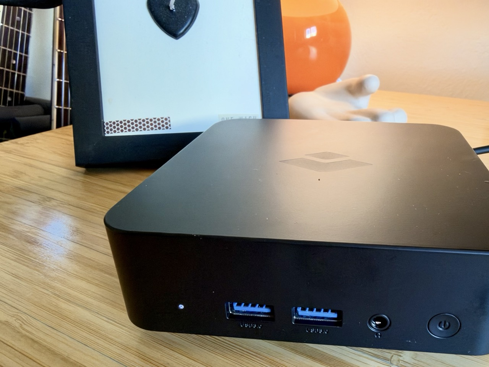

I just got a brand new [Otto](https://myotto.ai) today. If you haven't been bombarded with the same campaign of Instagram advertisements as I have, Otto is a little, purpose-built computer for running AI agents—namely[OpenClaw](https://openclaw.ai). The first thing I wanted to do—before asking it to do literally anything useful—was reach its Control UI from my laptop and phone over [Tailscale](https://tailscale.com).



Needless to say, the setup process didn't go as smoothly as I would like. In fairness, these things _just_ came out and the fact I could configure a Linux machine from my iPhone _at all_ is—honestly—a modern miracle. They'll probably update the software and you'll never run into this issue—but just in case you do. Hopefully either Google or your favorite LLM will lead you here.

So, my first instinct was to SSH into the little box and just set up Tailscale myself. Let's start with the part that I couldn't find written down _anywhere_: how exactly you do that? What's the username?

## How to SSH into your Otto

As far as I can tell, there is exactly zero documentation on this. So, here it is:

- The user is **`otto`**.
- The password is **whatever you set when you were setting up your Otto**.

```bash
ssh otto@<your-device-address-here>
```

> [!TIP] The SSH user and the user running OpenClaw are different users.
> When you SSH in as `otto`, one thing you'll find out is that is _not_ the user where the OpenClaw gateway is running; that's running under `otto-agent`. I did a bunch of `sudo -u otto-agent` shenanigans as I was figuring this all out and that's what my notes will reflect, but you might just want to switch into that user and saved yourself some heartache.

That hostname is whatever your Otto shows up as on your network or your [tailnet](https://tailscale.com/kb/1136/tailnet). If you've got Tailscale running, you can also just use its Tailscale IP address (the one that starts with `100.`):

```bash
ssh otto@100.x.y.z
```

The thing that tripped me up next is that there are a few other accounts on the box, and the one that actually _runs_ OpenClaw is not the one you log in as.

| Account         | What it's for                                                                    |
| --------------- | -------------------------------------------------------------------------------- |
| `otto`          | You. Interactive login, SSH, and `sudo` for anything administrative.             |
| `otto-agent`    | The service account that runs OpenClaw. Login is disabled (`/usr/sbin/nologin`). |
| `otto-observer` | Another restricted service account.                                              |

So you SSH in as `otto`, and when you need to poke at the service, you `sudo` your way over to `otto-agent`. Hang on to that distinction, because it's going to come back and bite me in about four sections. As of this writing, I have no idea what `otto-observer` does.

## The error

My plan was simple: leave the OpenClaw Gateway listening on `localhost`, put [Tailscale Serve](https://tailscale.com/kb/1312/serve) in front of it, and get a nice private HTTPS URL that only devices on my tailnet can reach. Tailscale Serve is basically a tiny reverse proxy that Tailscale runs for you—it takes traffic coming in over the tailnet and forwards it to a service running locally on the machine.

```text
Browser
  ↓ HTTPS over Tailscale
Tailscale Serve (on the Otto)
  ↓ local proxy
OpenClaw Gateway on 127.0.0.1:18789
```

I opened `https://otto-xxxxxxxxxx.your-tailnet.ts.net/` and got this:

```json
{
  "error": {
    "message": "Proxy client attribution is required. Configure gateway.trustedProxies narrowly and make the proxy overwrite or safely rebuild forwarded client headers.",
    "type": "proxy_attribution_required"
  }
}
```

Gross.

## It was not Tailscale

My first instinct was that Tailscale was broken. It was not. The Otto had a Tailscale address. It could see my phone. It could `tailscale ping` my phone and get a pong back in about 19 milliseconds. `tailscale netcheck` reported working UDP, IPv4 and IPv6, port mapping, and a nearby [DERP relay](https://tailscale.com/kb/1232/derp-servers). The network was fine.

Honestly, the error message was telling me this the whole time. The request clearly _got_ to OpenClaw—that JSON is OpenClaw talking. The network had done its job. The application just didn't like what the network handed it.

`openclaw status` confirmed the rest of the picture:

```text
Dashboard:          http://127.0.0.1:18789/
Tailscale exposure: off
Gateway:            local · ws://127.0.0.1:18789
```

The Gateway only listens on loopback, which is a perfectly sensible default. It means the only way in from the outside is through a proxy—in this case, Tailscale Serve.

## What proxy_attribution_required is actually complaining about

When a request goes through a reverse proxy, the proxy usually tacks on headers like [`X-Forwarded-For`](https://developer.mozilla.org/en-US/docs/Web/HTTP/Reference/Headers/X-Forwarded-For) or [`Forwarded`](https://developer.mozilla.org/en-US/docs/Web/HTTP/Reference/Headers/Forwarded) so the application behind it knows who the _original_ client was. From the application's perspective, every request otherwise looks like it's coming from the proxy.

The problem is that anyone can send those headers. If OpenClaw believed them unconditionally, any client could claim to be anybody. So OpenClaw—correctly—refuses to trust forwarded headers unless the request came from a proxy you've explicitly told it to trust.

From OpenClaw's point of view, a request showed up from `127.0.0.1` (Tailscale Serve, running on the same machine) carrying forwarded headers, and nobody had said `127.0.0.1` was a trusted proxy. So: `proxy_attribution_required`.

The fix is to tell OpenClaw to trust the loopback addresses—and _only_ the loopback addresses—as proxies. That's what the "narrowly" in the error message is getting at.

## Two things that looked like fixes and weren't

**Binding the Gateway to the tailnet.** If the proxy is the problem, why not skip it and have OpenClaw listen on the Tailscale interface directly? Because OpenClaw won't let you do that while Tailscale Serve mode is on:

```text
gateway.bind must resolve to loopback when gateway.tailscale.mode=serve
```

Which, fair. Serve mode assumes Serve is the front door.

**Trusting the whole tailnet.** Adding `100.64.0.0/10` (the entire Tailscale address range) to `trustedProxies` is way more permissive than it needs to be, and it doesn't even describe what's happening. The thing connecting to OpenClaw is Tailscale Serve on localhost, not some other machine on the tailnet.

## The part that actually cost me the evening

Remember `otto` versus `otto-agent`? Here's where it comes back.

I SSH'd in as `otto`, ran `openclaw config set ...`, and started getting errors that made no sense. `Config validation failed`. `gateway token mismatch`. A complaint about an unrecognized key called `lastTouchedAt` in a config file I'd never touched.

That's because, when you run `openclaw` as the `otto` user, it reads `/home/otto/.openclaw/openclaw.json`. But the Gateway that's actually running isn't using that file. It's a system-level [systemd](https://systemd.io) service running as `otto-agent`, with its own config file and state directory. I was carefully editing a config that nothing was reading.

You can see exactly what the service uses with:

```bash
sudo systemctl show otto-agent.service -p User -p Environment -p ExecStart
```

On my Otto, the important bits were:

```text
User=otto-agent
OPENCLAW_CONFIG_PATH=/etc/otto/openclaw/openclaw.json
OPENCLAW_STATE_DIR=/var/lib/otto/owner/agent/state
```

So every `openclaw` command needs to run as `otto-agent`, with that environment. That's a mouthful to type five times, so I made a little shell function for the session:

```bash
as-otto-agent() {
	sudo -u otto-agent env \
		HOME=/var/lib/otto/owner/agent \
		OPENCLAW_STATE_DIR=/var/lib/otto/owner/agent/state \
		OPENCLAW_CONFIG_PATH=/etc/otto/openclaw/openclaw.json \
		OPENCLAW_WORKSPACE_DIR=/var/lib/otto/owner/agent/workspace \
		"$@"
}
```

> [!NOTE] I actually called it `oc`
> But, that's kind of hard to follow if you're reading this and troubleshooting. So, for the purposes of this write-up, we'll stick with `as-otto-agent`.

Same goes for restarting things. This is a system service, so it's `sudo systemctl restart otto-agent.service`. If you find a guide telling you to run `systemctl --user restart openclaw-gateway.service`, that's for a different, per-user OpenClaw install, and it won't do anything here.

## The fix

With the right user and the right config file, the actual change is small. First, I stopped the service so it wouldn't be running while I rewrote its config:

```bash
sudo systemctl stop otto-agent.service
```

Then I told OpenClaw to trust loopback—and only loopback—as a proxy:

```bash
as-otto-agent openclaw config set gateway.trustedProxies \
	'["127.0.0.1","::1"]' --strict-json
```

Next, I allowed proxy attribution from loopback:

```bash
as-otto-agent openclaw config set gateway.auth.trustedProxy \
	'{"userHeader":"x-forwarded-user","allowLoopback":true}' --strict-json
```

Finally, I validated the config and started the service back up:

```bash
as-otto-agent openclaw config validate
sudo systemctl start otto-agent.service
sudo systemctl status otto-agent.service --no-pager
```

The relevant slice of the config ends up looking like this:

```json5
{
  gateway: {
    bind: 'loopback',
    trustedProxies: ['127.0.0.1', '::1'],
    auth: {
      mode: 'token',
      trustedProxy: {
        userHeader: 'x-forwarded-user',
        allowLoopback: true,
      },
    },
  },
}
```

A note on that `trustedProxy` block, because it looks like it's doing more than it is. `userHeader` is only there because OpenClaw's config schema requires it whenever the `trustedProxy` section exists. It does _not_ mean I switched to [trusted-proxy authentication](https://docs.openclaw.ai/gateway/trusted-proxy-auth), where the proxy vouches for who the user is. `auth.mode` is still `token`. The Gateway still wants its token.

## Logging in from the browser

Two more gates, and then you're in.

First, the Gateway token. Grab it from the same config the service uses (see the pattern here?):

```bash
as-otto-agent openclaw gateway auth-token --show
```

Paste that into the **Gateway Token** field in the Control UI. Leave the Password field blank, since we're using token auth. Also, this token is the key to your agent, so keep it out of screenshots, chat windows, and Git repositories.

Second, device pairing. Once the token was accepted, OpenClaw still wanted to approve _this specific browser_ as a Control UI device, and showed me a pairing request ID. Approve it from the Otto:

```bash
as-otto-agent openclaw devices approve <PAIRING_REQUEST_ID>
```

And then—finally—the Control UI loaded.

Count them: three separate gates had to pass here: Tailscale deciding my device was allowed on the tailnet, the Gateway token, and device pairing. Proxy attribution isn't authentication at all; it's just OpenClaw agreeing to believe what the proxy says about where a request came from. Each one produces its own flavor of "no," and they're easy to confuse for one another when you're tired and just want the thing to load.

## What I'd tell past me

The `proxy_attribution_required` error was a one-line fix: trust `127.0.0.1` and `::1`, nothing broader. What made it an evening was that I spent most of my time confidently editing the wrong file as the wrong user.

So if you take one thing from this: before you change _anything_ on your Otto, run `sudo systemctl show otto-agent.service` and find out which user the service runs as and which config file it reads. Then do everything as that user, against that file. You log in as `otto`. OpenClaw lives as `otto-agent`. Once I stopped treating those as the same person, everything else fell into place.
